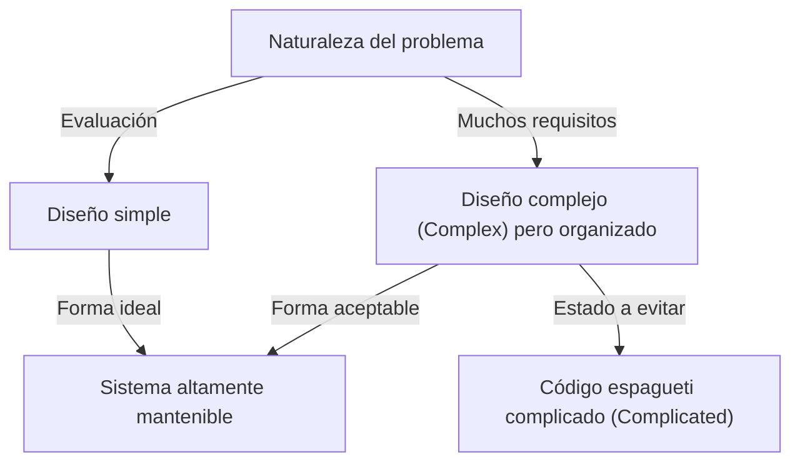
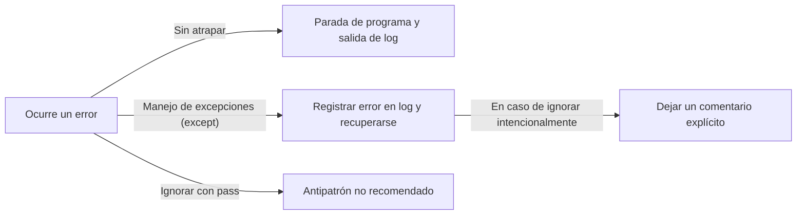

Los lenguajes de programación no son simples secuencias de instrucciones para una computadora. Son medios para expresar el pensamiento de los desarrolladores y un lenguaje común compartido por todo el equipo. Entre los muchos lenguajes de programación, Python destaca por tener una «filosofía» única y peculiar. Ese es **«El Zen de Python (The Zen of Python)»**.

En este artículo, profundizaremos en este «Zen», que constituye el núcleo de la filosofía de diseño de Python, desde los antecedentes de su creación hasta la profunda filosofía detrás de cada aforismo y cómo debemos aplicar estas ideas en el desarrollo diario de software.

---

## 1. ¿Qué es «El Zen de Python»?

¿Alguna vez has abierto la consola interactiva de Python (REPL) e introducido el siguiente comando?

```python
import this
```

Al ejecutar este código corto, se muestra un texto poético de 19 líneas como un «huevo de pascua» en la pantalla. Este es «El Zen de Python», considerado como el pilar espiritual de la comunidad de Python.

En el mundo de la ingeniería de software, existen diversas mejores prácticas y patrones de diseño, pero es muy raro encontrar un ejemplo en el que un lenguaje de programación específico formule su filosofía central en forma de «poema» y lo integre directamente en el propio lenguaje.

### Orígenes: Tim Peters y PEP 20

El Zen de Python fue escrito por Tim Peters, un desarrollador principal con una larga trayectoria en el desarrollo de Python. Tim sistematizó los «acuerdos implícitos» y las «intuiciones» del diseño del creador de Python, Guido van Rossum, verbalizándolos para poder compartirlos con la comunidad.

Esto se documentó posteriormente de manera oficial como **PEP 20 (Python Enhancement Proposal 20)**. Cuando se añaden o cambian características en Python, este PEP 20 funciona como el punto de partida al que siempre hay que volver.

Curiosamente, El Zen de Python se conoce por tener «19 aforismos», pero Tim mencionó que «hay un total de 20, pero el último se ha dejado en blanco para que lo escriba Guido». Ese último aforismo todavía está en blanco, lo que parece encarnar una especie de «belleza del espacio vacío».

---

## 2. El pensamiento Zen: Descifrando los 19 aforismos

A primera vista, cada línea de El Zen de Python puede parecer una simple sucesión de palabras, pero en el fondo ocultan una profunda comprensión de la ingeniería de software. Vamos a desentrañar su significado uno a uno.

### Beautiful is better than ugly. (Lo hermoso es mejor que lo feo)

El código lo ejecuta la máquina, pero sobre todo es «algo que los humanos leen». Python garantiza obligatoriamente una belleza visual al exigir la indentación como bloques sintácticos.

El código hermoso tiene un flujo lógico claro y su intención se transmite de inmediato. Un código feo (por ejemplo, con un anidamiento profundo e innecesario, convenciones de nomenclatura incoherentes y lógica tipo espagueti) no solo es un caldo de cultivo para los errores, sino que también disminuye la motivación del equipo. Buscar la belleza no es solo una cuestión estética, sino un enfoque práctico para crear software altamente mantenible.

### Explicit is better than implicit. (Lo explícito es mejor que lo implícito)

Este principio es una de las principales características que diferencia a Python de otros lenguajes (como Ruby o JavaScript, por ejemplo).
El comportamiento implícito o la «magia» pueden parecer convenientes a la hora de programar. Sin embargo, cuando lees ese código medio año después, o cuando se une un nuevo miembro al proyecto, las suposiciones implícitas se convierten en un gran obstáculo.

Python prefiere ser explícito acerca de «qué se está importando» y «qué variables se están manipulando». Por ejemplo, no se recomienda usar algo como `from module import *`. Esto se debe a que resulta implícito de dónde viene cada función.

### Simple is better than complex. (Lo simple es mejor que lo complejo)
### Complex is better than complicated. (Lo complejo es mejor que lo complicado)

Estos dos aforismos deberían considerarse en conjunto. En primer lugar, se debe buscar la solución más «simple» para cualquier problema. Deben evitarse jerarquías de clases innecesarias o una abstracción excesiva.

Sin embargo, la lógica de negocio del mundo real no siempre es simple. Si el problema en sí mismo es inherentemente complejo (Complex), es aceptable que el código refleje esa complejidad.

Pero no se debe convertir algo complejo en un estado «complicado» (Complicated). «Complex (complejo)» es un estado en el que hay muchos elementos pero una estructura organizada, mientras que «Complicated (complicado)» se refiere a un estado en el que el diseño se ha roto y está enredado.



### Flat is better than nested. (Lo plano es mejor que lo anidado)

El anidamiento profundo (indentación) reduce significativamente la legibilidad del código. Especialmente cuando los bucles y las bifurcaciones condicionales se superponen en múltiples capas, abruman la memoria de trabajo del cerebro y hacen que sea fácil pasar por alto los errores.

En Python, se recomienda mantener el código lo más plano (flat) posible mediante el uso de listas por comprensión o patrones de retorno anticipado (Early Return).

### Sparse is better than dense. (Lo disperso es mejor que lo denso)

Agrupar demasiado código en una sola línea es una mala idea. Si incluyes múltiples operaciones (como fórmulas matemáticas complejas, cadenas de métodos o operadores ternarios) en una sola línea, no sabrás dónde ocurrió un error cuando uses la ejecución paso a paso en un depurador.

Al añadir espacios y saltos de línea adecuados y mantener los procesos de manera «dispersa» (Sparse), la intención del código se hace evidente.

### Readability counts. (La legibilidad cuenta)

Es uno de los valores más importantes del diseño de Python. Se basa en el hecho de que «el código se lee muchas más veces de las que se escribe». El hecho de que la sintaxis de Python esté diseñada para parecerse al inglés natural es precisamente para maximizar esta «legibilidad».

### Special cases aren't special enough to break the rules. (Los casos especiales no son tan especiales como para romper las reglas)
### Although practicality beats purity. (Aunque lo práctico gana a lo puro)

Estos también son aforismos complementarios. En principio, debemos seguir estrictamente las reglas y convenciones de codificación establecidas (como PEP 8). Si comienzas a romper las reglas bajo el pretexto de que «esta vez es especial», todo el sistema se encamina hacia el colapso.

Sin embargo, al mismo tiempo, Python es un lenguaje de «pragmatismo». Si la búsqueda de la «pureza» teórica resulta en una caída drástica del rendimiento o una mala usabilidad, se debe priorizar lo práctico. Es precisamente este sentido de equilibrio lo que hace que Python se utilice tan ampliamente.

### Errors should never pass silently. (Los errores nunca deberían pasar en silencio)
### Unless explicitly silenced. (A menos que se silencien explícitamente)

Si ocurre algún estado anormal en el sistema, el código debe fallar inmediatamente (Fail Fast). Ignorar el error y continuar ejecutando el programa puede manifestarse más tarde como un error de origen desconocido y dificultar enormemente la depuración.



Si realmente deseas ignorar un error, debes hacerlo de forma «explícita» utilizando un bloque `try...except`.

### In the face of ambiguity, refuse the temptation to guess. (Frente a la ambigüedad, rechaza la tentación de adivinar)

Existen lenguajes donde el compilador o el intérprete «adivinan» por su cuenta las intenciones del programador y continúan el procesamiento. Las conversiones de tipo implícitas son un ejemplo típico.

Python detesta este tipo de comportamiento de «leer la mente». Si intentas sumar una cadena y un número, Python no concatenará la cadena por su cuenta, sino que lanzará un `TypeError`. En situaciones ambiguas, requiere instrucciones claras del humano (programador).

### There should be one-- and preferably only one --obvious way to do it. (Debería haber una —y preferiblemente solo una— manera obvia de hacerlo)
### Although that way may not be obvious at first unless you're Dutch. (Aunque esa manera puede no ser obvia al principio a menos que seas holandés)

Un lenguaje llamado Perl tiene una filosofía conocida como «There's more than one way to do it» (TIMTOWTDI: hay más de una forma de hacerlo), pero Python va en la dirección opuesta.

Si se realiza el mismo proceso, lo ideal es que todos escriban de la misma manera. Esto reduce drásticamente la carga cognitiva al leer código escrito por otra persona.
Por cierto, «holandés» se refiere al creador de Python, Guido van Rossum. Contiene algo de humor, sugiriendo que comprender completamente las intenciones del diseñador del lenguaje puede llevar algo de tiempo.

### Now is better than never. (Ahora es mejor que nunca)
### Although never is often better than *right* now. (Aunque nunca suele ser mejor que *justo* ahora)

Esta es la filosofía de planificación y toma de decisiones en el desarrollo de software. En lugar de esperar por la solución perfecta sin hacer nada, deberías dar tu mejor esfuerzo ahora, lanzar el código y obtener comentarios (pensamiento ágil).

Por otro lado, en muchos casos, es preferible «no hacer nada» hasta que se descubra la causa subyacente, en lugar de introducir un «hack» o corrección temporal incompleta «ahora mismo». Es una advertencia sobre no aumentar la deuda técnica de forma descuidada.

### If the implementation is hard to explain, it's a bad idea. (Si la implementación es difícil de explicar, es una mala idea)
### If the implementation is easy to explain, it may be a good idea. (Si la implementación es fácil de explicar, puede ser una buena idea)

Este es uno de los indicadores definitivos para medir la calidad del código. Si te resulta extremadamente difícil explicar cómo funciona el código que escribiste a los miembros de tu equipo, entonces ese diseño está equivocado.

A la inversa, si puedes explicar fácilmente el flujo del código en una pizarra, es muy probable que el diseño sea excelente. (Sin embargo, «fácil = absolutamente correcto» no siempre es cierto, razón por la cual se utiliza la expresión modesta de «may be» - puede ser).

### Namespaces are one honking great idea -- let's do more of those! (Los espacios de nombres son una gran idea fenomenal, ¡hagamos más de eso!)

Los «espacios de nombres» (como módulos y clases), que previenen conflictos entre nombres de variables y funciones, son un concepto esencial a la hora de construir software a gran escala. Python promueve mantener una baja dependencia en el sistema mediante el uso activo de espacios de nombres basados en módulos.

---

## 3. Cómo aplicar «El Zen de Python» al desarrollo diario

El Zen de Python no es en absoluto algo que solo se aplica cuando se usa Python. La filosofía de la que se habla aquí encierra verdades universales que pueden aplicarse al diseño de sistemas con cualquier lenguaje de programación e incluso a la comunicación de equipos y la teoría organizacional.

1. **Usarlo como base para la revisión de código**: Cuando hay dudas sobre el diseño dentro del equipo, usar los términos del Zen, como «¿Es simple o complejo?» o «¿No es implícito?», como lenguaje común evita los conflictos emocionales y permite debates constructivos.
2. **Usarlo como brújula de diseño**: Al agregar nuevas funcionalidades, ser consciente de «¿se puede mantener plano?» o «¿se manejan adecuadamente los errores?» ayudará a mantener una arquitectura sostenible a largo plazo.
3. **Refactorización continua**: Al tener todo el equipo un sentido estético de que «lo hermoso es mejor que lo feo», se elimina la actitud complaciente de «mientras funcione está bien» y se cultiva una cultura que mantiene siempre el código fuente en un estado saludable.

## Conclusión

«El Zen de Python» condensa una profunda sabiduría sobre la ingeniería de software en un texto corto de solo 19 líneas. Detrás de que Python sea hoy tan amado en todo el mundo y un lenguaje inmensamente popular utilizado en todo tipo de campos como la IA, la ciencia de datos y el desarrollo web, está la presencia de esta hermosa y robusta «filosofía».

La próxima vez que escribas código, detente un momento y recuerda estas palabras de este «Zen». Seguramente tu código evolucionará hasta convertirse en algo más hermoso, más legible y más «Pythonico».
