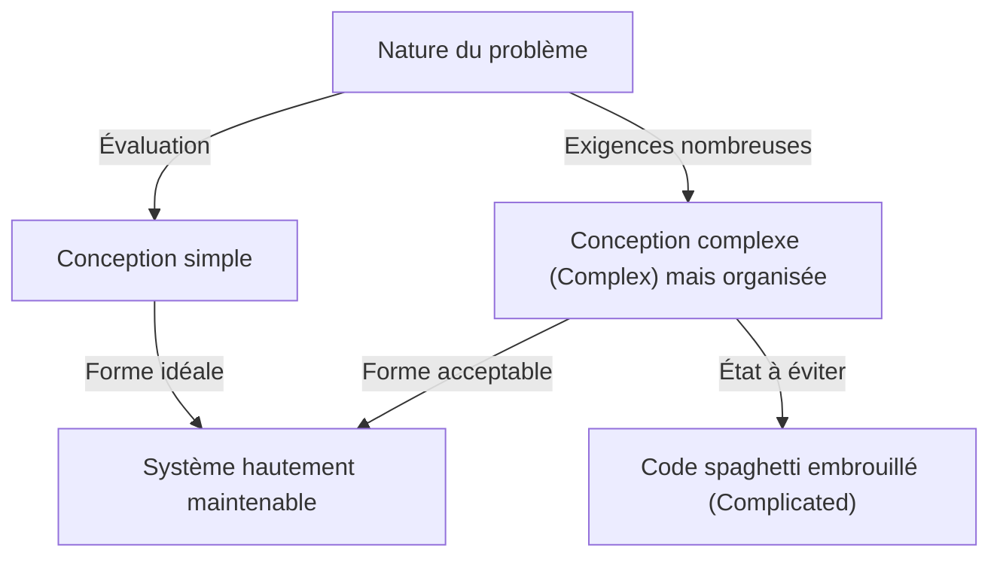
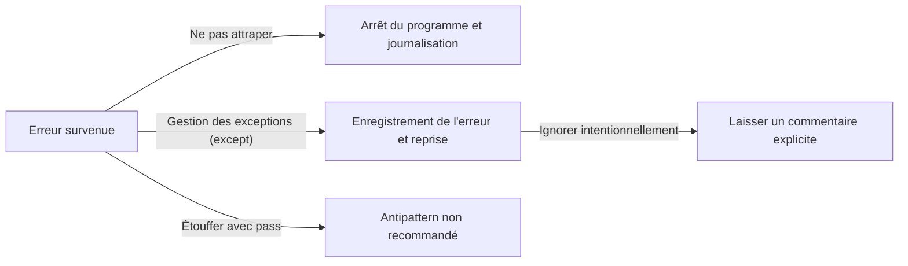

Un langage de programmation n'est pas simplement une série d'instructions pour un ordinateur. C'est un moyen d'exprimer la pensée des développeurs et un langage commun partagé par toute l'équipe. Parmi les nombreux langages de programmation, Python possède une « philosophie » particulièrement unique. C'est le **« Zen of Python » (Le Zen de Python)**.

Dans cet article, nous explorerons en profondeur ce « Zen », qui forme le cœur de la philosophie de conception de Python : depuis le contexte de sa création jusqu'à la philosophie profonde derrière chaque aphorisme, et comment nous devrions appliquer cette pensée dans notre développement logiciel quotidien.

---

## 1. Qu'est-ce que « The Zen of Python » ?

Avez-vous déjà ouvert le shell interactif (REPL) de Python et saisi la commande suivante ?

```python
import this
```

En exécutant ce court code, un texte semblable à un poème de 19 lignes apparaît à l'écran comme un easter egg (œuf de Pâques). C'est « The Zen of Python », que l'on peut considérer comme le pilier spirituel de la communauté Python.

Bien qu'il existe diverses meilleures pratiques et modèles de conception dans le monde de l'ingénierie logicielle, il est extrêmement rare qu'un langage de programmation spécifique verbalise sa philosophie fondamentale sous forme de « poème » et l'intègre dans le langage lui-même.

### Le contexte de la création : Tim Peters et la PEP 20

The Zen of Python a été écrit par Tim Peters, un développeur principal (core developer) impliqué dans le développement de Python depuis de nombreuses années. Tim a systématisé les « accords tacites » et les « intuitions » de conception de Guido van Rossum, le créateur de Python, afin qu'ils puissent être verbalisés et partagés au sein de la communauté.

Cela a ensuite été officiellement documenté sous le nom de **PEP 20 (Python Enhancement Proposal 20)**. Lors de l'ajout de fonctionnalités ou de la modification de Python, cette PEP 20 sert toujours de point de départ auquel il faut revenir.

Fait intéressant, bien que The Zen of Python soit connu comme « 19 aphorismes », Tim a déclaré : « Il y en a 20 au total, mais le dernier est laissé en blanc pour que Guido l'écrive ». Ce dernier aphorisme reste toujours vide, comme s'il incarnait une sorte de « beauté de l'espace vide ».

---

## 2. La philosophie du Zen : Décrypter les 19 aphorismes

Chaque ligne du Zen of Python semble être à première vue une simple série de mots, mais des connaissances profondes en ingénierie logicielle se cachent derrière. Déchiffrons leur signification une par une.

### Beautiful is better than ugly. (Le beau est préférable au laid.)

Le code est exécuté par des machines, mais il est surtout « lu par des humains ». Python garantit l'esthétique visuelle en forçant l'indentation comme blocs syntaxiques.

Un beau code a un flux logique clair et ses intentions sont immédiatement transmises. Un code laid (par exemple, avec une imbrication inutilement profonde, des conventions de nommage incohérentes ou une logique en spaghetti) devient non seulement un nid à bugs, mais réduit également la motivation de l'équipe. Poursuivre la beauté n'est pas seulement une question d'esthétique, mais une approche pratique pour créer des logiciels hautement maintenables.

### Explicit is better than implicit. (L'explicite est préférable à l'implicite.)

Ce principe est l'une des caractéristiques majeures qui sépare Python de plusieurs autres langages (tels que Ruby ou JavaScript).
Les comportements implicites et la « magie » peuvent sembler pratiques lors de l'écriture du code. Cependant, lors de la relecture du code six mois plus tard, ou lorsqu'un nouveau membre rejoint le projet, les prémisses implicites deviennent des obstacles majeurs.

Python préfère rendre explicites « ce qui est importé » et « quelles variables sont manipulées ». Par exemple, l'écriture `from module import *` n'est pas recommandée, car la provenance de chaque fonction devient implicite.

### Simple is better than complex. (Le simple est préférable au complexe.)
### Complex is better than complicated. (Le complexe est préférable au compliqué.)

Ces deux aphorismes doivent être considérés ensemble. Tout d'abord, pour chaque problème, la solution la plus « simple » doit être recherchée. Les hiérarchies de classes superflues et les abstractions excessives doivent être évitées.

Cependant, la logique métier du monde réel n'est pas toujours simple. Si le problème lui-même est intrinsèquement complexe (Complex), il est acceptable que le code reflète cette complexité.

Néanmoins, une chose complexe ne doit pas devenir « embrouillée (Complicated) ». « Complex (Complexe) » fait référence à un état où il y a de nombreux éléments mais avec une structure bien organisée, tandis que « Complicated (Compliqué) » fait référence à un état où la conception est brisée et entremêlée.



### Flat is better than nested. (Le plat est préférable à l'imbriqué.)

L'imbrication profonde (indentation) réduit considérablement la lisibilité du code. En particulier, lorsque les boucles et les branchements conditionnels sont imbriqués à plusieurs niveaux, cela pèse sur la mémoire de travail du cerveau et facilite l'omission de bugs.

En Python, il est recommandé de garder le code aussi plat que possible en utilisant des compréhensions de listes ou le modèle de retour anticipé (Early Return).

### Sparse is better than dense. (L'aéré est préférable au compact.)

Condenser trop de code sur une seule ligne est une mauvaise pratique. Si plusieurs opérations (par exemple, des formules mathématiques complexes, des chaînes de méthodes, des opérateurs ternaires, etc.) sont entassées sur une ligne, il devient difficile de savoir où l'erreur s'est produite lors de l'exécution pas-à-pas dans un débogueur.

En insérant des espaces et des sauts de ligne appropriés et en gardant le traitement « aéré (Sparse) », l'intention du code devient claire.

### Readability counts. (La lisibilité compte.)

C'est l'une des valeurs les plus importantes de la conception de Python. Elle est basée sur le fait que « le code est lu beaucoup plus souvent qu'il n'est écrit ». La syntaxe de Python a été conçue pour être proche du langage naturel anglais précisément pour maximiser cette « lisibilité ».

### Special cases aren't special enough to break the rules. (Les cas particuliers ne le sont jamais assez pour violer les règles.)
### Although practicality beats purity. (Mais la praticité bat la pureté.)

Ce sont également des aphorismes appariés. En principe, nous devrions suivre strictement les règles établies et les conventions de codage (telles que la PEP 8). Si nous commençons à enfreindre les règles sous prétexte que « c'est exceptionnel cette fois-ci », l'ensemble du système se dirigera vers l'effondrement.

Cependant, en même temps, Python est un langage de « pragmatisme (Pragmatism) ». Si la poursuite de la « pureté » théorique entraîne une baisse extrême des performances ou une mauvaise utilisabilité, la praticité doit primer. Ce sens de l'équilibre est précisément la raison pour laquelle Python est si largement utilisé.

### Errors should never pass silently. (Les erreurs ne doivent jamais passer sous silence.)
### Unless explicitly silenced. (Sauf si elles sont explicitement ignorées.)

Si un état anormal se produit dans le système, le code doit échouer immédiatement (Fail Fast). Si vous étouffez l'erreur et continuez le programme, elle se manifestera plus tard comme un bug d'origine inconnue, rendant le débogage extrêmement difficile.



Si vous voulez vraiment ignorer une erreur, vous devez l'ignorer « explicitement » en utilisant un bloc `try...except`.

### In the face of ambiguity, refuse the temptation to guess. (Face à l'ambiguïté, refusez la tentation de deviner.)

Il existe des langages où le compilateur ou l'interpréteur « devinent » l'intention du programmeur et procèdent au traitement. Les conversions de type implicites en sont un exemple typique.

Python déteste ce type de comportement qui consiste à « lire entre les lignes ». Si vous essayez d'additionner une chaîne de caractères et un nombre, Python ne fera pas de concaténation de chaînes arbitraire, mais lèvera une `TypeError`. Dans des situations ambiguës, il exige des instructions claires de la part de l'humain (le programmeur).

### There should be one-- and preferably only one --obvious way to do it. (Il devrait y avoir une -- et de préférence une seule -- façon évidente de le faire.)
### Although that way may not be obvious at first unless you're Dutch. (Bien que cette façon puisse ne pas être évidente au premier abord, à moins que vous ne soyez Néerlandais.)

Le langage Perl a une philosophie selon laquelle "There's more than one way to do it" (Il y a plus d'une façon de le faire), mais Python prend la direction opposée.

Pour accomplir une tâche, l'idéal est que tout le monde écrive le code de la même manière. Cela réduit considérablement la charge cognitive lors de la lecture du code écrit par d'autres.
Par ailleurs, le terme « Néerlandais » fait référence à Guido van Rossum, le créateur de Python. C'est une touche d'humour signifiant qu'il peut falloir du temps pour comprendre pleinement l'intention du concepteur du langage.

### Now is better than never. (Maintenant est préférable à jamais.)
### Although never is often better than *right* now. (Cependant, jamais est souvent préférable à *tout de suite*.)

C'est une philosophie de planification et de prise de décision dans le développement logiciel. Plutôt que d'attendre la solution parfaite et de ne rien faire, il vaut mieux faire de son mieux maintenant, publier le code et obtenir des retours (pensée Agile).

D'un autre côté, il est souvent préférable de ne « rien faire » jusqu'à ce que la cause fondamentale soit comprise, plutôt que d'implémenter des correctifs incomplets ou des hacks à la hâte « tout de suite ». C'est un avertissement contre l'accumulation imprudente de la dette technique.

### If the implementation is hard to explain, it's a bad idea. (Si l'implémentation est difficile à expliquer, c'est une mauvaise idée.)
### If the implementation is easy to explain, it may be a good idea. (Si l'implémentation est facile à expliquer, cela peut être une bonne idée.)

C'est l'un des indicateurs ultimes pour mesurer la qualité du code. Si vous avez du mal à expliquer à un membre de l'équipe comment fonctionne le code que vous avez écrit, alors la conception est mauvaise.

À l'inverse, si vous pouvez facilement expliquer le flux du code sur un tableau blanc, il y a de fortes chances que la conception soit excellente. (Cependant, l'expression "may be" (peut-être) est utilisée de manière conservatrice, car « facile » ne signifie pas « absolument correct ».)

### Namespaces are one honking great idea -- let's do more of those! (Les espaces de noms sont une sacrée bonne idée -- utilisons-les davantage !)

Les « espaces de noms (namespaces) » (tels que les modules et les classes) qui empêchent les collisions de noms de variables et de fonctions sont un concept indispensable pour construire des logiciels à grande échelle. En utilisant activement des espaces de noms basés sur des modules, Python favorise un faible couplage du système.

---

## 3. Comment appliquer "The Zen of Python" au développement quotidien

The Zen of Python ne s'applique en aucun cas uniquement lorsque vous utilisez Python. La philosophie abordée ici détient des vérités universelles qui peuvent être appliquées à la conception de systèmes utilisant n'importe quel langage de programmation, ainsi qu'à la communication d'équipe et aux théories de l'organisation.

1. **Utiliser comme norme de revue de code** : Lorsque vous hésitez sur une conception au sein de l'équipe, utiliser les mots du Zen tels que « Est-ce Simple ou Complex ? » ou « N'est-ce pas implicite ? » comme langage commun permet d'éviter les conflits émotionnels et de faciliter des discussions constructives.
2. **Utiliser comme boussole de conception** : Lors de l'ajout de nouvelles fonctionnalités, garder à l'esprit des questions telles que « Peut-on le garder plat ? » ou « Les erreurs sont-elles gérées de manière appropriée ? » permet de maintenir une architecture maintenable sur le long terme.
3. **Refactorisation continue** : En partageant le sens esthétique selon lequel « le beau est préférable au laid » au sein de toute l'équipe, vous éliminez les compromis du type « ça suffit si ça marche », favorisant ainsi une culture qui maintient toujours la base de code dans un état sain.

## Conclusion

« The Zen of Python » condense la sagesse profonde de l'ingénierie logicielle en seulement 19 courtes lignes de texte. Si Python est aujourd'hui un langage immensément populaire, apprécié dans le monde entier et utilisé dans tous les domaines tels que l'IA, la science des données et le développement Web, c'est grâce à la présence de cette « philosophie » belle et robuste.

La prochaine fois que vous écrirez du code, arrêtez-vous un instant et essayez de vous souvenir des mots de ce « Zen ». Assurément, votre code évoluera vers quelque chose de plus beau, plus lisible et plus « Pythonique » (Pythonic).
