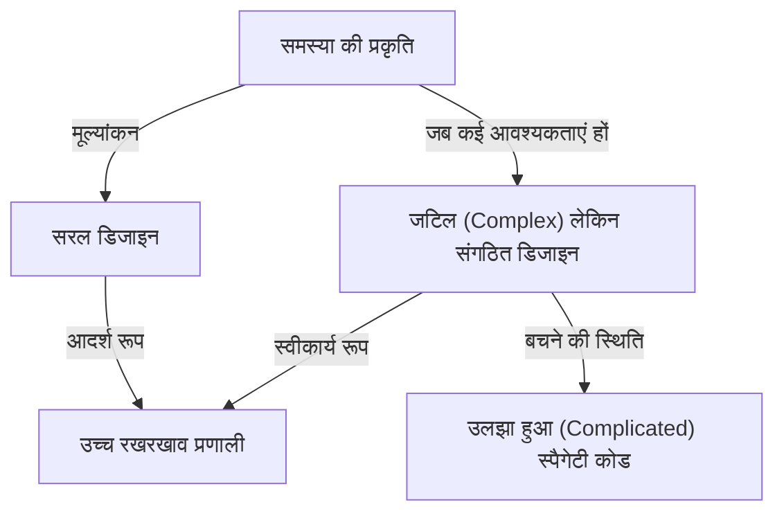
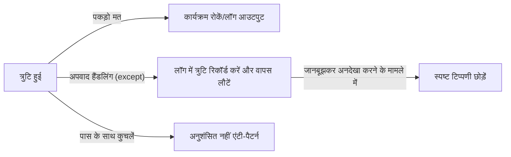

प्रोग्रामिंग भाषाएँ कंप्यूटर के लिए केवल निर्देशों की एक शृंखला नहीं हैं। वे डेवलपर्स के विचारों को व्यक्त करने का एक माध्यम हैं, और पूरी टीम द्वारा साझा की जाने वाली एक आम भाषा हैं। कई प्रोग्रामिंग भाषाओं में, Python का एक अनूठा "दर्शन" है। यही **"The Zen of Python (पायथन का ज़ेन)"** है।

इस लेख में, हम इस "Zen (ज़ेन)" में गहराई से उतरेंगे, जो Python के डिज़ाइन दर्शन के मूल में है, इसके जन्म की पृष्ठभूमि से लेकर प्रत्येक कहावत के पीछे के गहरे दर्शन तक, और हमें रोज़मर्रा के सॉफ्टवेयर विकास में इस सोच को कैसे लागू करना चाहिए।

---

## 1. "The Zen of Python" क्या है?

क्या आपने कभी Python का इंटरएक्टिव शेल (REPL) खोला है और निम्नलिखित कमांड दर्ज किया है?

```python
import this
```

जब आप यह छोटा कोड चलाते हैं, तो एक ईस्टर एग के रूप में स्क्रीन पर 19-पंक्तियों की कविता जैसा टेक्स्ट आउटपुट होता है। यह "The Zen of Python" है, जिसे Python समुदाय का आध्यात्मिक स्तंभ कहा जा सकता है।

सॉफ्टवेयर इंजीनियरिंग की दुनिया में विभिन्न सर्वोत्तम प्रथाएँ और डिज़ाइन पैटर्न हैं, लेकिन यह अत्यंत दुर्लभ है कि कोई विशिष्ट प्रोग्रामिंग भाषा अपने मुख्य दर्शन को "कविता" के रूप में व्यक्त करे और इसे भाषा में ही शामिल करे।

### जन्म की पृष्ठभूमि: Tim Peters और PEP 20

The Zen of Python लंबे समय से Python के मुख्य डेवलपर रहे Tim Peters द्वारा लिखा गया था। Tim ने Python के निर्माता Guido van Rossum के डिज़ाइन में "अव्यक्त समझ" और "अंतर्ज्ञान" को व्यवस्थित किया ताकि इसे समुदाय के साथ व्यक्त और साझा किया जा सके।

इसे बाद में आधिकारिक तौर पर **PEP 20 (Python Enhancement Proposal 20)** के रूप में प्रलेखित किया गया था। जब Python में सुविधाएँ जोड़ी या बदली जाती हैं, तो यह PEP 20 हमेशा उस मूल बिंदु के रूप में कार्य करता है जिस पर वापस लौटना चाहिए।

दिलचस्प बात यह है कि, The Zen of Python को "19 कहावतों" के रूप में जाना जाता है, लेकिन Tim ने कहा, "कुल 20 हैं, लेकिन अंतिम एक Guido के लिखने के लिए खाली छोड़ दिया गया है।" वह अंतिम आज भी खाली है, और ऐसा लगता है कि यह एक प्रकार की "खाली जगह की सुंदरता" का प्रतीक है।

---

## 2. ज़ेन का दर्शन: 19 कहावतों को समझना

The Zen of Python की प्रत्येक पंक्ति पहली नज़र में शब्दों की एक साधारण शृंखला लग सकती है, लेकिन इसके पीछे सॉफ्टवेयर इंजीनियरिंग का गहरा ज्ञान छिपा है। आइए हम उनके अर्थों को एक-एक करके समझें।

### Beautiful is better than ugly. (सुंदर बदसूरत से बेहतर है)

कोड मशीनों द्वारा निष्पादित किया जाता है, लेकिन इससे भी अधिक यह "मनुष्यों द्वारा पढ़ा जाने वाला" है। Python वाक्यरचना ब्लॉक के रूप में इंडेंटेशन को मजबूर करके दृश्य सुंदरता सुनिश्चित करता है।

सुंदर कोड में तर्क का स्पष्ट प्रवाह होता है और इरादा तुरंत संप्रेषित होता है। बदसूरत कोड (उदाहरण के लिए, अनावश्यक रूप से गहरा घोंसला बनाना (nesting), असंगत नामकरण परंपराएं, स्पैगेटी लॉजिक) न केवल बग्स के लिए प्रजनन स्थल बन जाता है, बल्कि टीम की प्रेरणा को भी कम करता है। सुंदरता का पीछा करना केवल एक सौंदर्यशास्त्र नहीं है, बल्कि अत्यधिक रखरखाव योग्य सॉफ्टवेयर बनाने के लिए एक व्यावहारिक दृष्टिकोण है।

### Explicit is better than implicit. (स्पष्ट, अस्पष्ट से बेहतर है)

यह सिद्धांत उन प्रमुख विशेषताओं में से एक है जो Python को कई अन्य भाषाओं (जैसे Ruby या JavaScript) से अलग करता है।
कोड लिखते समय अस्पष्ट व्यवहार और "जादू" सुविधाजनक लग सकता है। हालाँकि, जब आप छह महीने बाद उस कोड को पढ़ते हैं, या जब कोई नया सदस्य परियोजना में शामिल होता है, तो निहित धारणाएँ एक बड़ी बाधा बन जाती हैं।

Python स्पष्ट रूप से यह बताना पसंद करता है कि "क्या आयात किया जा रहा है" और "किन चर (variables) में हेरफेर किया जा रहा है"। उदाहरण के लिए, `from module import *` लिखने की अनुशंसा नहीं की जाती है। क्योंकि यह स्पष्ट नहीं होता कि कौन सा कार्य कहाँ से आ रहा है।

### Simple is better than complex. (सरल, जटिल से बेहतर है)
### Complex is better than complicated. (जटिल, उलझे हुए से बेहतर है)

इन दो कहावतों को एक सेट के रूप में माना जाना चाहिए। सबसे पहले, आपको हर समस्या का सबसे "सरल" समाधान खोजना चाहिए। अनावश्यक वर्ग पदानुक्रम (class hierarchies) और अत्यधिक अमूर्तता (abstraction) से बचा जाना चाहिए।

हालाँकि, वास्तविक दुनिया का व्यावसायिक तर्क हमेशा सरल नहीं होता है। यदि समस्या स्वयं स्वाभाविक रूप से जटिल (Complex) है, तो इसे प्रतिबिंबित करने के लिए कोड के भी जटिल होने की अनुमति है।

हालाँकि, जटिल चीजों को "उलझे हुए अवस्था (Complicated)" में नहीं बनाया जाना चाहिए। "Complex (जटिल)" वह अवस्था है जहां संरचना व्यवस्थित होती है लेकिन तत्व बहुत अधिक होते हैं, जबकि "Complicated (उलझा हुआ)" वह अवस्था है जहां डिज़ाइन टूट गया है और आपस में उलझ गया है।



### Flat is better than nested. (सपाट, नेस्टेड से बेहतर है)

गहरा नेस्टिंग (इंडेंटेशन) कोड की पठनीयता (readability) को काफी कम कर देता है। खासकर जब लूप और सशर्त शाखाएं (conditional branches) कई बार ओवरलैप होती हैं, तो यह मस्तिष्क की कार्यशील मेमोरी पर दबाव डालती है और बग्स को अनदेखा करना आसान बना देती है।

Python में, कोड को यथासंभव सपाट (Flat) रखने के लिए सूची समझ (list comprehensions) और प्रारंभिक वापसी (Early Return) पैटर्न का उपयोग करने की अनुशंसा की जाती है।

### Sparse is better than dense. (विरल, सघन से बेहतर है)

कोड को एक ही पंक्ति में बहुत अधिक क्रैम (cram) करना एक बुरा विचार है। यदि आप एक ही पंक्ति में कई प्रक्रियाओं (उदाहरण के लिए, जटिल सूत्र, विधि श्रृंखला (method chains), टर्नरी ऑपरेटर, आदि) को भरते हैं, तो आप नहीं जान पाएंगे कि डिबगर में चरण-दर-चरण निष्पादन करते समय त्रुटि कहाँ हुई।

उचित स्थान और लाइन ब्रेक जोड़कर, और प्रसंस्करण को "विरल (Sparse)" रखकर, कोड का इरादा स्पष्ट हो जाता है।

### Readability counts. (पठनीयता मायने रखती है)

यह Python के डिज़ाइन में सबसे महत्वपूर्ण मूल्यों में से एक है। यह इस तथ्य पर आधारित है कि "कोड लिखे जाने की तुलना में बहुत अधिक बार पढ़ा जाता है।" Python का सिंटैक्स अंग्रेजी प्राकृतिक भाषा के करीब होने के लिए डिज़ाइन किया गया है ताकि इस "पठनीयता" को इसकी सीमा तक बढ़ाया जा सके।

### Special cases aren't special enough to break the rules. (विशेष मामले नियमों को तोड़ने के लिए पर्याप्त विशेष नहीं हैं)
### Although practicality beats purity. (हालांकि व्यावहारिकता शुद्धता को हरा देती है)

ये कहावतें भी एक दूसरे की पूरक हैं। एक नियम के रूप में, हमें स्थापित नियमों और कोडिंग सम्मेलनों (जैसे PEP 8) का सख्ती से पालन करना चाहिए। एक बार जब आप यह कहते हुए नियमों को तोड़ना शुरू कर देते हैं कि "केवल इस बार विशेष है," तो पूरी प्रणाली ढहने लगेगी।

हालाँकि, एक ही समय में Python "व्यावहारिकता (Pragmatism)" की भाषा भी है। यदि सैद्धांतिक "शुद्धता" का पीछा करने से प्रदर्शन में अत्यधिक गिरावट आती है या उपयोगिता खराब हो जाती है, तो व्यावहारिकता को प्राथमिकता दी जानी चाहिए। यह संतुलन ही वह कारण है कि Python का इतना व्यापक रूप से उपयोग किया जाता है।

### Errors should never pass silently. (त्रुटियों को कभी भी चुपचाप नहीं गुजरने देना चाहिए)
### Unless explicitly silenced. (जब तक कि स्पष्ट रूप से शांत न किया गया हो)

यदि सिस्टम में कोई असामान्य स्थिति उत्पन्न होती है, तो कोड को तुरंत विफल हो जाना चाहिए (Fail Fast)। त्रुटियों को अनदेखा करना और कार्यक्रम को जारी रखना उन्हें बाद में अस्पष्टीकृत बग के रूप में प्रकट करेगा, जिससे डिबगिंग बेहद मुश्किल हो जाएगी।



यदि आप वास्तव में किसी त्रुटि को अनदेखा करना चाहते हैं, तो आपको `try...except` ब्लॉक का उपयोग करके इसे "स्पष्ट रूप से" अनदेखा करना होगा।

### In the face of ambiguity, refuse the temptation to guess. (अस्पष्टता की स्थिति में, अनुमान लगाने के प्रलोभन को अस्वीकार करें)

कुछ भाषाओं में, कंपाइलर या इंटरप्रेटर प्रोग्रामर के इरादे का स्वतंत्र रूप से "अनुमान" लगाते हैं और प्रसंस्करण के साथ आगे बढ़ते हैं। उदाहरण के लिए, अंतर्निहित प्रकार रूपांतरण (implicit type conversion) ठेठ है।

Python इस तरह के "हवा पढ़ने (reading the air)" व्यवहार से नफरत करता है। यदि आप एक स्ट्रिंग और एक संख्या जोड़ने का प्रयास करते हैं, तो Python स्वतंत्र रूप से तारों को संयोजित नहीं करेगा, बल्कि `TypeError` फेंक देगा। अस्पष्ट स्थितियों में, यह मनुष्य (प्रोग्रामर) से स्पष्ट निर्देशों की मांग करता है।

### There should be one-- and preferably only one --obvious way to do it. (ऐसा करने का एक- और अधिमानतः केवल एक - स्पष्ट तरीका होना चाहिए)
### Although that way may not be obvious at first unless you're Dutch. (हालाँकि यह तरीका पहली बार में स्पष्ट नहीं हो सकता है जब तक कि आप डच न हों)

Perl नामक एक भाषा का एक दर्शन है जिसे "There's more than one way to do it" (TIMTOWTDI) कहा जाता है, लेकिन Python बिल्कुल विपरीत है।

आदर्श रूप से, यदि आप एक ही प्रक्रिया कर रहे हैं, तो सभी को एक ही तरह से लिखना चाहिए। यह अन्य लोगों के कोड को पढ़ते समय संज्ञानात्मक भार (cognitive load) को नाटकीय रूप से कम करता है।
वैसे, "डचमैन" Python के निर्माता Guido van Rossum को संदर्भित करता है। इसमें यह हास्य शामिल है कि भाषा डिजाइनर के इरादों को पूरी तरह से समझने में समय लग सकता है।

### Now is better than never. (अब कभी नहीं से बेहतर है)
### Although never is often better than *right* now. (हालांकि कभी नहीं अक्सर *अभी* से बेहतर है)

यह सॉफ्टवेयर विकास में शेड्यूलिंग और निर्णय लेने का एक दर्शन है। एक सही समाधान की प्रतीक्षा करने और कुछ न करने के बजाय, आपको अभी अपना सर्वश्रेष्ठ प्रदर्शन करना चाहिए, कोड जारी करना चाहिए और प्रतिक्रिया प्राप्त करनी चाहिए (Agile थिंकिंग)।

दूसरी ओर, "अभी" तदर्थ हैक्स या अधूरे फिक्स (fixes) डालने के बजाय, जब तक मूल कारण ज्ञात न हो जाए तब तक "कुछ भी न करना" अक्सर बेहतर होता है। यह एक चेतावनी है कि तकनीकी ऋण को लापरवाही से नहीं बढ़ाया जाना चाहिए।

### If the implementation is hard to explain, it's a bad idea. (यदि कार्यान्वयन की व्याख्या करना कठिन है, तो यह एक बुरा विचार है)
### If the implementation is easy to explain, it may be a good idea. (यदि कार्यान्वयन की व्याख्या करना आसान है, तो यह एक अच्छा विचार हो सकता है)

यह कोड गुणवत्ता को मापने के लिए अंतिम संकेतकों में से एक है। यदि आप अपनी टीम के सदस्यों को आपके द्वारा लिखे गए कोड के व्यवहार को समझाने के लिए संघर्ष कर रहे हैं, तो डिज़ाइन गलत है।

इसके विपरीत, यदि आप व्हाइटबोर्ड पर कोड के प्रवाह को आसानी से समझा सकते हैं, तो यह बहुत संभव है कि डिज़ाइन उत्कृष्ट है। (हालाँकि, "सरल = बिल्कुल सही" हमेशा सच नहीं होता है, इसलिए इसे रूढ़िवादी रूप से "हो सकता है" (may be) के रूप में व्यक्त किया जाता है।)

### Namespaces are one honking great idea -- let's do more of those! (नेमस्पेस एक बहुत अच्छा विचार है - आइए उनमें से और अधिक करें!)

चर (variable) और फ़ंक्शन नामों के टकराव को रोकने के लिए "नेमस्पेस" (मॉड्यूल और कक्षाएं, आदि) बड़े पैमाने पर सॉफ्टवेयर बनाने के लिए एक आवश्यक अवधारणा है। मॉड्यूल-आधारित नेमस्पेस का सक्रिय रूप से उपयोग करके, Python सिस्टम युग्मन (coupling) को कम रखने को बढ़ावा देता है।

---

## 3. रोज़मर्रा के विकास में The Zen of Python का उपयोग कैसे करें

The Zen of Python का प्रयोग केवल Python का उपयोग करते समय नहीं किया जाता है। यहाँ चर्चा किए गए दर्शन में एक सार्वभौमिक सत्य है जिसे किसी भी प्रोग्रामिंग भाषा का उपयोग करके सिस्टम डिज़ाइन और यहां तक कि टीम संचार और संगठन सिद्धांत पर लागू किया जा सकता है।

1. **कोड समीक्षाओं के लिए एक मानक के रूप में उपयोग करें**: जब कोई टीम किसी डिज़ाइन के बारे में अनिश्चित होती है, तो "क्या यह सरल है? क्या यह जटिल है?" या "क्या यह अस्पष्ट है?" जैसे Zen शब्दों का उपयोग एक सामान्य भाषा के रूप में किया जा सकता है। यह भावनात्मक संघर्षों को रोकता है और रचनात्मक चर्चाओं को सक्षम बनाता है।
2. **एक डिजाइन कंपास के रूप में कार्य करें**: नई सुविधाओं को जोड़ते समय, "क्या इसे सपाट रखा जा सकता है?" या "क्या त्रुटियों को ठीक से संभाला जाता है?" इस बात से अवगत होकर एक दीर्घकालिक रखरखाव वास्तुकला को बनाए रखा जा सकता है।
3. **सतत रीफैक्टरिंग**: पूरी टीम में एक सौंदर्यबोध होने से कि "सुंदर बदसूरत से बेहतर है," यह उन समझौता को समाप्त करता है जो "जब तक यह काम करता है तब तक ठीक है" और कोडबेस को हमेशा स्वस्थ स्थिति में रखने की संस्कृति को बढ़ावा देता है।

## निष्कर्ष

"The Zen of Python" सॉफ्टवेयर इंजीनियरिंग के गहरे ज्ञान को सिर्फ 19 पंक्तियों के पाठ में समेटता है। आज Python के दुनिया भर में इतना लोकप्रिय होने का कारण, और एआई (AI), डेटा विज्ञान और वेब विकास जैसे सभी क्षेत्रों में उपयोग की जाने वाली एक अत्यंत लोकप्रिय भाषा बन गई है, इस सुंदर और मजबूत "दर्शन" के अस्तित्व के कारण है।

अगली बार जब आप कोड लिखें, तो एक पल के लिए रुकें और "ज़ेन" के इन शब्दों को याद करें। निश्चित रूप से, आपका कोड विकसित होकर अधिक सुंदर, अधिक पठनीय और अधिक पायथनिक (Pythonic) बन जाएगा।
