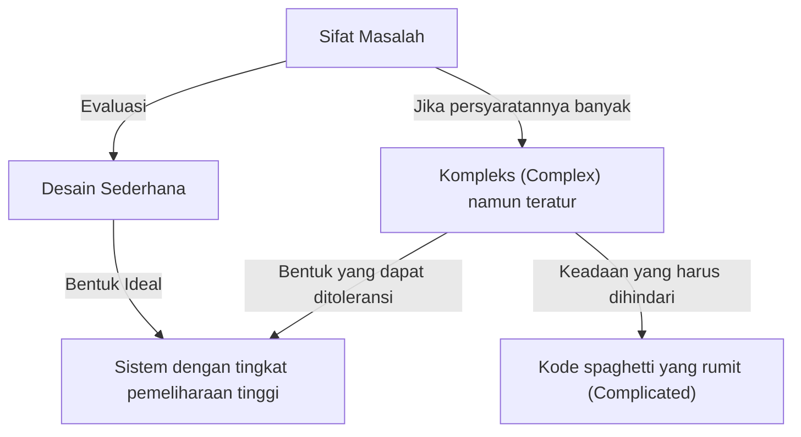
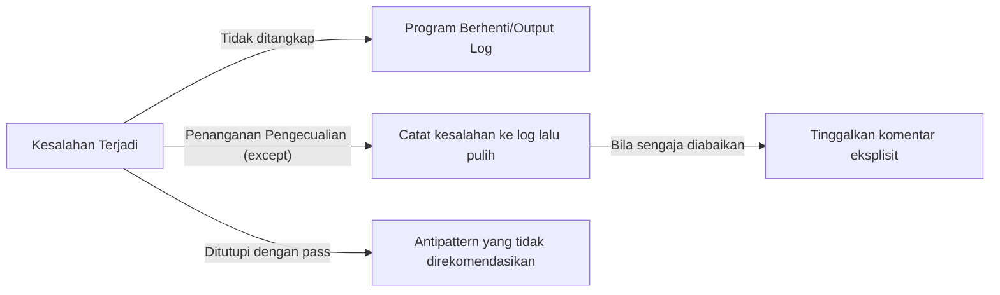

Bahasa pemrograman bukanlah sekadar deretan perintah untuk komputer. Ia adalah media untuk mengekspresikan pemikiran pengembang, dan juga bahasa umum yang dibagikan ke seluruh tim. Di antara banyak bahasa pemrograman, Python memiliki "filosofi" yang sangat unik. Itulah **"The Zen of Python (Zen Python)"**.

Dalam artikel ini, kita akan menggali lebih dalam dengan sangat rinci mengenai "Zen" yang menjadi akar dari filosofi desain Python, mulai dari latar belakang penciptaannya, filosofi mendalam di balik setiap pepatah, dan bagaimana kita seharusnya menerapkan pemikiran ini dalam pengembangan perangkat lunak kita sehari-hari.

---

## 1. Apa itu "The Zen of Python"?

Pernahkah Anda membuka interactive shell (REPL) Python dan mengetikkan perintah berikut?

```python
import this
```

Ketika Anda mengeksekusi kode pendek ini, sebuah teks puitis sepanjang 19 baris akan ditampilkan di layar sebagai easter egg. Inilah "The Zen of Python" yang bisa dikatakan sebagai pilar spiritual komunitas Python.

Ada berbagai praktik terbaik dan pola desain di dunia rekayasa perangkat lunak, tetapi sangat jarang ada bahasa pemrograman tertentu yang memverbalkan filosofi intinya sebagai "puisi" dan menyematkannya ke dalam bahasa itu sendiri.

### Latar Belakang Penciptaan: Tim Peters dan PEP 20

The Zen of Python ditulis oleh Tim Peters, seorang pengembang inti yang telah lama terlibat dalam pengembangan Python. Tim mensistematisasi "pemahaman implisit" dan "intuisi" dalam desain Guido van Rossum, pencipta Python, dengan mengubahnya menjadi kata-kata sehingga dapat dibagikan dengan komunitas.

Ini kemudian didokumentasikan secara resmi sebagai **PEP 20 (Python Enhancement Proposal 20)**. Setiap kali ada penambahan atau perubahan fitur pada Python, PEP 20 ini selalu berfungsi sebagai titik awal untuk kembali.

Menariknya, meskipun The Zen of Python dikenal sebagai "19 pepatah", Tim mengatakan bahwa "ada 20 pepatah secara total, tetapi yang terakhir dibiarkan kosong agar Guido yang menulisnya". Yang terakhir itu masih kosong, seolah-olah mewujudkan semacam "keindahan ruang kosong".

---

## 2. Pemikiran Zen: Mengartikan 19 Pepatah

Setiap baris dari The Zen of Python, sekilas terlihat seperti deretan kata sederhana, tetapi di baliknya tersembunyi pengetahuan mendalam tentang rekayasa perangkat lunak. Mari kita uraikan maknanya satu per satu.

### Beautiful is better than ugly. (Indah lebih baik daripada buruk rupa)

Kode dieksekusi oleh mesin, tetapi lebih dari itu, kode adalah "sesuatu untuk dibaca oleh manusia". Python secara paksa menjamin keindahan visual dengan memaksakan indentasi sebagai blok sintaks.

Kode yang indah memiliki alur logika yang jelas dan niat yang segera tersampaikan. Kode yang jelek (misalnya sarang atau *nesting* yang terlalu dalam, aturan penamaan yang berantakan, logika spaghetti) tidak hanya menjadi sarang bug, tetapi juga menurunkan motivasi tim. Mengejar keindahan bukan sekadar estetika, melainkan pendekatan praktis untuk membuat perangkat lunak yang sangat mudah dipelihara.

### Explicit is better than implicit. (Eksplisit lebih baik daripada implisit)

Prinsip ini adalah salah satu fitur utama yang membedakan Python dengan beberapa bahasa lain (seperti Ruby atau JavaScript).
Perilaku implisit atau "sihir" mungkin terasa nyaman saat menulis kode. Namun, ketika membaca kode itu setengah tahun kemudian, atau ketika anggota baru bergabung dengan proyek, asumsi implisit menjadi penghalang besar.

Python lebih suka memperjelas "apa yang sedang diimpor" dan "variabel apa yang sedang dimanipulasi". Misalnya, penulisan `from module import *` tidak direkomendasikan. Karena menjadi implisit dari mana fungsi mana berasal.

### Simple is better than complex. (Sederhana lebih baik daripada kompleks)
### Complex is better than complicated. (Kompleks lebih baik daripada rumit)

Kedua pepatah ini harus dipertimbangkan sebagai satu kesatuan. Pertama-tama, kita harus mencari solusi yang paling "sederhana" untuk setiap masalah. Hierarki kelas yang tidak perlu dan abstraksi yang berlebihan harus dihindari.

Namun, logika bisnis di dunia nyata tidak selalu sederhana. Jika masalahnya pada dasarnya kompleks (Complex), dapat dimaklumi jika kodenya mencerminkan hal tersebut dan menjadi kompleks.

Tetapi, Anda tidak boleh mengubah sesuatu yang kompleks menjadi keadaan yang "rumit (Complicated)". "Complex (kompleks)" adalah keadaan di mana ada banyak elemen tetapi strukturnya teratur, sedangkan "Complicated (rumit)" merujuk pada keadaan di mana desainnya rusak dan saling terkait.



### Flat is better than nested. (Datar lebih baik daripada bersarang)

Sarang (indentasi) yang dalam akan sangat mengurangi keterbacaan kode. Terutama bila ada pengulangan atau percabangan bersyarat dalam beberapa lapis, itu akan membebani memori kerja otak, sehingga bug lebih mudah terlewatkan.

Di Python, disarankan untuk menjaga kode sedatar (flat) mungkin dengan menggunakan pemahaman daftar (list comprehension) atau pola kembali lebih awal (Early Return).

### Sparse is better than dense. (Renggang lebih baik daripada padat)

Mempadatkan kode ke dalam satu baris adalah ide yang buruk. Jika Anda menjejalkan banyak proses ke dalam satu baris (misalnya, rumus matematika kompleks, rantai metode, operator ternary, dll.), Anda tidak akan tahu di mana kesalahan terjadi ketika melakukan eksekusi bertahap (step execution) di debugger.

Dengan memberikan spasi dan baris baru yang wajar dan menjaga agar prosesnya tetap "renggang (Sparse)", maksud dari kode tersebut akan menjadi jelas.

### Readability counts. (Keterbacaan itu penting)

Ini adalah salah satu nilai terpenting dalam desain Python. Berdasarkan fakta bahwa "kode lebih sering dibaca daripada ditulis". Sintaks Python dirancang mendekati bahasa alami bahasa Inggris untuk memaksimalkan "keterbacaan" ini.

### Special cases aren't special enough to break the rules. (Kasus khusus tidak cukup istimewa untuk melanggar aturan)
### Although practicality beats purity. (Meskipun kepraktisan mengalahkan kemurnian)

Ini juga adalah pepatah yang berpasangan. Pada prinsipnya, kita harus secara ketat mematuhi aturan dan konvensi penulisan kode (seperti PEP 8) yang telah ditetapkan. Jika Anda mulai melanggar aturan hanya dengan berkata "kali ini saja ada pengecualian", seluruh sistem akan mulai runtuh.

Namun, pada saat yang sama, Python juga merupakan bahasa "pragmatisme (Pragmatism)". Jika mengejar "kemurnian" teoretis menyebabkan kinerja turun drastis atau kegunaan memburuk, maka kepraktisan harus diprioritaskan. Rasa keseimbangan inilah yang menjadi alasan mengapa Python digunakan secara luas.

### Errors should never pass silently. (Kesalahan tidak boleh berlalu begitu saja secara diam-diam)
### Unless explicitly silenced. (Kecuali jika didiamkan secara eksplisit)

Jika ada kondisi abnormal dalam sistem, kodenya harus segera gagal (Fail Fast). Jika Anda menutupi kesalahan dan membiarkan program terus berjalan, nanti akan muncul bug yang penyebabnya tidak diketahui, dan membuat debugging menjadi sangat sulit.



Jika Anda benar-benar ingin mengabaikan kesalahan, Anda harus mengabaikannya secara "eksplisit" menggunakan blok `try...except`.

### In the face of ambiguity, refuse the temptation to guess. (Menghadapi ambiguitas, tolak godaan untuk menebak)

Ada bahasa pemrograman yang mana kompilator atau interpreter "menebak" niat dari programmer dan memprosesnya secara otomatis. Misalnya konversi tipe data implisit adalah salah satu contoh tipikal.

Python tidak menyukai perilaku "membaca situasi" seperti ini. Jika Anda mencoba menambahkan string ke angka, alih-alih menggabungkan string secara otomatis, Python akan melemparkan `TypeError`. Dalam situasi yang ambigu, ia menuntut instruksi yang jelas dari manusia (programmer).

### There should be one-- and preferably only one --obvious way to do it. (Seharusnya ada satu-- dan lebih disukai hanya satu --cara yang jelas untuk melakukannya)
### Although that way may not be obvious at first unless you're Dutch. (Meskipun cara itu mungkin tidak jelas pada awalnya kecuali Anda orang Belanda)

Bahasa Perl memiliki filosofi "There's more than one way to do it" (TIMTOWTDI: Ada lebih dari satu cara untuk melakukannya), tetapi Python mengambil arah yang berlawanan.

Jika melakukan pemrosesan yang sama, idealnya semua orang menulis dengan cara yang sama. Hal ini secara drastis mengurangi beban kognitif saat membaca kode yang ditulis oleh orang lain.
Selain itu, "orang Belanda" yang dimaksud merujuk pada Guido van Rossum, pencipta Python. Ini mengandung humor bahwa mungkin butuh waktu untuk memahami niat perancang bahasa dengan sempurna.

### Now is better than never. (Sekarang lebih baik daripada tidak sama sekali)
### Although never is often better than *right* now. (Meskipun tidak sama sekali sering kali lebih baik daripada *sekarang juga*)

Ini adalah filosofi penjadwalan dan pengambilan keputusan dalam pengembangan perangkat lunak. Daripada tidak melakukan apa pun sambil menunggu solusi yang sempurna, lebih baik melakukan hal terbaik yang bisa dilakukan sekarang untuk merilis kode dan mendapatkan umpan balik (pemikiran gaya Agile).

Namun di sisi lain, sering kali "tidak melakukan apa-apa" sampai Anda tahu akar penyebabnya, jauh lebih baik daripada menerapkan *hack* sembarangan atau perbaikan tidak sempurna "sekarang juga". Ini adalah peringatan untuk tidak meningkatkan utang teknis (technical debt) secara sembarangan.

### If the implementation is hard to explain, it's a bad idea. (Jika implementasinya sulit dijelaskan, itu adalah ide yang buruk)
### If the implementation is easy to explain, it may be a good idea. (Jika implementasinya mudah dijelaskan, itu mungkin ide yang bagus)

Ini adalah salah satu indikator utama untuk mengukur kualitas kode. Jika Anda bersusah payah menjelaskan kepada anggota tim bagaimana kode Anda bekerja, maka desainnya salah.

Sebaliknya, jika Anda bisa menjelaskan alur kode dengan mudah menggunakan papan tulis, desainnya kemungkinan besar bagus. (Namun karena "mudah = tidak selalu benar", maka digunakan ekspresi yang lebih hati-hati yaitu "mungkin" atau "may be".)

### Namespaces are one honking great idea -- let's do more of those! (Ruang nama adalah satu ide yang sangat hebat -- mari kita gunakan lebih banyak lagi!)

"Ruang nama (seperti modul dan kelas)" yang mencegah bentrok antara nama variabel atau nama fungsi merupakan konsep penting untuk membangun perangkat lunak berskala besar. Python mendorong penggunaan ruang nama berbasis modul secara proaktif untuk menjaga keterikatan (coupling) sistem tetap rendah.

---

## 3. Bagaimana Menerapkan The Zen of Python ke dalam Pengembangan Sehari-hari

The Zen of Python tentu saja tidak hanya berlaku saat menggunakan Python. Filosofi yang diutarakan di sini memiliki kebenaran universal yang dapat diterapkan pada desain sistem menggunakan bahasa pemrograman apa pun, bahkan hingga komunikasi tim dan teori organisasi.

1. **Sebagai standar untuk code review**: Saat ragu dengan sebuah desain dalam tim, menggunakan ungkapan Zen seperti "Apakah itu Simple atau Complex?" atau "Apakah itu menjadi implisit?" sebagai bahasa umum dapat mencegah konflik emosional dan memungkinkan diskusi yang konstruktif.
2. **Sebagai kompas untuk desain**: Saat menambahkan fitur baru, memperhatikan apakah "Dapat dijaga tetap datar?" atau "Apakah kita menangani kesalahan dengan tepat?" dapat mempertahankan arsitektur yang dapat dipelihara dalam jangka panjang.
3. **Refactoring secara terus-menerus**: Memiliki rasa keindahan "Indah lebih baik daripada buruk rupa" di seluruh tim menghilangkan kompromi "yang penting jalan", dan menumbuhkan budaya untuk menjaga *codebase* tetap sehat.

## Kesimpulan

"The Zen of Python" memadatkan kebijaksanaan mendalam dalam rekayasa perangkat lunak hanya dalam teks singkat 19 baris. Alasan mengapa Python sangat dicintai di seluruh dunia saat ini, menjadi bahasa populer luar biasa yang digunakan dalam berbagai bidang seperti AI, ilmu data (data science), dan pengembangan Web, adalah karena keberadaan "filosofi" yang indah dan tangguh ini.

Lain kali saat Anda menulis kode, berhentilah sejenak dan cobalah untuk mengingat kata-kata "Zen" ini. Pastinya, kode Anda akan berkembang menjadi sesuatu yang lebih indah, lebih mudah dibaca, dan lebih Pythonic.
