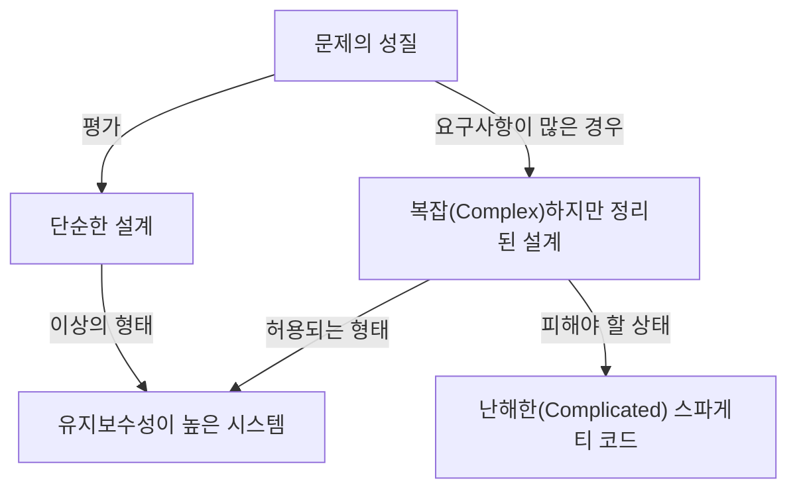
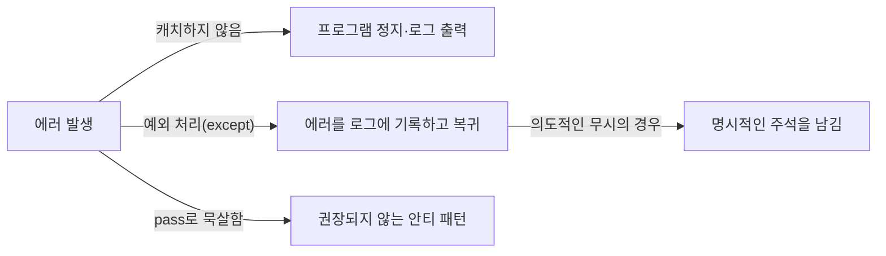

프로그래밍 언어는 단순한 컴퓨터에 대한 명령의 나열이 아닙니다. 그것은 개발자의 사고를 표현하기 위한 미디어이며, 팀 전체가 공유하는 공통 언어이기도 합니다. 수많은 프로그래밍 언어 중에서도 Python은 눈에 띄게 독특한 「철학」을 가지고 있습니다. 그것이 바로 **「The Zen of Python (Python의 선)」**입니다.

본 기사에서는 Python 설계 사상의 근간을 이루는 이 「Zen (선)」에 대해, 그 탄생 배경부터 각 격언이 의미하는 깊은 철학, 그리고 우리가 일상적인 소프트웨어 개발에서 어떻게 이 사상을 적용해 나가야 하는지에 대해 매우 상세하게 깊이 파고들어 보겠습니다.

---

## 1. 「The Zen of Python」이란 무엇인가?

Python의 인터랙티브 셸(REPL)을 열고 다음 명령을 입력해 본 적이 있습니까?

```python
import this
```

이 짧은 코드를 실행하면, 화면에는 이스터 에그로서 19줄의 시와 같은 텍스트가 출력됩니다. 이것이 Python 커뮤니티의 정신적 지주라고도 할 수 있는 「The Zen of Python」입니다.

소프트웨어 엔지니어링의 세계에는 다양한 모범 사례나 디자인 패턴이 존재하지만, 특정 프로그래밍 언어가 스스로의 핵심 철학을 「시」로서 언어화하고, 언어 자체에 내장하고 있는 예는 극히 드뭅니다.

### 탄생의 배경: Tim Peters와 PEP 20

The Zen of Python은 오랜 기간 Python 개발에 참여해 온 코어 디벨로퍼 Tim Peters(팀 피터스)에 의해 쓰여졌습니다. Tim은 Python의 창시자인 Guido van Rossum(귀도 반 로섬)의 설계에 있어서의 「암묵적인 양해」나 「직관」을 언어화하여 커뮤니티에서 공유할 수 있도록 체계화했습니다.

이것은 나중에 **PEP 20 (Python Enhancement Proposal 20)**으로 공식적으로 문서화되었습니다. Python의 기능 추가나 변경이 이루어질 때, 이 PEP 20은 항상 되돌아가야 할 원점으로 기능하고 있습니다.

재미있게도 The Zen of Python은 「19가지 격언」으로 알려져 있지만, Tim은 "모두 20가지가 있지만, 마지막 하나는 Guido가 쓰기 위해 비워 두었다"라고 말했습니다. 그 마지막 하나는 여전히 공백으로 남아 있으며, 일종의 「여백의 미」를 구현하고 있는 듯합니다.

---

## 2. 선의 사상: 19가지 격언 해석하기

The Zen of Python의 각 줄은 얼핏 보면 단순한 말의 나열이지만, 그 이면에는 소프트웨어 엔지니어링의 깊은 식견이 숨겨져 있습니다. 하나씩 그 의미를 밝혀 봅시다.

### Beautiful is better than ugly. (아름다운 것이 추한 것보다 낫다)

코드는 기계가 실행하는 것이지만, 그 이상으로 「인간이 읽는 것」입니다. Python은 들여쓰기를 구문의 블록으로 강제함으로써 시각적인 아름다움을 강제로 담보합니다.

아름다운 코드는 로직의 흐름이 명확하고 의도가 바로 전달됩니다. 추한 코드(예를 들어 불필요하게 깊은 중첩, 제각각인 명명 규칙, 스파게티화된 로직)는 버그의 온상이 될 뿐만 아니라 팀의 사기마저 떨어뜨립니다. 아름다움을 추구하는 것은 단순한 미학이 아니라 유지보수성이 높은 소프트웨어를 만들기 위한 실용적인 접근 방식입니다.

### Explicit is better than implicit. (명시적인 것이 암묵적인 것보다 낫다)

이 원칙은 Python과 다른 몇몇 언어(예를 들어 Ruby나 JavaScript 등)를 가르는 큰 특징 중 하나입니다.
암묵적인 동작이나 「매직」은 코드를 작성할 때는 편리하게 느껴질지 모릅니다. 하지만 반년 후에 그 코드를 읽거나 새로운 멤버가 프로젝트에 참여했을 때, 암묵적인 전제는 거대한 장벽이 됩니다.

Python은 「무엇을 임포트하고 있는지」, 「어떤 변수를 조작하고 있는지」를 명시하는 것을 선호합니다. 예를 들어 `from module import *`라는 작성법은 권장되지 않습니다. 어디서 어떤 함수가 오고 있는지가 암묵적이 되어버리기 때문입니다.

### Simple is better than complex. (단순한 것이 복잡한 것보다 낫다)
### Complex is better than complicated. (복잡한 것이 난해한 것보다 낫다)

이 두 격언은 세트로 생각해야 합니다. 먼저, 모든 문제에 대해 가장 「단순한」 해결책을 찾아야 합니다. 불필요한 클래스 계층이나 과도한 추상화는 피해야 합니다.

하지만 현실 세계의 비즈니스 로직이 항상 단순한 것은 아닙니다. 문제 자체가 본질적으로 복잡(Complex)한 경우, 코드도 그것을 반영하여 복잡해지는 것은 허용됩니다.

단, 복잡한 것을 「난해한 상태(Complicated)」로 만들어서는 안 됩니다. 「Complex(복잡)」는 구조가 정리된 상태에서 요소가 많은 상태이며, 「Complicated(난해한)」는 설계가 파탄 나고 뒤엉켜 있는 상태를 가리킵니다.



### Flat is better than nested. (평평한 것이 중첩된 것보다 낫다)

깊은 중첩(들여쓰기)은 코드의 가독성을 현저히 떨어뜨립니다. 특히 루프나 조건 분기가 몇 겹으로 겹치면 뇌의 작업 기억을 압박하여 버그를 놓치기 쉬워집니다.

Python에서는 리스트 컴프리헨션을 사용하거나 조기 반환(Early Return) 패턴을 사용함으로써 코드를 가능한 한 평탄하게(플랫하게) 유지할 것을 권장합니다.

### Sparse is better than dense. (여유로운 것이 밀집된 것보다 낫다)

코드를 한 줄에 너무 많이 채워 넣는 것은 나쁜 방법입니다. 1줄에 여러 처리(예를 들어 복잡한 수식, 메서드 체인, 삼항 연산자 등)를 채워 넣으면, 디버거에서 단계 실행을 할 때 어디서 에러가 발생했는지 알 수 없게 됩니다.

적절한 공백과 줄바꿈을 넣고 처리를 「여유롭게(Sparse)」 유지함으로써 코드의 의도가 분명하게 드러납니다.

### Readability counts. (가독성은 중요하다)

Python의 디자인에서 가장 중요한 가치관 중 하나입니다. "코드는 작성되는 횟수보다 읽히는 횟수가 훨씬 많다"라는 사실에 바탕을 두고 있습니다. Python의 구문이 영어의 자연어에 가까운 형태로 설계된 것도 이 「가독성」을 극한까지 높이기 위해서입니다.

### Special cases aren't special enough to break the rules. (특별한 경우라도 규칙을 깰 만큼 특별하지 않다)
### Although practicality beats purity. (하지만 실용성은 순수성을 이긴다)

이것 역시 짝을 이루는 격언입니다. 원칙적으로 우리는 정해진 규칙이나 코딩 규약(PEP 8 등)을 엄격하게 지켜야 합니다. "이번만은 특별하니까"라며 규칙을 깨기 시작하면 시스템 전체가 붕괴로 향합니다.

하지만 동시에 Python은 「실용주의(Pragmatism)」의 언어이기도 합니다. 이론적인 「순수성」을 추구한 나머지 성능이 극단적으로 떨어지거나 사용성이 나빠진다면 실용성을 우선해야 합니다. 이 균형 감각이야말로 Python이 널리 사용되는 이유입니다.

### Errors should never pass silently. (에러는 결코 조용히 넘어가서는 안 된다)
### Unless explicitly silenced. (명시적으로 조용히 넘기지 않는 한)

시스템에서 어떤 이상 상태가 발생한 경우, 코드는 즉시 실패해야(Fail Fast) 합니다. 에러를 묵살하고 프로그램을 계속 진행하면, 나중에 원인 불명의 버그로 발현되어 디버깅을 매우 어렵게 만듭니다.



만약 정말로 에러를 무시하고 싶다면, `try...except` 블록을 사용하여 「명시적」으로 무시해야 합니다.

### In the face of ambiguity, refuse the temptation to guess. (모호함에 직면했을 때, 추측하려는 유혹을 거절하라)

컴파일러나 인터프리터가 프로그래머의 의도를 마음대로 「추측」하여 처리를 진행해 버리는 언어가 있습니다. 예를 들어 암묵적인 형 변환 등이 그 전형입니다.

Python은 이러한 「눈치 보는」 동작을 싫어합니다. 문자열과 숫자를 더하려고 한 경우, Python은 마음대로 문자열 결합을 하는 것이 아니라 `TypeError`를 던집니다. 모호한 상황에서는 인간(프로그래머)에게 명확한 지시를 요구하는 것입니다.

### There should be one-- and preferably only one --obvious way to do it. (어떤 일을 하기 위한 명백한 방법은 하나, 가급적이면 오직 하나여야 한다)
### Although that way may not be obvious at first unless you're Dutch. (당신이 네덜란드인이 아니라면 처음에는 그 방법이 명백하지 않을 수 있지만)

Perl이라는 언어에는 "There's more than one way to do it" (TIMTOWTDI: 방법은 하나가 아니다)라는 철학이 있지만, Python은 그 정반대로 갑니다.

같은 처리를 한다면 누구나 같은 작성법이 되는 것이 이상적입니다. 이를 통해 다른 사람이 작성한 코드를 읽을 때의 인지 부하가 극적으로 줄어듭니다.
참고로 「네덜란드인」이라는 것은 Python의 창시자인 Guido van Rossum을 가리킵니다. 언어 설계자의 의도를 완전히 이해하는 데는 시간이 걸릴 수 있다는 유머가 포함되어 있습니다.

### Now is better than never. (지금 하는 것이 아예 안 하는 것보다 낫다)
### Although never is often better than *right* now. (하지만 아예 안 하는 것이 종종 '당장' 하는 것보다 낫다)

소프트웨어 개발에서의 일정 관리와 의사 결정에 대한 철학입니다. 완벽한 해결책을 기다리며 아무것도 하지 않는 것보다는 지금 할 수 있는 최선을 다해 코드를 릴리스하고 피드백을 얻어야 합니다(애자일적인 사고).

하지만 한편으로, 「당장」 임시방편적인 해킹이나 불완전한 수정을 넣을 바에는 근본적인 원인을 알 때까지 「아무것도 하지 않는」 편이 나은 경우도 많습니다. 기술적 부채를 부주의하게 늘려서는 안 된다는 경고입니다.

### If the implementation is hard to explain, it's a bad idea. (구현을 설명하기 어렵다면, 그것은 나쁜 아이디어다)
### If the implementation is easy to explain, it may be a good idea. (구현을 설명하기 쉽다면, 그것은 좋은 아이디어일 수 있다)

코드의 품질을 측정하는 궁극적인 지표 중 하나입니다. 만약 당신이 작성한 코드의 동작을 팀원에게 설명하는 데 어려움을 겪고 있다면, 그 설계는 잘못된 것입니다.

반대로 코드의 흐름을 화이트보드에서 쉽게 설명할 수 있다면, 그 설계는 우수할 가능성이 높습니다. (단, "쉽다=무조건 옳다"는 아니기 때문에 "may be"라고 조심스럽게 표현되어 있습니다.)

### Namespaces are one honking great idea -- let's do more of doing those! (네임스페이스는 정말 훌륭한 아이디어다 -- 더 많이 활용하자!)

변수명이나 함수명의 충돌을 방지하는 「네임스페이스(모듈이나 클래스 등)」는 대규모 소프트웨어를 구축하는 데 없어서는 안 될 개념입니다. Python은 모듈 기반의 네임스페이스를 적극적으로 이용함으로써 시스템의 결합도를 낮게 유지하는 것을 추진하고 있습니다.

---

## 3. The Zen of Python을 일상적인 개발에 어떻게 활용할 것인가

The Zen of Python은 결코 Python을 사용할 때만 적용되는 것이 아닙니다. 여기서 이야기하는 철학은 모든 프로그래밍 언어를 이용한 시스템 설계, 나아가 팀의 커뮤니케이션이나 조직론에도 응용할 수 있는 보편적인 진리를 가지고 있습니다.

1. **코드 리뷰의 기준으로 삼는다**: 팀 내에서 설계에 고민할 때, "그것은 Simple한가? Complex한가?", "암묵적이진 않은가?"라는 Zen의 말을 공통 언어로 사용함으로써 감정적인 대립을 막고 건설적인 논의가 가능해집니다.
2. **설계의 나침반으로 삼는다**: 새로운 기능을 추가할 때, "플랫하게 유지할 수 있는가?", "에러를 적절하게 핸들링하고 있는가?"를 의식함으로써 장기적으로 유지보수 가능한 아키텍처를 유지할 수 있습니다.
3. **지속적인 리팩터링**: "아름다운 것이 추한 것보다 낫다"라는 미의식을 팀 전체가 가짐으로써, "작동하기만 하면 된다"라는 타협을 배제하고 코드베이스를 항상 건전한 상태로 유지하는 문화가 자라납니다.

## 요약

「The Zen of Python」은 단 19줄의 짧은 문장 속에 소프트웨어 엔지니어링의 깊은 지혜가 응축되어 있습니다. Python이 오늘날처럼 전 세계에서 사랑받고 AI, 데이터 과학, 웹 개발 등 모든 분야에서 이용되는 압도적인 인기 언어가 된 이면에는 이 아름답고 강인한 「철학」의 존재가 있었기 때문입니다.

다음에 당신이 코드를 작성할 때, 잠시 멈춰 서서 이 「선」의 말을 떠올려 보십시오. 분명 당신의 코드는 더 아름답고, 더 읽기 쉽고, 더 Pythonic한 것으로 진화해 나갈 것입니다.
