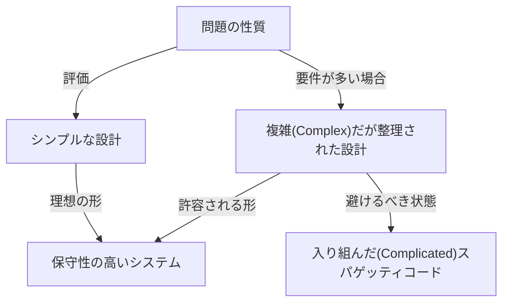
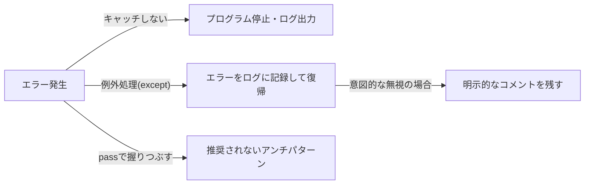

プログラミング言語は、単なるコンピュータへの命令の羅列ではありません。それは開発者の思考を表現するためのメディアであり、チーム全体で共有される共通言語でもあります。数あるプログラミング言語の中でも、Pythonは際立ってユニークな「哲学」を持っています。それが**「The Zen of Python（Pythonの禅）」**です。

本記事では、Pythonの設計思想の根幹をなすこの「Zen（禅）」について、その誕生の背景から、各格言が意味する深い哲学、そして私たちが日々のソフトウェア開発においてどのようにこの思想を適用していくべきかについて、極めて詳細に深掘りしていきます。

---

## 1. 「The Zen of Python」とは何か？

Pythonのインタラクティブシェル（REPL）を開いて、以下のコマンドを入力したことはあるでしょうか？

```python
import this
```

この短いコードを実行すると、画面にはイースターエッグとして19行の詩のようなテキストが出力されます。これが、Pythonコミュニティの精神的支柱とも言える「The Zen of Python」です。

ソフトウェアエンジニアリングの世界には様々なベストプラクティスやデザインパターンが存在しますが、特定のプログラミング言語が自らのコア・フィロソフィーを「詩」として言語化し、言語自体に組み込んでいる例は極めて稀です。

### 誕生の背景：Tim PetersとPEP 20

The Zen of Pythonは、長年Pythonの開発に携わってきたコア・デベロッパーのTim Peters（ティム・ピーターズ）によって書かれました。Timは[Pythonの生みの親](/p/biography-guido-van-rossum/)であるGuido van Rossum（グイド・ヴァン・ロッサム）の設計における「暗黙の了解」や「直感」を、言語化してコミュニティで共有できるように体系化しました。

これはのちに **PEP 20 (Python Enhancement Proposal 20)** として正式に文書化されました。Pythonの機能追加や変更が行われる際、このPEP 20は常に立ち返るべき原点として機能しています。

面白いことに、The Zen of Pythonは「19の格言」として知られていますが、Timは「全部で20あるが、最後の1つはGuidoが書くために空けてある」と述べています。その最後の一つは未だに空白のままであり、一種の「余白の美」を体現しているかのようです。

---

## 2. 禅の思想：19の格言を読み解く

The Zen of Pythonの各行は、一見するとシンプルな言葉の羅列ですが、その背後にはソフトウェアエンジニアリングの深い知見が隠されています。一つずつ、その意味を解き明かしていきましょう。

### Beautiful is better than ugly.（美しいことは醜いことより良い）

コードは機械が実行するものですが、それ以上に「人間が読むもの」です。Pythonはインデントを構文のブロックとして強制することで、強制的に視覚的な美しさを担保します。

美しいコードは、ロジックの流れが明確であり、意図がすぐに伝わります。醜いコード（例えば無駄にネストが深い、命名規則がバラバラ、ロジックがスパゲッティ化している）は、バグの温床になるだけでなく、チームのモチベーションさえも低下させます。美しさを追求することは、単なる美学ではなく、保守性の高いソフトウェアを作るための実用的なアプローチなのです。

### Explicit is better than implicit.（明示的なことは暗黙的なことより良い）

この原則は、Pythonと他のいくつかの言語（例えばRubyやJavaScriptなど）を隔てる大きな特徴の一つです。
暗黙的な挙動や「マジック」は、コードを書く時は便利に感じるかもしれません。しかし、半年後にそのコードを読んだり、新しいメンバーがプロジェクトに参加したりした時、暗黙の前提は巨大な障壁となります。

Pythonは「何をインポートしているか」「どの変数を操作しているか」を明示することを好みます。例えば、`from module import *` という書き方は推奨されません。どこからどの関数が来ているのかが暗黙的になってしまうからです。

### Simple is better than complex.（シンプルなことは複雑なことより良い）
### Complex is better than complicated.（複雑なことは入り組んだことより良い）

この2つの格言はセットで考えるべきです。まず、あらゆる問題に対して最も「シンプル」な解決策を探すべきです。余計なクラス階層や、過剰な抽象化は避けるべきです。

しかし、現実世界のビジネスロジックは常にシンプルであるとは限りません。問題自体が本質的に複雑（Complex）な場合、コードもそれを反映して複雑になることは許容されます。

ただし、複雑なものを「入り組んだ状態（Complicated）」にしてはいけません。「Complex（複雑）」は構造が整理された上で要素が多い状態であり、「Complicated（入り組んでいる）」は設計が破綻し、絡み合っている状態を指します。



### Flat is better than nested.（フラットなことはネストするより良い）

深いネスト（インデント）はコードの可読性を著しく低下させます。特にループや条件分岐が何重にも重なると、脳のワーキングメモリを圧迫し、バグを見逃しやすくなります。

Pythonではリスト内包表記を使ったり、早期リターン（Early Return）のパターンを用いたりすることで、コードをできるだけ平坦（フラット）に保つことが推奨されます。

### Sparse is better than dense.（疎であることは密であることより良い）

コードを一行に詰め込みすぎるのは悪手です。1行に複数の処理（例えば、複雑な数式、メソッドチェーン、三項演算子など）を詰め込むと、デバッガでステップ実行する際にどこでエラーが起きたか分からなくなります。

適度なスペースと改行を入れ、処理を「疎（Sparse）」に保つことで、コードの意図がはっきりと見えてきます。

### Readability counts.（読みやすさは重要である）

Pythonのデザインにおける最重要の価値観の一つです。「コードは書かれる回数よりも、読まれる回数の方がはるかに多い」という事実に基づいています。Pythonの構文が英語の自然言語に近い形に設計されているのも、この「読みやすさ」を極限まで高めるためです。

### Special cases aren't special enough to break the rules.（特殊なケースもルールを破るほど特殊ではない）
### Although practicality beats purity.（しかし、実用性は純粋さに勝る）

これも対をなす格言です。原則として、私たちは定められたルールやコーディング規約（PEP 8など）を厳密に守るべきです。「今回だけは特別だから」とルールを破り始めると、システム全体が崩壊に向かいます。

しかし、同時にPythonは「実用主義（Pragmatism）」の言語でもあります。理論的な「純粋さ」を追求するあまり、パフォーマンスが極端に落ちたり、使い勝手が悪くなったりするのであれば、実用性を優先すべきです。このバランス感覚こそが、Pythonが広く使われる理由です。

### Errors should never pass silently.（エラーは決して静かに見過ごされてはならない）
### Unless explicitly silenced.（明示的に見過ごされる場合を除いては）

システムで何らかの異常状態が発生した場合、コードは直ちに失敗するべき（Fail Fast）です。エラーを握りつぶしてプログラムを続行すると、後になって原因不明のバグとして発現し、デバッグを極めて困難にします。



もし本当にエラーを無視したい場合は、`try...except` ブロックを用いて「明示的」に無視しなければなりません。

### In the face of ambiguity, refuse the temptation to guess.（曖昧さを前にして、推測の誘惑を拒絶せよ）

コンパイラやインタープリタが、プログラマの意図を勝手に「推測」して処理を進めてしまう言語があります。例えば、暗黙の型変換などがその典型です。

Pythonはこのような「空気を読む」挙動を嫌います。文字列と数値を足そうとした場合、Pythonは勝手に文字列結合をするのではなく、`TypeError` を投げます。曖昧な状況では、人間（プログラマ）に明確な指示を要求するのです。

### There should be one-- and preferably only one --obvious way to do it.（あることを行うための明白な方法は1つ、できれば1つだけであるべきだ）
### Although that way may not be obvious at first unless you're Dutch.（あなたがオランダ人でない限り、最初は明白ではないかもしれないが）

Perlという言語には "There's more than one way to do it" (TIMTOWTDI: やり方は1つじゃない) という哲学がありますが、Pythonはその真逆を行きます。

同じ処理をするなら、誰もが同じ書き方になるのが理想的です。これにより、他の人の書いたコードを読む時の認知負荷が劇的に下がります。
なお「オランダ人」というのは、[Pythonの生みの親](/p/biography-guido-van-rossum/)であるGuido van Rossumのことです。言語設計者の意図を完全に理解するには時間がかかるかもしれない、というユーモアが含まれています。

### Now is better than never.（今やることは全くやらないことより良い）
### Although never is often better than *right* now.（しかし、全くやらないことは、往々にして「今すぐ」やることより良い）

ソフトウェア開発におけるスケジューリングと意思決定の哲学です。完璧な解決策を待って何もしないよりは、今できる最善を尽くしてコードをリリースし、フィードバックを得るべきです（アジャイル的な思考）。

しかし一方で、「今すぐ」場当たり的なハックや不完全な修正を入れるくらいなら、根本的な原因が分かるまで「何もしない」方がマシな場合も多々あります。技術的負債を不用意に増やすべきではないという戒めです。

### If the implementation is hard to explain, it's a bad idea.（実装を説明するのが難しいなら、それは悪いアイデアだ）
### If the implementation is easy to explain, it may be a good idea.（実装を説明するのが簡単なら、それは良いアイデアかもしれない）

コードの品質を測る究極の指標の一つです。もしあなたが書いたコードの動作を、チームメンバーに説明するのに四苦八苦しているなら、その設計は間違っています。

逆に、コードの流れをホワイトボードで簡単に説明できるなら、その設計は優れている可能性が高いです。（ただし、「簡単＝絶対に正しい」とは限らないため、"may be" と控えめな表現になっています。）

### Namespaces are one honking great idea -- let's do more of those!（名前空間は素晴らしいアイデアだ -- もっと活用しよう！）

変数名や関数名の衝突を防ぐ「名前空間（モジュールやクラスなど）」は、大規模なソフトウェアを構築する上で不可欠な概念です。Pythonはモジュールベースの名前空間を積極的に利用することで、システムの結合度を低く保つことを推進しています。

---

## 3. The Zen of Pythonを日常の開発にどう活かすか

The Zen of Pythonは、決してPythonを使うときだけに適用されるものではありません。ここで語られている哲学は、あらゆるプログラミング言語を用いたシステム設計、ひいてはチームのコミュニケーションや組織論にも応用できる普遍的な真理を持っています。

1. **コードレビューの基準とする**: チーム内で設計に迷った時、「それはSimpleか？Complexか？」「暗黙的になっていないか？」というZenの言葉を共通言語として用いることで、感情的な対立を防ぎ、建設的な議論が可能になります。
2. **設計の羅針盤とする**: 新しい機能を追加する際、「フラットに保てるか？」「エラーを適切にハンドリングしているか？」を意識することで、長期的にメンテナンス可能なアーキテクチャを保つことができます。
3. **継続的なリファクタリング**: 「美しいは醜いより良い」という美意識をチーム全体で持つことで、「動けばいい」という妥協を排除し、コードベースを常に健全な状態に保つ文化が育ちます。

## まとめ

「The Zen of Python」は、たった19行の短い文章の中に、ソフトウェアエンジニアリングの深い叡智が凝縮されています。Pythonが今日のように世界中で愛され、AI、データサイエンス、Web開発などあらゆる分野で利用される圧倒的な人気言語となった裏には、この美しく強靭な「哲学」の存在があったからです。

次にあなたがコードを書くとき、少しだけ立ち止まって、この「禅」の言葉を思い出してみてください。きっと、あなたのコードはより美しく、より読みやすく、よりPythonicなものへと進化していくはずです。
