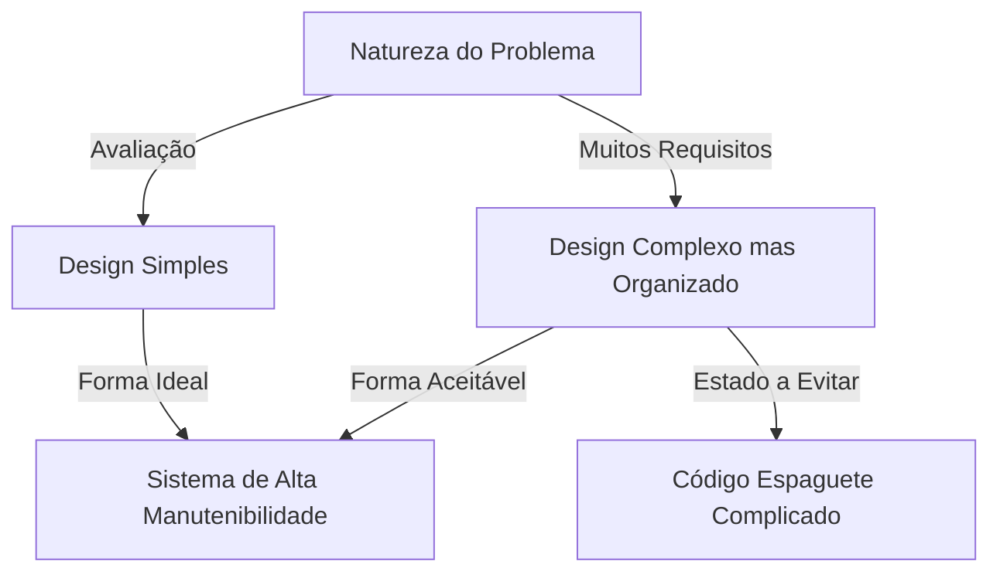
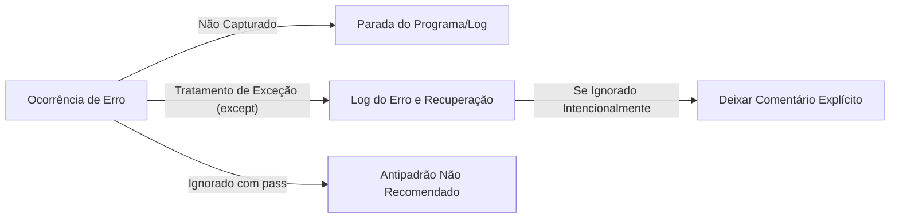

As linguagens de programação não são apenas uma sequência de comandos para um computador. Elas são um meio para expressar o pensamento do desenvolvedor e uma linguagem comum compartilhada por toda a equipe. Entre muitas linguagens de programação, o Python tem uma "filosofia" notavelmente única. Esse é **"The Zen of Python (O Zen do Python)"**.

Neste artigo, vamos nos aprofundar nessa filosofia "Zen", que forma a base do design do Python, desde o contexto de seu nascimento, a filosofia profunda por trás de cada aforismo, e como devemos aplicar esses princípios em nosso desenvolvimento diário de software.

---

## 1. O que é "The Zen of Python"?

Você já abriu o shell interativo do Python (REPL) e digitou o seguinte comando?

```python
import this
```

Ao executar este código curto, um texto de 19 linhas semelhante a um poema é impresso na tela como um easter egg. Este é "The Zen of Python", que pode ser dito ser o pilar espiritual da comunidade Python.

Existem várias melhores práticas e padrões de projeto no mundo da engenharia de software, mas é extremamente raro que uma linguagem de programação específica articule sua filosofia central como um "poema" e a integre na própria linguagem.

### Contexto de Nascimento: Tim Peters e PEP 20

O Zen do Python foi escrito por Tim Peters, um desenvolvedor central envolvido no desenvolvimento do Python por muitos anos. Tim sistematizou o "conhecimento tácito" e a "intuição" na concepção de Guido van Rossum, o criador do Python, para que pudessem ser verbalizados e compartilhados com a comunidade.

Mais tarde, isso foi documentado oficialmente como **PEP 20 (Python Enhancement Proposal 20)**. Sempre que recursos são adicionados ou alterados no Python, esta PEP 20 serve como ponto de partida ao qual se deve sempre retornar.

Curiosamente, O Zen do Python é conhecido como "19 aforismos", mas Tim afirmou: "Há 20 no total, mas o último foi deixado em branco para Guido escrever". Esse último permanece em branco até hoje, como se incorporasse uma espécie de "beleza do espaço vazio".

---

## 2. A Filosofia do Zen: Decifrando os 19 Aforismos

Cada linha de "The Zen of Python" é, à primeira vista, um simples arranjo de palavras, mas por trás delas esconde-se um profundo conhecimento de engenharia de software. Vamos desvendar o significado um por um.

### Beautiful is better than ugly. (Bonito é melhor que feio.)

O código é executado por máquinas, mas acima de tudo, é "lido por humanos". O Python garante beleza visual forçando o recuo (indentação) como blocos de sintaxe.

Um código bonito tem um fluxo lógico claro e transmite imediatamente sua intenção. Código feio (por exemplo, com aninhamento desnecessariamente profundo, convenções de nomenclatura inconsistentes, lógica espaguete) não apenas se torna um terreno fértil para bugs, mas também reduz a motivação da equipe. A busca pela beleza não é apenas uma estética, mas uma abordagem prática para criar software de alta manutenibilidade.

### Explicit is better than implicit. (Explícito é melhor que implícito.)

Este princípio é uma das principais características que separam o Python de algumas outras linguagens (como Ruby ou JavaScript).
O comportamento implícito e a "mágica" podem parecer convenientes ao escrever o código. No entanto, quando você lê esse código seis meses depois, ou quando um novo membro se junta ao projeto, suposições implícitas tornam-se grandes barreiras.

O Python prefere deixar explícito "o que está sendo importado" e "quais variáveis estão sendo manipuladas". Por exemplo, a sintaxe `from module import *` não é recomendada porque torna implícito de onde vem cada função.

### Simple is better than complex. (Simples é melhor que complexo.)
### Complex is better than complicated. (Complexo é melhor que complicado.)

Esses dois aforismos devem ser considerados em conjunto. Em primeiro lugar, você deve procurar a solução mais "simples" para qualquer problema. Hierarquias de classes desnecessárias e abstrações excessivas devem ser evitadas.

No entanto, a lógica de negócios no mundo real nem sempre é simples. Quando o problema em si é inerentemente complexo (Complex), é aceitável que o código reflita isso e se torne complexo.

Entretanto, não transforme algo complexo em um estado "complicado (Complicated)". "Complex" significa que existem muitos elementos, mas a estrutura é organizada, enquanto "Complicated" refere-se a um estado onde o design ruiu e está emaranhado.



### Flat is better than nested. (Plano é melhor que aninhado.)

O aninhamento profundo (indentação) reduz significativamente a legibilidade do código. Especialmente quando loops e ramificações condicionais são sobrepostos em muitas camadas, isso sobrecarrega a memória de trabalho do cérebro, facilitando a perda de bugs.

No Python, recomenda-se manter o código o mais plano possível, usando list comprehensions ou padrões de retorno antecipado (Early Return).

### Sparse is better than dense. (Esparso é melhor que denso.)

Colocar muito código em uma única linha é uma má ideia. Se você espremer várias operações em uma linha (por exemplo, fórmulas complexas, encadeamento de métodos, operadores ternários), não saberá onde o erro ocorreu durante a execução passo a passo em um depurador.

Adicionando espaços e quebras de linha adequados e mantendo o processamento "esparso (Sparse)", a intenção do código se tornará claramente visível.

### Readability counts. (A legibilidade conta.)

Um dos valores mais importantes no design do Python. Baseia-se no fato de que "o código é lido com muito mais frequência do que escrito". A sintaxe do Python é projetada para ser próxima da linguagem natural inglesa para maximizar essa "legibilidade".

### Special cases aren't special enough to break the rules. (Casos especiais não são especiais o suficiente para quebrar as regras.)
### Although practicality beats purity. (Embora a praticidade vença a pureza.)

Estes também são aforismos contrastantes. Como regra geral, devemos aderir estritamente às regras estabelecidas e às convenções de codificação (como o PEP 8). Se você começar a quebrar as regras porque "desta vez é especial", todo o sistema rumará ao colapso.

No entanto, ao mesmo tempo, o Python é uma linguagem de "Pragmatismo (Pragmatism)". Se buscar uma "pureza" teórica causar uma queda extrema de desempenho ou prejudicar a usabilidade, a praticidade deve ser priorizada. Esse senso de equilíbrio é a razão pela qual o Python é tão amplamente usado.

### Errors should never pass silently. (Erros nunca devem passar silenciosamente.)
### Unless explicitly silenced. (A menos que sejam explicitamente silenciados.)

Se ocorrer algum estado anormal no sistema, o código deve falhar imediatamente (Fail Fast). Suprimir um erro e continuar o programa fará com que ele se manifeste como um bug desconhecido mais tarde, tornando a depuração extremamente difícil.



Se você realmente quiser ignorar um erro, deve fazê-lo "explicitamente" usando um bloco `try...except`.

### In the face of ambiguity, refuse the temptation to guess. (Diante da ambiguidade, recuse a tentação de adivinhar.)

Algumas linguagens possuem compiladores ou interpretadores que avançam processando e "adivinhando" as intenções do programador de forma independente. As conversões implícitas de tipo, por exemplo, são típicas disso.

O Python odeia esse tipo de comportamento de "ler nas entrelinhas". Se você tentar adicionar uma string e um número, o Python lançará um `TypeError` em vez de concatenar a string arbitrariamente. Em situações ambíguas, exige-se instruções claras do ser humano (programador).

### There should be one-- and preferably only one --obvious way to do it. (Deveria haver uma - e preferencialmente apenas uma - maneira óbvia de fazer isso.)
### Although that way may not be obvious at first unless you're Dutch. (Embora essa maneira possa não ser óbvia à primeira vista, a menos que você seja holandês.)

Uma linguagem chamada Perl tem a filosofia de "There's more than one way to do it" (TIMTOWTDI: Há mais de uma maneira de fazer isso), mas o Python segue exatamente o oposto.

Para realizar o mesmo processo, é ideal que todos escrevam da mesma forma. Isso reduz drasticamente a carga cognitiva ao ler códigos escritos por outras pessoas.
Observe que o "holandês" refere-se a Guido van Rossum, o criador do Python. Isso inclui humor sugerindo que pode levar algum tempo para entender completamente as intenções do criador da linguagem.

### Now is better than never. (Agora é melhor que nunca.)
### Although never is often better than *right* now. (Embora nunca seja frequentemente melhor do que *exatamente* agora.)

A filosofia de agendamento e tomada de decisão no desenvolvimento de software. Em vez de esperar por uma solução perfeita e não fazer nada, você deve fazer o melhor possível agora e lançar o código para obter feedback (pensamento ágil).

Por outro lado, muitas vezes é melhor "não fazer nada" até entender a causa raiz do que aplicar um hack improvisado ou uma correção imperfeita "imediatamente". É um alerta para não aumentar o débito técnico de forma descuidada.

### If the implementation is hard to explain, it's a bad idea. (Se a implementação é difícil de explicar, é uma má ideia.)
### If the implementation is easy to explain, it may be a good idea. (Se a implementação é fácil de explicar, pode ser uma boa ideia.)

Este é um dos indicadores definitivos para medir a qualidade do código. Se você tem dificuldades para explicar o comportamento do código que escreveu para os membros da sua equipe, esse design está errado.

Por outro lado, se você pode explicar facilmente o fluxo do código em um quadro branco, há uma alta probabilidade de que o design seja excelente. (No entanto, a expressão modesta "may be" é usada porque "fácil" não significa necessariamente "absolutamente correto".)

### Namespaces are one honking great idea -- let's do more of those! (Namespaces são uma grande ideia brilhante -- vamos fazer mais deles!)

"Namespaces" (módulos, classes, etc.) que evitam a colisão de nomes de variáveis e funções são um conceito essencial na construção de softwares de grande escala. O Python incentiva manter o acoplamento do sistema baixo, utilizando ativamente namespaces baseados em módulos.

---

## 3. Como usar o The Zen of Python no desenvolvimento diário

O "Zen of Python" não se aplica apenas quando se usa o Python. A filosofia discutida aqui contém verdades universais que podem ser aplicadas ao design de sistemas usando qualquer linguagem de programação, e por extensão, à comunicação em equipe e à teoria organizacional.

1. **Usar como padrão de revisão de código**: Ao hesitar no design dentro da equipe, usar palavras do Zen como "É Simples ou Complexo?" ou "Não está implícito?" como linguagem comum previne conflitos emocionais e permite discussões construtivas.
2. **Usar como bússola de design**: Ao adicionar novos recursos, estar ciente de "Posso mantê-lo plano?" e "Os erros estão sendo tratados adequadamente?" ajudará a manter uma arquitetura que seja fácil de manter a longo prazo.
3. **Refatoração contínua**: Ao compartilhar um senso estético em toda a equipe de que "O bonito é melhor que o feio", a cultura de comprometer dizendo "desde que funcione, está bom" é eliminada, e uma cultura de manter a base de código em um estado sempre saudável é cultivada.

## Resumo

O "Zen do Python" concentra a profunda sabedoria da engenharia de software em apenas 19 linhas curtas de texto. A existência desta filosofia bela e forte é o que fez do Python a linguagem incrivelmente popular que é hoje, amada mundialmente e usada em todas as áreas, como IA, ciência de dados e desenvolvimento Web.

Da próxima vez que escrever código, pare um momento e tente se lembrar dessas palavras "Zen". Com certeza, seu código evoluirá para ser mais bonito, mais legível e mais Pythonic.
