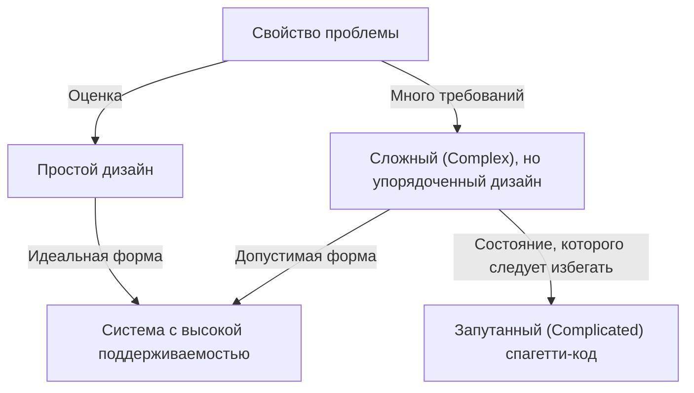
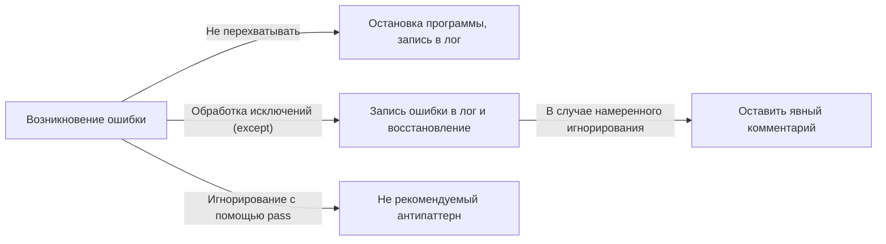

Программирование — это не просто набор инструкций для компьютера. Это медиум для выражения мыслей разработчика и общий язык, разделяемый всей командой. Среди множества языков программирования Python выделяется своей уникальной «философией». И это **«The Zen of Python» (Дзен Python)**.

В этой статье мы подробно и глубоко рассмотрим этот «Дзен», составляющий основу философии дизайна Python: от истории его создания до глубокого философского смысла каждого афоризма, и того, как мы должны применять эти идеи в повседневной разработке программного обеспечения.

---

## 1. Что такое «The Zen of Python»?

Открывали ли вы когда-нибудь интерактивную оболочку Python (REPL) и вводили следующую команду?

```python
import this
```

При выполнении этого короткого кода на экран в качестве пасхалки выводится текст из 19 строк, похожий на стихотворение. Это «The Zen of Python», который можно назвать духовной опорой сообщества Python.

В мире программной инженерии существует множество передовых практик и шаблонов проектирования, но крайне редко конкретный язык программирования формулирует свою базовую философию в виде «стихотворения» и встраивает её в сам язык.

### История создания: Тим Питерс и PEP 20

«Дзен Python» был написан Тимом Питерсом (Tim Peters), ключевым разработчиком, который долгое время участвовал в разработке Python. Тим систематизировал «негласные правила» и «интуицию» в дизайне Гвидо ван Россума (Guido van Rossum), создателя Python, чтобы их можно было выразить словами и поделиться ими с сообществом.

Позже это было официально задокументировано как **PEP 20 (Python Enhancement Proposal 20)**. При добавлении функций или внесении изменений в Python PEP 20 всегда служит отправной точкой, к которой следует возвращаться.

Интересно, что хотя «The Zen of Python» известен как «19 афоризмов», Тим заявлял: «Всего их 20, но последний оставлен пустым, чтобы его написал Гвидо». Это последнее правило до сих пор остается пустым, словно воплощая собой своего рода «красоту пустого пространства».

---

## 2. Философия Дзен: Разбор 19 афоризмов

Каждая строка «The Zen of Python» на первый взгляд кажется простым набором слов, но за ними скрываются глубокие знания программной инженерии. Давайте разберем их смысл шаг за шагом.

### Beautiful is better than ugly. (Красивое лучше, чем уродливое)

Код выполняется машинами, но в первую очередь это то, что «читают люди». Python принудительно обеспечивает визуальную красоту, требуя использовать отступы в качестве блоков синтаксиса.

В красивом коде логика ясна, а намерения сразу понятны. Уродливый код (например, с неоправданно глубокой вложенностью, непоследовательными правилами именования, запутанной логикой) не только становится рассадником ошибок, но и снижает мотивацию команды. Стремление к красоте — это не просто эстетика, а практичный подход к созданию легко поддерживаемого программного обеспечения.

### Explicit is better than implicit. (Явное лучше, чем неявное)

Этот принцип является одной из главных особенностей, отличающих Python от некоторых других языков (например, Ruby или JavaScript).
Неявное поведение или «магия» могут казаться удобными при написании кода. Однако, когда вы читаете этот код полгода спустя или к проекту присоединяется новый участник, неявные предположения становятся огромным препятствием.

Python предпочитает, чтобы было явно указано, «что импортируется» и «какими переменными мы манипулируем». Например, конструкция `from module import *` не рекомендуется, так как становится неочевидно (неявно), откуда берутся функции.

### Simple is better than complex. (Простое лучше, чем сложное)
### Complex is better than complicated. (Сложное лучше, чем запутанное)

Эти два афоризма следует рассматривать вместе. Во-первых, вы должны искать самое «простое» решение для любой проблемы. Следует избегать излишней иерархии классов и чрезмерной абстракции.

Однако бизнес-логика реального мира не всегда бывает простой. Если сама проблема по своей сути сложна (Complex), допускается, чтобы код отражал это и тоже был сложным.

Однако вы не должны делать сложное «запутанным (Complicated)». «Сложное (Complex)» означает наличие большого количества элементов в упорядоченной структуре, в то время как «Запутанное (Complicated)» описывает состояние, когда дизайн разрушен и элементы переплетены.



### Flat is better than nested. (Плоское лучше, чем вложенное)

Глубокая вложенность (отступы) значительно снижает читаемость кода. В частности, когда циклы и условные ветвления перекрываются много раз, это перегружает рабочую память мозга и увеличивает вероятность упустить ошибки.

В Python рекомендуется сохранять код максимально плоским, используя списковые включения (list comprehensions) или паттерн раннего возврата (Early Return).

### Sparse is better than dense. (Разреженное лучше, чем плотное)

Запихивать код в одну строку — плохая идея. Если поместить в одну строку несколько операций (например, сложные математические формулы, цепочки методов, тернарные операторы), при пошаговом выполнении в отладчике будет непонятно, где произошла ошибка.

Вставляя умеренное количество пробелов и переносов строк, сохраняя обработку «разреженной (Sparse)», намерения кода становятся четко видимыми.

### Readability counts. (Читаемость имеет значение)

Одна из самых важных ценностей в дизайна Python. Она основана на факте, что «код читают гораздо чаще, чем пишут». Синтаксис Python спроектирован близким к естественному английскому языку именно для того, чтобы максимально повысить эту «читаемость».

### Special cases aren't special enough to break the rules. (Особые случаи не настолько особые, чтобы нарушать правила)
### Although practicality beats purity. (Хотя практичность важнее безупречности)

Это также парные афоризмы. Как правило, мы должны строго следовать установленным правилам и соглашениям по кодированию (таким как PEP 8). Если мы начнем нарушать правила под предлогом «в этот раз особый случай», вся система начнет рушиться.

В то же время Python — это язык «прагматизма (Pragmatism)». Если стремление к теоретической «чистоте» приводит к резкому падению производительности или ухудшению удобства использования, приоритет следует отдавать практичности. Именно это чувство баланса является причиной широкого использования Python.

### Errors should never pass silently. (Ошибки никогда не должны замалчиваться)
### Unless explicitly silenced. (Если не замалчиваются явно)

Если в системе возникает какая-либо нештатная ситуация, код должен немедленно завершиться ошибкой (Fail Fast). Если вы проигнорируете ошибку и продолжите выполнение программы, позже она проявится как ошибка с неизвестной причиной, что сделает отладку крайне сложной.



Если вы действительно хотите проигнорировать ошибку, вы должны сделать это «явно», используя блок `try...except`.

### In the face of ambiguity, refuse the temptation to guess. (Перед лицом двусмысленности откажитесь от искушения угадывать)

Есть языки, в которых компилятор или интерпретатор произвольно «угадывает» намерения программиста и продолжает работу. Классический пример — неявное преобразование типов.

Python не любит такое «чтение между строк». Если вы попытаетесь сложить строку и число, Python выдаст `TypeError`, а не будет произвольно склеивать строки. В неоднозначных ситуациях он требует от человека (программиста) четких инструкций.

### There should be one-- and preferably only one --obvious way to do it. (Должен существовать один — и, желательно, только один — очевидный способ сделать это)
### Although that way may not be obvious at first unless you're Dutch. (Хотя он может быть неочевиден с первого взгляда, если вы не голландец)

Язык Perl имеет философию "There's more than one way to do it" (TIMTOWTDI: Есть более одного способа сделать это), но Python идет в прямо противоположном направлении.

В идеале каждый должен писать код одинаково для выполнения одной и той же задачи. Это кардинально снижает когнитивную нагрузку при чтении кода, написанного кем-то другим.
«Голландец» здесь — это Гвидо ван Россум, создатель Python. В этом есть доля юмора: полное понимание намерений создателя языка может занять некоторое время.

### Now is better than never. (Сейчас лучше, чем никогда)
### Although never is often better than *right* now. (Хотя никогда часто лучше, чем прямо *сейчас*)

Это философия планирования и принятия решений в разработке программного обеспечения. Вместо того чтобы ждать идеального решения и ничего не делать, лучше приложить все усилия прямо сейчас, выпустить код и получить обратную связь (гибкое/Agile мышление).

С другой стороны, часто бывает лучше «ничего не делать», пока не будет найдена основная причина, чем вносить поспешные хаки и неполные исправления «прямо сейчас». Это предостережение против неосторожного увеличения технического долга.

### If the implementation is hard to explain, it's a bad idea. (Если реализацию сложно объяснить — идея плохая)
### If the implementation is easy to explain, it may be a good idea. (Если реализацию легко объяснить — идея, возможно, хорошая)

Один из главных показателей качества кода. Если вам трудно объяснить работу написанного вами кода членам вашей команды, значит, дизайн неверен.

И наоборот, если вы можете легко объяснить логику кода на маркерной доске, есть большая вероятность, что дизайн хорош. (Однако «просто = абсолютно верно» не всегда работает, поэтому используется сдержанное выражение «возможно» — "may be").

### Namespaces are one honking great idea -- let's do more of those! (Пространства имен — отличная штука! Будем делать их больше!)

«Пространства имен» (такие как модули и классы), которые предотвращают конфликты имен переменных и функций, являются незаменимой концепцией для создания крупномасштабного программного обеспечения. Python активно использует пространства имен на основе модулей, чтобы поддерживать низкую степень связанности системы.

---

## 3. Как применять The Zen of Python в повседневной разработке

«The Zen of Python» ни в коем случае не применяется только при использовании Python. Философия, о которой здесь говорится, несет в себе универсальную истину, которую можно применять к проектированию систем на любом языке программирования, а также к командной коммуникации и организационной теории.

1. **Использовать как стандарт для ревью кода**: Когда команда сомневается в дизайне, использование слов Дзен, таких как «Это Simple или Complex?» или «Не стало ли это неявным?», в качестве общего языка предотвращает эмоциональные конфликты и обеспечивает конструктивное обсуждение.
2. **Использовать как компас при проектировании**: При добавлении новых функций, обращая внимание на то, «можно ли сохранить это плоским?» и «правильно ли обрабатываются ошибки?», вы можете поддерживать архитектуру, пригодную для долгосрочного обслуживания.
3. **Непрерывный рефакторинг**: Если вся команда будет разделять эстетическое чувство «Красивое лучше, чем уродливое», исчезнут компромиссы вроде «лишь бы работало», и будет взращиваться культура постоянного поддержания кодовой базы в здоровом состоянии.

## Заключение

«The Zen of Python» — это всего 19 коротких строк текста, в которых сконцентрирована глубочайшая мудрость программной инженерии. За тем фактом, что сегодня Python так любят во всем мире, и он стал доминирующим языком, используемым во всех областях, включая ИИ, науку о данных и веб-разработку, стоит существование этой красивой и сильной «философии».

В следующий раз, когда вы будете писать код, остановитесь на мгновение и вспомните эти слова «Дзен». Безусловно, ваш код станет красивее, читабельнее и более Pythonic.
