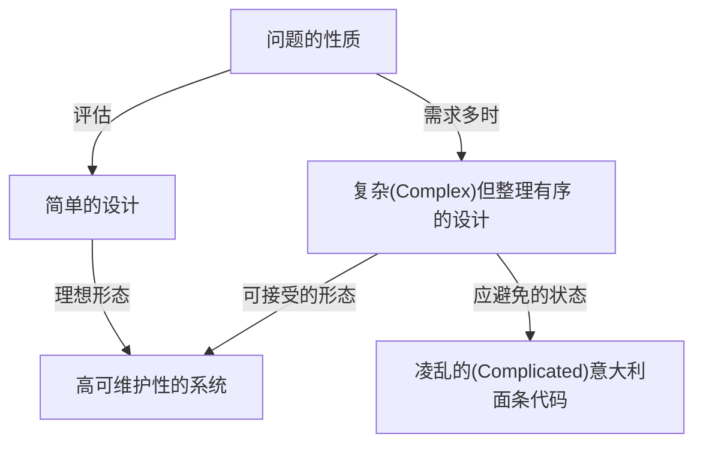
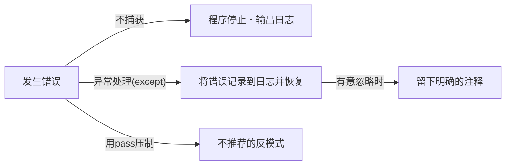

编程语言不仅仅是给计算机的一系列命令的罗列。它是表达开发者思想的媒介，也是整个团队共享的通用语言。在众多的编程语言中，Python拥有非常独特的“哲学”。那就是**“The Zen of Python（Python之禅）”**。

在本文中，我们将极其详细地深入探讨构成Python设计思想根基的这个“禅（Zen）”，从其诞生的背景，到每句格言所意味着的深刻哲学，以及我们在日常的软件开发中应该如何应用这一思想。

---

## 1. “The Zen of Python”是什么？

你是否曾经打开过Python的交互式shell（REPL）并输入以下命令？

```python
import this
```

执行这段简短的代码后，屏幕上会作为彩蛋输出一段19行的诗一般的文本。这可以说是Python社区精神支柱的“The Zen of Python”。

在软件工程的世界里存在着各种各样的最佳实践和设计模式，但像这样特定的编程语言将其核心哲学化作“诗”的语言，并将其内置于语言本身的例子是极其罕见的。

### 诞生的背景：Tim Peters与PEP 20

The Zen of Python是由长期参与Python开发的核心开发者Tim Peters编写的。Tim将Python创始人Guido van Rossum在设计中的“默契”和“直觉”进行了语言化，使其成为能够与社区共享的体系化内容。

这后来作为**PEP 20 (Python Enhancement Proposal 20)**被正式文档化。在对Python进行功能添加或更改时，这个PEP 20始终充当着必须回归的原点。

有趣的是，尽管The Zen of Python作为“19句格言”而闻名，但Tim曾表示“总共有20句，但最后一句是留给Guido来写的”。那最后一句至今仍保持空白，似乎体现了一种“留白之美”。

---

## 2. 禅的思想：解读19句格言

The Zen of Python的每一行乍看之下只是简单的词语罗列，但其背后隐藏着软件工程的深刻见解。让我们逐一揭开它们的含义吧。

### Beautiful is better than ugly.（优美胜于丑陋）

代码是机器执行的东西，但更重要的是“人阅读的东西”。Python通过强制缩进作为语法块，强行保证了视觉上的美感。

优美的代码逻辑流程清晰，意图能迅速传达。丑陋的代码（例如无谓的嵌套过深、命名规则混乱、逻辑变成意大利面条）不仅会成为Bug的温床，甚至会降低团队的积极性。追求美不仅仅是美学，而是创建高可维护性软件的实用方法。

### Explicit is better than implicit.（明了胜于晦涩）

这一原则是区分Python和其他一些语言（如Ruby或JavaScript等）的一大特征。
隐式行为或“魔法”在编写代码时可能会觉得方便。然而，当半年后阅读该代码，或者新成员加入项目时，隐式的前提将成为巨大的障碍。

Python倾向于明确指示“正在导入什么”和“正在操作哪个变量”。例如，不推荐使用`from module import *`的写法。因为哪些函数从何而来变得不明确了。

### Simple is better than complex.（简洁胜于复杂）
### Complex is better than complicated.（复杂胜于凌乱）

这两句格言应该结合起来思考。首先，对于任何问题，都应该寻找最“简单”的解决方案。应该避免多余的类层次结构和过度的抽象化。

但是，现实世界中的业务逻辑并不总是简单的。当问题本身本质上是复杂（Complex）的时候，代码也允许反映这一点而变得复杂。

不过，不能把复杂的东西变成“凌乱的状态（Complicated）”。“Complex（复杂）”是在结构整理好的基础上元素众多的状态，而“Complicated（凌乱）”则是指设计崩溃、交织缠绕的状态。



### Flat is better than nested.（扁平胜于嵌套）

深层嵌套（缩进）会显著降低代码的可读性。特别是循环和条件分支重叠多层时，会压迫大脑的工作记忆，容易漏看Bug。

在Python中，推荐使用列表推导式或尽早返回（Early Return）模式，以保持代码尽可能平坦（扁平）。

### Sparse is better than dense.（间隔胜于紧凑）

把代码塞满一行是不好的做法。如果在一行中塞入多个操作（例如，复杂的数学公式、方法链、三元运算符等），在调试器中单步执行时就会不知道哪里出了错。

通过加入适当的空格和换行，保持处理的“稀疏（Sparse）”，代码的意图就会清晰可见。

### Readability counts.（可读性很重要）

这是Python设计中最重要的价值观之一。它基于“代码被阅读的次数远远多于被编写的次数”这一事实。Python的语法被设计成接近英语自然语言的形式，也是为了最大限度地提高这种“可读性”。

### Special cases aren't special enough to break the rules.（特例不足以打破规则）
### Although practicality beats purity.（但是，实用性胜过纯粹性）

这也是成对的格言。原则上，我们应该严格遵守既定的规则和编码规范（如PEP 8等）。如果以“这次是特例”为由开始打破规则，整个系统将走向崩溃。

但是，与此同时，Python也是一种“实用主义（Pragmatism）”语言。如果过分追求理论上的“纯粹”，导致性能急剧下降或可用性变差，那么应该优先考虑实用性。正是这种平衡感，才是Python被广泛使用的原因。

### Errors should never pass silently.（错误永远不应默默地被忽略）
### Unless explicitly silenced.（除非被明确地忽略）

当系统中发生某种异常状态时，代码应该立即失败（Fail Fast）。如果压制错误并继续执行程序，后来它会以不明原因的Bug形式出现，使调试变得极其困难。



如果真的想忽略错误，必须使用`try...except`块来“明确”地忽略。

### In the face of ambiguity, refuse the temptation to guess.（面对歧义，拒绝猜测的诱惑）

有些语言的编译器或解释器会擅自“猜测”程序员的意图并继续处理。例如，隐式类型转换就是典型的例子。

Python讨厌这种“看脸色行事”的行为。如果尝试将字符串和数字相加，Python不会擅自进行字符串拼接，而是抛出`TypeError`。在模棱两可的情况下，它要求人类（程序员）给出明确的指示。

### There should be one-- and preferably only one --obvious way to do it.（应该有一种——最好只有一种——明显的方法来做事）
### Although that way may not be obvious at first unless you're Dutch.（虽然那种方法一开始可能并不明显，除非你是荷兰人）

Perl这种语言有一种哲学叫"There's more than one way to do it" (TIMTOWTDI: 解决问题的方法不止一种)，但Python走的是完全相反的道路。

如果要做同样的处理，理想情况是所有人的写法都一样。这样在阅读别人编写的代码时，认知负荷会急剧下降。
顺便说一下，“荷兰人”指的是Python的创始人Guido van Rossum。这里包含着一种幽默，意指完全理解语言设计者的意图可能需要一些时间。

### Now is better than never.（做也许好过不做）
### Although never is often better than *right* now.（但不假思索就动手还不如不做）

这是软件开发中关于日程安排和决策的哲学。与其等待完美的解决方案什么都不做，不如尽现在所能发布代码并获取反馈（敏捷思维）。

但另一方面，与其“马上”加入临时的黑客手段或不完整的修复，在找出根本原因之前“什么都不做”往往会更好。这是对不应草率增加技术债务的告诫。

### If the implementation is hard to explain, it's a bad idea.（如果实现很难解释，那它是个坏主意）
### If the implementation is easy to explain, it may be a good idea.（如果实现很容易解释，那它可能是一个好主意）

这是衡量代码质量的终极指标之一。如果你在向团队成员解释你所写代码的运行情况时感到吃力，那么那个设计就是错的。

相反，如果能在白板上轻松解释代码的流程，那么那个设计很可能很出色。（但是，“简单=绝对正确”并不总是成立，所以用了"may be"这种保守的表达方式。）

### Namespaces are one honking great idea -- let's do more of是有素晴らしいアイデアだ -- もっと活用しよう！）
Wait, missed translation:
### Namespaces are one honking great idea -- let's do more of those!（命名空间是一个绝妙的主意——让我们多利用它们！）

The above is correctly translated. Wait, I should not paste it incorrectly.

Let me verify the code content block.
