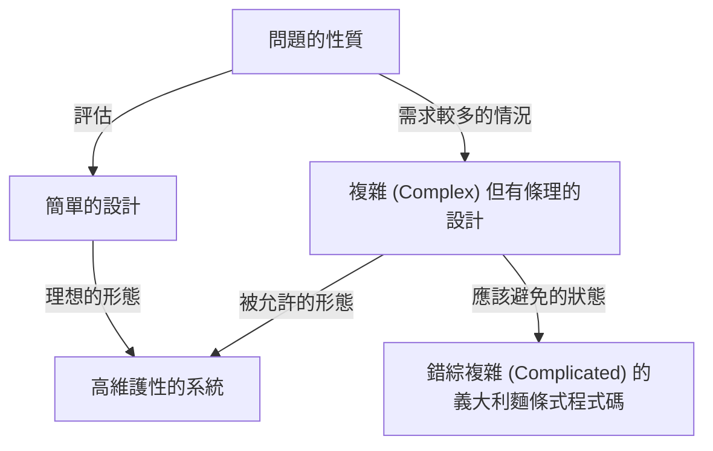
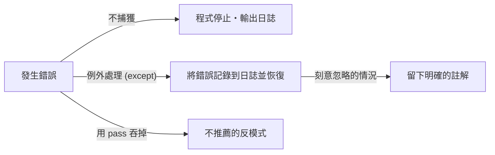

程式語言不僅僅是一連串給電腦的指令。它是開發者表達思考的媒介，也是整個團隊共享的共通語言。在眾多程式語言中，Python 擁有非常獨特的「哲學」。那就是**「The Zen of Python（Python 之禪）」**。

本文將針對作為 Python 設計思想核心的「Zen（禪）」，從其誕生的背景、每句格言所代表的深層哲學，到我們在日常軟體開發中該如何應用這種思想，進行極度詳細的深入探討。

---

## 1. 什麼是「The Zen of Python」？

你有沒有打開過 Python 的互動式環境（REPL），並輸入以下指令？

```python
import this
```

執行這段簡短的程式碼後，畫面上會出現一段像詩一樣的 19 行彩蛋文本。這就是可以稱作 Python 社群精神支柱的「The Zen of Python」。

在軟體工程的世界裡有著各種最佳實踐與設計模式，但特定的程式語言將自身的核心哲學化為「詩」並內建於語言之中的例子，可以說是非常罕見的。

### 誕生的背景：Tim Peters 與 PEP 20

The Zen of Python 是由長期參與 Python 開發的核心開發者 Tim Peters 所寫的。Tim 將 Python 之父 Guido van Rossum 在設計上的「默契」與「直覺」化為文字，並體系化以便在社群中分享。

這後來作為 **PEP 20 (Python Enhancement Proposal 20)** 被正式文件化。當 Python 要新增功能或進行修改時，這個 PEP 20 總能作為回歸原點的指南針。

有趣的是，雖然 The Zen of Python 以「19 句格言」聞名，但 Tim 表示：「其實總共有 20 句，最後一句是留給 Guido 寫的。」而那最後一句至今依然維持空白，彷彿體現了一種「留白之美」。

---

## 2. 禪的思想：解讀 19 句格言

The Zen of Python 的每一行乍看之下只是簡單的文字排列，但其背後隱藏著軟體工程的深刻見解。讓我們一句句來解開其中的涵義。

### Beautiful is better than ugly.（優美勝於醜陋）

程式碼雖然是給機器執行的，但更重要的是「給人看的」。Python 透過強制縮排來劃分語法區塊，從而強制確保了視覺上的美感。

優美的程式碼邏輯清晰，意圖能立刻傳達。醜陋的程式碼（例如無謂的深層巢狀、命名規則混亂、邏輯像義大利麵條般糾結）不僅會成為 Bug 的溫床，更會降低團隊的士氣。追求優美不僅僅是美學，而是打造高維護性軟體的實用方法。

### Explicit is better than implicit.（明言勝於暗示）

這項原則是區分 Python 與其他某些語言（例如 Ruby 或 JavaScript 等）的一大特徵。
隱含的行為或「魔法」在寫程式時或許會覺得方便。然而，當半年後再來閱讀這段程式碼，或是新成員加入專案時，隱含的前提就會成為巨大的障礙。

Python 喜歡明確指出「匯入了什麼」、「正在操作哪個變數」。舉例來說，`from module import *` 這種寫法是不被推薦的。因為這會讓哪個函數從哪裡來的變得不明確。

### Simple is better than complex.（簡單勝於複雜）
### Complex is better than complicated.（複雜勝於錯綜複雜）

這兩句格言必須放在一起思考。首先，對於任何問題都應該尋求最「簡單（Simple）」的解決方案。應避免多餘的類別階層與過度抽象化。

然而，現實世界中的商業邏輯並不總是簡單的。如果問題本身就本質上是複雜的（Complex），程式碼反映這點而變得複雜是可以被接受的。

但是，絕對不能把複雜的東西變成「錯綜複雜的狀態（Complicated）」。「Complex（複雜）」是指結構經過整理但元素很多的狀態，而「Complicated（錯綜複雜）」則是指設計崩壞、邏輯糾纏不清的狀態。



### Flat is better than nested.（扁平勝於巢狀）

深層的巢狀（縮排）會大幅降低程式碼的可讀性。特別是當迴圈和條件判斷重疊好幾層時，會壓迫大腦的工作記憶，讓人更容易忽略 Bug。

在 Python 中，建議透過使用串列生成式（List Comprehension）或提早返回（Early Return）的模式，盡可能讓程式碼保持平坦（Flat）。

### Sparse is better than dense.（稀疏勝於密集）

把程式碼硬塞在同一行是個壞主意。如果在 1 行內擠入多個操作（例如複雜的數學公式、方法串接、三元運算子等），在除錯器進行逐步執行時，就會不知道到底是在哪裡發生了錯誤。

加入適當的空格與換行，讓程式碼保持「稀疏（Sparse）」，程式碼的意圖就會變得清晰可見。

### Readability counts.（可讀性很重要）

這是 Python 設計中最重要的價值觀之一。它建立在一個事實之上：「程式碼被閱讀的次數，遠遠大於被撰寫的次數」。Python 的語法被設計成接近英語的自然語言，也是為了將這種「可讀性」發揮到極致。

### Special cases aren't special enough to break the rules.（特例也沒有特殊到可以打破常規）
### Although practicality beats purity.（儘管實用性勝過純粹）

這也是一對相輔相成的格言。原則上，我們應該嚴格遵守既定的規則與編碼規範（如 PEP 8 等）。一旦因為「這次比較特別」而開始打破規則，整個系統就會走向崩壞。

但同時，Python 也是一種強調「實用主義（Pragmatism）」的語言。如果為了追求理論上的「純粹」，而導致效能極度下降或變得難以使用，那麼就應該以實用性為優先。這種平衡感正是 Python 被廣泛使用的原因。

### Errors should never pass silently.（錯誤絕不該默默地被放過）
### Unless explicitly silenced.（除非你明確地讓它安靜）

當系統發生某種異常狀態時，程式碼應該立刻失敗（Fail Fast）。如果把錯誤吞掉並讓程式繼續執行，之後它會以原因不明的 Bug 形式爆發出來，讓除錯變得極度困難。



如果你真的想忽略錯誤，就必須使用 `try...except` 區塊來「明確地」忽略它。

### In the face of ambiguity, refuse the temptation to guess.（面對模稜兩可，拒絕猜測的誘惑）

有些語言的編譯器或直譯器會擅自「猜測」程式設計師的意圖並繼續執行。例如，隱式型別轉換就是典型的例子。

Python 非常討厭這種「看臉色」的行為。當你試圖把字串和數字相加時，Python 不會擅自將字串連接，而是會拋出 `TypeError`。在模稜兩可的情況下，它會要求人類（程式設計師）給出明確的指示。

### There should be one-- and preferably only one --obvious way to do it.（應該要有一種——且最好只有一種——明顯的方法來做這件事）
### Although that way may not be obvious at first unless you're Dutch.（雖然那個方法一開始可能不明顯，除非你是荷蘭人）

有一種名叫 Perl 的語言擁有 "There's more than one way to do it"（TIMTOWTDI：方法不只一種）的哲學，但 Python 卻反其道而行。

如果要執行相同的操作，最理想的情況是所有人都寫出一樣的程式碼。這能大幅降低閱讀他人程式碼時的認知負擔。
附帶一提，「荷蘭人」指的是 Python 的生父 Guido van Rossum。這句話帶有幽默的成分，意思是想完全理解語言設計者的意圖可能需要一點時間。

### Now is better than never.（現在做總比永遠不做的好）
### Although never is often better than *right* now.（儘管永遠不做通常比「立刻盲目去做」更好）

這是軟體開發中關於排程與決策的哲學。與其等待完美的解決方案而什麼都不做，不如盡現在所能寫出程式碼並發布，然後獲取回饋（敏捷式的思考）。

但另一方面，與其「立刻」加入治標不治本的駭客手法或不完整的修正，有時候在找出根本原因之前「什麼都不做」反而更好。這是警告我們不應該草率地增加技術債。

### If the implementation is hard to explain, it's a bad idea.（如果實作很難解釋，那這是個壞點子）
### If the implementation is easy to explain, it may be a good idea.（如果實作很容易解釋，這可能是個好點子）

這是衡量程式碼品質的終極指標之一。如果你費盡口舌也難以向團隊成員解釋你寫的程式碼是如何運作的，那代表設計有問題。

相反地，如果你能在白板上輕鬆解釋程式碼的流程，這項設計就很可能相當出色。（不過，因為「簡單＝絕對正確」並非必然，所以用了 "may be" 這種保守的表達方式。）

### Namespaces are one honking great idea -- let's do more of those!（命名空間是個超讚的點子——讓我們多用點吧！）

為避免變數名稱或函數名稱發生衝突，「命名空間（如模組或類別等）」是在建立大型軟體時不可或缺的概念。Python 積極提倡利用基於模組的命名空間，以保持系統的低耦合度。

---

## 3. 如何將 The Zen of Python 應用於日常開發

The Zen of Python 絕對不僅適用於寫 Python 的時候。這裡所談論的哲學蘊含著普遍的真理，可以應用在任何程式語言的系統設計上，甚至是團隊的溝通與組織管理之中。

1. **作為程式碼審查的標準**：當團隊對設計感到迷惘時，可以用「這個設計是 Simple 還是 Complex？」、「有沒有變得隱含（implicit）？」等 Zen 的語句作為共通語言，這能避免情緒化的對立，促成建設性的討論。
2. **作為設計的指南針**：在加入新功能時，時時意識著「能保持扁平（Flat）嗎？」、「有沒有妥善處理錯誤？」，這有助於維持能夠長期維護的架構。
3. **持續的重構**：只要整個團隊抱持著「優美勝於醜陋」的美學標準，就能排除「會動就好」的妥協心態，培養出隨時讓程式碼庫保持健康狀態的文化。

## 總結

「The Zen of Python」在短短 19 行的文章中，凝聚了軟體工程的深刻智慧。Python 今天能如此深受全世界喜愛，成為在 AI、資料科學、Web 開發等各領域中佔據壓倒性人氣的語言，其背後正是因為這套優美且強大的「哲學」存在。

下次當你寫程式時，不妨稍微停下腳步，回想一下這幾句「禪」語。相信你的程式碼一定能朝著更優美、更具可讀性、更 Pythonic 的境界進化。
