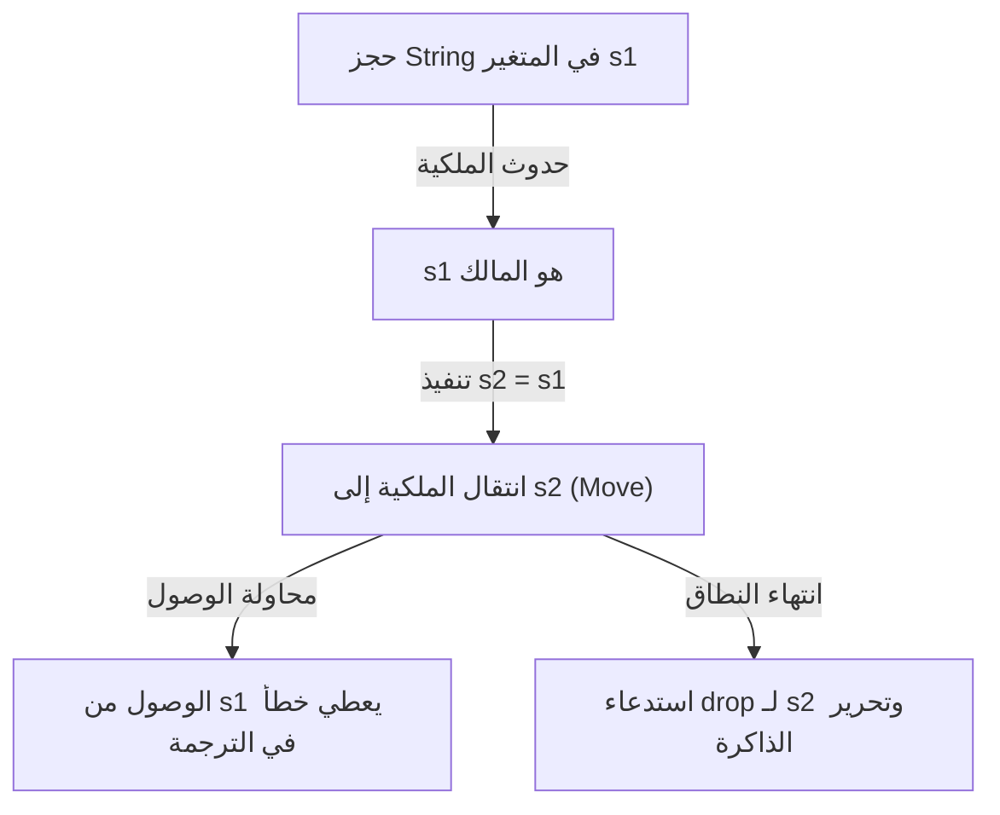
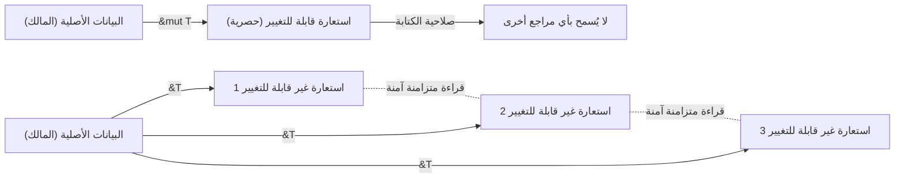

## مقدمة: لماذا تعتبر Rust "آمنة"؟

في تاريخ لغات البرمجة، طالما اُعتبر "الأداء" و"الأمان" في علاقة مقايضة (Trade-off). لغات برمجة النظم مثل C و C++ توفر أداءً مذهلاً يستخرج أقصى قدرات الأجهزة، ولكن في المقابل تضع مسؤولية إدارة الذاكرة على عاتق المبرمج. الإدارة اليدوية للذاكرة (`malloc` / `free` أو `new` / `delete`) كانت مرتعاً للثغرات الأمنية والأخطاء البرمجية الخطيرة مثل المؤشرات المتدلية (Dangling Pointers)، والتحرير المزدوج (Double Free)، وتجاوز سعة المخزن المؤقت (Buffer Overflow)، وتسرب الذاكرة (Memory Leaks).

من ناحية أخرى، اللغات عالية المستوى مثل Java، C#، Python، و Ruby أدخلت ميزة جمع القمامة (Garbage Collection, GC) لإخفاء تعقيدات إدارة الذاكرة عن المبرمجين. يقوم GC باستعادة الذاكرة التي لم تعد هناك حاجة إليها بشكل تلقائي ودوري، مما يزيد من أمان الذاكرة بشكل كبير. ومع ذلك، فإن تنفيذ GC يصاحبه عبء على وقت التشغيل، وخاصة في الأنظمة التي تتطلب الاستجابة في الوقت الفعلي أو البيئات ذات الموارد المحدودة، حيث يمثل وقت التوقف غير المتوقع (Stop-the-World) مشكلة حقيقية.

لغة **Rust** هي من كسرت هذه المعضلة وأحدثت نقلة نوعية في عالم برمجة النظم. من خلال مفهومها الفريد "الملكية (Ownership)" والتحليل الثابت الصارم للمترجم، تضمن Rust **أمان الذاكرة دون الحاجة إلى جامع القمامة**. يمكن وصف هذا التصميم الذي يتيح معالجة متزامنة آمنة بدون أي عبء إضافي في وقت التشغيل (تجريد صفري التكلفة) بأنه فن بحد ذاته.

في هذا المقال، سنتعمق في "الأمان" و"نموذج الملكية" اللذين يمثلان جوهر Rust، بدءًا من فلسفتها وصولاً إلى آلياتها الدقيقة.

## 3 مناهج لإدارة الذاكرة

لفهم تفرد Rust، دعونا أولاً نلخص المناهج الرئيسية لإدارة الذاكرة في لغات البرمجة.

1. **الإدارة اليدوية للذاكرة (Manual Memory Management)**
   - اللغات الممثلة: C, C++
   - الميزات: يقوم المطور بصراحة بحجز وتحرير الذاكرة.
   - المزايا: لا يوجد عبء في وقت التشغيل. أداء مطلق.
   - العيوب: الأخطاء البشرية أمر لا مفر منه، وهناك نقص أساسي في أمان الذاكرة.

2. **جمع القمامة (Garbage Collection)**
   - اللغات الممثلة: Java, C#, Go, Python
   - الميزات: تراقب بيئة التشغيل كيفية استخدام الذاكرة وتجمع الذاكرة غير المطلوبة تلقائياً.
   - المزايا: أمان عالٍ للذاكرة وتقليل كبير للعبء على المطور.
   - العيوب: انخفاض في الأداء وزيادة في استهلاك الذاكرة بسبب تشغيل دورات GC.

3. **الملكية والاستعارة (Ownership and Borrowing)**
   - اللغات الممثلة: Rust
   - الميزات: يحسب المترجم دورة حياة الذاكرة أثناء الترجمة (compile time) ويدرج عمليات التحرير اللازمة تلقائياً.
   - المزايا: يحقق أمان الذاكرة بدون GC، ويقدم أداءً يعادل أداء C/C++.
   - العيوب: منحنى تعليمي حاد، ويتطلب الصراع مع "مدقق الاستعارة (Borrow Checker)".

مترجم Rust وكأنه يثبت رياضياً (باستثناء الكتل البرمجية غير الآمنة `unsafe`) أنه بمجرد اجتياز الكود للترجمة، لن يحدث أي سلوك غير معرف متعلق بالذاكرة.

## المبادئ الثلاثة الرئيسية للملكية (Ownership)

نظام الملكية في Rust مبني على ثلاثة قواعد بسيطة فقط. هذه القواعد الثلاث هي أساس كل أمان الذاكرة.

1. **كل قيمة في Rust تمتلك متغيراً يُدعى "المالك (owner)".**
2. **يوجد مالك واحد فقط في أي وقت.**
3. **عندما يخرج المالك من النطاق (Scope)، يتم تدمير القيمة.**

### القواعد 1 و 3: النطاق وتحرير الذاكرة (Drop)

نطاق المتغيرات (Scope) في Rust يُعرف باستخدام الأقواس `{}`. عندما يخرج المتغير من النطاق، تقوم Rust تلقائياً باستدعاء دالة خاصة تسمى `drop`، والتي تحرر منطقة الذاكرة التي كانت تحتلها تلك القيمة. هذا السلوك مشابه لنمط RAII في C++، ولكن في Rust يُفرض هذا بصرامة كميزة أساسية للغة.

```rust
{
    let s = String::from("hello"); // s صالحة من هنا
    // عمليات باستخدام s
} // هنا يخرج s من النطاق، ويتم تحرير الذاكرة تلقائياً (يتم استدعاء دالة drop)
```

بفضل هذه الآلية، لا داعي للقلق من نسيان استدعاء `free()` يدوياً والتسبب في تسرب الذاكرة.

### القاعدة 2: المالك الوحيد ودلالات النقل (Move)

الفرق الحاسم بين Rust والعديد من اللغات الأخرى هو القاعدة 2: "يوجد مالك واحد فقط في أي وقت".

بينما تعيين أنواع البيانات البسيطة المخزنة في المكدس (Stack) (مثل الأعداد الصحيحة والقيم المنطقية، التي تنفذ السمة `Copy`) يؤدي إلى نسخ القيمة، فإن تعيين الأنواع التي تحجز البيانات في الكومة (Heap) (مثل `String` و `Vec`) يؤدي إلى **"نقل الملكية (Move)"**.

```rust
let s1 = String::from("hello");
let s2 = s1; // هنا تنتقل الملكية من s1 إلى s2

// println!("{}, world!", s1); // خطأ في الترجمة! s1 لم يعد صالحاً
```

لماذا يحدث النقل (Move)؟ إذا كان `s1` و `s2` يشيران إلى نفس مساحة الذاكرة على الكومة، وعندما يخرجان من النطاق يحاولان كليهما تحرير الذاكرة، سيحدث خطأ **التحرير المزدوج (Double Free)**. لا تسمح Rust بحدوث هذا الموقف من الأساس، وتضمن الأمان بإبطال المتغير القديم `s1` بمجرد إجراء التعيين.

دعونا نتصور حركة الملكية في رسم Mermaid التالي:



## الاستعارة (Borrowing): الوصول إلى البيانات دون نقل الملكية

قواعد الملكية صارمة وآمنة، لكن فكرة أن "الملكية تنتقل في كل مرة يتم فيها تمرير قيمة إلى دالة، ولا يمكن استخدامها مرة أخرى" أمر غير مريح للغاية. لذلك تقدم Rust مفاهيم **"المراجع (References)"** و **"الاستعارة (Borrowing)"**.

باستخدام المراجع، يمكنك الوصول إلى القيمة دون أخذ ملكيتها. هذا يسمى "الاستعارة".

```rust
fn calculate_length(s: &String) -> usize { // s هو مرجع إلى String
    s.len()
} // هنا يخرج s من النطاق، لكنه لا يملك الملكية لذا لا يحدث شيء

let s1 = String::from("hello");
let len = calculate_length(&s1); // تبقى الملكية لـ s1، ونمرر المرجع فقط
println!("The length of '{}' is {}.", s1, len); // s1 لا يزال قابلاً للاستخدام
```

### قواعد الاستعارة ومنع سباق البيانات (Data Race)

توجد قواعد صارمة للاستعارة أيضاً:

1. في أي وقت، يمكنك إما امتلاك **مرجع واحد قابل للتغيير (`&mut T`)**، أو **عدة مراجع غير قابلة للتغيير (`&T`)** (لا يمكنك امتلاكهما معاً في نفس الوقت).
2. يجب أن تكون المراجع دائماً صالحة (منع المؤشرات المتدلية).

هذه القاعدة موجودة للقضاء تماماً على **سباق البيانات (Data Race)** أثناء المعالجة المتزامنة في وقت الترجمة. يحدث سباق البيانات عند توفر الشروط الثلاثة التالية:

- مؤشران أو أكثر يحاولان الوصول إلى نفس البيانات في نفس الوقت.
- يُستخدم على الأقل أحد المؤشرات للكتابة على البيانات.
- لا توجد آلية لمزامنة الوصول إلى البيانات.

قواعد الاستعارة في Rust تمنع هذه الحالة على مستوى المترجم. فهي تفرض تحكمًا حصريًا (Readers-Writer lock) ليس في وقت التشغيل، بل في وقت الترجمة: "إذا أردت القراءة فقط، يمكن لأي عدد من الأشخاص القراءة في نفس الوقت (مراجع غير قابلة للتغيير)" و "عند الكتابة، لا يمكن لأحد القراءة، وشخص واحد فقط يمتلك حق الكتابة (مرجع واحد قابل للتغيير)".



## دورة الحياة (Lifetimes): إثبات صلاحية المرجع

قاعدة الاستعارة الأخرى "يجب أن تكون المراجع دائماً صالحة" تُنفذ من خلال مفهوم **دورة الحياة (Lifetimes)**.

في لغة C، من السهل جداً إنشاء مؤشر متدلٍ يشير إلى مساحة ذاكرة غير صالحة عن طريق إرجاع مؤشر لمتغير محلي لدالة.

يتتبع مدقق الاستعارة في Rust دورات الحياة (النطاق الذي يكون فيه المرجع صالحاً) لجميع المراجع ويقارنها. إنه يتحقق من أن دورة حياة المرجع ليست أطول من دورة حياة البيانات التي يشير إليها المرجع.

```rust
let r;
{
    let x = 5;
    r = &x; // خطأ! دورة حياة x قصيرة جداً
} // x يُدمر هنا
// println!("r: {}", r); // محاولة استخدام r هنا ستجعله مؤشراً متدلياً
```

الكود أعلاه سيُرفض بلا رحمة من قبل مترجم Rust. في العديد من الحالات، يسمح لنا المترجم بحذف الشروحات الصريحة بفضل استنتاج دورة الحياة (Lifetime Elision)، لكن في الهياكل أو الدوال المعقدة، يجب على المطور إضافة تعليقات دورة الحياة (مثل `'a`) لإخبار المترجم بالعلاقة بين المراجع.

قد تبدو دورات الحياة معقدة في البداية، لكنها تمثل الشكل النهائي للتعبير عن "متى وأين تُحجز الذاكرة ومتى تُدمر" كنظام كتابة البرنامج.

## أمان الخيوط والمعالجة المتزامنة: التزامن بلا خوف (Fearless Concurrency)

المفاهيم الأساسية لـ Rust مثل الملكية، والاستعارة، ودورات الحياة لا تجعل البرامج ذات الخيط الواحد آمنة فحسب، بل تجعل المعالجة المتزامنة في بيئات متعددة الخيوط آمنة بشكل مدهش.

كما ذكرنا سابقاً، تمنع القواعد الحصرية للمراجع القابلة للتغيير وغير القابلة للتغيير سباق البيانات. بالإضافة إلى ذلك، تستخدم Rust سمات العلامات `Send` و `Sync` لضمان أمان نقل البيانات ومشاركتها بين الخيوط.

- **`Send`**: يشير إلى أنه يمكن نقل ملكية النوع بأمان إلى خيط آخر.
- **`Sync`**: يشير إلى أنه من الآمن الرجوع إليه من عدة خيوط في نفس الوقت.

على سبيل المثال، عداد المراجع غير الآمن للخيوط `Rc<T>` لا ينفذ لا `Send` ولا `Sync`، لذلك إذا حاولت استخدامه بالخطأ في بيئة متعددة الخيوط، فسيحدث خطأ في الترجمة. بدلاً من ذلك، يمكنك استخدام عداد المراجع الذري `Arc<T>` مع التحكم الحصري `Mutex<T>` لاجتياز عملية الترجمة.

بدلاً من "اكتشاف الأخطاء في وقت التشغيل"، "إذا لم يكن آمناً، فلن يتم حتى تجميعه". هذا هو جوهر ما تدعو إليه Rust وهو **"التزامن بلا خوف (Fearless Concurrency)"**.

## الخاتمة: الملكية كنموذج (Paradigm)

نظام الملكية في Rust ليس مجرد ميزة، بل هو نموذج (Paradigm) أساسي لتصميم البرامج. إنه يطرح علينا أسئلة مهمة في مرحلة كتابة الكود: "من يمتلك هذه البيانات؟" "إلى متى ستكون البيانات صالحة؟" "متى ستتم إعادة كتابتها؟"

صحيح أن الوقت الذي تقضيه في الصراع مع مدقق الاستعارة قد يبدو مؤلماً. ولكن، أخطاء المترجم هي صوت شريكك الأكثر ثقة لحمايتك من الأخطاء القاتلة التي قد تحدث في بيئة الإنتاج، ومن حالات التسابق التي يصعب إعادة إنتاجها، ومن الثغرات الأمنية التي قد يتم استغلالها.

لقد دمجت Rust بنجاح الأداء العالي لإدارة الذاكرة اليدوية مع أمان لغات GC بمستوى متقدم. من خلال فهم الفلسفة العميقة والتصميم الدقيق وراءها، سنتمكن من بناء عالم برمجيات أكثر قوة وسرعة وموثوقية.
