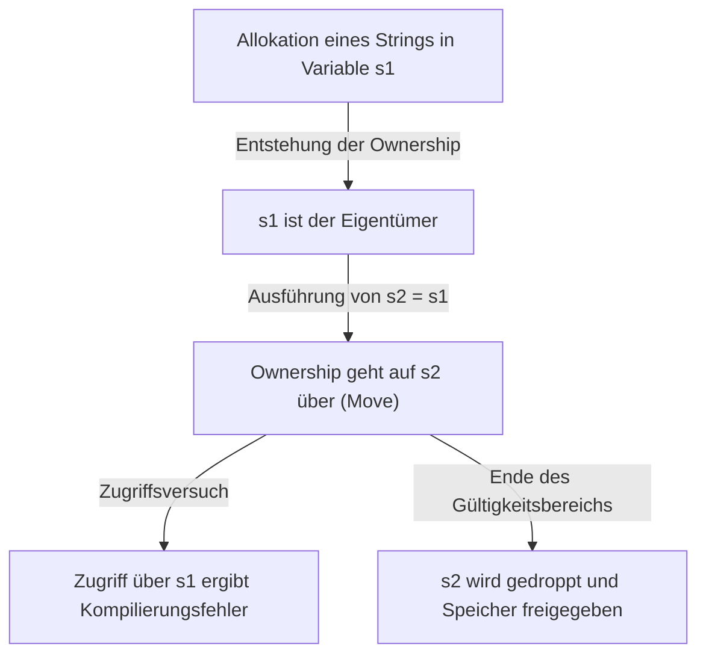
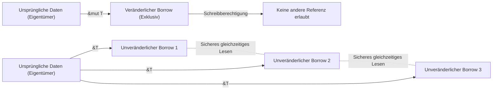

## Einführung: Warum ist Rust "sicher"?

In der Geschichte der Programmiersprachen wurden "Leistung" und "Sicherheit" lange Zeit als Kompromiss (Trade-off) betrachtet. Systemprogrammiersprachen wie C und C++ bieten eine erstaunliche Leistung, die die Hardware voll ausschöpft, aber im Gegenzug übertragen sie die Verantwortung der Speicherverwaltung auf den Programmierer. Manuelle Speicherverwaltung (`malloc` / `free` oder `new` / `delete`) ist ein Nährboden für schwerwiegende Fehler und Sicherheitslücken wie Dangling Pointer, Double Free (doppelte Freigabe), Buffer Overflows und Speicherlecks.

Auf der anderen Seite haben Hochsprachen wie Java, C#, Python und Ruby durch die Einführung von Garbage Collection (GC) diese Komplexität der Speicherverwaltung vor dem Programmierer verborgen. GC sammelt regelmäßig und automatisch nicht mehr benötigten Speicher und verbessert die Speichersicherheit dramatisch. Die Ausführung von GC geht jedoch mit einem Laufzeit-Overhead einher, und insbesondere in Systemen, die Echtzeitfähigkeit erfordern, oder in ressourcenbeschränkten Umgebungen werden unvorhersehbare Pausenzeiten (Stop-the-World) zu einem Problem.

**Rust** hat dieses Dilemma durchbrochen und einen Paradigmenwechsel in der Welt der Systemprogrammierung herbeigeführt. Durch das einzigartige Konzept der "Ownership" (Eigentümerschaft) und die strenge statische Analyse des Compilers **garantiert Rust Speichersicherheit ohne Garbage Collector**. Dieses Design, das eine sichere Nebenläufigkeit (Zero-Cost Abstraction) ohne Laufzeit-Overhead realisiert, kann fast schon als künstlerisch bezeichnet werden.

In diesem Artikel werden wir tief in die Kernaspekte von Rust, "Sicherheit" und das "Ownership-Modell", eintauchen, von seiner Philosophie bis hin zu seinen konkreten Mechanismen.

## Drei Ansätze zur Speicherverwaltung

Um die Einzigartigkeit von Rust zu verstehen, fassen wir zunächst die wichtigsten Ansätze zur Speicherverwaltung in Programmiersprachen zusammen.

1. **Manuelle Speicherverwaltung (Manual Memory Management)**
   - Typische Sprachen: C, C++
   - Merkmale: Der Entwickler alloziert und gibt Speicher explizit frei.
   - Vorteile: Null Laufzeit-Overhead. Ultimative Leistung.
   - Nachteile: Menschliche Fehler sind unvermeidlich, und es mangelt grundlegend an Speichersicherheit.

2. **Garbage Collection (GC)**
   - Typische Sprachen: Java, C#, Go, Python
   - Merkmale: Die Laufzeitumgebung überwacht die Speichernutzung und sammelt automatisch nicht mehr benötigten Speicher ein.
   - Vorteile: Hohe Speichersicherheit und eine deutliche Verringerung der Belastung für den Entwickler.
   - Nachteile: Leistungseinbußen durch GC-Zyklen und erhöhter Speicherverbrauch.

3. **Ownership und Borrowing**
   - Typische Sprache: Rust
   - Merkmale: Der Compiler berechnet die Lebensdauer des Speichers zur Kompilierzeit und fügt automatisch die notwendigen Freigabeprozesse ein.
   - Vorteile: Erreicht Speichersicherheit ohne GC und bietet Leistung auf dem Niveau von C/C++.
   - Nachteile: Steile Lernkurve und erfordert den Kampf mit dem "Borrow Checker".

Der Rust-Compiler ist fast so, als würde er mathematisch beweisen (mit Ausnahme von unsicheren Codeblöcken), dass keine speicherbezogenen undefinierten Verhaltensweisen auftreten, sobald der Code die Kompilierung bestanden hat.

## Die drei Hauptprinzipien der Ownership (Eigentümerschaft)

Das Ownership-System von Rust baut auf nur drei einfachen Regeln auf. Diese drei Regeln bilden die Grundlage für jegliche Speichersicherheit.

1. **Jeder Wert in Rust hat eine Variable, die sein "Eigentümer" (owner) genannt wird.**
2. **Es kann zu jeder Zeit nur genau einen Eigentümer geben.**
3. **Wenn der Eigentümer den Gültigkeitsbereich (Scope) verlässt, wird der Wert fallengelassen (dropped).**

### Regeln 1 und 3: Gültigkeitsbereich und Speicherfreigabe (Drop)

In Rust wird der Gültigkeitsbereich (Scope) einer Variablen durch einen Block `{}` definiert. Wenn eine Variable ihren Scope verlässt, ruft Rust automatisch eine spezielle Funktion `drop` auf und gibt den Speicherbereich frei, der von ihrem Wert belegt wurde. Dieses Verhalten ähnelt dem RAII-Muster (Resource Acquisition Is Initialization) von C++, wird jedoch in Rust als Kernfunktion der Sprache rigoros durchgesetzt.

```rust
{
    let s = String::from("hello"); // s ist ab hier gültig
    // Verarbeitung mit s
} // Hier verlässt s den Gültigkeitsbereich und der Speicher wird automatisch freigegeben (die drop-Funktion wird aufgerufen)
```

Durch diesen Mechanismus muss sich der Programmierer keine Sorgen machen, den manuellen Aufruf von `free()` zu vergessen und dadurch Speicherlecks zu verursachen.

### Regel 2: Einziger Eigentümer und Move-Semantik

Der entscheidende Unterschied zwischen Rust und vielen anderen Sprachen ist Regel 2: "Es kann zu jeder Zeit nur genau einen Eigentümer geben."

Zuweisungen für einfache Datentypen, die auf dem Stack gespeichert werden (z.B. Integer oder Booleans, Typen, die das `Copy`-Trait implementieren), kopieren den Wert, aber Zuweisungen für Typen, die Daten auf dem Heap allozieren (wie `String` oder `Vec`), führen zu einem **"Transfer der Ownership (Move)"**.

```rust
let s1 = String::from("hello");
let s2 = s1; // Hier geht die Ownership von s1 auf s2 über

// println!("{}, world!", s1); // Kompilierungsfehler! s1 ist nicht mehr gültig
```

Warum kommt es zu einem Move? Wenn `s1` und `s2` auf denselben Speicherbereich auf dem Heap zeigen würden und beide beim Verlassen ihres Gültigkeitsbereichs versuchen würden, diesen freizugeben, käme es zu einem **Double Free**-Fehler (doppelte Freigabe). Rust lässt ein solches Szenario gar nicht erst zu und garantiert die Sicherheit, indem die alte Variable `s1` im Moment der Zuweisung ungültig gemacht wird.

Lassen Sie uns die Bewegung der Ownership im folgenden Mermaid-Diagramm visualisieren.



## Borrowing (Ausleihen): Zugriff auf Daten ohne Übertragung der Ownership

Die Ownership-Regeln sind streng und sicher, aber es wäre extrem unpraktisch, wenn "jedes Mal, wenn man einen Wert an eine Funktion übergibt, die Ownership übertragen wird und man ihn nie wieder verwenden kann". Daher gibt es in Rust die Konzepte der **"Referenzen (References)"** und des **"Borrowing"**.

Durch die Verwendung von Referenzen können Sie auf einen Wert zugreifen, ohne dessen Ownership zu übernehmen. Dies wird als "Borrowing" bezeichnet.

```rust
fn calculate_length(s: &String) -> usize { // s ist eine Referenz auf einen String
    s.len()
} // Hier verlässt s den Scope, aber da es nicht die Ownership besitzt, passiert nichts

let s1 = String::from("hello");
let len = calculate_length(&s1); // Ownership bleibt bei s1, nur eine Referenz wird übergeben
println!("The length of '{}' is {}.", s1, len); // s1 ist immer noch nutzbar
```

### Borrowing-Regeln und die Verhinderung von Data Races

Auch für das Borrowing gibt es strenge Regeln.

1. Zu einem beliebigen Zeitpunkt dürfen Sie entweder **eine veränderliche (mutable) Referenz (`&mut T`)** oder **beliebig viele unveränderliche Referenzen (`&T`)** haben (aber niemals beides gleichzeitig).
2. Referenzen müssen immer gültig sein (Verbot von Dangling Pointers).

Diese Regeln sollen **Data Races (Datenwettläufe)** in der Nebenläufigkeit zur Kompilierzeit vollständig ausschließen. Ein Data Race tritt auf, wenn die folgenden drei Bedingungen erfüllt sind:

- Zwei oder mehr Zeiger (Pointers) greifen gleichzeitig auf dieselben Daten zu.
- Mindestens einer der Zeiger wird verwendet, um in die Daten zu schreiben.
- Es gibt keinen Mechanismus zur Synchronisation des Zugriffs auf die Daten.

Die Borrowing-Regeln von Rust verbieten genau diesen Zustand auf Compiler-Ebene. Sie erzwingen zur Kompilierzeit – und nicht zur Laufzeit – eine Ausschlusssteuerung (Readers-Writer-Lock): "Solange man nur liest, können beliebig viele gleichzeitig lesen (mehrere unveränderliche Referenzen)" und "Wenn man schreibt, kann niemand sonst lesen, und nur einer kann schreiben (eine einzige veränderliche Referenz)".



## Lifetimes (Lebensdauern): Beweisen der Gültigkeit von Referenzen

Das Konzept der **Lifetimes (Lebensdauern)** setzt die andere Borrowing-Regel um: "Referenzen müssen immer gültig sein."

In C ist es leicht, einen Dangling Pointer zu erzeugen, der auf einen ungültigen Speicherbereich zeigt, indem man einen Zeiger auf eine funktionslokale Variable zurückgibt.

Der Borrow Checker von Rust verfolgt und vergleicht die Lifetimes (Gültigkeitsbereiche) aller Referenzen. Er stellt sicher, dass die Lifetime einer Referenz nicht länger ist als die Lifetime der referenzierten Daten.

```rust
let r;
{
    let x = 5;
    r = &x; // Fehler! Die Lifetime von x ist zu kurz
} // x wird hier freigegeben
// println!("r: {}", r); // Ein Versuch, r hier zu verwenden, würde zu einem Dangling Pointer führen
```

Der obige Code wird vom Rust-Compiler gnadenlos abgelehnt. Oft erlaubt der Compiler durch Lifetime Elision (Weglassen von Lebensdauern), die explizite Angabe wegzulassen. Bei komplexen Strukturen oder Funktionen müssen Entwickler jedoch Lifetime-Annotationen (z.B. `'a`) hinzufügen, um dem Compiler die Beziehungen zwischen Referenzen mitzuteilen.

Lifetimes mögen anfangs entmutigend wirken, aber sie sind die ultimative Form der Repräsentation von "wann und wo Speicher alloziert und freigegeben wird" als Teil des Typsystems eines Programms.

## Threadsicherheit und Nebenläufigkeit: Furchtlose Nebenläufigkeit (Fearless Concurrency)

Die Kernkonzepte von Rust, wie Ownership, Borrowing und Lifetimes, machen nicht nur Single-Thread-Programme sicher, sondern auch die Nebenläufigkeit in Multi-Thread-Umgebungen unglaublich sicher.

Wie bereits erwähnt, verhindern die Exklusivitätsregeln für veränderliche und unveränderliche Referenzen Data Races. Darüber hinaus verwendet Rust die Marker-Traits `Send` und `Sync`, um die Sicherheit von Datentransfers und dem Teilen von Daten zwischen Threads zu garantieren.

- **`Send`**: Zeigt an, dass die Ownership eines Typs sicher an einen anderen Thread übertragen werden kann.
- **`Sync`**: Zeigt an, dass es sicher ist, wenn mehrere Threads gleichzeitig Referenzen auf einen Typ besitzen.

Beispielsweise implementiert der nicht-threadsichere Referenzzähler `Rc<T>` weder `Send` noch `Sync`. Ein Versuch, ihn versehentlich in einer Multi-Thread-Umgebung zu verwenden, führt zu einem Kompilierungsfehler. Nur durch die Kombination des atomaren Referenzzählers `Arc<T>` mit dem Ausschlusssteuerungsmechanismus `Mutex<T>` ist eine erfolgreiche Kompilierung möglich.

Anstatt "Bugs zur Laufzeit zu bemerken", gilt die Devise: "Wenn es nicht sicher ist, lässt es sich gar nicht erst kompilieren." Das ist das wahre Wesen von Rusts Versprechen der **"furchtlosen Nebenläufigkeit (Fearless Concurrency)"**.

## Fazit: Ownership als Paradigma

Das Ownership-System von Rust ist nicht einfach nur ein Feature, sondern ein grundlegendes Paradigma des Programmdesigns. Es zwingt uns, wichtige Fragen schon beim Schreiben des Codes zu stellen: "Wer besitzt diese Daten?", "Wie lange sind die Daten gültig?" und "Wann werden sie verändert?".

Gewiss, die Zeit, die man im Kampf mit dem Borrow Checker verbringt, mag sich manchmal schmerzhaft anfühlen. Die Fehlermeldungen des Compilers sind jedoch die Stimme unseres verlässlichsten Partners, der uns vor potenziell fatalen Bugs in der Produktionsumgebung, schwer reproduzierbaren Race Conditions und ausnutzbaren Sicherheitslücken schützt.

Rust vereint die hohe Leistung manueller Speicherverwaltung auf hohem Niveau mit der Sicherheit von GC-Sprachen. Indem wir die tiefe Philosophie und das sorgfältige Design dahinter verstehen, können wir eine Welt robusterer, schnellerer und zuverlässigerer Software aufbauen.
