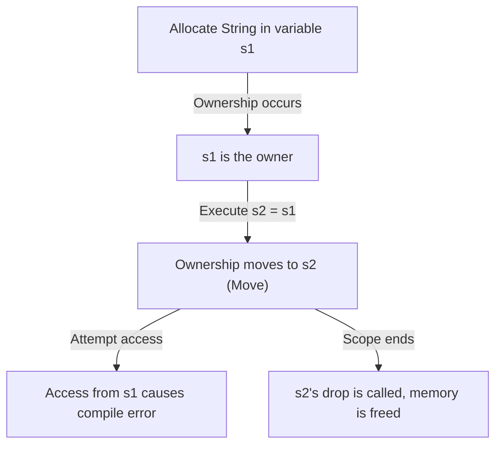
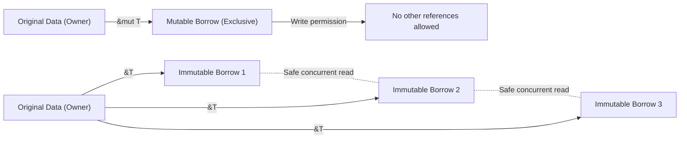

## Introduction: Why is Rust "Safe"?

In the history of programming languages, "performance" and "safety" have long been considered a trade-off. System programming languages like C and C++ offer incredible performance that maximizes hardware capabilities, but at the cost of leaving memory management responsibilities to the programmer. Manual memory management (`malloc` / `free` and `new` / `delete`) has been a breeding ground for serious bugs and security vulnerabilities, such as dangling pointers, double frees, buffer overflows, and memory leaks.

On the other hand, high-level languages like Java, C#, Python, and Ruby hide these memory management complexities from the programmer by introducing Garbage Collection (GC). GC automatically reclaims memory that is no longer needed on a regular basis, dramatically improving memory safety. However, executing GC entails runtime overhead, and unpredictable stop-the-world pauses become a problem, especially in systems requiring real-time performance or environments with strict resource constraints.

**Rust** is what broke through this dilemma and brought a paradigm shift to the world of system programming. Through its unique concept of "Ownership" and the compiler's strict static analysis, Rust **guarantees memory safety without a garbage collector**. This design, which achieves safe concurrent processing without runtime overhead (zero-cost abstraction), can truly be called an art.

In this article, we will dig deeply into Rust's core "safety" and "ownership model," from its philosophy to its concrete mechanisms.

## 3 Approaches to Memory Management

To understand Rust's uniqueness, let's first organize the main approaches to memory management in programming languages.

1. **Manual Memory Management**
   - Representative languages: C, C++
   - Features: The developer explicitly allocates and frees memory.
   - Advantages: Zero runtime overhead. Ultimate performance.
   - Disadvantages: Human errors are inevitable, fundamentally lacking memory safety.

2. **Garbage Collection**
   - Representative languages: Java, C#, Go, Python
   - Features: The runtime monitors memory usage and automatically reclaims memory that is no longer needed.
   - Advantages: High memory safety, greatly reducing the burden on developers.
   - Disadvantages: Performance degradation due to GC cycles and increased memory usage.

3. **Ownership and Borrowing**
   - Representative language: Rust
   - Features: The compiler calculates the memory lifetime at compile time and automatically inserts the necessary deallocation processes.
   - Advantages: Achieves memory safety without GC and delivers performance equivalent to C/C++.
   - Disadvantages: A steep learning curve, requiring battles with the "Borrow Checker".

When the code passes compilation, it is as if the Rust compiler mathematically proves (excluding unsafe code blocks) that no memory-related undefined behavior will occur.

## The 3 Major Principles of Ownership

Rust's ownership system is built upon just three simple rules. These three rules form the foundation of all memory safety.

1. **Each value in Rust has a variable called its "owner".**
2. **There can only be one owner at a time.**
3. **When the owner goes out of scope, the value will be dropped (destroyed).**

### Rules 1 and 3: Scope and Memory Deallocation (Drop)

The valid range (scope) of a variable in Rust is defined by the block `{}`. When a variable goes out of scope, Rust automatically calls a special function `drop` to deallocate the memory area occupied by that value. This behavior is similar to the RAII (Resource Acquisition Is Initialization) pattern in C++, but in Rust, this is thoroughly implemented as a core language feature.

```rust
{
    let s = String::from("hello"); // s is valid from here
    // do stuff with s
} // s goes out of scope here, and memory is automatically freed (drop function is called)
```

Thanks to this mechanism, programmers don't have to worry about forgetting to manually call `free()` and causing memory leaks.

### Rule 2: Single Owner and Move Semantics (Move)

The crucial difference between Rust and many other languages is Rule 2: "There can only be one owner at a time."

Assigning simple data types stored on the stack (types implementing the `Copy` trait, such as integers and booleans) results in a copy of the value. However, assigning types that allocate data on the heap (such as `String` and `Vec`) results in a **"transfer of ownership (move)"**.

```rust
let s1 = String::from("hello");
let s2 = s1; // Ownership moves from s1 to s2 here

// println!("{}, world!", s1); // Compile error! s1 is no longer valid
```

Why does a move occur? If `s1` and `s2` pointed to the same memory area on the heap, and both attempted to free it when going out of scope, a **Double Free** bug would occur. Rust guarantees safety by completely disallowing such states to be created in the first place, invalidating the old variable `s1` at the point of assignment.

Let's visualize the movement of ownership with the following Mermaid diagram.



## Borrowing: Accessing Data Without Transferring Ownership

The rules of ownership are strict and safe, but it would be extremely inconvenient if "every time you pass a value to a function, ownership moves and it can never be used again." Therefore, Rust has the concepts of **"References"** and **"Borrowing"**.

By using references, you can access a value without taking ownership of it. This is called "borrowing".

```rust
fn calculate_length(s: &String) -> usize { // s is a reference to a String
    s.len()
} // s goes out of scope here, but since it doesn't have ownership, nothing happens

let s1 = String::from("hello");
let len = calculate_length(&s1); // Ownership remains with s1, only a reference is passed
println!("The length of '{}' is {}.", s1, len); // s1 can still be used
```

### Rules of Borrowing and Preventing Data Races

Borrowing also has strict rules.

1. At any given time, you can have either **one mutable reference (`&mut T`)** or **multiple immutable references (`&T`)** (but not both at the same time).
2. References must always be valid (prohibition of dangling pointers).

These rules exist to completely eliminate **Data Races** in concurrent processing at compile time. A data race occurs when these three conditions are met:

- Two or more pointers access the same data at the same time.
- At least one of the pointers is being used to write to the data.
- There's no mechanism being used to synchronize access to the data.

Rust's borrowing rules prohibit this very state at the compile level. It enforces exclusive control (Readers-Writer lock)—"anyone can read at the same time if they are just reading (multiple immutable references)", and "no one can read while someone is writing, and only one person can write (single mutable reference)"—not at runtime, but at compile time.



## Lifetimes: Proving the Validity of References

The other rule of borrowing, "References must always be valid", is realized by the concept of **Lifetimes**.

In C, it is easy to create a dangling pointer pointing to an invalid memory area by simply returning a pointer to a function-local variable.

Rust's borrow checker tracks and compares the lifetimes of all references (the scope in which the reference is valid). It ensures that the lifetime of a reference does not exceed the lifetime of the data it points to.

```rust
let r;
{
    let x = 5;
    r = &x; // Error! x's lifetime is too short
} // x is destroyed here
// println!("r: {}", r); // Attempting to use r here would result in a dangling pointer
```

The code above is mercilessly rejected by the Rust compiler. Often, the compiler allows developers to omit explicit annotations through Lifetime Elision, but for complex structs or functions, the developer needs to add lifetime annotations (e.g., `'a`) to teach the compiler about the relationships between references.

Lifetimes might feel esoteric at first, but they are the ultimate form of expressing "when and where memory is allocated and when it is destroyed" as a program's type system.

## Thread Safety and Concurrency: Fearless Concurrency

Rust's core concepts such as ownership, borrowing, and lifetimes not only make single-threaded programs safe but also make concurrent processing in multi-threaded environments astonishingly safe.

As mentioned above, the mutually exclusive rules for mutable and immutable references prevent data races. Furthermore, Rust uses marker traits called `Send` and `Sync` to guarantee the safety of data transfer and sharing between threads.

- **`Send`**: Indicates that the ownership of a type can be safely transferred to another thread.
- **`Sync`**: Indicates that it is safe for the type to be referenced simultaneously from multiple threads.

For example, a non-thread-safe reference counter `Rc<T>` implements neither `Send` nor `Sync`, so attempting to use it mistakenly in a multi-threaded environment will result in a compile error. Instead, the compilation will only pass by combining the atomic reference counter `Arc<T>` and the mutual exclusion `Mutex<T>`.

Rather than "noticing bugs at runtime", "if it's not safe, it won't even compile". This is the true essence of Rust's **"Fearless Concurrency"**.

## Conclusion: Ownership as a Paradigm

Rust's ownership system is not just a feature; it is a fundamental paradigm of program design. It confronts us with important questions at the code-writing stage, such as "Who owns this data?", "How long is the data valid?", and "When will it be overwritten?".

Indeed, the time spent wrestling with the borrow checker may feel painful. However, compiler errors are the voice of our most reliable partner, protecting us from fatal bugs that can occur in production environments, hard-to-reproduce race conditions, and potentially exploitable security holes.

Rust is a high-level fusion of the high performance of manual memory management and the safety of GC languages. By understanding the deep philosophy and meticulous design behind it, we can build a world of more robust, faster, and more reliable software.
