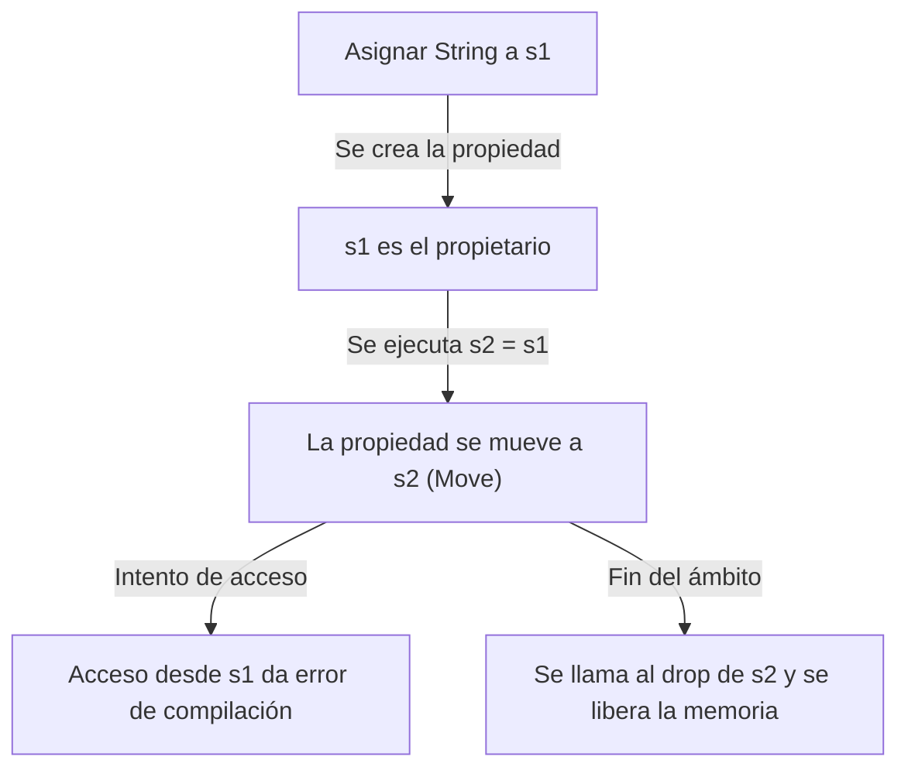
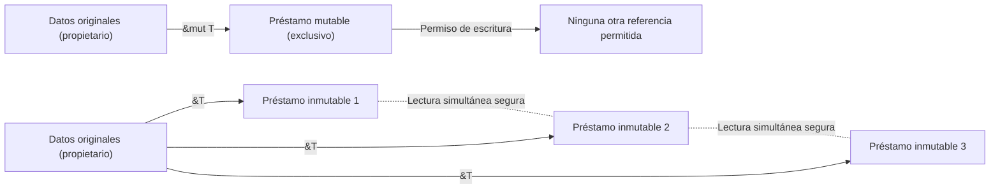

## Introducción: ¿Por qué Rust es "seguro"?

En la historia de los lenguajes de programación, el "rendimiento" y la "seguridad" han sido considerados durante mucho tiempo como un compromiso (trade-off). Los lenguajes de programación de sistemas como C o C++ ofrecen un rendimiento asombroso que maximiza las capacidades del hardware, pero a cambio delegan la responsabilidad de la gestión de la memoria a los programadores. La gestión manual de la memoria (`malloc` / `free` o `new` / `delete`) ha sido un semillero de errores graves y vulnerabilidades de seguridad, como punteros colgantes (dangling pointers), doble liberación (double free), desbordamientos de búfer (buffer overflows) y fugas de memoria (memory leaks).

Por otro lado, los lenguajes de alto nivel como Java, C#, Python o Ruby ocultan esta complejidad de gestión de memoria a los programadores mediante la introducción de la recolección de basura (Garbage Collection, GC). El GC recupera automáticamente la memoria que ya no se necesita, aumentando drásticamente la seguridad de la memoria. Sin embargo, la ejecución del GC conlleva una sobrecarga en tiempo de ejecución (runtime overhead), y especialmente en sistemas que requieren tiempo real o en entornos con recursos limitados, los tiempos de pausa impredecibles (Stop-the-World) se convierten en un problema.

Quien rompió este dilema y trajo un cambio de paradigma al mundo de la programación de sistemas fue **Rust**. Mediante el concepto único de "Propiedad (Ownership)" y el estricto análisis estático de su compilador, Rust **garantiza la seguridad de la memoria sin tener un recolector de basura**. Este diseño, que logra un procesamiento concurrente seguro (abstracciones de costo cero) sin sobrecarga en tiempo de ejecución, se puede considerar verdaderamente artístico.

En este artículo, profundizaremos en el núcleo de Rust, la "seguridad" y el "modelo de propiedad", desde su filosofía hasta sus mecanismos concretos.

## Los 3 enfoques para la gestión de la memoria

Para entender la singularidad de Rust, primero repasemos los principales enfoques de gestión de memoria en los lenguajes de programación.

1. **Gestión manual de la memoria (Manual Memory Management)**
   - Lenguajes representativos: C, C++
   - Características: Los desarrolladores asignan y liberan la memoria explícitamente.
   - Ventajas: Cero sobrecarga en tiempo de ejecución. Rendimiento extremo.
   - Desventajas: El error humano es inevitable y carece fundamentalmente de seguridad de memoria.

2. **Recolección de basura (Garbage Collection)**
   - Lenguajes representativos: Java, C#, Go, Python
   - Características: El entorno de ejecución supervisa el uso de la memoria y recupera automáticamente la que ya no es necesaria.
   - Ventajas: Alta seguridad de memoria y reduce significativamente la carga del desarrollador.
   - Desventajas: Reducción del rendimiento debido a la ejecución del ciclo de GC y aumento del uso de memoria.

3. **Propiedad y Préstamo (Ownership and Borrowing)**
   - Lenguajes representativos: Rust
   - Características: El compilador calcula el tiempo de vida (lifetime) de la memoria en tiempo de compilación e inserta automáticamente el código necesario para liberarla.
   - Ventajas: Logra la seguridad de la memoria sin GC y ofrece un rendimiento equivalente a C/C++.
   - Desventajas: Curva de aprendizaje empinada y requiere luchar contra el "Comprobador de préstamos (Borrow Checker)".

El compilador de Rust es como si demostrara matemáticamente (excluyendo bloques de código inseguros, unsafe) que el comportamiento no definido relacionado con la memoria no ocurrirá una vez que el código haya pasado la compilación.

## Los 3 grandes principios de la Propiedad (Ownership)

El sistema de propiedad de Rust se basa en solo tres reglas simples. Estas tres reglas son la base de toda la seguridad de la memoria.

1. **Cada valor en Rust tiene una variable que se denomina su "propietario (owner)".**
2. **Solo puede haber un propietario a la vez.**
3. **Cuando el propietario sale del ámbito (scope), el valor se descarta.**

### Reglas 1 y 3: Ámbito (Scope) y liberación de memoria (Drop)

En Rust, el ámbito (rango válido) de una variable se define mediante bloques `{}`. Cuando una variable sale del ámbito, Rust llama automáticamente a una función especial `drop` y libera el área de memoria ocupada por su valor. Este comportamiento es similar al patrón RAII (Resource Acquisition Is Initialization) de C++, pero en Rust esto se implementa rigurosamente como una característica central del lenguaje.

```rust
{
    let s = String::from("hello"); // s es válido desde aquí
    // operaciones usando s
} // Aquí s sale del ámbito y la memoria se libera automáticamente (se llama a la función drop)
```

Con este mecanismo, los programadores no tienen que preocuparse por olvidar llamar a `free()` manualmente y causar fugas de memoria.

### Regla 2: Un único propietario y la semántica de movimiento (Move)

La diferencia crucial entre Rust y muchos otros lenguajes es la regla 2: "Solo puede haber un propietario a la vez".

La asignación de tipos de datos simples almacenados en la pila (como enteros o booleanos, tipos que implementan el trait `Copy`) resulta en una copia del valor. Sin embargo, asignar tipos que reservan datos en el montón (heap), como `String` o `Vec`, resulta en un **"movimiento de propiedad (Move)"**.

```rust
let s1 = String::from("hello");
let s2 = s1; // Aquí la propiedad se mueve de s1 a s2

// println!("{}, world!", s1); // ¡Error de compilación! s1 ya no es válido
```

¿Por qué ocurre este movimiento? Si `s1` y `s2` apuntaran a la misma área de memoria en el montón, y al salir de sus respectivos ámbitos ambos intentaran liberar esa memoria, ocurriría un error de **doble liberación (Double Free)**. Rust simplemente no permite que se cree esta situación; al invalidar la variable antigua `s1` en el momento de la asignación, garantiza la seguridad.

Visualicemos el movimiento de la propiedad con el siguiente diagrama Mermaid:



## Préstamo (Borrowing): Acceder a los datos sin transferir la propiedad

Las reglas de propiedad son estrictas y seguras, pero sería extremadamente inconveniente si "cada vez que pasas un valor a una función, la propiedad se mueve y no puedes volver a usarlo". Por lo tanto, en Rust existen los conceptos de **"Referencias (References)"** y **"Préstamo (Borrowing)"**.

Utilizando referencias, se puede acceder a un valor sin quitarle su propiedad. A esto se le llama "préstamo".

```rust
fn calculate_length(s: &String) -> usize { // s es una referencia a un String
    s.len()
} // Aquí s sale del ámbito, pero como no tiene la propiedad, no ocurre nada

let s1 = String::from("hello");
let len = calculate_length(&s1); // La propiedad sigue en s1, solo pasamos la referencia
println!("The length of '{}' is {}.", s1, len); // s1 aún se puede usar
```

### Reglas del préstamo y prevención de carreras de datos (Data Races)

El préstamo también tiene reglas estrictas:

1. En cualquier momento dado, puedes tener **una sola referencia mutable (`&mut T`)** o **múltiples referencias inmutables (`&T`)** (no puedes tener ambas al mismo tiempo).
2. Las referencias siempre deben ser válidas (se prohíben los punteros colgantes).

Estas reglas existen para eliminar completamente las **carreras de datos (Data Races)** en la programación concurrente durante la compilación. Una carrera de datos ocurre cuando se cumplen las tres condiciones siguientes:

- Dos o más punteros acceden a los mismos datos al mismo tiempo.
- Al menos uno de los punteros se utiliza para escribir en los datos.
- No existe un mecanismo para sincronizar el acceso a los datos.

Las reglas de préstamo de Rust prohíben exactamente esta situación a nivel de compilación. Aplican un control exclusivo (Readers-Writer lock) no en tiempo de ejecución, sino en tiempo de compilación: "Cualquier número de personas puede leer simultáneamente si solo están leyendo (múltiples referencias inmutables)" y "Al escribir, nadie más puede leer, y solo uno puede escribir (referencia mutable única)".



## Tiempos de vida (Lifetimes): Demostrando la validez de las referencias

Para cumplir la otra regla del préstamo, "las referencias siempre deben ser válidas", existe el concepto de **Tiempos de vida (Lifetimes)**.

En C, es fácil crear punteros colgantes que apunten a áreas de memoria no válidas devolviendo un puntero a una variable local de la función.

El Borrow Checker de Rust rastrea y compara los tiempos de vida (el ámbito en el que la referencia es válida) de todas las referencias. Comprueba que el tiempo de vida de la referencia nunca sea más largo que el de los datos referenciados.

```rust
let r;
{
    let x = 5;
    r = &x; // ¡Error! El tiempo de vida de x es demasiado corto
} // x se descarta aquí
// println!("r: {}", r); // Si intentamos usar r aquí, sería un puntero colgante
```

El código anterior es rechazado implacablemente por el compilador de Rust. A menudo, el compilador nos permite omitir la anotación explícita mediante la elisión de tiempos de vida (Lifetime Elision), pero en estructuras y funciones complejas, los desarrolladores deben agregar anotaciones de tiempos de vida (ej. `'a`) para enseñar al compilador la relación entre las referencias.

Aunque al principio los tiempos de vida parecen complicados, son la forma definitiva de expresar "cuándo y dónde se asigna y se destruye la memoria" como el sistema de tipos del programa.

## Concurrencia segura (Thread-safe) y Concurrencia sin miedo (Fearless Concurrency)

Los conceptos centrales de Rust, como la propiedad, el préstamo y los tiempos de vida, no solo hacen seguros los programas de un solo hilo, sino que también hacen increíblemente seguro el procesamiento concurrente en un entorno multihilo.

Como se mencionó anteriormente, la regla de exclusividad de las referencias mutables e inmutables previene las carreras de datos. Además, Rust utiliza marcadores de traits (marker traits) llamados `Send` y `Sync` para garantizar la seguridad de la transferencia y el intercambio de datos entre hilos.

- **`Send`**: Indica que la propiedad del tipo se puede transferir de forma segura a otro hilo.
- **`Sync`**: Indica que es seguro ser referenciado simultáneamente desde múltiples hilos.

Por ejemplo, un contador de referencias no seguro para hilos, como `Rc<T>`, no implementa ni `Send` ni `Sync`, por lo que si se intenta usar erróneamente en un entorno multihilo, resultará en un error de compilación. En su lugar, el código solo compilará si se combina un contador de referencias atómico `Arc<T>` y un control exclusivo `Mutex<T>`.

En lugar de "darse cuenta de los errores en tiempo de ejecución", se aplica la filosofía de que "si no es seguro, ni siquiera compilará". Este es el verdadero valor de la **"Concurrencia sin miedo (Fearless Concurrency)"** promovida por Rust.

## Conclusión: La propiedad como paradigma

El sistema de propiedad de Rust no es solo una característica; es un paradigma fundamental en el diseño de programas. Nos obliga a hacernos preguntas importantes en la etapa de escritura del código, como "¿Quién es el propietario de estos datos?", "¿Hasta cuándo son válidos los datos?" y "¿Cuándo se modificarán?".

Es cierto que el tiempo que se pasa luchando contra el Borrow Checker puede parecer doloroso. Sin embargo, los errores del compilador son la voz de nuestro socio más confiable, protegiéndonos de errores fatales que podrían ocurrir en entornos de producción, condiciones de carrera difíciles de reproducir y agujeros de seguridad que podrían ser explotados.

Rust fusiona el alto rendimiento de la gestión manual de la memoria con la seguridad de los lenguajes GC en un nivel superior. Al comprender la profunda filosofía y el diseño minucioso detrás de él, podremos construir un mundo de software más robusto, rápido y confiable.
