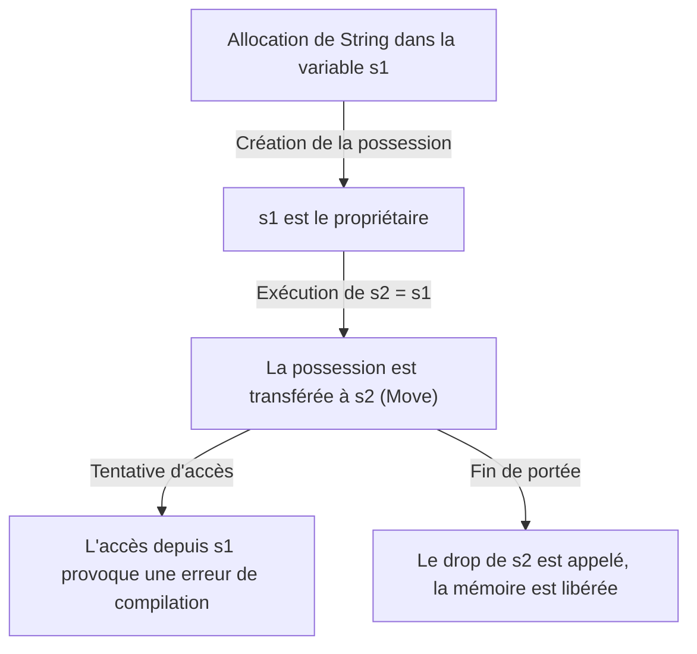
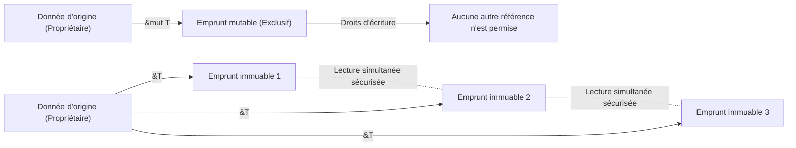

## Introduction : Pourquoi Rust est-il "sûr" ?

Dans l'histoire des langages de programmation, on a longtemps considéré qu'il y avait un compromis entre "performances" et "sécurité". Les langages de programmation système comme C et C++ offrent des performances incroyables qui maximisent les capacités matérielles, mais au prix de laisser la responsabilité de la gestion de la mémoire au programmeur. La gestion manuelle de la mémoire (`malloc` / `free` et `new` / `delete`) a été un terreau pour des bugs graves et des vulnérabilités de sécurité tels que les pointeurs pendouillants (dangling pointers), la double libération (double free), les dépassements de tampon (buffer overflow) et les fuites de mémoire.

D'un autre côté, les langages de haut niveau comme Java, C#, Python et Ruby ont masqué la complexité de cette gestion de la mémoire au programmeur en introduisant le ramasse-miettes (Garbage Collection, GC). Le GC récupère automatiquement la mémoire qui n'est plus nécessaire à intervalles réguliers, améliorant considérablement la sécurité de la mémoire. Cependant, l'exécution du GC s'accompagne d'une surcharge à l'exécution (runtime overhead), et les temps d'arrêt imprévisibles (Stop-the-World) posent problème, en particulier dans les systèmes nécessitant des temps réels ou dans des environnements soumis à des contraintes de ressources strictes.

**Rust** a brisé ce dilemme et apporté un changement de paradigme dans le monde de la programmation système. Grâce à son concept unique de "possession (Ownership)" et à une analyse statique stricte par le compilateur, Rust **garantit la sécurité de la mémoire sans ramasse-miettes**. Cette conception, qui permet une concurrence sûre sans surcharge d'exécution (abstraction à coût zéro), peut même être qualifiée d'artistique.

Dans cet article, nous explorerons en profondeur le cœur de Rust, la "sécurité" et le "modèle de possession", depuis sa philosophie jusqu'à ses mécanismes concrets.

## 3 approches de la gestion de la mémoire

Pour comprendre l'unicité de Rust, commençons par passer en revue les principales approches de gestion de la mémoire dans les langages de programmation.

1. **Gestion manuelle de la mémoire (Manual Memory Management)**
   - Langages représentatifs : C, C++
   - Caractéristiques : Le développeur alloue et libère explicitement la mémoire.
   - Avantages : Surcharge d'exécution nulle. Performances ultimes.
   - Inconvénients : Les erreurs humaines sont inévitables et la sécurité de la mémoire fait fondamentalement défaut.

2. **Ramasse-miettes (Garbage Collection)**
   - Langages représentatifs : Java, C#, Go, Python
   - Caractéristiques : L'environnement d'exécution surveille l'utilisation de la mémoire et récupère automatiquement celle qui n'est plus nécessaire.
   - Avantages : Grande sécurité de la mémoire et charge du développeur considérablement réduite.
   - Inconvénients : Baisse des performances due à l'exécution des cycles de GC et augmentation de l'utilisation de la mémoire.

3. **Possession et Emprunt (Ownership and Borrowing)**
   - Langages représentatifs : Rust
   - Caractéristiques : Le compilateur calcule la durée de vie de la mémoire à la compilation et insère automatiquement les processus de libération nécessaires.
   - Avantages : Atteint la sécurité de la mémoire sans GC et offre des performances équivalentes au C/C++.
   - Inconvénients : Courbe d'apprentissage abrupte et nécessité de se battre contre le "Borrow Checker".

C'est comme si le compilateur Rust prouvait mathématiquement (à l'exception des blocs de code non sûrs) que le comportement indéfini lié à la mémoire ne se produit pas une fois que le code est compilé avec succès.

## Les 3 grands principes de la Possession (Ownership)

Le système de possession de Rust repose sur seulement trois règles simples. Ces trois règles constituent la base de toute la sécurité de la mémoire.

1. **Chaque valeur en Rust a une variable appelée son "propriétaire" (owner).**
2. **Il ne peut y avoir qu'un seul propriétaire à la fois.**
3. **Lorsque le propriétaire sort de la portée, la valeur est détruite.**

### Règles 1 et 3 : Portée (Scope) et libération de la mémoire (Drop)

La portée d'une variable en Rust est définie par le bloc `{}`. Lorsqu'une variable sort de sa portée, Rust appelle automatiquement une fonction spéciale `drop` pour libérer la zone de mémoire occupée par sa valeur. Ce comportement est similaire au modèle RAII (Resource Acquisition Is Initialization) en C++, mais en Rust, il est rigoureusement appliqué en tant que fonctionnalité centrale du langage.

```rust
{
    let s = String::from("hello"); // s est valide à partir d'ici
    // Traitement utilisant s
} // Ici s sort de la portée, la mémoire est automatiquement libérée (la fonction drop est appelée)
```

Grâce à ce mécanisme, le programmeur n'a pas à s'inquiéter d'oublier d'appeler manuellement `free()` et de provoquer des fuites de mémoire.

### Règle 2 : Propriétaire unique et sémantique de déplacement (Move)

La différence cruciale entre Rust et de nombreux autres langages est la règle 2 : "Il ne peut y avoir qu'un seul propriétaire à la fois".

L'affectation de types de données simples stockés sur la pile (comme les entiers et les booléens, qui implémentent le trait `Copy`) donne lieu à une copie de la valeur. En revanche, l'affectation de types allouant des données sur le tas (comme `String` et `Vec`) entraîne un **"déplacement de la possession (Move)"**.

```rust
let s1 = String::from("hello");
let s2 = s1; // Ici, la possession passe de s1 à s2

// println!("{}, world!", s1); // Erreur de compilation ! s1 n'est plus valide
```

Pourquoi le déplacement (Move) se produit-il ? Si `s1` et `s2` pointaient vers la même zone mémoire sur le tas, et que les deux tentaient d'être libérés lorsqu'ils sortent de la portée, un bug de **double libération (Double Free)** se produirait. Rust garantit la sécurité en empêchant l'existence même d'un tel état et en invalidant l'ancienne variable `s1` au moment de l'affectation.

Visualisons le mouvement de possession avec le diagramme Mermaid suivant.



## Emprunt (Borrowing) : Accéder aux données sans transférer la possession

Bien que les règles de possession soient strictes et sûres, il serait extrêmement gênant de dire que "chaque fois qu'une valeur est passée à une fonction, la possession est déplacée et ne peut plus jamais être utilisée". Par conséquent, Rust propose les concepts de **"Références (References)"** et d'**"Emprunt (Borrowing)"**.

L'utilisation de références permet d'accéder à une valeur sans en prendre possession. C'est ce qu'on appelle "l'emprunt".

```rust
fn calculate_length(s: &String) -> usize { // s est une référence à un String
    s.len()
} // Ici, s sort de la portée, mais comme il n'a pas la possession, rien ne se passe

let s1 = String::from("hello");
let len = calculate_length(&s1); // La possession reste à s1, seule la référence est passée
println!("The length of '{}' is {}.", s1, len); // s1 est toujours utilisable
```

### Règles d'emprunt et prévention des accès concurrents aux données (Data Races)

L'emprunt a également des règles strictes.

1. À tout moment donné, vous pouvez avoir **soit une référence mutable (`&mut T`)**, **soit n'importe quel nombre de références immuables (`&T`)** (vous ne pouvez pas avoir les deux simultanément).
2. Les références doivent toujours être valides (interdiction des pointeurs pendouillants).

Ces règles visent à éliminer complètement les **accès concurrents aux données (Data Races)** au moment de la compilation. Un accès concurrent aux données se produit lorsque les 3 conditions suivantes sont réunies :

- Deux pointeurs ou plus accèdent à la même donnée simultanément.
- Au moins un des pointeurs est utilisé pour écrire dans la donnée.
- Aucun mécanisme n'est utilisé pour synchroniser l'accès à la donnée.

Les règles d'emprunt de Rust interdisent cet état au niveau de la compilation. Elles imposent un contrôle d'exclusion (verrous lecteurs-rédacteurs) : "N'importe quel nombre de personnes peut lire simultanément (plusieurs références immuables)", et "Lorsque quelqu'un écrit, personne d'autre ne peut lire, et un seul peut écrire (référence mutable unique)". Ce contrôle est appliqué à la compilation et non à l'exécution.



## Durées de vie (Lifetimes) : Prouver la validité des références

La deuxième règle de l'emprunt, "Les références doivent toujours être valides", est mise en œuvre par le concept de **Durée de vie (Lifetimes)**.

En langage C, il est facile de créer des pointeurs pendouillants pointant vers des zones mémoire invalides en renvoyant le pointeur d'une variable locale à une fonction.

Le vérificateur d'emprunt (Borrow Checker) de Rust suit et compare les durées de vie de toutes les références (la portée dans laquelle une référence est valide). Il s'assure que la durée de vie d'une référence n'est pas plus longue que la durée de vie des données auxquelles elle fait référence.

```rust
let r;
{
    let x = 5;
    r = &x; // Erreur ! La durée de vie de x est trop courte
} // x est détruit ici
// println!("r: {}", r); // Si on essaie d'utiliser r ici, on obtient un pointeur pendouillant
```

Le code ci-dessus est impitoyablement rejeté par le compilateur Rust. Dans de nombreux cas, le compilateur permet d'omettre les déclarations explicites grâce à l'élision de durée de vie (Lifetime Elision), mais dans des structures et des fonctions complexes, les développeurs doivent ajouter des annotations de durée de vie (par exemple, `'a`) pour informer le compilateur de la relation entre les références.

Les durées de vie peuvent sembler difficiles à comprendre au début, mais elles représentent la forme ultime de l'expression "quand et où la mémoire est allouée et quand elle est détruite", intégrée dans le système de types du programme.

## Thread-safety et concurrence : La Concurrence sans crainte (Fearless Concurrency)

Les concepts centraux de Rust (possession, emprunt et durée de vie) ne sécurisent pas seulement les programmes à un seul thread, ils rendent également la programmation concurrente dans des environnements multithreads incroyablement sûre.

Comme mentionné précédemment, la règle d'exclusion des références mutables et immuables empêche les accès concurrents aux données. De plus, Rust utilise les marqueurs de traits `Send` et `Sync` pour garantir la sécurité du transfert et du partage de données entre les threads.

- **`Send`** : Indique que la possession du type peut être transférée en toute sécurité à un autre thread.
- **`Sync`** : Indique qu'il est sûr que plusieurs threads fassent référence à ce type simultanément.

Par exemple, le compteur de référence non thread-safe `Rc<T>` n'implémente ni `Send` ni `Sync`, de sorte que s'il est utilisé par erreur dans un environnement multithread, il provoque une erreur de compilation. Ce n'est qu'en combinant un compteur de référence atomique `Arc<T>` et un contrôle d'exclusion `Mutex<T>` que le code compile.

"Ne pas réaliser le bug à l'exécution", mais plutôt "Si ce n'est pas sûr, ça ne compile même pas". C'est l'essence même de la promesse de Rust : la **"Concurrence sans crainte (Fearless Concurrency)"**.

## Conclusion : La possession comme paradigme

Le système de possession de Rust n'est pas seulement une fonctionnalité, c'est un paradigme fondamental de conception de programmes. Il nous oblige à faire face à des questions importantes dès l'écriture du code : "Qui possède cette donnée ?", "Combien de temps cette donnée est-elle valide ?" et "Quand sera-t-elle réécrite ?".

Il est vrai que lutter contre le vérificateur d'emprunt peut sembler douloureux. Cependant, les erreurs du compilateur sont la voix du partenaire le plus fiable, nous protégeant des bogues fatals en production, des conditions de concurrence difficiles à reproduire et des failles de sécurité exploitables.

Rust fusionne les hautes performances de la gestion manuelle de la mémoire avec la sécurité des langages à GC à un niveau supérieur. En comprenant la philosophie profonde et la conception minutieuse qui se cachent derrière, nous pourrons construire un monde logiciel plus robuste, plus rapide et plus fiable.
