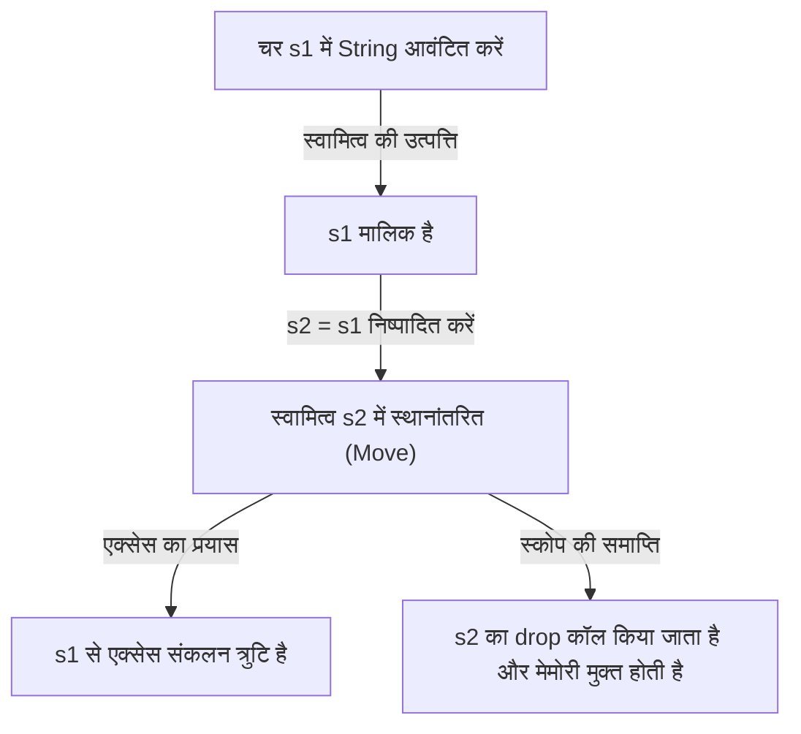
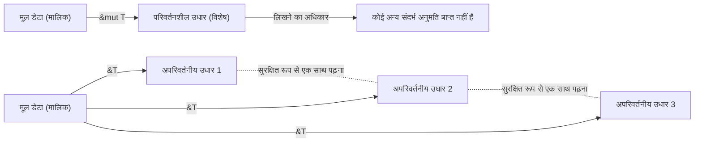

## परिचय: Rust "सुरक्षित" क्यों है?

प्रोग्रामिंग भाषाओं के इतिहास में, "प्रदर्शन" और "सुरक्षा" को लंबे समय से ट्रेड-ऑफ (एक के बदले दूसरे का समझौता) माना जाता रहा है। C और C++ जैसी सिस्टम प्रोग्रामिंग भाषाएँ हार्डवेयर की क्षमताओं को अधिकतम करने वाला शानदार प्रदर्शन प्रदान करती हैं, लेकिन इसके बदले मेमोरी प्रबंधन की ज़िम्मेदारी प्रोग्रामर पर छोड़ देती हैं। मैन्युअल मेमोरी प्रबंधन (`malloc` / `free` या `new` / `delete`) अक्सर डैंगलिंग पॉइंटर्स, डबल फ्री, बफर ओवरफ्लो और मेमोरी लीक जैसे गंभीर बग्स और सुरक्षा कमजोरियों का कारण बनता है।

दूसरी ओर, Java, C#, Python और Ruby जैसी उच्च-स्तरीय भाषाएँ गारबेज कलेक्शन (GC) को अपनाकर मेमोरी प्रबंधन की इस जटिलता को प्रोग्रामर से छिपाती हैं। GC समय-समय पर अनावश्यक मेमोरी को स्वचालित रूप से पुनः प्राप्त करता है, जिससे मेमोरी सुरक्षा में नाटकीय रूप से सुधार होता है। हालाँकि, GC के निष्पादन के साथ रनटाइम ओवरहेड जुड़ा होता है, और विशेष रूप से रीयल-टाइम सिस्टम या सख्त संसाधन प्रतिबंध वाले वातावरण में, अप्रत्याशित रोक समय (Stop-the-World) एक समस्या बन जाता है।

इस दुविधा को तोड़ने और सिस्टम प्रोग्रामिंग की दुनिया में एक पैराडाइम शिफ्ट (प्रतिमान बदलाव) लाने वाली भाषा **Rust** है। Rust "स्वामित्व (Ownership)" की अनूठी अवधारणा और कंपाइलर के कठोर स्थिर विश्लेषण (static analysis) के माध्यम से **बिना गारबेज कलेक्टर के मेमोरी सुरक्षा की गारंटी** देता है। बिना किसी रनटाइम ओवरहेड (शून्य-लागत अमूर्तन) के सुरक्षित समवर्ती प्रसंस्करण (concurrent processing) प्राप्त करने वाला यह डिज़ाइन वास्तव में कलात्मक कहा जा सकता है।

इस लेख में, हम Rust के मूल "सुरक्षा" और "स्वामित्व मॉडल" के दर्शन से लेकर इसके विशिष्ट तंत्र तक गहराई से पड़ताल करेंगे।

## मेमोरी प्रबंधन के 3 दृष्टिकोण

Rust की विशिष्टता को समझने के लिए, आइए पहले प्रोग्रामिंग भाषाओं में मेमोरी प्रबंधन के मुख्य दृष्टिकोणों को व्यवस्थित करें।

1. **मैन्युअल मेमोरी प्रबंधन (Manual Memory Management)**
   - प्रतिनिधि भाषाएँ: C, C++
   - विशेषताएँ: डेवलपर स्पष्ट रूप से मेमोरी आवंटित और मुक्त करता है।
   - लाभ: रनटाइम ओवरहेड शून्य है। अत्यधिक प्रदर्शन।
   - नुकसान: मानवीय त्रुटि अपरिहार्य है, और बुनियादी तौर पर मेमोरी सुरक्षा का अभाव होता है।

2. **गारबेज कलेक्शन (Garbage Collection)**
   - प्रतिनिधि भाषाएँ: Java, C#, Go, Python
   - विशेषताएँ: रनटाइम मॉनिटर करता है कि मेमोरी का उपयोग कैसे किया जा रहा है और अनावश्यक मेमोरी को स्वचालित रूप से पुनः प्राप्त करता है।
   - लाभ: उच्च मेमोरी सुरक्षा और डेवलपर के बोझ में काफी कमी।
   - नुकसान: GC चक्र के निष्पादन के कारण प्रदर्शन में गिरावट और मेमोरी उपयोग में वृद्धि।

3. **स्वामित्व और उधार (Ownership and Borrowing)**
   - प्रतिनिधि भाषा: Rust
   - विशेषताएँ: कंपाइलर संकलन (compile) के समय मेमोरी के जीवनकाल (lifetime) की गणना करता है और स्वचालित रूप से आवश्यक मुक्ति प्रक्रिया (freeing) सम्मिलित करता है।
   - लाभ: GC के बिना मेमोरी सुरक्षा प्राप्त करता है और C/C++ के बराबर प्रदर्शन प्रदान करता है।
   - नुकसान: सीखने की अवस्था कठिन है, और "बॉरो चेकर (Borrow Checker)" से जूझना पड़ता है।

Rust का कंपाइलर एक तरह से गणितीय रूप से यह साबित करता है कि कोड के संकलन से गुजरने पर मेमोरी से संबंधित कोई अपरिभाषित व्यवहार नहीं होगा (असुरक्षित कोड ब्लॉक को छोड़कर)।

## स्वामित्व (Ownership) के 3 मुख्य सिद्धांत

Rust का स्वामित्व सिस्टम सिर्फ 3 सरल नियमों पर बनाया गया है। ये 3 नियम सभी मेमोरी सुरक्षा की नींव बनाते हैं।

1. **Rust में प्रत्येक मान (value) का एक चर (variable) होता है जिसे उसका "मालिक (owner)" कहा जाता है।**
2. **एक समय में केवल एक ही मालिक हो सकता है।**
3. **जब मालिक स्कोप से बाहर हो जाता है, तो मान नष्ट हो जाता है।**

### नियम 1 और 3: स्कोप और मेमोरी मुक्ति (Drop)

Rust में चर का वैध दायरा (स्कोप) ब्लॉक `{}` द्वारा परिभाषित किया जाता है। जब कोई चर स्कोप से बाहर निकलता है, तो Rust स्वचालित रूप से एक विशेष फ़ंक्शन `drop` को कॉल करता है, और उस मान द्वारा अधिग्रहित मेमोरी क्षेत्र को मुक्त कर देता है। यह व्यवहार C++ के RAII (Resource Acquisition Is Initialization) पैटर्न के समान है, लेकिन Rust में इसे भाषा की मुख्य विशेषता के रूप में पूरी तरह से लागू किया गया है।

```rust
{
    let s = String::from("hello"); // s यहाँ से वैध है
    // s का उपयोग करके प्रक्रिया
} // यहाँ s स्कोप से बाहर निकलता है, और मेमोरी स्वतः मुक्त हो जाती है (drop फ़ंक्शन कॉल किया जाता है)
```

इस तंत्र के साथ, प्रोग्रामर को मैन्युअल रूप से `free()` कॉल करना भूलने और मेमोरी लीक होने की चिंता करने की आवश्यकता नहीं है।

### नियम 2: एकल मालिक और मूव सेमांटिक्स (Move)

कई अन्य भाषाओं और Rust के बीच निर्णायक अंतर नियम 2 है, जो कहता है कि "एक समय में केवल एक ही मालिक हो सकता है"।

स्टैक पर सहेजे गए सरल डेटा प्रकारों (जैसे पूर्णांक और बूलियन, जो `Copy` ट्रेट को लागू करते हैं) का असाइनमेंट मान की एक प्रतिलिपि (copy) बनाता है, लेकिन हीप पर डेटा आवंटित करने वाले प्रकारों (जैसे `String` या `Vec`) का असाइनमेंट **"स्वामित्व का स्थानांतरण (Move)"** होता है।

```rust
let s1 = String::from("hello");
let s2 = s1; // यहाँ स्वामित्व s1 से s2 में स्थानांतरित हो जाता है

// println!("{}, world!", s1); // संकलन त्रुटि! s1 अब वैध नहीं है
```

मूव (Move) क्यों होता है? यदि `s1` और `s2` एक ही हीप मेमोरी क्षेत्र को इंगित करते हैं, और जब दोनों स्कोप से बाहर निकलते हैं तो मुक्त करने का प्रयास करते हैं, तो **डबल फ्री (Double Free)** बग उत्पन्न होगा। Rust शुरू से ही ऐसी स्थिति बनने की अनुमति नहीं देता है, और असाइनमेंट के समय पुराने चर `s1` को अमान्य करके सुरक्षा सुनिश्चित करता है।

आइए नीचे दिए गए Mermaid आरेख के साथ स्वामित्व की गति की कल्पना करें।



## उधार (Borrowing): स्वामित्व दिए बिना डेटा एक्सेस करना

हालाँकि स्वामित्व के नियम सख्त और सुरक्षित हैं, लेकिन यह अत्यंत असुविधाजनक होगा यदि "फ़ंक्शन में मान पास करने पर हर बार स्वामित्व स्थानांतरित हो जाए और आप इसे फिर कभी उपयोग न कर सकें।" इसलिए, Rust में **"संदर्भ (References)"** और **"उधार (Borrowing)"** की अवधारणाएँ हैं।

संदर्भों का उपयोग करके, आप स्वामित्व लिए बिना मान तक पहुँच सकते हैं। इसे "उधार (Borrowing)" कहा जाता है।

```rust
fn calculate_length(s: &String) -> usize { // s String का एक संदर्भ है
    s.len()
} // यहाँ s स्कोप से बाहर हो जाता है, लेकिन इसके पास स्वामित्व नहीं है, इसलिए कुछ नहीं होता

let s1 = String::from("hello");
let len = calculate_length(&s1); // स्वामित्व s1 के पास रहता है, केवल संदर्भ पास किया जाता है
println!("The length of '{}' is {}.", s1, len); // s1 का अभी भी उपयोग किया जा सकता है
```

### उधार लेने के नियम और डेटा रेस की रोकथाम

उधार लेने के भी सख्त नियम हैं।

1. किसी भी समय, आपके पास या तो **एक परिवर्तनशील संदर्भ (`&mut T`)**, या **कई अपरिवर्तनीय संदर्भ (`&T`)** हो सकते हैं (दोनों एक साथ नहीं हो सकते)।
2. संदर्भ हमेशा वैध होने चाहिए (डैंगलिंग पॉइंटर्स निषिद्ध हैं)।

ये नियम संकलन के समय समवर्ती प्रसंस्करण में **डेटा रेस (Data Race)** को पूरी तरह से समाप्त करने के लिए हैं। डेटा रेस तब होती है जब निम्नलिखित तीन शर्तें पूरी होती हैं:

- दो या दो से अधिक पॉइंटर्स एक ही समय में एक ही डेटा तक पहुँचते हैं।
- डेटा को लिखने के लिए कम से कम एक पॉइंटर का उपयोग किया जाता है।
- डेटा तक पहुँच को सिंक्रोनाइज़ करने का कोई तंत्र नहीं है।

Rust के उधार लेने के नियम इस स्थिति को संकलन स्तर पर ही प्रतिबंधित करते हैं। "अगर आपको सिर्फ पढ़ना है तो कितने भी लोग एक साथ पढ़ सकते हैं (कई अपरिवर्तनीय संदर्भ)" और "जब आप लिखते हैं, तो कोई और नहीं पढ़ सकता, और केवल एक ही व्यक्ति लिख सकता है (एकल परिवर्तनशील संदर्भ)" - इस तरह के एक्सक्लूसिव कंट्रोल (Readers-Writer लॉक) को रनटाइम के बजाय संकलन समय पर ही लागू किया जाता है।



## जीवनकाल (Lifetimes): संदर्भों की वैधता सिद्ध करना

उधार लेने का एक और नियम, "संदर्भ हमेशा वैध होने चाहिए", **जीवनकाल (Lifetimes)** की अवधारणा के माध्यम से महसूस किया जाता है।

C भाषा में, फ़ंक्शन के स्थानीय चर का पॉइंटर लौटाने से आसानी से एक डैंगलिंग पॉइंटर बन सकता है जो अमान्य मेमोरी क्षेत्र को इंगित करता है।

Rust का बॉरो चेकर सभी संदर्भों के जीवनकाल (वह दायरा जिसमें संदर्भ वैध है) को ट्रैक और तुलना करता है। यह सुनिश्चित करता है कि संदर्भ का जीवनकाल संदर्भित डेटा के जीवनकाल से अधिक लंबा नहीं है।

```rust
let r;
{
    let x = 5;
    r = &x; // त्रुटि! x का जीवनकाल बहुत छोटा है
} // x यहाँ नष्ट हो जाता है
// println!("r: {}", r); // यदि आप यहाँ r का उपयोग करने का प्रयास करते हैं, तो यह डैंगलिंग पॉइंटर होगा
```

उपरोक्त कोड को Rust कंपाइलर द्वारा निर्दयतापूर्वक अस्वीकार कर दिया जाएगा। कई मामलों में, कंपाइलर लाइफटाइम एलिशन (Lifetime Elision) के माध्यम से स्पष्ट लाइफटाइम को छोड़ देता है, लेकिन जटिल संरचनाओं और फ़ंक्शन में, डेवलपर्स को लाइफटाइम एनोटेशन (जैसे, `'a`) जोड़कर संदर्भों के बीच संबंध कंपाइलर को बताना पड़ता है।

जीवनकाल पहले कठिन लग सकता है, लेकिन यह एक प्रोग्राम के प्रकार प्रणाली (type system) के रूप में "मेमोरी कब और कहाँ आवंटित की जाती है, और इसे कब नष्ट किया जाता है" को व्यक्त करने का अंतिम रूप है।

## थ्रेड-सुरक्षित और समवर्ती प्रसंस्करण: निडर समवर्तीता (Fearless Concurrency)

स्वामित्व, उधार और जीवनकाल जैसी Rust की मूल अवधारणाएँ न केवल एकल-थ्रेड प्रोग्राम को सुरक्षित बनाती हैं, बल्कि मल्टी-थ्रेड वातावरण में समवर्ती प्रसंस्करण को भी आश्चर्यजनक रूप से सुरक्षित बनाती हैं।

जैसा कि पहले उल्लेख किया गया है, परिवर्तनशील और अपरिवर्तनीय संदर्भों के विशेष नियम डेटा रेस को रोकते हैं। इसके अलावा, Rust थ्रेड्स के बीच डेटा ट्रांसफर और साझाकरण की सुरक्षा सुनिश्चित करने के लिए `Send` और `Sync` नामक मार्कर ट्रेट्स का उपयोग करता है।

- **`Send`**: यह दर्शाता है कि किसी प्रकार के स्वामित्व को सुरक्षित रूप से दूसरे थ्रेड में स्थानांतरित किया जा सकता है।
- **`Sync`**: यह दर्शाता है कि यदि इसे कई थ्रेड्स से एक साथ संदर्भित किया जाता है तो यह सुरक्षित है।

उदाहरण के लिए, गैर-थ्रेड-सुरक्षित संदर्भ काउंटर `Rc<T>` न तो `Send` और न ही `Sync` लागू करता है, इसलिए यदि आप गलती से मल्टी-थ्रेड वातावरण में इसका उपयोग करने का प्रयास करते हैं, तो संकलन त्रुटि होगी। इसके बजाय, एटॉमिक संदर्भ काउंटर `Arc<T>` और एक्सक्लूसिव कंट्रोल `Mutex<T>` को मिलाकर, संकलन पहली बार सफल होता है।

"रनटाइम पर बग्स का पता लगाना" के बजाय "यदि यह सुरक्षित नहीं है, तो यह संकलन भी नहीं कर सकता"। यही Rust की **"निडर समवर्तीता (Fearless Concurrency)"** का असली सार है।

## निष्कर्ष: प्रतिमान (पैराडाइम) के रूप में स्वामित्व

Rust का स्वामित्व सिस्टम सिर्फ एक विशेषता नहीं है, बल्कि प्रोग्राम डिज़ाइन का एक मौलिक प्रतिमान (पैराडाइम) है। यह हम पर महत्वपूर्ण प्रश्न थोपता है जैसे, "इस डेटा का मालिक कौन है?", "डेटा कब तक वैध है?", और "इसे कब फिर से लिखा जाएगा?", और वह भी कोड लिखने के चरण में।

यह सच है कि बॉरो चेकर से जूझने में बिताया गया समय दर्दनाक लग सकता है। हालाँकि, कंपाइलर त्रुटियाँ हमें उत्पादन वातावरण में होने वाले घातक बग्स, कम-प्रजनन वाली रेस स्थितियों और आसानी से शोषित होने वाली सुरक्षा खामियों से बचाने के लिए सबसे विश्वसनीय भागीदार की आवाज़ हैं।

Rust ने मैन्युअल मेमोरी प्रबंधन के उच्च प्रदर्शन और GC भाषाओं की सुरक्षा को एक उच्च आयाम पर मिला दिया है। इसके पीछे के गहरे दर्शन और विस्तृत डिज़ाइन को समझकर, हम अधिक मजबूत, तेज और विश्वसनीय सॉफ़्टवेयर की दुनिया बना सकेंगे。
