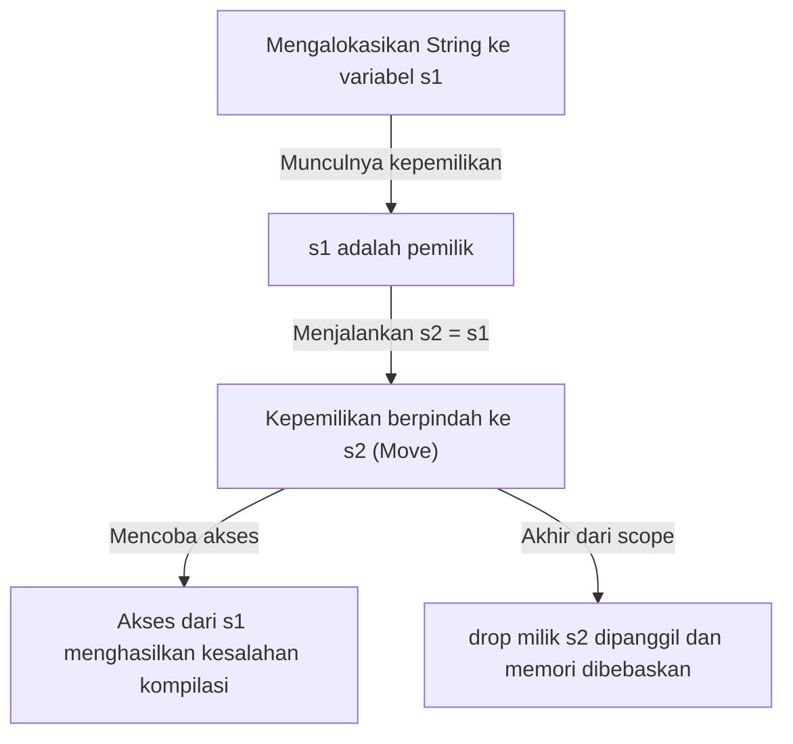
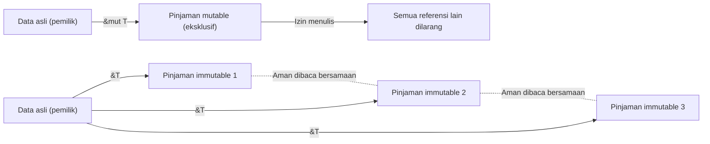

## Pendahuluan: Mengapa Rust "Aman"?

Dalam sejarah bahasa pemrograman, "performa" dan "keamanan" telah lama dianggap memiliki hubungan tarik-ulur (trade-off). Bahasa pemrograman sistem seperti C dan C++ menawarkan performa luar biasa yang memaksimalkan potensi perangkat keras, tetapi sebagai gantinya, mereka menyerahkan tanggung jawab manajemen memori kepada programmer. Manajemen memori manual (`malloc` / `free` dan `new` / `delete`) telah menjadi sarang bagi bug serius dan kerentanan keamanan seperti *dangling pointer*, pembebasan ganda (Double Free), *buffer overflow*, dan kebocoran memori (*memory leak*).

Di sisi lain, bahasa tingkat tinggi seperti Java, C#, Python, dan Ruby menyembunyikan kompleksitas manajemen memori ini dari programmer dengan memperkenalkan *Garbage Collection* (GC). GC secara otomatis mengumpulkan memori yang tidak lagi dibutuhkan secara berkala, yang secara dramatis meningkatkan keamanan memori. Namun, eksekusi GC datang dengan beban waktu berjalan (*runtime overhead*), dan waktu henti yang tidak dapat diprediksi (Stop-the-World) menjadi masalah, terutama dalam sistem yang membutuhkan waktu nyata (*real-time*) dan lingkungan dengan batasan sumber daya yang ketat.

**Rust**-lah yang memecahkan dilema ini dan membawa pergeseran paradigma ke dunia pemrograman sistem. Melalui konsep uniknya yaitu "Kepemilikan (Ownership)" dan analisis statis yang ketat dari kompilernya, Rust **menjamin keamanan memori tanpa memiliki *garbage collector***. Desain ini, yang mencapai pemrosesan konkuren yang aman (abstraksi tanpa biaya atau *zero-cost abstraction*) tanpa beban *runtime*, dapat dikatakan sebagai sebuah seni.

Dalam artikel ini, kita akan menggali sedalam mungkin inti dari "keamanan" dan "model kepemilikan" Rust, mulai dari filosofinya hingga mekanisme konkretnya.

## 3 Pendekatan Manajemen Memori

Untuk memahami keunikan Rust, mari kita mulai dengan menguraikan pendekatan utama pada manajemen memori dalam bahasa pemrograman.

1. **Manajemen Memori Manual (Manual Memory Management)**
   - Bahasa Representatif: C, C++
   - Karakteristik: Pengembang secara eksplisit mengalokasikan dan membebaskan memori.
   - Keuntungan: *Overhead* saat dijalankan nol. Performa tertinggi.
   - Kekurangan: Kesalahan manusia tidak bisa dihindari, dan pada dasarnya tidak memiliki keamanan memori.

2. **Garbage Collection (Pengumpulan Sampah)**
   - Bahasa Representatif: Java, C#, Go, Python
   - Karakteristik: *Runtime* memonitor bagaimana memori digunakan dan secara otomatis memulihkan memori yang tidak lagi dibutuhkan.
   - Keuntungan: Keamanan memori tinggi, dan beban pengembang sangat berkurang.
   - Kekurangan: Penurunan performa karena eksekusi siklus GC dan peningkatan penggunaan memori.

3. **Kepemilikan dan Peminjaman (Ownership and Borrowing)**
   - Bahasa Representatif: Rust
   - Karakteristik: Kompiler menghitung *lifetime* memori pada saat kompilasi dan secara otomatis menyisipkan proses pembebasan yang diperlukan.
   - Keuntungan: Mencapai keamanan memori tanpa GC dan memberikan performa setara dengan C/C++.
   - Kekurangan: Kurva pembelajaran yang curam dan perlunya bertarung dengan "*Borrow Checker*".

Kompiler Rust ibarat membuktikan secara matematis bahwa tidak ada perilaku terkait memori yang tidak terdefinisi (kecuali untuk blok kode *unsafe*) yang akan terjadi setelah kode lolos kompilasi.

## 3 Prinsip Utama Kepemilikan (Ownership)

Sistem kepemilikan Rust dibangun hanya di atas tiga aturan sederhana. Ketiga aturan ini menjadi fondasi bagi semua keamanan memori.

1. **Setiap nilai di Rust memiliki variabel yang disebut "pemilik (owner)".**
2. **Hanya boleh ada satu pemilik pada satu waktu.**
3. **Ketika pemilik keluar dari ruang lingkup (*scope*), nilainya akan dibuang (*dropped*).**

### Aturan 1 dan 3: Ruang Lingkup dan Pembebasan Memori (Drop)

Rentang valid (*scope*) dari sebuah variabel di Rust didefinisikan oleh blok `{}`. Ketika sebuah variabel keluar dari *scope*, Rust secara otomatis memanggil fungsi khusus bernama `drop` dan membebaskan ruang memori yang ditempati oleh nilai tersebut. Perilaku ini mirip dengan pola RAII (Resource Acquisition Is Initialization) di C++, tetapi di Rust hal ini diterapkan secara menyeluruh sebagai fitur inti bahasa.

```rust
{
    let s = String::from("hello"); // s valid mulai dari sini
    // pemrosesan menggunakan s
} // di sini s keluar dari scope, dan memori secara otomatis dibebaskan (fungsi drop dipanggil)
```

Dengan mekanisme ini, programmer tidak perlu khawatir lupa memanggil `free()` secara manual dan menyebabkan kebocoran memori.

### Aturan 2: Pemilik Tunggal dan Semantik Pemindahan (Move)

Perbedaan krusial antara banyak bahasa lain dan Rust adalah Aturan 2, "Hanya boleh ada satu pemilik pada satu waktu."

Penugasan untuk tipe data sederhana yang disimpan di *stack* (seperti bilangan bulat dan boolean, tipe yang mengimplementasikan *trait* `Copy`) menghasilkan penyalinan nilai, tetapi penugasan untuk tipe yang mengalokasikan data di *heap* (seperti `String` atau `Vec`) menghasilkan **"perpindahan kepemilikan (Move)"**.

```rust
let s1 = String::from("hello");
let s2 = s1; // di sini kepemilikan berpindah dari s1 ke s2

// println!("{}, world!", s1); // Kesalahan kompilasi! s1 tidak lagi valid
```

Mengapa pemindahan terjadi? Jika `s1` dan `s2` menunjuk ke ruang memori yang sama di *heap*, dan keduanya mencoba membebaskannya ketika mereka keluar dari *scope*, *bug* **pembebasan ganda (Double Free)** akan terjadi. Rust menjamin keamanan dengan mencegah terjadinya keadaan tersebut sejak awal dengan membatalkan variabel lama `s1` pada saat penugasan.

Mari visualisasikan pergerakan kepemilikan dengan diagram Mermaid di bawah ini.



## Peminjaman (Borrowing): Mengakses Data tanpa Mentransfer Kepemilikan

Meskipun aturan kepemilikan sangat ketat dan aman, akan sangat tidak nyaman jika "setiap kali sebuah nilai diberikan ke sebuah fungsi, kepemilikannya berpindah dan nilai tersebut tidak dapat digunakan lagi." Oleh karena itu, ada konsep **"Referensi (References)"** dan **"Peminjaman (Borrowing)"** di Rust.

Dengan menggunakan referensi, Anda dapat mengakses suatu nilai tanpa merampas kepemilikannya. Ini disebut "peminjaman".

```rust
fn calculate_length(s: &String) -> usize { // s adalah referensi ke String
    s.len()
} // di sini s keluar dari scope, tetapi karena tidak memiliki kepemilikan, tidak terjadi apa-apa

let s1 = String::from("hello");
let len = calculate_length(&s1); // Kepemilikan tetap pada s1, hanya melewatkan referensi
println!("The length of '{}' is {}.", s1, len); // s1 masih bisa digunakan
```

### Aturan Peminjaman dan Pencegahan Data Race (Perlombaan Data)

Peminjaman juga memiliki aturan yang ketat.

1. Pada waktu tertentu, Anda bisa memiliki salah satu dari **satu referensi *mutable* (`&mut T`)**, atau **banyak referensi *immutable* (`&T`)** (Anda tidak bisa memiliki keduanya secara bersamaan).
2. Referensi harus selalu valid (larangan *dangling pointer*).

Aturan ini dirancang untuk sepenuhnya menghilangkan **perlombaan data (*Data Race*)** dalam pemrosesan konkuren pada saat kompilasi. Perlombaan data terjadi ketika tiga kondisi berikut terpenuhi:

- Dua atau lebih pointer mengakses data yang sama pada saat yang bersamaan.
- Setidaknya satu pointer digunakan untuk menulis ke data tersebut.
- Tidak ada mekanisme untuk menyinkronkan akses ke data tersebut.

Aturan peminjaman Rust justru melarang kondisi ini di tingkat kompilasi. Rust memaksakan kontrol eksklusif (*Readers-Writer lock*) pada saat kompilasi, bukan pada saat *runtime*: "Berapa pun orang dapat membaca secara bersamaan asalkan hanya untuk membaca (referensi *immutable* jamak)" dan "Saat menulis, tidak ada yang bisa membaca dan hanya satu yang bisa menulis (referensi *mutable* tunggal)."



## Lifetime: Membuktikan Validitas Referensi

Aturan peminjaman yang lain, "referensi harus selalu valid," diwujudkan oleh konsep **Lifetime (Waktu Hidup)**.

Dalam bahasa C, sangat mudah untuk membuat *dangling pointer* yang menunjuk ke ruang memori yang tidak valid dengan mengembalikan *pointer* ke variabel lokal fungsi.

*Borrow Checker* Rust melacak dan membandingkan *lifetime* (ruang lingkup di mana referensi tersebut valid) dari semua referensi. Rust memastikan bahwa *lifetime* dari referensi tidak bertahan lebih lama dari *lifetime* data yang dirujuk.

```rust
let r;
{
    let x = 5;
    r = &x; // Error! lifetime x terlalu pendek
} // x dibuang di sini
// println!("r: {}", r); // mencoba menggunakan r di sini akan menghasilkan dangling pointer
```

Kode di atas akan ditolak tanpa ampun oleh kompiler Rust. Sering kali, kompiler memungkinkan Anda menghilangkan deskripsi eksplisit melalui Inferensi *Lifetime* (*Lifetime Elision*), tetapi dalam struktur (*struct*) atau fungsi yang kompleks, pengembang perlu menambahkan anotasi *lifetime* (misalnya: `'a`) untuk memberi tahu kompiler tentang hubungan antar referensi.

*Lifetime* mungkin terasa sulit pada awalnya, tetapi ini adalah bentuk pamungkas dari ekspresi "kapan dan di mana memori dialokasikan, dan kapan dimusnahkan" sebagai sistem tipe (*type system*) dari sebuah program.

## Thread-Safe dan Pemrosesan Konkuren: Konkurensi Tanpa Rasa Takut (Fearless Concurrency)

Konsep inti dari Rust, seperti Kepemilikan, Peminjaman, dan *Lifetime*, tidak hanya membuat program dengan satu *thread* (*single-thread*) menjadi aman, tetapi juga membuat pemrosesan konkuren di lingkungan multi-*thread* menjadi sangat aman.

Seperti yang disebutkan sebelumnya, aturan eksklusif untuk referensi *mutable* dan *immutable* mencegah perlombaan data. Lebih jauh, Rust menggunakan *marker trait* `Send` dan `Sync` untuk menjamin keamanan transfer dan pembagian data antar *thread*.

- **`Send`**: Menandakan bahwa kepemilikan suatu tipe dapat dipindahkan secara aman ke *thread* lain.
- **`Sync`**: Menandakan bahwa referensi ke suatu tipe secara bersamaan dari berbagai *thread* aman dilakukan.

Sebagai contoh, penghitung referensi (*reference counter*) `Rc<T>` yang tidak *thread-safe* tidak mengimplementasikan `Send` maupun `Sync`, sehingga mencoba menggunakannya secara tidak sengaja di lingkungan multi-*thread* akan menghasilkan kesalahan kompilasi. Sebagai gantinya, menggabungkan penghitung referensi atomik `Arc<T>` dan kontrol eksklusif `Mutex<T>` barulah akan memungkinkan kode untuk dikompilasi.

Bukan "menyadari bug saat *runtime*", melainkan "bahkan tidak akan dikompilasi jika tidak aman". Inilah nilai sesungguhnya dari **"Konkurensi Tanpa Rasa Takut (Fearless Concurrency)"** yang dipromosikan oleh Rust.

## Kesimpulan: Kepemilikan sebagai Sebuah Paradigma

Sistem kepemilikan Rust bukan sekadar fitur, melainkan paradigma mendasar dalam desain program. Sistem ini memaksa kita untuk menghadapi pertanyaan penting pada tahap penulisan kode: "Siapa yang memiliki data ini?", "Berapa lama data ini valid?", dan "Kapan data ini ditulis ulang?".

Memang, waktu yang dihabiskan untuk bertarung dengan *Borrow Checker* mungkin terasa menyakitkan. Akan tetapi, kesalahan (*error*) kompiler adalah suara paling terpercaya dari mitra yang melindungi kita dari *bug* fatal yang bisa terjadi di lingkungan produksi, kondisi perlombaan (*race conditions*) yang sulit direproduksi, dan celah keamanan yang bisa dieksploitasi.

Rust secara brilian menggabungkan kinerja tinggi dari manajemen memori manual dengan keamanan bahasa bersistem GC. Dengan memahami filosofi yang dalam dan desain yang cermat di baliknya, kita akan dapat membangun dunia perangkat lunak yang lebih kuat, cepat, dan andal.
