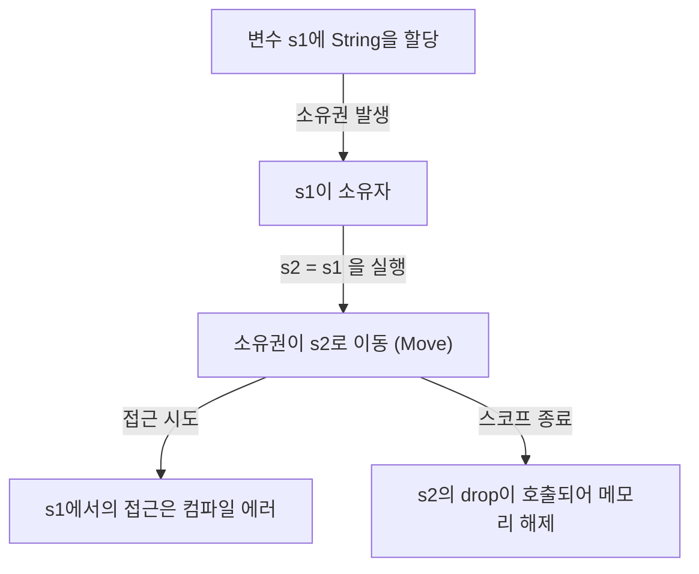
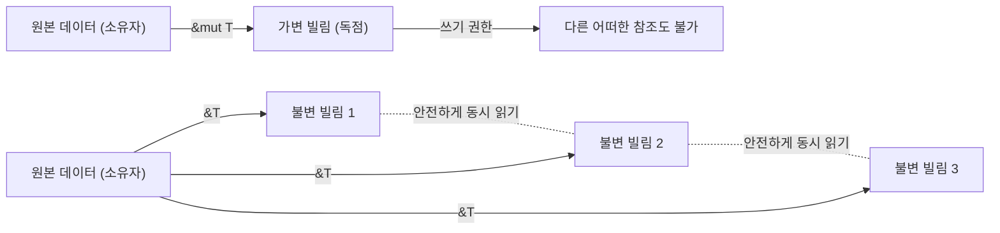

## 들어가며: 왜 Rust는 "안전"한가?

프로그래밍 언어의 역사에서 "퍼포먼스"와 "안전성"은 오랫동안 트레이드오프 관계에 있다고 여겨져 왔습니다. C나 C++ 같은 시스템 프로그래밍 언어는 하드웨어의 능력을 최대한으로 끌어내는 경이로운 퍼포먼스를 제공하지만, 그 대가로 메모리 관리의 책임을 프로그래머에게 맡깁니다. 수동 메모리 관리(`malloc` / `free` 나 `new` / `delete`)는 댕글링 포인터, 이중 해제(Double Free), 버퍼 오버플로우, 메모리 누수와 같은 심각한 버그나 보안 취약점의 온상이 되어 왔습니다.

한편, Java나 C#, Python, Ruby와 같은 고수준 언어는 가비지 컬렉션(Garbage Collection, GC)을 도입함으로써 이러한 메모리 관리의 복잡성을 프로그래머로부터 은폐했습니다. GC는 불필요해진 메모리를 주기적으로 자동 회수하여 메모리 안전성을 비약적으로 높입니다. 그러나 GC 실행에는 런타임 오버헤드가 따르며, 특히 실시간성이 요구되는 시스템이나 리소스 제약이 심한 환경에서는 예측 불가능한 정지 시간(Stop-the-World)이 문제가 됩니다.

이러한 딜레마를 타파하고 시스템 프로그래밍의 세계에 패러다임 전환을 가져온 것이 **Rust**입니다. Rust는 "소유권(Ownership)"이라는 독자적인 개념과 컴파일러의 엄격한 정적 분석을 통해, **가비지 컬렉터를 가지지 않고도 메모리 안전성을 보장**합니다. 런타임 오버헤드 없이 안전한 동시성 처리(제로 코스트 추상화)를 실현하는 이 설계는 그야말로 예술적이라고 할 수 있습니다.

본 기사에서는 Rust의 핵심인 "안전성"과 "소유권 모델"에 대해, 그 철학부터 구체적인 메커니즘까지 끝없이 깊이 파고들어 보겠습니다.

## 메모리 관리의 3가지 접근 방식

Rust의 독자성을 이해하기 위해, 먼저 프로그래밍 언어에 있어서 메모리 관리의 주요 접근 방식을 정리해 봅시다.

1. **수동 메모리 관리 (Manual Memory Management)**
   - 대표 언어: C, C++
   - 특징: 개발자가 명시적으로 메모리 할당과 해제를 수행합니다.
   - 장점: 실행 시 오버헤드가 제로. 궁극의 퍼포먼스.
   - 단점: 휴먼 에러가 불가피하며, 메모리 안전성이 근본적으로 결여되어 있음.

2. **가비지 컬렉션 (Garbage Collection)**
   - 대표 언어: Java, C#, Go, Python
   - 특징: 런타임이 메모리 사용 방식을 감시하고, 불필요해진 메모리를 자동으로 회수합니다.
   - 장점: 메모리 안전성이 높고, 개발자의 부담이 대폭 경감됨.
   - 단점: GC 사이클 실행에 따른 퍼포먼스 저하와 메모리 사용량 증가.

3. **소유권과 빌림 (Ownership and Borrowing)**
   - 대표 언어: Rust
   - 특징: 컴파일러가 컴파일 시에 메모리의 라이프타임을 계산하고, 필요한 해제 처리를 자동으로 삽입합니다.
   - 장점: GC 없이 메모리 안전성을 달성하고, C/C++와 동등한 퍼포먼스를 발휘함.
   - 단점: 학습 곡선이 가파르고, "빌림 검사기(Borrow Checker)"와의 싸움이 필요함.

Rust 컴파일러는 코드가 컴파일을 통과한 시점에서 메모리 관련 미정의 동작이 발생하지 않는다는 것을 (언세이프한 코드 블록을 제외하고) 수학적으로 증명하는 것과 같습니다.

## 소유권 (Ownership)의 3대 원칙

Rust의 소유권 시스템은 단 3가지의 간단한 규칙 위에 구축되어 있습니다. 이 3가지 규칙이 모든 메모리 안전성의 기초가 됩니다.

1. **Rust의 각 값은 "소유자(owner)"라고 불리는 변수를 가진다.**
2. **어느 때든 소유자는 단 하나뿐이다.**
3. **소유자가 스코프를 벗어나면 값은 파기된다.**

### 규칙 1과 3: 스코프와 메모리 해제 (Drop)

Rust에서 변수의 유효 범위(스코프)는 블록 `{}` 에 의해 정의됩니다. 변수가 스코프를 빠져나갈 때, Rust는 자동으로 특별한 함수 `drop`을 호출하여, 그 값이 점유하고 있던 메모리 영역을 해제합니다. 이 동작은 C++의 RAII(Resource Acquisition Is Initialization) 패턴과 비슷하지만, Rust에서는 이것이 언어의 핵심 기능으로서 철저히 지켜집니다.

```rust
{
    let s = String::from("hello"); // s는 여기서부터 유효
    // s를 사용한 처리
} // 여기서 s가 스코프를 벗어나고, 메모리가 자동으로 해제됨 (drop 함수가 호출됨)
```

이 메커니즘을 통해 프로그래머가 수동으로 `free()`를 호출하는 것을 잊어 메모리 누수가 발생할 걱정이 없습니다.

### 규칙 2: 단일 소유자와 무브 시맨틱스 (Move)

다른 많은 언어와 Rust의 결정적인 차이가 바로 "어느 때든 소유자는 단 하나뿐이다"라는 규칙 2입니다.

스택에 저장되는 단순한 데이터 타입(정수나 불리언 등, `Copy` 트레이트를 구현하고 있는 타입)의 대입은 값의 복사가 되지만, 힙에 데이터를 할당하는 타입(`String`이나 `Vec` 등)의 대입은 **"소유권의 이동(무브)"**이 됩니다.

```rust
let s1 = String::from("hello");
let s2 = s1; // 여기서 소유권이 s1에서 s2로 이동함

// println!("{}, world!", s1); // 컴파일 에러! s1은 더 이상 유효하지 않음
```

왜 무브가 발생할까요? 만약 `s1`과 `s2`가 같은 힙 상의 메모리 영역을 가리키고 있고, 양쪽 모두 스코프를 빠져나갔을 때 각각 해제를 시도한다면, **이중 해제(Double Free)** 버그가 발생하게 됩니다. Rust는 애초에 그러한 상태를 만들어내는 것을 허용하지 않으며, 대입 시점에 이전 변수 `s1`을 무효화함으로써 안전성을 담보하는 것입니다.

다음의 Mermaid 다이어그램에서 소유권의 움직임을 시각화해 보겠습니다.



## 빌림 (Borrowing): 소유권을 넘기지 않고 데이터에 접근하기

소유권의 규칙은 엄격하고 안전하지만, "함수에 값을 넘길 때마다 소유권이 이동하여 두 번 다시 사용할 수 없게 된다"면 불편하기 짝이 없습니다. 그래서 Rust에는 **"참조(References)"**와 **"빌림(Borrowing)"**이라는 개념이 존재합니다.

참조를 사용함으로써 소유권을 빼앗지 않고 값에 접근할 수 있습니다. 이것을 "빌림"이라고 부릅니다.

```rust
fn calculate_length(s: &String) -> usize { // s는 String에 대한 참조
    s.len()
} // 여기서 s는 스코프를 벗어나지만, 소유권은 가지고 있지 않으므로 아무 일도 일어나지 않음

let s1 = String::from("hello");
let len = calculate_length(&s1); // 소유권은 s1에 그대로 둔 채, 참조만을 넘김
println!("The length of '{}' is {}.", s1, len); // s1은 아직 사용할 수 있음
```

### 빌림의 규칙과 데이터 경합 방지

빌림에도 엄격한 규칙이 존재합니다.

1. 임의의 타이밍에, **하나의 가변 참조(`&mut T`)** 또는 **여러 개의 불변 참조(`&T`)** 중 하나만을 가질 수 있다(양쪽을 동시에 가질 수는 없다).
2. 참조는 항상 유효해야 한다(댕글링 포인터의 금지).

이 규칙은 동시성 처리에서의 **데이터 경합(Data Race)**을 컴파일 시에 완전히 배제하기 위한 것입니다. 데이터 경합은 다음 3가지 조건이 갖춰졌을 때 발생합니다.

- 2개 이상의 포인터가 동시에 같은 데이터에 접근한다.
- 최소 1개의 포인터가 데이터 쓰기에 사용된다.
- 데이터에 대한 접근을 동기화하는 메커니즘이 존재하지 않는다.

Rust의 빌림 규칙은 바로 이 상태를 컴파일 수준에서 금지하고 있습니다. "읽기만 한다면 몇 명이라도 동시에 읽을 수 있다(여러 개의 불변 참조)"와 "쓸 때는 아무도 읽을 수 없고, 쓸 수 있는 것은 한 명뿐이다(단일 가변 참조)"라는 배타 제어(Readers-Writer 잠금)를 런타임이 아닌 컴파일 시에 강제하고 있는 것입니다.



## 라이프타임 (Lifetimes): 참조의 유효성을 증명하기

빌림의 또 다른 규칙인 "참조는 항상 유효해야 한다"를 실현하는 것이 **라이프타임(Lifetimes)**이라는 개념입니다.

C 언어에서는 함수 로컬 변수의 포인터를 반환해 버림으로써 무효한 메모리 영역을 가리키는 댕글링 포인터가 쉽게 만들어질 수 있습니다.

Rust의 빌림 검사기는 모든 참조의 라이프타임(참조가 유효한 스코프)을 추적하고 비교합니다. 참조의 라이프타임이 참조 대상 데이터의 라이프타임보다 길어지지 않는지 확인하는 것입니다.

```rust
let r;
{
    let x = 5;
    r = &x; // 에러! x의 라이프타임이 너무 짧음
} // x는 여기서 파기됨
// println!("r: {}", r); // 여기서 r을 사용하려고 하면 댕글링 포인터가 됨
```

위의 코드는 Rust 컴파일러에 의해 가차 없이 차단됩니다. 대부분의 경우 컴파일러는 라이프타임 생략(Lifetime Elision) 규칙에 따라 명시적인 작성을 생략하게 해주지만, 복잡한 구조체나 함수에서는 개발자가 라이프타임 어노테이션(예: `'a`)을 부여하여 참조 간의 관계성을 컴파일러에게 알려주어야 합니다.

라이프타임은 처음에는 난해하게 느껴지지만, "메모리가 언제 어디서 할당되고, 언제 파기되는가"를 프로그램의 타입 시스템으로 표현한 궁극의 형태입니다.

## 스레드 안전성과 동시성 처리: 두려움 없는 동시성 (Fearless Concurrency)

소유권, 빌림, 라이프타임과 같은 Rust의 핵심 개념은 단일 스레드 프로그램을 안전하게 만들 뿐만 아니라 멀티스레드 환경에서의 동시성 처리도 경이롭게 안전하게 만듭니다.

앞서 언급했듯이 가변 참조와 불변 참조의 배타 규칙은 데이터 경합을 방지합니다. 게다가 Rust는 `Send`와 `Sync`라는 마커 트레이트를 사용하여 스레드 간의 데이터 전송과 공유의 안전성을 보장합니다.

- **`Send`**: 타입의 소유권을 다른 스레드로 안전하게 이동시킬 수 있음을 나타냅니다.
- **`Sync`**: 여러 스레드에서 동시에 참조되어도 안전함을 나타냅니다.

예를 들어, 스레드에 안전하지 않은 참조 카운터 `Rc<T>`는 `Send`도 `Sync`도 구현하고 있지 않기 때문에, 멀티스레드 환경에서 잘못 사용하려고 하면 컴파일 에러가 발생합니다. 대신 원자적 참조 카운터 `Arc<T>`와 배타 제어 `Mutex<T>`를 조합함으로써 비로소 컴파일을 통과하게 됩니다.

"실행 시에 버그를 알아차린다"가 아니라, "안전하지 않으면 컴파일조차 되지 않는다". 이것이야말로 Rust가 내세우는 **"두려움 없는 동시성(Fearless Concurrency)"**의 진면목입니다.

## 결론: 패러다임으로서의 소유권

Rust의 소유권 시스템은 단순한 기능이 아니라 프로그램 설계의 근본적인 패러다임입니다. 그것은 우리에게 "누가 이 데이터를 소유하고 있는가?", "데이터는 언제까지 유효한가?", "언제 변경되는가?"와 같은 중요한 질문을 코드 작성 단계에서 던집니다.

확실히 빌림 검사기와 씨름하는 시간은 고통스럽게 느껴질 수 있습니다. 그러나 컴파일러의 에러는 운영 환경에서 발생할 수 있는 치명적인 버그, 재현성이 낮은 경합 상태, 악용될 가능성이 있는 보안 취약점으로부터 우리를 보호하기 위한, 가장 신뢰할 수 있는 파트너의 목소리입니다.

수동 메모리 관리의 고성능과 GC 언어의 안전성을 고차원으로 융합시킨 Rust. 그 이면에 있는 깊은 철학과 치밀한 설계를 이해함으로써, 우리는 보다 견고하고 빠르며 신뢰성 높은 소프트웨어의 세계를 구축해 나갈 수 있을 것입니다.
