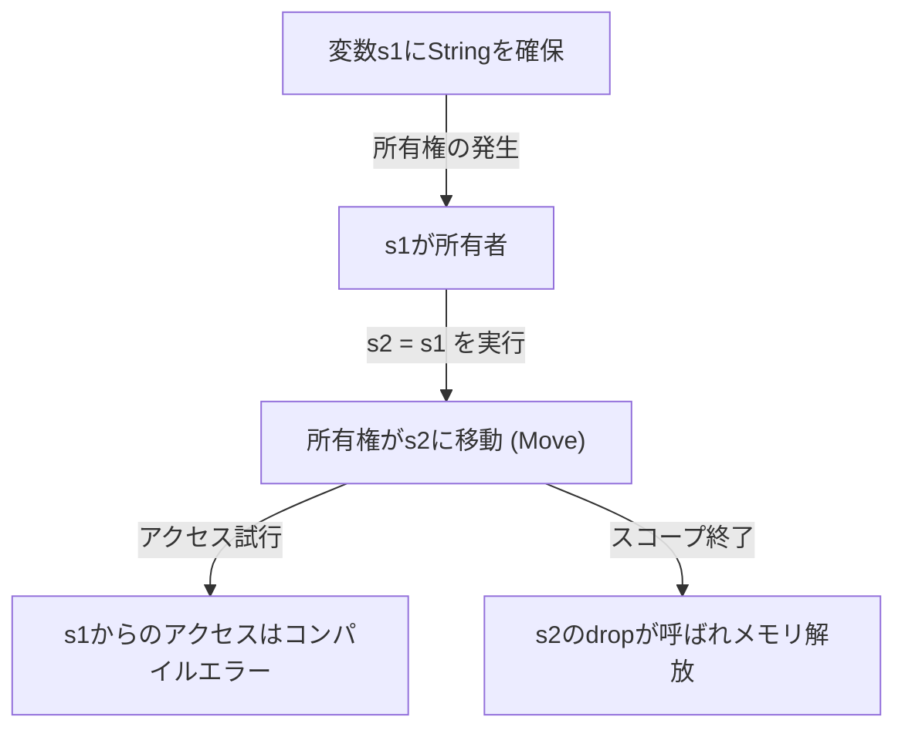
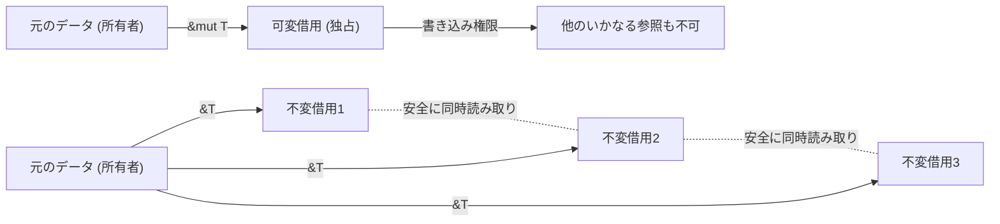

## はじめに：なぜRustは「安全」なのか？

プログラミング言語の歴史において、「パフォーマンス」と「安全性」は長らくトレードオフの関係にあると考えられてきました。CやC++のようなシステムプログラミング言語は、ハードウェアの能力を最大限に引き出す驚異的なパフォーマンスを提供しますが、その代償としてメモリ管理の責任をプログラマに委ねます。手動でのメモリ管理（`malloc` / `free` や `new` / `delete`）は、ダングリングポインタ、二重解放（Double Free）、バッファオーバーフロー、メモリリークといった深刻なバグやセキュリティ脆弱性の温床となってきました。

一方で、JavaやC#、Python、Rubyのような高水準言語は、ガベージコレクション（Garbage Collection, GC）を導入することで、これらのメモリ管理の複雑さをプログラマから隠蔽しました。GCは不要になったメモリを定期的に自動で回収し、メモリ安全性を飛躍的に高めます。しかし、GCの実行にはランタイムオーバーヘッドが伴い、特にリアルタイム性が求められるシステムやリソース制約の厳しい環境では、予測不可能な停止時間（Stop-the-World）が問題となります。

このジレンマを打ち破り、システムプログラミングの世界にパラダイムシフトをもたらしたのが **Rust** です。Rustは、「所有権（Ownership）」という独自の概念とコンパイラの厳格な静的解析によって、**ガベージコレクタを持たずにメモリ安全性を保証** します。ランタイムのオーバーヘッドなしに安全な並行処理（ゼロコスト抽象化）を実現するこの設計は、まさに芸術的とさえ言えるでしょう。

本記事では、Rustの核心である「安全性」と「所有権モデル」について、その哲学から具体的なメカニズムまで、どこまでも深く掘り下げていきます。

## メモリ管理の3つのアプローチ

Rustの独自性を理解するために、まずはプログラミング言語におけるメモリ管理の主なアプローチを整理しましょう。

1. **手動メモリ管理 (Manual Memory Management)**
   - 代表言語: C, C++
   - 特徴: 開発者が明示的にメモリの確保と解放を行います。
   - 利点: 実行時のオーバーヘッドがゼロ。究極のパフォーマンス。
   - 欠点: ヒューマンエラーが不可避であり、メモリ安全性が根本的に欠如している。

2. **ガベージコレクション (Garbage Collection)**
   - 代表言語: Java, C#, Go, Python
   - 特徴: ランタイムがメモリの使われ方を監視し、不要になったメモリを自動で回収します。
   - 利点: メモリ安全性が高く、開発者の負担が大幅に軽減される。
   - 欠点: GCサイクルの実行によるパフォーマンスの低下と、メモリ使用量の増加。

3. **所有権と借用 (Ownership and Borrowing)**
   - 代表言語: Rust
   - 特徴: コンパイラがコンパイル時にメモリのライフタイムを計算し、必要な解放処理を自動で挿入します。
   - 利点: GCなしでメモリ安全性を達成し、C/C++と同等のパフォーマンスを発揮する。
   - 欠点: 学習曲線が急峻であり、「ボローチェッカー（Borrow Checker）」との戦いが必要。

Rustのコンパイラは、コードがコンパイルを通過した時点で、メモリ関連の未定義動作が発生しないことを（アンセーフなコードブロックを除いて）数学的に証明しているようなものです。

## 所有権 (Ownership) の3大原則

Rustの所有権システムは、たった3つのシンプルなルールの上に構築されています。この3つのルールが、あらゆるメモリ安全性の基礎となります。

1. **Rustの各値は、「所有者（owner）」と呼ばれる変数を持つ。**
2. **いかなる時も所有者は一つである。**
3. **所有者がスコープから外れると、値は破棄される。**

### ルール1と3：スコープとメモリ解放 (Drop)

Rustにおける変数の有効範囲（スコープ）は、ブロック `{}` によって定義されます。変数がスコープを抜けるとき、Rustは自動的に特別な関数 `drop` を呼び出し、その値が占有していたメモリ領域を解放します。この挙動はC++のRAII（Resource Acquisition Is Initialization）パターンに似ていますが、Rustではこれが言語のコア機能として徹底されています。

```rust
{
    let s = String::from("hello"); // sはここから有効
    // sを使った処理
} // ここでsがスコープを抜け、メモリが自動的に解放される (drop関数が呼ばれる)
```

この仕組みにより、プログラマが手動で `free()` を呼び忘れてメモリリークを起こす心配はありません。

### ルール2：単一の所有者とムーブセマンティクス (Move)

他の多くの言語とRustの決定的な違いが、「いかなる時も所有者は一つである」というルール2です。

スタック上に保存される単純なデータ型（整数やブーリアンなど、`Copy`トレイトを実装している型）の代入は値のコピーになりますが、ヒープ上にデータを確保する型（`String`や`Vec`など）の代入は、**「所有権の移動（ムーブ）」** となります。

```rust
let s1 = String::from("hello");
let s2 = s1; // ここで所有権がs1からs2へ移動する

// println!("{}, world!", s1); // コンパイルエラー！s1はもう有効ではない
```

なぜムーブが起きるのでしょうか？ もし `s1` と `s2` が同じヒープ上のメモリ領域を指していて、両方がスコープを抜けた時にそれぞれ解放を試みた場合、**二重解放（Double Free）** のバグが発生してしまいます。Rustはそもそもそのような状態を作り出すことを許さず、代入の時点で古い変数 `s1` を無効化することで安全性を担保しているのです。

以下のMermaid図で、所有権の動きを視覚化してみましょう。



## 借用 (Borrowing)：所有権を渡さずにデータにアクセスする

所有権のルールは厳密で安全ですが、「関数に値を渡すたびに所有権が移動し、二度と使えなくなる」のでは不便極まりありません。そこでRustには**「参照（References）」**と**「借用（Borrowing）」**という概念が存在します。

参照を用いることで、所有権を奪うことなく値にアクセスすることができます。これを「借用」と呼びます。

```rust
fn calculate_length(s: &String) -> usize { // sはStringへの参照
    s.len()
} // ここでsはスコープを抜けるが、所有権は持っていないので何も起こらない

let s1 = String::from("hello");
let len = calculate_length(&s1); // 所有権はs1のまま、参照だけを渡す
println!("The length of '{}' is {}.", s1, len); // s1はまだ使える
```

### 借用のルールとデータ競合の防止

借用にも厳格なルールが存在します。

1. 任意のタイミングにおいて、**一つの可変参照（`&mut T`）**、または**複数の不変参照（`&T`）**のいずれかを持つことができる（両方を同時に持つことはできない）。
2. 参照は常に有効でなければならない（ダングリングポインタの禁止）。

このルールは、並行処理における**データ競合（Data Race）**をコンパイル時に完全に排除するためのものです。データ競合は、以下の3つの条件が揃った時に発生します。

- 2つ以上のポインタが同時に同じデータにアクセスする。
- 少なくとも1つのポインタがデータへの書き込みに使用される。
- データへのアクセスを同期するメカニズムが存在しない。

Rustの借用ルールは、まさにこの状態をコンパイルレベルで禁止しています。「読むだけなら何人でも同時に読める（複数の不変参照）」「書くときは誰も読めず、書けるのは一人だけ（単一の可変参照）」という排他制御（Readers-Writerロック）を、実行時ではなくコンパイル時に強制しているのです。



## ライフタイム (Lifetimes)：参照の有効性を証明する

借用のもう一つのルール「参照は常に有効でなければならない」を実現するのが、**ライフタイム（Lifetimes）**という概念です。

C言語では、関数ローカルな変数のポインタを返してしまうことで、無効なメモリ領域を指すダングリングポインタが容易に作れてしまいます。

Rustのボローチェッカーは、すべての参照のライフタイム（参照が有効であるスコープ）を追跡し比較します。参照のライフタイムが、参照先のデータのライフタイムよりも長くならないことを確認するのです。

```rust
let r;
{
    let x = 5;
    r = &x; // エラー！ xのライフタイムが短すぎる
} // xはここで破棄される
// println!("r: {}", r); // ここでrを使おうとするとダングリングポインタになる
```

上記のコードは、Rustコンパイラによって容赦なく弾かれます。多くの場合、コンパイラはライフタイム推論（Lifetime Elision）によって明示的な記述を省略させてくれますが、複雑な構造体や関数では、開発者がライフタイム注釈（例：`'a`）を付与して、参照間の関係性をコンパイラに教える必要があります。

ライフタイムは最初は難解に感じられますが、「メモリがいつどこで確保され、いつ破棄されるか」をプログラムの型システムとして表現した究極の形態です。

## スレッドセーフと並行処理：恐れなき並行性 (Fearless Concurrency)

所有権、借用、ライフタイムといったRustの中核概念は、単一スレッドのプログラムを安全にするだけでなく、マルチスレッド環境における並行処理をも驚異的に安全にします。

前述の通り、可変参照と不変参照の排他ルールは、データ競合を防ぎます。さらにRustは `Send` と `Sync` というマーカートレイトを用いて、スレッド間のデータ転送と共有の安全性を保証します。

- **`Send`**: 型の所有権を別のスレッドに安全に移動できることを示します。
- **`Sync`**: 複数のスレッドから同時に参照されても安全であることを示します。

例えば、スレッドセーフでない参照カウンタ `Rc<T>` は `Send` も `Sync` も実装していないため、マルチスレッド環境で誤って使おうとするとコンパイルエラーになります。代わりにアトミックな参照カウンタ `Arc<T>` と排他制御 `Mutex<T>` を組み合わせることで、初めてコンパイルが通るのです。

「実行時にバグに気づく」のではなく、「安全でなければコンパイルすらできない」。これこそが、Rustの掲げる**「恐れなき並行性（Fearless Concurrency）」**の真骨頂です。

## 結論：パラダイムとしての所有権

Rustの所有権システムは、単なる機能ではなく、プログラム設計の根本的なパラダイムです。それは我々に、「誰がこのデータを所有しているのか？」「データはいつまで有効なのか？」「いつ書き換えられるのか？」といった重要な問いを、コードを書く段階で突きつけます。

確かに、ボローチェッカーと格闘する時間は苦痛に感じられるかもしれません。しかし、コンパイラのエラーは、本番環境で発生しうる致命的なバグ、再現性の低い競合状態、悪用される可能性のあるセキュリティホールから私たちを守るための、最も信頼できるパートナーの声なのです。

手動メモリ管理のハイパフォーマンスと、GC言語の安全性を高次元で融合させたRust。その背後にある深い哲学と緻密な設計を理解することで、私たちはより堅牢で、速く、信頼性の高いソフトウェアの世界を築いていくことができるでしょう。
