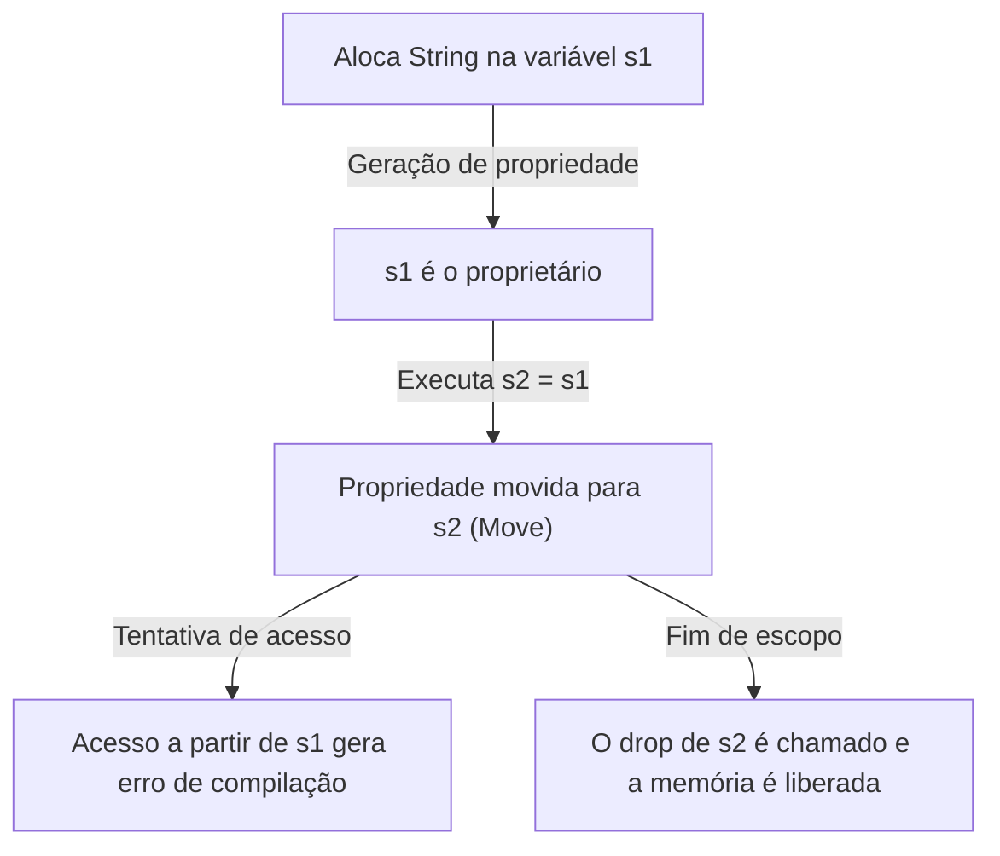
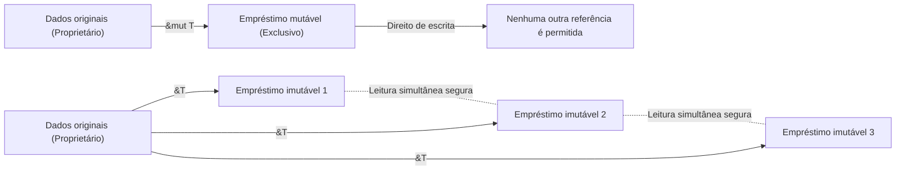

## Introdução: Por que o Rust é "Seguro"?

Na história das linguagens de programação, "desempenho" e "segurança" foram por muito tempo considerados um compromisso (trade-off). Linguagens de programação de sistemas como C e C++ oferecem um desempenho incrível, maximizando a capacidade do hardware, mas, em troca, deixam a responsabilidade do gerenciamento de memória para o programador. O gerenciamento manual de memória (`malloc` / `free` ou `new` / `delete`) tem sido um terreno fértil para bugs graves e vulnerabilidades de segurança, como ponteiros pendentes (dangling pointers), liberação dupla (double free), estouro de buffer (buffer overflow) e vazamentos de memória (memory leaks).

Por outro lado, linguagens de alto nível como Java, C#, Python e Ruby ocultaram a complexidade desse gerenciamento de memória do programador ao introduzir a Coleta de Lixo (Garbage Collection, GC). O GC recupera automaticamente a memória que não é mais necessária em intervalos regulares, melhorando drasticamente a segurança da memória. No entanto, a execução do GC vem com uma sobrecarga de tempo de execução, e pausas imprevisíveis (Stop-the-World) tornam-se um problema, especialmente em sistemas que requerem tempo real ou ambientes com restrições rígidas de recursos.

Quem quebrou esse dilema e trouxe uma mudança de paradigma para o mundo da programação de sistemas foi o **Rust**. O Rust **garante a segurança da memória sem ter um coletor de lixo**, por meio de um conceito único chamado "Propriedade" (Ownership) e uma rigorosa análise estática por parte do compilador. Esse design, que alcança concorrência segura sem sobrecarga em tempo de execução (abstração de custo zero), pode ser considerado quase uma obra de arte.

Neste artigo, vamos explorar profundamente o núcleo da "segurança" e do "modelo de propriedade" do Rust, desde sua filosofia até seus mecanismos específicos.

## As 3 Abordagens de Gerenciamento de Memória

Para entender a singularidade do Rust, vamos primeiro organizar as principais abordagens de gerenciamento de memória em linguagens de programação.

1. **Gerenciamento Manual de Memória (Manual Memory Management)**
   - Linguagens representativas: C, C++
   - Características: Os desenvolvedores alocam e liberam memória explicitamente.
   - Vantagens: Zero sobrecarga em tempo de execução. Desempenho extremo.
   - Desvantagens: O erro humano é inevitável e há uma falta fundamental de segurança de memória.

2. **Coleta de Lixo (Garbage Collection)**
   - Linguagens representativas: Java, C#, Go, Python
   - Características: O runtime monitora o uso da memória e recupera automaticamente a memória que não é mais necessária.
   - Vantagens: Alta segurança de memória, reduzindo grandemente o fardo sobre os desenvolvedores.
   - Desvantagens: Degradação do desempenho e aumento do uso de memória devido à execução de ciclos de GC.

3. **Propriedade e Empréstimo (Ownership and Borrowing)**
   - Linguagens representativas: Rust
   - Características: O compilador calcula os tempos de vida (lifetimes) da memória em tempo de compilação e insere automaticamente os processos de liberação necessários.
   - Vantagens: Atinge segurança de memória sem GC, oferecendo desempenho equivalente ao C/C++.
   - Desvantagens: Curva de aprendizado íngreme e a necessidade de "lutar" contra o "Verificador de Empréstimos" (Borrow Checker).

O compilador do Rust é como uma prova matemática de que nenhum comportamento indefinido relacionado à memória ocorrerá (exceto em blocos de código unsafe) assim que o código passar pela compilação.

## Os 3 Grandes Princípios da Propriedade (Ownership)

O sistema de propriedade do Rust é construído sobre apenas três regras simples. Essas três regras são a base de toda a segurança da memória.

1. **Cada valor em Rust possui uma variável chamada "proprietário" (owner).**
2. **Só pode haver um único proprietário por vez.**
3. **Quando o proprietário sai de escopo, o valor é descartado (dropped).**

### Regras 1 e 3: Escopo e Liberação de Memória (Drop)

O escopo de uma variável no Rust é definido pelo bloco `{}`. Quando uma variável sai de escopo, o Rust chama automaticamente uma função especial `drop`, liberando a região de memória que o valor ocupava. Esse comportamento é semelhante ao padrão RAII (Resource Acquisition Is Initialization) do C++, mas no Rust isso é imposto de forma rígida como um recurso central da linguagem.

```rust
{
    let s = String::from("hello"); // s é válido a partir daqui
    // processamento usando s
} // Aqui s sai de escopo, e a memória é liberada automaticamente (a função drop é chamada)
```

Com esse mecanismo, os programadores não precisam se preocupar em esquecer de chamar `free()` manualmente e causar vazamentos de memória.

### Regra 2: Proprietário Único e Semântica de Movimentação (Move)

Uma diferença crucial entre o Rust e muitas outras linguagens é a Regra 2, que afirma: "Só pode haver um único proprietário por vez."

A atribuição de tipos de dados simples armazenados na pilha (stack) (como inteiros e booleanos que implementam o trait `Copy`) resulta em uma cópia do valor, mas a atribuição de tipos que alocam dados na heap (como `String` ou `Vec`) resulta em uma **"Transferência de Propriedade" (Move)**.

```rust
let s1 = String::from("hello");
let s2 = s1; // Aqui a propriedade se move de s1 para s2

// println!("{}, world!", s1); // Erro de compilação! s1 não é mais válido
```

Por que ocorre essa movimentação? Se `s1` e `s2` apontassem para a mesma região de memória na heap, e ambos tentassem liberar a memória ao sair de escopo, ocorreria um bug de **Liberação Dupla (Double Free)**. O Rust garante a segurança impedindo completamente a criação desse estado e invalidando a variável antiga `s1` no momento da atribuição.

Vamos visualizar a transferência da propriedade com o diagrama Mermaid abaixo.



## Empréstimo (Borrowing): Acessando Dados Sem Passar a Propriedade

As regras de propriedade são rigorosas e seguras, mas seria extremamente inconveniente se "toda vez que um valor fosse passado para uma função, a propriedade se movesse e ele não pudesse mais ser usado". Portanto, o Rust possui os conceitos de **"Referências" (References)** e **"Empréstimo" (Borrowing)**.

Ao usar referências, podemos acessar um valor sem tomar posse dele. Chamamos isso de "empréstimo".

```rust
fn calculate_length(s: &String) -> usize { // s é uma referência para uma String
    s.len()
} // Aqui s sai de escopo, mas não possui a propriedade, então nada acontece

let s1 = String::from("hello");
let len = calculate_length(&s1); // A propriedade permanece em s1, apenas a referência é passada
println!("The length of '{}' is {}.", s1, len); // s1 ainda pode ser usada
```

### Regras de Empréstimo e Prevenção de Corridas de Dados

O empréstimo também tem regras rígidas.

1. A qualquer momento, você pode ter **uma referência mutável (`&mut T`)**, ou **múltiplas referências imutáveis (`&T`)** (você não pode ter ambas ao mesmo tempo).
2. As referências devem ser sempre válidas (proibição de ponteiros pendentes).

Esta regra destina-se a eliminar completamente as **Corridas de Dados (Data Race)** no processamento simultâneo em tempo de compilação. As corridas de dados ocorrem quando as seguintes três condições são atendidas:

- Dois ou mais ponteiros acessam os mesmos dados simultaneamente.
- Pelo menos um dos ponteiros está sendo usado para escrever nos dados.
- Não existe mecanismo para sincronizar o acesso aos dados.

As regras de empréstimo do Rust proíbem expressamente essa condição em nível de compilação. Ele força o controle exclusivo (Leitor-Escritor) — "qualquer número de pessoas pode ler ao mesmo tempo se for apenas para leitura (múltiplas referências imutáveis)" e "quando se escreve, ninguém mais pode ler, e apenas uma pessoa pode escrever (uma referência mutável única)" — não em tempo de execução, mas em tempo de compilação.



## Tempos de Vida (Lifetimes): Provando a Validade das Referências

O que torna a outra regra de empréstimo "referências devem ser sempre válidas" possível é o conceito de **Tempos de Vida (Lifetimes)**.

Na linguagem C, é fácil criar ponteiros pendentes que apontam para regiões de memória inválidas retornando ponteiros de variáveis locais de função.

O verificador de empréstimos do Rust rastreia e compara os tempos de vida (os escopos nos quais a referência é válida) de todas as referências. Ele garante que o tempo de vida da referência não exceda o tempo de vida dos dados referenciados.

```rust
let r;
{
    let x = 5;
    r = &x; // Erro! O tempo de vida de x é muito curto
} // x é descartado aqui
// println!("r: {}", r); // Tentar usar r aqui resultaria em um ponteiro pendente
```

O código acima será implacavelmente rejeitado pelo compilador do Rust. Em muitos casos, o compilador permite que você omita anotações explícitas por meio da elisão de tempo de vida (Lifetime Elision), mas para structs ou funções complexas, o desenvolvedor precisa fornecer anotações de tempo de vida (por exemplo: `'a`) para ensinar ao compilador os relacionamentos entre referências.

Os tempos de vida podem parecer difíceis de entender no começo, mas eles são a forma definitiva de expressar "quando e onde a memória é alocada e descartada" como o sistema de tipos de um programa.

## Thread-Safe e Concorrência: Concorrência Sem Medo (Fearless Concurrency)

Os conceitos centrais do Rust de propriedade, empréstimos e tempos de vida não apenas tornam os programas de thread única seguros, mas também tornam a concorrência em ambientes multithreaded incrivelmente segura.

Como mencionado anteriormente, as regras exclusivas de referências mutáveis e imutáveis evitam corridas de dados. Além disso, o Rust usa os marker traits `Send` e `Sync` para garantir o compartilhamento seguro e a transferência de dados entre as threads.

- **`Send`**: Indica que a propriedade do tipo pode ser movida com segurança para outra thread.
- **`Sync`**: Indica que é seguro para múltiplas threads referenciarem o tipo simultaneamente.

Por exemplo, um contador de referência não seguro para threads, como o `Rc<T>`, não implementa `Send` ou `Sync`, portanto, o uso acidental em um ambiente multithreaded resultará em um erro de compilação. Somente ao combinar o contador de referência atômico `Arc<T>` com o controle de exclusão mútua `Mutex<T>`, o código será compilado com sucesso.

Em vez de "descobrir bugs em tempo de execução", se "não for seguro, nem será compilado". Esta é a verdadeira essência da **"Concorrência Sem Medo" (Fearless Concurrency)** do Rust.

## Conclusão: Propriedade como um Paradigma

O sistema de propriedade do Rust não é apenas um recurso, mas um paradigma fundamental de design de programas. Ele nos apresenta questões cruciais durante o estágio de escrita do código, como: "Quem possui esses dados?", "Por quanto tempo os dados são válidos?" e "Quando eles podem ser reescritos?".

É verdade que o tempo gasto lutando contra o verificador de empréstimos pode parecer doloroso. No entanto, os erros do compilador são a voz do parceiro mais confiável, nos protegendo contra falhas críticas, condições de corrida difíceis de reproduzir e brechas de segurança potencialmente exploráveis em ambientes de produção.

O Rust funde o alto desempenho do gerenciamento manual de memória com a segurança de linguagens que utilizam GC, num nível extremamente elevado. Ao entender a filosofia profunda e o design meticuloso por trás dele, poderemos construir um mundo de software mais robusto, rápido e confiável.
