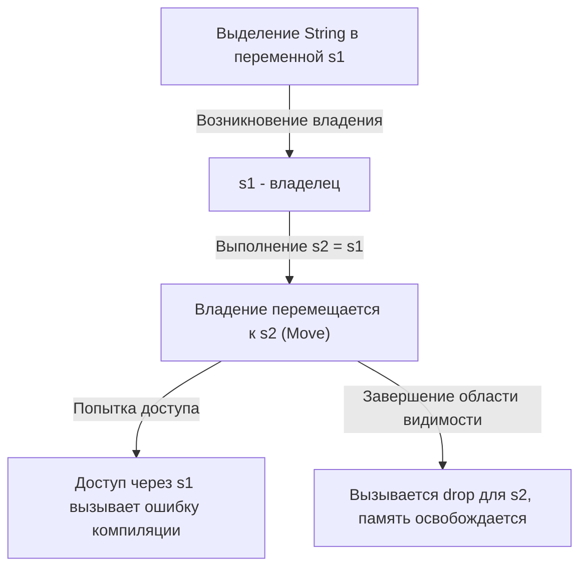
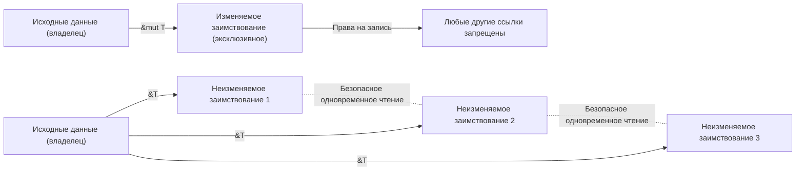

## Введение: почему Rust считается "безопасным"?

В истории языков программирования "производительность" и "безопасность" долгое время считались компромиссом. Системные языки программирования, такие как C и C++, обеспечивают невероятную производительность, максимально использующую возможности оборудования, но ценой возложения ответственности за управление памятью на программиста. Ручное управление памятью (`malloc` / `free` или `new` / `delete`) стало рассадником серьезных ошибок и уязвимостей безопасности, таких как висячие указатели, двойное освобождение (Double Free), переполнение буфера и утечки памяти.

С другой стороны, высокоуровневые языки, такие как Java, C#, Python и Ruby, скрывают сложность управления памятью от программиста путем внедрения сборки мусора (Garbage Collection, GC). GC периодически автоматически собирает ненужную память, значительно повышая безопасность памяти. Однако выполнение GC сопровождается накладными расходами во время выполнения, и, в частности, в системах, требующих реального времени, или в средах с жесткими ограничениями ресурсов, непредсказуемое время остановки (Stop-the-World) становится проблемой.

Этот конфликт разрушил **Rust**, произведя сдвиг парадигмы в мире системного программирования. Благодаря своей уникальной концепции "Владения" (Ownership) и строгому статическому анализу компилятора, Rust **гарантирует безопасность памяти без сборщика мусора**. Этот дизайн, реализующий безопасную параллельную обработку без накладных расходов во время выполнения (абстракции с нулевой стоимостью), можно назвать поистине искусством.

В этой статье мы глубоко погрузимся в суть Rust — "безопасность" и "модель владения", от ее философии до конкретных механизмов.

## 3 подхода к управлению памятью

Чтобы понять уникальность Rust, давайте сначала рассмотрим основные подходы к управлению памятью в языках программирования.

1. **Ручное управление памятью (Manual Memory Management)**
   - Представители: C, C++
   - Особенности: Разработчик явно выделяет и освобождает память.
   - Преимущества: Нулевые накладные расходы во время выполнения. Максимальная производительность.
   - Недостатки: Человеческий фактор неизбежен, фундаментально отсутствует безопасность памяти.

2. **Сборка мусора (Garbage Collection)**
   - Представители: Java, C#, Go, Python
   - Особенности: Среда выполнения отслеживает использование памяти и автоматически собирает ненужную.
   - Преимущества: Высокая безопасность памяти, значительно снижается нагрузка на разработчика.
   - Недостатки: Снижение производительности из-за циклов GC и увеличение использования памяти.

3. **Владение и заимствование (Ownership and Borrowing)**
   - Представители: Rust
   - Особенности: Компилятор вычисляет время жизни памяти во время компиляции и автоматически вставляет необходимые процессы освобождения.
   - Преимущества: Достигается безопасность памяти без GC при производительности, сравнимой с C/C++.
   - Недостатки: Крутая кривая обучения, необходимость "борьбы" с анализатором заимствований (Borrow Checker).

Компилятор Rust, когда код успешно компилируется, математически доказывает (за исключением небезопасных блоков кода - unsafe), что ошибки работы с памятью и неопределенное поведение не возникнут.

## 3 главных принципа владения (Ownership)

Система владения в Rust построена всего на трех простых правилах. Эти три правила являются основой всей безопасности памяти.

1. **Каждое значение в Rust имеет переменную, которая называется его "владельцем" (owner).**
2. **В любой момент времени может быть только один владелец.**
3. **Когда владелец выходит из области видимости, значение уничтожается.**

### Правила 1 и 3: Область видимости и освобождение памяти (Drop)

Область видимости переменной в Rust определяется блоком `{}`. Когда переменная выходит из области видимости, Rust автоматически вызывает специальную функцию `drop` и освобождает область памяти, занимаемую этим значением. Это поведение похоже на паттерн RAII (Resource Acquisition Is Initialization) в C++, но в Rust оно является ключевой функцией языка.

```rust
{
    let s = String::from("hello"); // s действительна, начиная с этого момента
    // операции с s
} // здесь s выходит из области видимости, и память автоматически освобождается (вызывается функция drop)
```

Благодаря этому механизму разработчикам не нужно беспокоиться о забытом вызове `free()` и возникновении утечек памяти.

### Правило 2: Единственный владелец и семантика перемещения (Move)

Критическое отличие Rust от многих других языков — правило 2: "в любой момент времени может быть только один владелец".

Присваивание простых типов данных, хранящихся в стеке (например, целые числа и логические значения, реализующие типаж `Copy`), приводит к копированию значения. Однако присваивание типов, выделяющих данные в куче (например, `String` или `Vec`), означает **"перемещение владения" (move)**.

```rust
let s1 = String::from("hello");
let s2 = s1; // здесь владение перемещается от s1 к s2

// println!("{}, world!", s1); // Ошибка компиляции! s1 больше недействительна
```

Почему происходит перемещение? Если бы `s1` и `s2` указывали на одну и ту же область памяти в куче, и при выходе из области видимости обе попытались бы ее освободить, произошла бы ошибка **двойного освобождения (Double Free)**. Rust изначально не допускает возникновения такой ситуации, обеспечивая безопасность за счет инвалидации старой переменной `s1` в момент присваивания.

Давайте визуализируем движение владения с помощью следующей диаграммы Mermaid.



## Заимствование (Borrowing): доступ к данным без передачи владения

Правила владения строги и безопасны, но "каждый раз при передаче значения в функцию владение перемещается, и значение больше нельзя использовать" — это крайне неудобно. Поэтому в Rust существуют концепции **"ссылок" (References)** и **"заимствования" (Borrowing)**.

Используя ссылки, можно получить доступ к значению, не забирая владение. Это и называется "заимствованием".

```rust
fn calculate_length(s: &String) -> usize { // s - это ссылка на String
    s.len()
} // здесь s выходит из области видимости, но так как у нее нет владения, ничего не происходит

let s1 = String::from("hello");
let len = calculate_length(&s1); // Владение остается у s1, передается только ссылка
println!("The length of '{}' is {}.", s1, len); // s1 все еще можно использовать
```

### Правила заимствования и предотвращение гонок данных

Для заимствования также существуют строгие правила.

1. В любой момент времени вы можете иметь либо **одну изменяемую ссылку (`&mut T`)**, либо **любое количество неизменяемых ссылок (`&T`)** (но не обе одновременно).
2. Ссылки всегда должны быть действительными (запрет висячих указателей).

Эти правила предназначены для полного исключения **гонок данных (Data Race)** при параллельной обработке на этапе компиляции. Гонка данных возникает при совпадении следующих трех условий:

- Два или более указателя одновременно обращаются к одним и тем же данным.
- Как минимум один из указателей используется для записи в данные.
- Отсутствует механизм синхронизации доступа к данным.

Правила заимствования Rust запрещают это состояние на уровне компиляции. Исключительный контроль (блокировка Readers-Writer) "если только читать, могут читать несколько человек одновременно (несколько неизменяемых ссылок)" и "при записи никто не может читать, и писать может только один (единственная изменяемая ссылка)" принудительно применяется не во время выполнения, а во время компиляции.



## Время жизни (Lifetimes): доказательство действительности ссылок

Другое правило заимствования, "ссылки всегда должны быть действительными", реализуется с помощью концепции **времени жизни (Lifetimes)**.

В языке C можно легко создать висячий указатель, указывающий на недействительную область памяти, просто вернув указатель на локальную переменную функции.

Анализатор заимствований Rust отслеживает и сравнивает время жизни всех ссылок (область видимости, в которой ссылка действительна). Он проверяет, чтобы время жизни ссылки не превышало время жизни данных, на которые она ссылается.

```rust
let r;
{
    let x = 5;
    r = &x; // Ошибка! Время жизни x слишком короткое
} // x уничтожается здесь
// println!("r: {}", r); // Попытка использовать r здесь приведет к висячему указателю
```

Приведенный выше код будет безжалостно отклонен компилятором Rust. В большинстве случаев компилятор позволяет опустить явное указание за счет вывода времени жизни (Lifetime Elision), но для сложных структур и функций разработчикам необходимо добавлять аннотации времени жизни (например, `'a`), чтобы указать компилятору отношения между ссылками.

Хотя время жизни поначалу кажется сложным, это высшая форма выражения того, "когда и где память выделяется, и когда она уничтожается" через систему типов программы.

## Потокобезопасность и параллелизм: Бесстрашный параллелизм (Fearless Concurrency)

Ключевые концепции Rust, такие как владение, заимствование и время жизни, не только делают однопоточные программы безопасными, но и делают параллельную обработку в многопоточных средах невероятно безопасной.

Как упоминалось ранее, правило взаимного исключения изменяемых и неизменяемых ссылок предотвращает гонки данных. Кроме того, Rust использует маркерные типажи (marker traits) `Send` и `Sync`, чтобы гарантировать безопасность передачи и совместного использования данных между потоками.

- **`Send`**: Указывает на то, что владение типом можно безопасно передать другому потоку.
- **`Sync`**: Указывает на то, что на тип можно безопасно ссылаться из нескольких потоков одновременно.

Например, непотокобезопасный счетчик ссылок `Rc<T>` не реализует ни `Send`, ни `Sync`, поэтому ошибочная попытка его использования в многопоточной среде приведет к ошибке компиляции. Вместо этого только комбинация атомарного счетчика ссылок `Arc<T>` и примитива исключающего доступа `Mutex<T>` позволит коду скомпилироваться.

Вместо того чтобы "замечать ошибки во время выполнения", код "даже не скомпилируется, если он небезопасен". В этом и заключается истинная суть **"бесстрашного параллелизма" (Fearless Concurrency)**, провозглашаемого Rust.

## Заключение: владение как парадигма

Система владения в Rust — это не просто функция, а фундаментальная парадигма проектирования программ. На этапе написания кода она ставит перед нами важные вопросы: "Кто владеет этими данными?", "До каких пор данные действительны?" и "Когда они могут быть перезаписаны?".

Конечно, время, проведенное в борьбе с анализатором заимствований, может показаться мучительным. Однако ошибки компилятора — это голос нашего самого надежного партнера, защищающего нас от фатальных ошибок, которые могут возникнуть в производственной среде, трудновоспроизводимых состояний гонки и потенциально уязвимых дыр в безопасности.

Rust на высоком уровне объединяет в себе высокую производительность ручного управления памятью и безопасность языков со сборкой мусора. Понимая глубокую философию и тщательный дизайн, стоящие за ним, мы сможем создать мир более надежного, быстрого и безотказного программного обеспечения.
