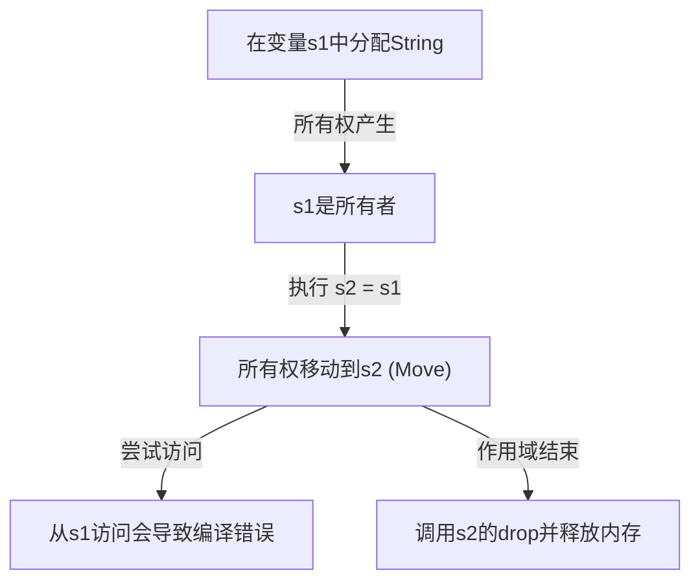
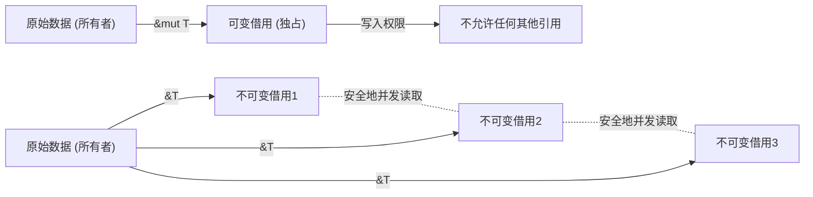

## 引言：为什么Rust是“安全”的？

在编程语言的历史中，“性能”和“安全性”长期以来被认为是鱼和熊掌不可兼得的关系。像C或C++这样的系统编程语言，能够最大限度地发挥硬件的能力，提供惊人的性能，但代价是将内存管理的责任交给了程序员。手动内存管理（`malloc` / `free` 或 `new` / `delete`）已成为悬垂指针（Dangling Pointer）、二次释放（Double Free）、缓冲区溢出（Buffer Overflow）和内存泄漏（Memory Leak）等严重错误和安全漏洞的温床。

另一方面，像Java、C#、Python和Ruby这样的高级语言，通过引入垃圾回收机制（Garbage Collection, GC），向程序员隐藏了这些内存管理的复杂性。GC定期自动回收不再需要的内存，极大地提高了内存安全性。然而，GC的执行伴随着运行时开销，特别是在需要实时性的系统或资源受限的环境中，不可预测的停顿时间（Stop-the-World）成为了一个问题。

打破这一困境，为系统编程世界带来范式转变的是 **Rust**。Rust通过独特的“所有权（Ownership）”概念和编译器严格的静态分析，**在没有垃圾回收器的情况下保证了内存安全**。这种在没有运行时开销的情况下实现安全并发处理（零成本抽象）的设计，可以说是一门真正的艺术。

本文将深入探讨Rust核心的“安全性”和“所有权模型”，从其哲学理念到具体的机制进行全面解析。

## 内存管理的3种方式

为了理解Rust的独特性，让我们先梳理一下编程语言中内存管理的主要方式。

1. **手动内存管理 (Manual Memory Management)**
   - 代表语言: C, C++
   - 特点: 开发者显式地进行内存的分配和释放。
   - 优点: 运行时开销为零。追求极致性能。
   - 缺点: 人为错误不可避免，从根本上缺乏内存安全性。

2. **垃圾回收 (Garbage Collection)**
   - 代表语言: Java, C#, Go, Python
   - 特点: 运行时监控内存的使用情况，并自动回收不再需要的内存。
   - 优点: 内存安全性高，大幅减轻开发者的负担。
   - 缺点: GC周期的执行会导致性能下降，并增加内存占用。

3. **所有权与借用 (Ownership and Borrowing)**
   - 代表语言: Rust
   - 特点: 编译器在编译时计算内存的生命周期，并自动插入必要的释放操作。
   - 优点: 在没有GC的情况下实现内存安全，并发挥与C/C++同等的性能。
   - 缺点: 学习曲线陡峭，需要与“借用检查器（Borrow Checker）”作斗争。

Rust编译器就像是在代码通过编译的那一刻，从数学上证明了（除了不安全的unsafe代码块）不会发生与内存相关的未定义行为。

## 所有权 (Ownership) 的3大原则

Rust的所有权系统建立在仅有的3个简单规则之上。这3个规则是所有内存安全的基石。

1. **Rust中的每一个值都有一个被称为其“所有者（owner）”的变量。**
2. **值在任何时候都只能有一个所有者。**
3. **当所有者（变量）离开作用域时，这个值将被丢弃。**

### 规则1和3：作用域与内存释放 (Drop)

Rust中变量的有效范围（作用域）由代码块 `{}` 定义。当变量离开作用域时，Rust会自动调用一个特殊的函数 `drop`，释放该值所占用的内存区域。这种行为类似于C++的RAII（Resource Acquisition Is Initialization，资源获取即初始化）模式，但在Rust中，这被彻底作为语言的核心功能来实现。

```rust
{
    let s = String::from("hello"); // s 从此处开始有效
    // 使用 s 进行处理
} // s 在此处离开作用域，内存被自动释放 (调用 drop 函数)
```

通过这种机制，程序员不必担心因为忘记手动调用 `free()` 而导致内存泄漏。

### 规则2：单一所有者与移动语义 (Move)

Rust与其他许多语言的决定性区别在于规则2：“值在任何时候都只能有一个所有者”。

在栈上保存的简单数据类型（如整数和布尔值等，实现了 `Copy` trait 的类型）的赋值是值的复制，但在堆上分配内存的类型（如 `String` 和 `Vec` 等）的赋值，则会发生 **“所有权的转移（移动，Move）”**。

```rust
let s1 = String::from("hello");
let s2 = s1; // 所有权在此处从 s1 移动到 s2

// println!("{}, world!", s1); // 编译错误！s1 已经失效
```

为什么会发生移动？如果 `s1` 和 `s2` 指向堆上的同一块内存区域，当它们都离开作用域时，如果分别尝试释放内存，就会发生 **二次释放（Double Free）** 错误。Rust从根本上就不允许创造出这种状态，在赋值时立即使旧变量 `s1` 失效，从而保证了安全性。

让我们用下面的Mermaid图来可视化所有权的移动。



## 借用 (Borrowing)：在不转移所有权的情况下访问数据

所有权规则虽然严谨且安全，但如果“每次将值传递给函数时都会转移所有权，再也无法使用”，那将是极其不便的。因此，Rust中存在 **“引用（References）”** 和 **“借用（Borrowing）”** 的概念。

通过使用引用，可以在不剥夺所有权的情况下访问值。这被称为“借用”。

```rust
fn calculate_length(s: &String) -> usize { // s 是对 String 的引用
    s.len()
} // s 在此处离开作用域，但因为它不拥有所有权，所以什么也不会发生

let s1 = String::from("hello");
let len = calculate_length(&s1); // 所有权仍属于 s1，只传递引用
println!("The length of '{}' is {}.", s1, len); // s1 仍然可用
```

### 借用规则与防止数据竞争

借用也有严格的规则。

1. 在任意给定的时间，你要么只能有**一个可变引用（`&mut T`）**，要么只能有**多个不可变引用（`&T`）**（不能同时拥有两者）。
2. 引用必须总是有效的（禁止悬垂指针）。

这些规则旨在在编译时彻底消除并发处理中的 **数据竞争（Data Race）**。当以下三个条件同时满足时，就会发生数据竞争：

- 两个或多个指针同时访问同一数据。
- 至少有一个指针被用来写入数据。
- 没有同步数据访问的机制。

Rust的借用规则正是在编译级别禁止了这种状态。“如果只是读，多少人都可以同时读（多个不可变引用）”，“写的时候任何人都不允许读，且只能由一个人写（单一可变引用）”——这种互斥控制（读写锁），不是在运行时，而是在编译时被强制执行的。



## 生命周期 (Lifetimes)：证明引用的有效性

实现借用另一条规则“引用必须总是有效的”，依靠的是 **生命周期（Lifetimes）** 概念。

在C语言中，通过返回函数局部变量的指针，很容易制造出指向无效内存区域的悬垂指针。

Rust的借用检查器会跟踪并比较所有引用的生命周期（引用有效的作用域）。它会确保引用的生命周期不会长于其所引用数据的生命周期。

```rust
let r;
{
    let x = 5;
    r = &x; // 错误！x 的生命周期太短了
} // x 在此处被丢弃
// println!("r: {}", r); // 如果在此处尝试使用 r，将会变成悬垂指针
```

上面的代码会被Rust编译器无情地拒绝。在很多情况下，编译器通过生命周期省略（Lifetime Elision）允许我们省略显式的标注，但在复杂的结构体或函数中，开发者需要添加生命周期注解（例如：`'a`）来告诉编译器引用之间的关系。

生命周期起初可能让人感到难以理解，但它是将“内存何时何地分配、何时被释放”作为程序的类型系统表现出来的终极形态。

## 线程安全与并发处理：无畏并发 (Fearless Concurrency)

所有权、借用和生命周期这些Rust的核心概念，不仅使单线程程序变得安全，更让多线程环境下的并发处理安全得令人惊叹。

如前所述，可变引用和不可变引用的互斥规则可以防止数据竞争。此外，Rust使用 `Send` 和 `Sync` 两个标记trait来保证线程间数据传输和共享的安全性。

- **`Send`**: 表示类型的所有权可以安全地转移到另一个线程。
- **`Sync`**: 表示可以安全地被多个线程同时引用。

例如，非线程安全的引用计数 `Rc<T>` 既没有实现 `Send` 也没有实现 `Sync`，如果在多线程环境中错误地使用它，就会产生编译错误。取而代之的是，结合使用原子引用计数 `Arc<T>` 和互斥锁 `Mutex<T>`，代码才能通过编译。

不是“在运行时发现错误”，而是“如果不安全，甚至无法编译”。这正是Rust所倡导的 **“无畏并发（Fearless Concurrency）”** 的精髓所在。

## 结论：作为范式的所有权

Rust的所有权系统不仅仅是一个特性，它是程序设计的根本范式。它迫使我们在编写代码的阶段，直面诸如“谁拥有这个数据？”、“数据有效到什么时候？”、“什么时候会被重写？”等重要问题。

确实，与借用检查器搏斗的时间可能会让人感到痛苦。然而，编译器的错误信息，正是为了保护我们免受生产环境中可能发生的致命Bug、难以重现的竞争状态，以及可能被利用的安全漏洞，是我们最可靠伙伴的忠告。

Rust将手动内存管理的高性能与GC语言的安全性在更高层次上融合在了一起。通过理解其背后的深刻哲学和精密设计，我们将能够构建出一个更加健壮、快速、可靠的软件世界。
