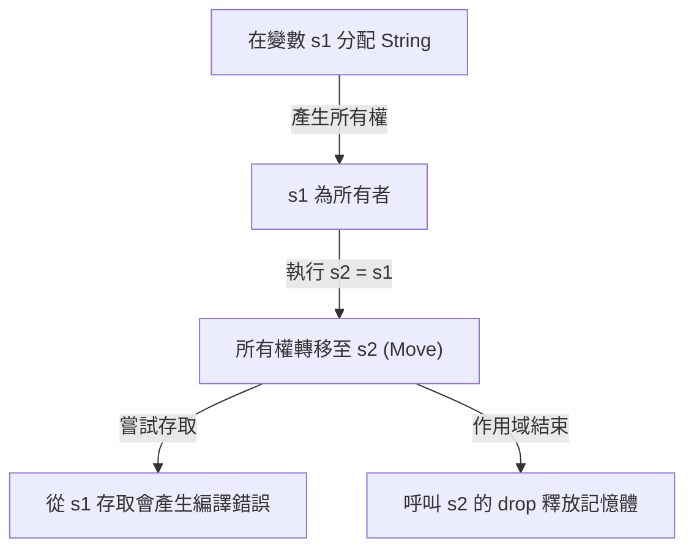
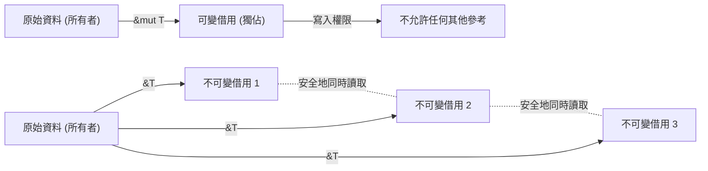

## 前言：為什麼 Rust 是「安全」的？

在程式語言的歷史中，「效能」與「安全性」長期以來被認為是取捨（Trade-off）的關係。像 C 或 C++ 這樣的系統程式語言提供了驚人的效能，能夠將硬體的能力發揮到極致，但代價是將記憶體管理的責任交給了程式設計師。手動記憶體管理（`malloc` / `free` 或 `new` / `delete`）一直是懸空指標（Dangling Pointer）、雙重釋放（Double Free）、緩衝區溢位（Buffer Overflow）、記憶體洩漏（Memory Leak）等嚴重 Bug 和安全漏洞的溫床。

另一方面，Java、C#、Python、Ruby 等高階語言透過引入垃圾回收（Garbage Collection, GC），將這些記憶體管理的複雜性對程式設計師隱藏起來。GC 會定期自動回收不再需要的記憶體，大幅提升了記憶體的安全性。然而，執行 GC 伴隨著執行期（Runtime）的開銷，特別是在需要即時性的系統或資源受限的環境中，不可預測的停頓時間（Stop-the-World）會成為一個問題。

打破這個兩難困境，並在系統程式設計領域帶來典範轉移的，正是 **Rust**。Rust 透過「所有權（Ownership）」這個獨特概念以及編譯器嚴格的靜態分析，**在不具備垃圾回收器的情況下保證了記憶體的安全性**。這種在沒有執行期開銷的情況下實現安全並行處理（零成本抽象化）的設計，簡直可以說是一門藝術。

在本文中，我們將深入探討 Rust 核心的「安全性」與「所有權模型」，從其哲學理念到具體機制進行徹底的解析。

## 記憶體管理的三種方法

為了理解 Rust 的獨特性，首先讓我們整理一下程式語言中主要的記憶體管理方法。

1. **手動記憶體管理 (Manual Memory Management)**
   - 代表語言: C, C++
   - 特徵: 開發者明確地進行記憶體的配置與釋放。
   - 優點: 執行期的開銷為零。極致的效能。
   - 缺點: 人為錯誤不可避免，根本上缺乏記憶體安全性。

2. **垃圾回收 (Garbage Collection)**
   - 代表語言: Java, C#, Go, Python
   - 特徵: 執行期會監控記憶體的使用狀況，並自動回收不再需要的記憶體。
   - 優點: 記憶體安全性高，大幅減輕開發者的負擔。
   - 缺點: 執行 GC 週期會導致效能下降與記憶體使用量增加。

3. **所有權與借用 (Ownership and Borrowing)**
   - 代表語言: Rust
   - 特徵: 編譯器在編譯時計算記憶體的生命週期，並自動插入必要的釋放處理。
   - 優點: 實現無 GC 的記憶體安全性，並發揮與 C/C++ 同等的效能。
   - 缺點: 學習曲線陡峭，需要與「借用檢查器（Borrow Checker）」奮戰。

Rust 的編譯器就像是：當程式碼通過編譯的那一刻，就已經在數學上證明了不會發生與記憶體相關的未定義行為（排除不安全的程式碼區塊 unsafe code）。

## 所有權 (Ownership) 的三大原則

Rust 的所有權系統建立在三個簡單的規則之上。這三個規則構成了所有記憶體安全性的基礎。

1. **Rust 中的每個值都有一個被稱為「所有者（owner）」的變數。**
2. **在任何時候，一個值只能有一個所有者。**
3. **當所有者離開作用域（Scope）時，該值將會被丟棄（Dropped）。**

### 規則 1 與 3：作用域與記憶體釋放 (Drop)

在 Rust 中，變數的有效範圍（作用域）是由區塊 `{}` 所定義的。當變數離開作用域時，Rust 會自動呼叫一個名為 `drop` 的特殊函式，並釋放該值佔用的記憶體區域。這個行為類似於 C++ 的 RAII（Resource Acquisition Is Initialization）模式，但在 Rust 中，這被貫徹為語言的核心功能。

```rust
{
    let s = String::from("hello"); // s 從這裡開始有效
    // 使用 s 進行處理
} // 在這裡 s 離開作用域，記憶體會被自動釋放 (呼叫 drop 函式)
```

透過這個機制，程式設計師不需要擔心因為忘記手動呼叫 `free()` 而導致記憶體洩漏。

### 規則 2：單一所有者與移動語意 (Move)

許多其他語言與 Rust 決定性的差異在於規則 2：「在任何時候，一個值只能有一個所有者」。

對於儲存在堆疊（Stack）上的簡單資料型別（如整數或布林值等實作了 `Copy` 實質（Trait）的型別），賦值操作會變成值的複製；但對於在堆積（Heap）上配置資料的型別（如 `String` 或 `Vec` 等），賦值操作則會變成**「所有權的轉移（Move）」**。

```rust
let s1 = String::from("hello");
let s2 = s1; // 在這裡所有權從 s1 轉移到 s2

// println!("{}, world!", s1); // 編譯錯誤！s1 已經無效
```

為什麼會發生轉移呢？如果 `s1` 和 `s2` 指向堆積上同一個記憶體區域，當它們雙雙離開作用域並嘗試釋放記憶體時，就會發生**雙重釋放（Double Free）**的 Bug。Rust 從一開始就不允許這種狀態發生，藉由在賦值時讓舊的變數 `s1` 失效，從而確保了安全性。

讓我們用以下的 Mermaid 圖表將所有權的動態視覺化。



## 借用 (Borrowing)：不轉移所有權而存取資料

雖然所有權的規則嚴格且安全，但如果「每次將值傳遞給函式時，所有權就會轉移，並且再也不能使用」，那就太不方便了。因此，Rust 中存在著**「參考（References）」**與**「借用（Borrowing）」**的概念。

藉由使用參考，我們可以在不奪取所有權的情況下存取值。這被稱為「借用」。

```rust
fn calculate_length(s: &String) -> usize { // s 是對 String 的參考
    s.len()
} // 在這裡 s 離開作用域，但因為它沒有所有權，所以什麼也不會發生

let s1 = String::from("hello");
let len = calculate_length(&s1); // 所有權保留在 s1，只傳遞參考
println!("The length of '{}' is {}.", s1, len); // s1 仍然可以使用
```

### 借用的規則與資料競爭的防止

借用也存在著嚴格的規則。

1. 在任何給定的時間點，只能擁有**一個可變參考（`&mut T`）**，或是**多個不可變參考（`&T`）**（兩者不能同時存在）。
2. 參考必須總是有效的（禁止懸空指標）。

這個規則是為了在編譯時徹底排除並行處理中發生的**資料競爭（Data Race）**。資料競爭會在以下三個條件同時滿足時發生：

- 兩個以上的指標同時存取相同的資料。
- 至少有一個指標被用來寫入資料。
- 不存在同步資料存取的機制。

Rust 的借用規則正是在編譯層級禁止了這種狀態。它在編譯時強制執行了互斥控制（Readers-Writer lock），而不是在執行期：「如果只是讀取，無論多少人都可以同時讀取（多個不可變參考）」；「寫入時沒有人可以讀取，且只能有一個人寫入（單一可變參考）」。



## 生命週期 (Lifetimes)：證明參考的有效性

實現借用的另一個規則「參考必須總是有效的」的概念是**生命週期（Lifetimes）**。

在 C 語言中，藉由回傳函式區域變數的指標，很容易就會產生指向無效記憶體區域的懸空指標。

Rust 的借用檢查器會追蹤並比較所有參考的生命週期（參考有效的作用域）。它會確保參考的生命週期不會長於其所指向的資料的生命週期。

```rust
let r;
{
    let x = 5;
    r = &x; // 錯誤！x 的生命週期太短了
} // x 在這裡被丟棄
// println!("r: {}", r); // 如果在這裡嘗試使用 r，它將成為一個懸空指標
```

上述程式碼會被 Rust 編譯器毫不留情地拒絕。在大多數情況下，編譯器會透過生命週期省略（Lifetime Elision）讓我們不需要明確地標註，但在複雜的結構體或函式中，開發者必須加入生命週期標註（例如：`'a`），以告知編譯器參考之間的關係。

生命週期一開始可能會讓人覺得難以理解，但它是將「記憶體何時在哪裡配置、何時被丟棄」這件事表現為程式型別系統的終極形態。

## 執行緒安全與並行處理：無懼的並行性 (Fearless Concurrency)

所有權、借用、生命週期等 Rust 的核心概念，不僅讓單一執行緒的程式變得安全，更讓多執行緒環境下的並行處理變得驚人地安全。

如前所述，可變參考與不可變參考的互斥規則防止了資料競爭。此外，Rust 使用 `Send` 和 `Sync` 這兩個標記實質（Marker Traits）來保證執行緒間資料傳遞與共享的安全性。

- **`Send`**: 表示可以安全地將型別的所有權轉移到另一個執行緒。
- **`Sync`**: 表示從多個執行緒同時參考也是安全的。

例如，非執行緒安全的參考計數器 `Rc<T>` 既沒有實作 `Send` 也沒有實作 `Sync`，因此如果在多執行緒環境中錯誤地嘗試使用它，將會產生編譯錯誤。作為替代方案，我們需要結合原子參考計數器 `Arc<T>` 與互斥鎖 `Mutex<T>`，程式碼才能夠通過編譯。

不是「在執行期才發現 Bug」，而是「如果不安全，連編譯都無法通過」。這正是 Rust 所標榜的**「無懼的並行性（Fearless Concurrency）」**的真諦。

## 結論：作為一種典範的所有權

Rust 的所有權系統不僅僅是一個功能，更是程式設計的基本典範。它在編寫程式碼的階段，就迫使我們面對這些重要的問題：「誰擁有這個資料？」、「這個資料何時有效？」、「何時會被改寫？」。

確實，與借用檢查器奮戰的時間可能會讓人感到痛苦。但是，編譯器給出的錯誤訊息是我們最可靠的夥伴的聲音，它保護我們免受可能在生產環境中發生的致命 Bug、難以重現的競爭狀態（Race Condition），以及可能被惡意利用的安全漏洞的威脅。

Rust 高度融合了手動記憶體管理的高效能與 GC 語言的安全性。透過理解其背後深層的哲學與嚴謹的設計，我們將能夠建構一個更堅固、更快、更可靠的軟體世界。
