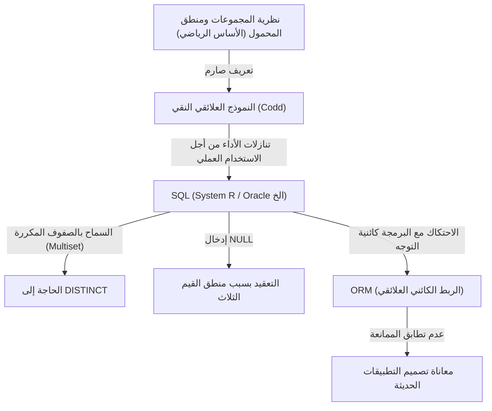

## 1. مقدمة: لماذا نتحدث عن "العلاقة"؟

اليوم، في عالم هندسة البرمجيات، لا يكاد يوجد مطور لا يعرف SQL (لغة الاستعلام المهيكلة). من تطبيقات الويب إلى أنظمة المؤسسات، وحتى تخزين البيانات المحلية على الهواتف الذكية، تعمل أنظمة إدارة قواعد البيانات العلائقية (RDBMS) في كل مكان.

ومع ذلك، فإن "القدرة على كتابة SQL" و"فهم جوهر النموذج العلائقي" هما شيئان مختلفان تمامًا. يقوم العديد من المطورين بتصميم قواعد البيانات بنموذج ذهني بسيط يعتبر "الجداول بمثابة أوراق Excel". يمكن بناء أنظمة معينة بهذا الفهم، ولكن عندما يزداد حجم النظام وتتشابك منطق المجال المعقد، فإنه سينهار فورًا.

في هذا المقال، سنعود إلى أصول "النموذج العلائقي" الذي اقترحه إدغار ف. كود في عام 1970، ونشرح بالتفصيل الشديد الأسس الرياضية والفلسفية (خاصة نظرية المجموعات ومنطق الرتبة الأولى) التي يقوم عليها. إنجاز كود العظيم، الذي رفع قاعدة البيانات من مجرد جهاز تخزين مادي إلى عالم المنطق الخالص والرياضيات، لم يكن مجرد اختراق تقني، بل نقلة نوعية في علم المعلومات.

---

## 2. العصر المظلم قبل كود: حدود قواعد البيانات الملاحية

لفهم القيمة الحقيقية للنموذج العلائقي، من الضروري معرفة "ما الذي تم حله". في الستينيات، كانت نماذج قواعد البيانات السائدة تُعرف باسم "النموذج الهرمي" و"النموذج الشبكي" (ومن الأمثلة البارزة عليها نظام IMS من IBM وأنظمة قواعد البيانات المتوافقة مع CODASYL).

كانت هذه الأنظمة تسمى **"ملاحية" (Navigational)**. كانت العلاقات بين البيانات مبرمجة بشكل ثابت باستخدام مؤشرات مادية (إشارات إلى عناوين الذاكرة)، ولاسترجاع البيانات، كان يتعين على المبرمج نفسه أن يكون على دراية بالهيكل المادي وأن يكتب كودًا إجرائيًا "يتنقل عبر المؤشرات من السجل الأصلي إلى السجل الفرعي".

### المشاكل القاتلة لقواعد البيانات الملاحية

1. **الافتقار إلى استقلالية البيانات (Lack of Data Independence)**
   كان الهيكل المادي للبيانات (وجود المؤشرات، كيفية ارتباطها، إلخ) مقترنًا بشكل وثيق بكود التطبيق. لذلك، فإن أي تغيير طفيف في هيكل قاعدة البيانات كان يتطلب إعادة كتابة جميع أكواد التطبيق التي تعتمد عليها.
2. **تعقيد الاستعلام والاعتماد على الأفراد**
   عند وجود مسارات متعددة (مسارات الوصول) لاستخراج مجموعة بيانات معينة، كان على المبرمج أن يقرر أي مسار هو الأكثر كفاءة ويكتب الكود بناءً على ذلك. كان هذا يتطلب مهارات حرفية عالية.
3. **صعوبة الاستعلامات المخصصة (Ad-hoc Queries)**
   كان إجراء عمليات بحث بشروط غير متوقعة مسبقًا (مثل "إدراج الموظفين الذين ينتمون إلى قسم معين ويبلغ راتبهم مبلغًا معينًا أو أكثر") أمرًا غير واقعي أو مكلفًا للغاية بسبب هيكل المؤشرات.

كانت البيانات حبيسة "مستنقع" القيود المادية وطرق التمثيل المادي.

---

## 3. فليكن هناك نور: النقلة النوعية في عام 1970 وولادة "النموذج العلائقي"

في عام 1970، نشر عالم الكمبيوتر وعالم الرياضيات إدغار ف. كود، الذي كان يعمل في مختبر سان خوسيه التابع لشركة IBM (حاليًا مركز ألمادن للأبحاث)، ورقته التاريخية "نموذج علائقي للبيانات لمستودعات البيانات المشتركة الكبيرة" (A Relational Model of Data for Large Shared Data Banks).

الفكرة التي قدمها كود في هذه الورقة قلبت المفاهيم السائدة في ذلك الوقت رأسًا على عقب. لقد جادل بأنه "يجب فصل الهيكل المنطقي للبيانات تمامًا عن طريقة التخزين المادي"، واعتمد **"نظرية المجموعات" (Set Theory)** و **"منطق الرتبة الأولى" (First-Order Predicate Logic)** كأساس رياضي لذلك.

### ما هي العلاقة (Relation)؟

يسيء الكثير من الناس فهم مصطلح "العلاقة" (Relation) على أنه يعني "العلاقة بين الجداول" (Relationship) (على سبيل المثال، الارتباط بين المفتاح الأساسي والمفتاح الأجنبي). ومع ذلك، في التعريف الرياضي وتعريف كود، يشير مصطلح "العلاقة" إلى **"الجدول نفسه (وبشكل أدق، مجموعة من الصفوف/الـ Tuples)"**.

في الرياضيات، عند إعطاء مجموعات $D_1, D_2, \dots, D_n$، تُعرَّف العلاقة من الدرجة $n$ (n-ary relation) $R$ كمجموعة فرعية من حاصل الضرب الديكارتي لهذه المجموعات.

$R \subseteq D_1 \times D_2 \times \dots \times D_n$

حيث:
- تُسمى $D_1, D_2, \dots$ بـ **المجال (Domain)**. وتكافئ "النوع (نوع البيانات)" في قاعدة البيانات.
- يُسمى كل عنصر في $R$ بـ **الصف (Tuple)**. ويكافئ "الصف (Row, Record)" في قاعدة البيانات.
- المجموعة $R$ بأكملها هي **العلاقة (Relation)**، وتكافئ "الجدول" في قاعدة البيانات.
- يُسمى تسمية المجال الذي ينتمي إليه كل عنصر في الصف بـ **السمة (Attribute)**، وتكافئ "العمود (Column)" في قاعدة البيانات.

### القيود المطلقة لكونها "مجموعة"

حقيقة أن العلاقة تم تعريفها كـ "مجموعة رياضية" لها آثار صارمة ومهمة للغاية. القواعد الأساسية لنظرية المجموعات تصبح قيودًا على نمذجة البيانات.

1. **القضاء على التكرار (تفرد الصفوف)**
   في المجموعة، لا يُسمح بوجود عناصر متطابقة تمامًا (المجموعة $\{1, 2, 2, 3\}$ تعادل $\{1, 2, 3\}$). لذلك، **يجب ألا توجد صفوف متطابقة تمامًا** داخل العلاقة. هذا يعني أن كل علاقة يجب أن تحتوي دائمًا على مفتاح مرشح (مجموعة من السمات التي تحدد الصف بشكل فريد).
2. **عدم أهمية الترتيب (الاستقلال عن الأعلى للأسفل / اليسار لليمين)**
   عناصر المجموعة ليس لها ترتيب. لذلك، لا معنى لـ **ترتيب الصفوف (ترتيب الأسطر)** ولا لـ **ترتيب السمات (ترتيب الأعمدة)** التي تشكل العلاقة. مفاهيم مثل "الصف الثالث" أو "العمود الأول" غير موجودة في النموذج العلائقي.
3. **القيم الذرية (النموذج الطبيعي الأول)**
   يجب أن تكون عناصر المجال "قيماً لا يمكن تقسيمها أكثر (ذرية)". لا يُسمح بحشو المصفوفات أو الهياكل المتداخلة في سمة واحدة.

---

## 4. الجبر العلائقي: رياضيات "معالجة" البيانات

بعد أن عرّف البيانات كمجموعة، قدم كود نظامًا رياضيًا يسمى **الجبر العلائقي (Relational Algebra)** للإجابة على سؤال "كيفية استخراج البيانات المطلوبة من تلك المجموعة".

الجبر هو نظام من "مجموعة من القيم" و "العمليات" عليها (على سبيل المثال، $+$, $-$, $\times$, $\div$ لمجموعة من الأرقام). "القيم" في الجبر العلائقي هي علاقات، و"العمليات" تأخذ علاقات كمدخلات و**تُرجع دائمًا علاقة جديدة**.

وهذا ما يسمى **"خاصية الانغلاق" (Closure Property)**. ونظرًا لأن نتيجة العملية هي علاقة أخرى، يمكنك تداخل (ربط) العمليات إلى ما لا نهاية.

تشمل العمليات الأساسية في الجبر العلائقي ما يلي:

*   **التقييد (Restrict / Select: $\sigma$)**: استخراج الصفوف التي تفي بشرط معين فقط.
*   **الإسقاط (Project: $\pi$)**: استخراج سمات (أعمدة) معينة فقط. إذا حدث تكرار نتيجة لذلك، تتم إزالة التكرارات وفقًا لقواعد المجموعات.
*   **الضرب الديكارتي (Cartesian Product: $\times$)**: إنشاء جميع التوليفات من علاقتين.
*   **الاتحاد (Union: $\cup$)**, **الفرق (Difference: $-$)**, **التقاطع (Intersection: $\cap$)**: العمليات الأساسية في نظرية المجموعات. يجب أن تكون متوافقة في الاتحاد (نفس العناوين).
*   **الضم (Join: $\bowtie$)**: مزيج من الضرب الديكارتي والتقييد، وهو أقوى عملية لربط البيانات ذات الصلة.

من خلال الجمع بين هذه العمليات، يصبح من الممكن طلب البيانات بشكل "تعريفي" (Declarative). أنت تصف "ما هي البيانات التي تريدها (What)"، وليس "كيفية جلب البيانات (How)". أصبح تحسين اختيار المسار مهمة نظام إدارة قواعد البيانات (DBMS) (من خلال المُحسِّن) بدلاً من المبرمج البشري.

---

## 5. الفجوة بين النظرية والواقع: هل SQL حقًا "علائقية"؟

الآن، دعونا نلقي نظرة على SQL التي نستخدمها يوميًا. ظهرت لغة SQL بإلهام من النموذج العلائقي (نشأت من لغة SEQUEL في مشروع System R التابع لشركة IBM)، ولكن في الواقع، **بالمعنى الدقيق للكلمة، فهي ليست تنفيذًا مخلصًا للنموذج العلائقي لكود.**

انتقد الأصوليون، مثل كريس ديت (C.J. Date، زميل كود ومروج للنموذج العلائقي)، SQL بشدة، قائلين إنها ترتكب "العديد من الانتهاكات الخطيرة للنموذج العلائقي".

### الخطايا "غير العلائقية" لـ SQL

1. **السماح بالصفوف المكررة (Bag / Multiset)**
   تسمح جداول SQL افتراضيًا بالصفوف المكررة. يتم تنفيذها كمجموعات متعددة (Bag / Multiset) بدلاً من مجموعات نقية (Set). يجب عليك كتابة `DISTINCT` صراحة لإزالة التكرارات. هذا تنازل خطير يهز أساس النموذج العلائقي.
2. **وجود NULL ومنطق القيم الثلاث (3VL)**
   يعتمد النموذج العلائقي على منطق ثنائي القيم (صحيح وخاطئ) (منطق الرتبة الأولى)، ولكن SQL أدخلت `NULL` للإشارة إلى أن "القيمة غير معروفة أو غير موجودة". أدى ذلك إلى جعل منطق التقييم في SQL منطقًا ثلاثي القيم (TRUE / FALSE / UNKNOWN)، مما جعل سلوك الاستعلام معقدًا للغاية ويصعب التنبؤ به.
3. **الاعتماد على ترتيب الأعمدة**
   في SQL، عند تنفيذ `SELECT *`، يتم إرجاع الأعمدة بالترتيب الذي تم تعريفها به في الجدول. أيضًا، يمكن استخدام جملة `ORDER BY` لإعطاء ترتيب لمجموعة النتائج (النتائج المرتبة لم تعد علاقة، بل قائمة أو مؤشرًا).

يوضح المخطط التالي العلاقة بين النموذج العلائقي النقي وتنفيذ SQL الواقعي.

---

## 6. فلسفة التسوية (Normalization): جعل "حقيقة" البيانات واحدة

لا يمكننا الحديث عن النموذج العلائقي دون ذكر مفهوم **"التسوية" (Normalization)**. التسوية ليست مجرد "تقسيم الجداول". بل هي عملية لمنع شذوذ البيانات (شذوذ التحديث، شذوذ الإدراج، شذوذ الحذف) وتحقيق النموذج المثالي في نظرية المعلومات المتمثل في أن **"حقيقة واحدة توجد في مكان واحد فقط" (One Fact in One Place)**.

بناءً على مفهوم الاعتماد الوظيفي (Functional Dependency)، يتم تحسين هيكل الجداول تدريجياً.

*   **النموذج الطبيعي الأول (1NF)**: جميع السمات ذرية. لا توجد مجموعات متكررة.
*   **النموذج الطبيعي الثاني (2NF)**: يفي بـ 1NF، وتعتمد جميع السمات غير الرئيسية وظيفيًا بشكل كامل على المفتاح الأساسي بأكمله. (إزالة الاعتماد الوظيفي الجزئي).
*   **النموذج الطبيعي الثالث (3NF)**: يفي بـ 2NF، وتعتمد جميع السمات غير الرئيسية وظيفيًا على المفتاح الأساسي فقط. لا تعتمد على سمات غير رئيسية أخرى. (إزالة الاعتماد الوظيفي المتعدي).
*   **نموذج بويس-كود الطبيعي (BCNF)**: في جميع الاعتمادات الوظيفية $X \rightarrow Y$، يكون $X$ مفتاحًا رئيسيًا فائقًا (Superkey). وهي نسخة أكثر صرامة من 3NF.

غالبًا ما نسمع آراء مفادها أن "التسوية تقلل من الأداء، لذا يجب إلغاء التسوية (Denormalization) بشكل مناسب". صحيح أن تكلفة عمليات الربط (JOIN) قد تكون مشكلة من وجهة نظر إدخال/إخراج القرص المادي. ومع ذلك، فإن التخلي عن التسوية منذ البداية في مرحلة تصميم نموذج البيانات المنطقي يعني اختيار المسار الخطير المتمثل في ضمان اتساق البيانات باستخدام كود التطبيق (منطق الأعمال).

قاعدة البيانات ليست مجرد "مكان لتخزين البيانات" (Bit Bucket). **إن مخطط قاعدة البيانات نفسه هو مستند من الدرجة الأولى وجهاز تنفيذي يعلن عن "الحقيقة (القيود والقواعد)" في نطاق العمل هذا.**

---

## 7. أهمية النموذج العلائقي في العصر الحديث وصعود NoSQL

في أوائل العقد الأول من القرن الحادي والعشرين، ظهرت حركة "NoSQL" (Not Only SQL) لتلبية متطلبات البيانات الضخمة وقابلية التوسع. ظهرت مخازن بيانات مختلفة، مثل قواعد البيانات الموجهة للمستندات (مثل MongoDB)، ومخازن المفتاح-القيمة (مثل Redis)، وقواعد البيانات الموجهة للأعمدة، وقواعد بيانات الرسوم البيانية، حتى همس البعض بأن "عصر العلاقات قد انتهى".

غطت NoSQL المجالات التي كانت تعاني فيها قواعد البيانات العلائقية، مثل قابلية التوسع (التوزيع الأفقي، التجزئة) وتحسين سرعة التطوير بفضل التخلي عن المخطط الثابت. أيضًا، كان التمكن من حفظ مستندات JSON كما هي مفيدًا للتوافق مع لغات البرمجة كائنية التوجه (القضاء على عدم تطابق الممانعة).

ولكن نتيجة لانتشار NoSQL، واجه المطورون مرة أخرى نوعًا من "كابوس قواعد البيانات الملاحية".
كان عليهم ربط العلاقات بين البيانات على مستوى الكود (Application Join)، وعانوا من عدم اتساق البيانات بسبب الافتقار إلى المعاملات (Transactions). ونتيجة لذلك، ارتفعت الأصوات المطالبة بالتناسق القوي للبيانات والاستعلامات التصريحية مرة أخرى، وتطبق العديد من قواعد بيانات NoSQL الحديثة الرائدة الآن ميزات المعاملات ولغات استعلام مشابهة لـ SQL.

من ناحية أخرى، تحقق الجيل التالي من قواعد البيانات، التي تسمى NewSQL (مثل Google Spanner و CockroachDB)، بنية توزيع أفقية سحابية أصلية مع الحفاظ على الأساس النظري القوي للنموذج العلائقي وواجهة SQL.

فلسفة "التعامل مع البيانات كمجموعة منطقية ورياضية" التي أسسها كود في عام 1970 لم تتلاشى أبدًا حتى بعد نصف قرن. بغض النظر عن مدى تطور أشكال التخزين المادي والبنية التحتية، يستمر النموذج العلائقي في كونه علامة فارقة في تاريخ علم المعلومات كحل للمشكلة الأساسية المتمثلة في "كيفية التعامل مع المعلومات بمرونة ودون تناقضات".

## 8. الخاتمة: تخيل "المجموعة" قبل كتابة الكود

في أعمال التطوير اليومية، حيث يمكن استرداد البيانات ببساطة عن طريق استدعاء طرق ORM، قد تقل فرص التفكير في النموذج العلائقي الذي يقف وراءها. أدوات ORM مريحة للغاية، ولكنها تحمل أيضًا خطر إخفاء حقيقة أن "العلاقة هي مجموعة".

عندما لا تعمل الاستعلامات المعقدة بشكل جيد، أو عندما يبدأ عدم تناسق البيانات في الحدوث، بدلاً من إضافة كود علاجي، توقف للحظة وارجع إلى عالم "الشكل المنطقي (المخطط)" للبيانات و "عمليات المجموعة (الجبر)" التي تعالجها.

الجدول ليس ورقة Excel بل "مجموعة من الحقائق" (Fact).
و SQL ليس مجرد أمر لاسترداد البيانات بل "بحث عن الحقيقة باستخدام منطق المحمول".

من خلال فهم هذه الفلسفة العميقة التي تركها إدغار ف. كود، سيتطور تصميم قاعدة البيانات الخاص بك، واستعلامات SQL التي تكتبها، لتصبح أكثر قوة وجمالًا وقوة حقيقية.
