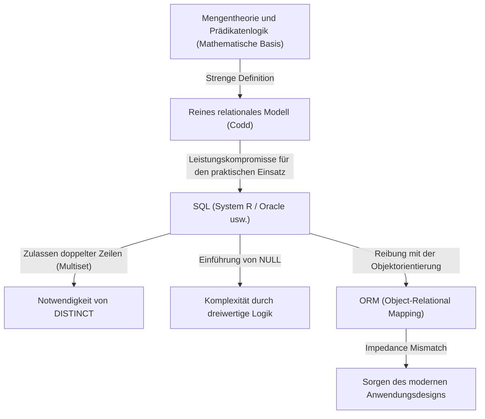

## 1. Einführung: Warum sprechen wir über "Relationen"?

Heute gibt es in der Welt der Softwareentwicklung kaum einen Entwickler, der SQL (Structured Query Language) nicht kennt. Von Webanwendungen über Unternehmenssysteme bis hin zur lokalen Datenspeicherung auf Smartphones sind RDBMS (Relational Database Management Systems) überall im Einsatz.

Jedoch ist "SQL schreiben zu können" etwas völlig anderes als "die Essenz des relationalen Modells zu verstehen". Viele Entwickler entwerfen Datenbanken mit dem naiven mentalen Modell, dass "Tabellen wie Excel-Tabellenblätter sind". Mit diesem Verständnis wird ein System bis zu einem gewissen Grad funktionieren, aber sobald das System wächst und sich die Geschäftslogik verkompliziert, wird es unweigerlich scheitern.

In diesem Artikel kehren wir zu den Ursprüngen des "relationalen Modells" zurück, das 1970 von Edgar F. Codd vorgeschlagen wurde, und erläutern sehr detailliert, auf welchen mathematischen und philosophischen Grundlagen (insbesondere Mengentheorie und Prädikatenlogik) es basiert. Codds großartige Leistung, das physische Speichermedium einer Datenbank in die Welt der reinen Logik und Mathematik zu erheben, war nicht nur ein technischer Durchbruch, sondern ein Paradigmenwechsel in der Informatik.

---

## 2. Das dunkle Zeitalter vor Codd: Die Grenzen navigationaler Datenbanken

Um den wahren Wert des relationalen Modells zu verstehen, muss man wissen, "was es gelöst hat". In den 1960er Jahren waren die vorherrschenden Datenbankmodelle "hierarchische Modelle" und "Netzwerkmodelle" (typische Beispiele sind IBMs IMS und CODASYL-konforme Datenbanksysteme).

Diese Systeme wurden als **"navigational"** (navigatorisch) bezeichnet. Die Beziehungen zwischen den Daten waren durch physische Zeiger (Verweise auf Speicheradressen) fest codiert. Um Daten abzurufen, mussten die Programmierer selbst sich dieser physischen Struktur bewusst sein und prozeduralen Code schreiben, um "über Zeiger vom übergeordneten Datensatz zum untergeordneten Datensatz zu navigieren".

### Fatale Probleme navigationaler Datenbanken

1. **Mangel an Datenunabhängigkeit (Lack of Data Independence)**
   Die physische Datenstruktur (Vorhandensein von Indizes, Art der Zeiger usw.) war eng mit dem Anwendungscode gekoppelt. Daher erforderte selbst die kleinste Änderung der Datenbankstruktur das Umschreiben des gesamten davon abhängigen Anwendungscodes.
2. **Komplexität von Abfragen und Abhängigkeit von Einzelpersonen**
   Wenn es mehrere Pfade (Zugriffspfade) zum Abrufen eines bestimmten Datensatzes gab, musste der Programmierer beurteilen, welcher Pfad am effizientesten war, und den entsprechenden Code schreiben. Dies erforderte ein hohes Maß an handwerklichem Geschick.
3. **Schwierigkeit von Ad-hoc-Abfragen**
   Die Durchführung von Suchen unter Bedingungen, die nicht im Voraus erwartet wurden (z. B. "Auflisten von Mitarbeitern, die einer bestimmten Abteilung angehören und deren Gehalt einen bestimmten Betrag übersteigt"), war aufgrund der Zeigerstruktur unrealistisch oder extrem kostspielig.

Daten waren im "Sumpf" der Hardwarebeschränkungen und physischen Darstellungsmethoden gefangen.

---

## 3. Es werde Licht: Der Paradigmenwechsel von 1970 und die Geburt des "relationalen Modells"

1970 veröffentlichte Edgar F. Codd, ein Informatiker mit mathematischem Hintergrund, der im San Jose Research Laboratory von IBM (dem heutigen Almaden Research Center) arbeitete, sein historisches Papier "A Relational Model of Data for Large Shared Data Banks".

Die Ideen, die Codd in diesem Papier präsentierte, stellten die damaligen Vorstellungen grundlegend auf den Kopf. Er argumentierte, dass "die logische Struktur von Daten vollständig von ihrer physischen Speichermethode getrennt werden sollte", und übernahm die **"Mengentheorie" (Set Theory)** und die **"Prädikatenlogik erster Stufe" (First-Order Predicate Logic)** als mathematische Grundlagen dafür.

### Was ist eine Relation?

Viele Menschen missverstehen den Begriff "Relation" als "Beziehungen zwischen Tabellen" (z. B. die Verbindung zwischen einem Primärschlüssel und einem Fremdschlüssel). In der mathematischen und Codd'schen Definition bezieht sich eine "Relation" jedoch auf **"die Tabelle selbst (streng genommen eine Menge von Tupeln)"**.

Wenn in der Mathematik die Mengen $D_1, D_2, \dots, D_n$ gegeben sind, wird die $n$-stellige Relation $R$ als eine Teilmenge des kartesischen Produkts dieser Mengen definiert.

$R \subseteq D_1 \times D_2 \times \dots \times D_n$

Hierbei gilt:
- $D_1, D_2, \dots$ werden als **Domänen (Domain, Definitionsbereich)** bezeichnet. Dies entspricht einem "Typ (Datentyp)" in einer Datenbank.
- Jedes Element von $R$ wird als **Tupel (Tuple)** bezeichnet. Dies entspricht einer "Zeile (Row, Datensatz)" in einer Datenbank.
- Die gesamte Menge $R$ ist eine **Relation** und entspricht einer "Tabelle" in einer Datenbank.
- Die Beschriftung zur Domäne, zu der jedes Element im Tupel gehört, wird als **Attribut (Attribute)** bezeichnet und entspricht einer "Spalte (Column)" in einer Datenbank.

### Die absolute Einschränkung, eine "Menge" zu sein

Die Tatsache, dass eine Relation als "mathematische Menge" definiert wurde, hat eine äußerst wichtige und strenge Bedeutung. Die Grundregeln der Mengentheorie werden direkt zu den Einschränkungen der Datenmodellierung.

1. **Ausschluss von Duplikaten (Einzigartigkeit von Tupeln)**
   Innerhalb einer Menge ist es nicht erlaubt, dass mehrere identische Elemente existieren ($\{1, 2, 2, 3\}$ ist äquivalent zu $\{1, 2, 3\}$). Daher dürfen innerhalb einer Relation **keine völlig identischen Tupel (Zeilen)** existieren. Dies bedeutet, dass jede Relation zwangsläufig einen Kandidatenschlüssel (eine Menge von Attributen, die sie eindeutig identifizieren kann) haben muss.
2. **Bedeutungslosigkeit der Reihenfolge (Unabhängigkeit von Top-Down / Left-Right)**
   Die Elemente einer Menge haben keine Reihenfolge. Daher ist weder die **Reihenfolge der Tupel (Zeilenfolge)** noch die **Reihenfolge der Attribute (Spaltenfolge)**, aus denen die Relation besteht, von Bedeutung. Konzepte wie "die 3. Zeile" oder "die erste Spalte" existieren im relationalen Modell nicht.
3. **Atomare Werte (Erste Normalform)**
   Die Elemente einer Domäne sollten "Werte sein, die nicht weiter zerlegt werden können (atomar)". Es ist nicht zulässig, Arrays oder verschachtelte Strukturen in ein einziges Attribut zu zwingen.

---

## 4. Relationale Algebra: Die Mathematik zur "Manipulation" von Daten

Nachdem Codd Daten als Mengen definiert hatte, lieferte er als Nächstes ein mathematisches System namens **Relationale Algebra (Relational Algebra)** als Antwort auf die Frage: "Wie können wir die gewünschten Daten aus dieser Menge ableiten?".

Algebra ist ein System einer "Menge von Werten" und der "Operatoren" für diese Werte (z. B. $+$, $-$, $\times$, $\div$ für die Menge der Zahlen). Ein "Wert" in der relationalen Algebra ist eine Relation, und ein "Operator" nimmt eine Relation als Argument und **gibt immer eine neue Relation zurück**.

Dies wird als **"Abgeschlossenheit" (Closure Property)** bezeichnet. Da das Ergebnis der Operation wieder eine Relation ist, können Operationen beliebig oft verschachtelt (verkettet) werden.

Typische Operatoren der relationalen Algebra sind wie folgt:

*   **Restriktion (Restrict / Select: $\sigma$)**: Extrahiert nur die Tupel (Zeilen), die eine Bedingung erfüllen.
*   **Projektion (Project: $\pi$)**: Extrahiert nur bestimmte Attribute (Spalten). Wenn als Ergebnis Duplikate entstehen, werden diese gemäß den Regeln für Mengen eliminiert.
*   **Kartesisches Produkt (Cartesian Product: $\times$)**: Erzeugt alle Kombinationen von zwei Relationen.
*   **Vereinigung (Union: $\cup$)**, **Differenz (Difference: $-$)**, **Durchschnitt (Intersection: $\cap$)**: Grundlegende Operationen in der Mengentheorie. Es ist erforderlich, dass sie vereinigungskompatibel (gleiche Kopfzeile) sind.
*   **Verbund (Join: $\bowtie$)**: Eine Kombination aus kartesischem Produkt und Restriktion, es ist der mächtigste Operator, um verwandte Daten miteinander zu verknüpfen.

Durch die Kombination dieser Operationen ist es möglich, Daten "deklarativ" anzufordern. Anstatt zu beschreiben, "wie die Daten geholt werden sollen (How)", beschreiben Sie, "welche Daten Sie haben möchten (What)". Die Optimierung der Pfadauswahl wurde zur Aufgabe des DBMS (des darin enthaltenen Optimizers) anstatt des menschlichen Programmierers.

---

## 5. Die Kluft zwischen Theorie und Realität: Ist SQL "wirklich relational"?

Lassen Sie uns an dieser Stelle einen Blick auf das SQL werfen, das wir jeden Tag verwenden. Obwohl SQL eine Sprache ist, die vom relationalen Modell inspiriert wurde (entstanden aus SEQUEL des System R-Projekts von IBM), ist sie **im strengen Sinne keine originalgetreue Implementierung von Codds relationalem Modell.**

Puristen, darunter Chris Date (C.J. Date, ein Kollege von Codd und Evangelist des relationalen Modells), haben SQL scharf kritisiert und ihm vorgeworfen, "viele schwerwiegende Verstöße gegen das relationale Modell zu begehen".

### Die "nicht-relationalen" Sünden von SQL

1. **Zulassung doppelter Zeilen (Bag / Multiset)**
   SQL-Tabellen lassen standardmäßig doppelte Zeilen zu. Sie sind nicht als reine Mengen (Set), sondern als Multimengen (Bag / Multiset) implementiert. Um Duplikate zu eliminieren, muss explizit `DISTINCT` geschrieben werden. Dies ist ein schwerwiegender Kompromiss, der das Fundament des relationalen Modells erschüttert.
2. **Existenz von NULL und dreiwertiger Logik (3VL)**
   Das relationale Modell basiert auf einer zweiwertigen Logik von wahr und falsch (Prädikatenlogik erster Stufe), aber SQL führte `NULL` ein, um anzuzeigen, dass "der Wert unbekannt ist oder nicht existiert". Dadurch wird die Auswertungslogik von SQL zu einer **dreiwertigen Logik (Three-Valued Logic)** von TRUE / FALSE / UNKNOWN, was das Verhalten von Abfragen extrem komplex und schwer vorhersehbar macht.
3. **Abhängigkeit von der Spaltenreihenfolge**
   In SQL gibt die Ausführung von `SELECT *` die Spalten in der Reihenfolge zurück, in der die Tabelle definiert wurde. Außerdem kann der Ergebnismenge durch die `ORDER BY`-Klausel eine Reihenfolge gegeben werden (eine geordnete Menge ist keine Relation mehr, sondern eine Liste oder ein Cursor).

Das folgende Diagramm zeigt die Beziehung zwischen dem reinen relationalen Modell und der tatsächlichen SQL-Implementierung.

---

## 6. Die Philosophie der Normalisierung: Die "Wahrheit" der Daten vereinen

Ein unverzichtbares Konzept, wenn man über das relationale Modell spricht, ist die **"Normalisierung" (Normalization)**. Normalisierung bedeutet nicht einfach "Tabellen aufteilen". Es ist der Prozess, Datenanomalien (Update-, Insert-, Delete-Anomalien) zu verhindern und das Ideal der Informationstheorie zu verwirklichen: **"Ein Faktum existiert nur an einem Ort (One Fact in One Place)"**.

Basierend auf dem Konzept der funktionalen Abhängigkeit (Functional Dependency) wird die Tabellenstruktur schrittweise verfeinert.

*   **Erste Normalform (1NF)**: Alle Attribute sind atomar. Es gibt keine sich wiederholenden Gruppen.
*   **Zweite Normalform (2NF)**: Erfüllt 1NF, und alle Nicht-Schlüsselattribute sind vollständig vom gesamten Primärschlüssel funktional abhängig. (Beseitigung partieller funktionaler Abhängigkeiten)
*   **Dritte Normalform (3NF)**: Erfüllt 2NF, und alle Nicht-Schlüsselattribute sind nur vom Primärschlüssel funktional abhängig. Sie sind nicht von anderen Nicht-Schlüsselattributen abhängig. (Beseitigung transitiver funktionaler Abhängigkeiten)
*   **Boyce-Codd-Normalform (BCNF)**: Ein Zustand, in dem für jede funktionale Abhängigkeit $X \rightarrow Y$, $X$ ein Superschlüssel ist. Eine noch strengere Version der 3NF.

Bei der Normalisierung hört man oft die Meinung: "Da sie die Leistung beeinträchtigt, sollte sie angemessen denormalisiert (Denormalization) werden". Es stimmt, dass die Kosten von JOINs aus der Perspektive der physischen Festplatten-E/A ein Problem darstellen können. Normalisierung jedoch in der Entwurfsphase des logischen Datenmodells von vornherein aufzugeben, bedeutet, den extrem gefährlichen Weg zu wählen, die Datenkonsistenz durch den Anwendungscode (Geschäftslogik) zu garantieren.

Eine Datenbank ist nicht nur ein "Datenablageort (Bit Bucket)". **Das Datenbankschema selbst ist das erstklassige Dokument und das ausführende Organ, das die "Wahrheit (Einschränkungen und Regeln)" in diesem Geschäftsbereich deklariert.**

---

## 7. Die Bedeutung des relationalen Modells in der heutigen Zeit und der Aufstieg von NoSQL

Zu Beginn der 2010er Jahre entstand aufgrund der Anforderungen an Big Data und Skalierbarkeit die "NoSQL (Not Only SQL)"-Bewegung. Verschiedene Datenspeicher wie dokumentenorientierte DBs (MongoDB usw.), Key-Value-Stores (Redis usw.), spaltenorientierte DBs und Graphendatenbanken tauchten auf, und es wurde sogar gemunkelt, dass "das Zeitalter der relationalen Datenbanken vorbei ist".

NoSQL deckte Bereiche ab, in denen relationale Datenbanken schwach waren, wie z. B. Skalierbarkeit (horizontale Verteilung, Sharding) und die Erhöhung der Entwicklungsgeschwindigkeit durch Schemalosigkeit. Auch die Möglichkeit, JSON-Dokumente so zu speichern, wie sie sind, war vorteilhaft für die Kompatibilität mit objektorientierten Programmiersprachen (Behebung des Impedance Mismatch).

Als sich NoSQL jedoch verbreitete, erlebten Entwickler in gewisser Weise den vergangenen "Albtraum der navigationalen Datenbanken" erneut.
Sie litten darunter, Beziehungen zwischen Daten auf Code-Ebene zu verknüpfen (Application Joins) und aufgrund des Fehlens von Transaktionen mit Dateninkonsistenzen umzugehen. Infolgedessen wurden die Forderungen nach starker Datenkonsistenz und deklarativen Abfragen wieder lauter, und viele der heutigen führenden NoSQL-Datenbanken haben begonnen, Transaktionsfunktionen und SQL-ähnliche Abfragesprachen zu implementieren.

Andererseits realisieren Next-Generation-Datenbanken, sogenannte NewSQL (Google Spanner, CockroachDB usw.), eine Cloud-native horizontale verteilte Architektur, während sie das starke theoretische Fundament und die SQL-Schnittstelle des relationalen Modells beibehalten.

Die Philosophie, "Daten als logische und mathematische Mengen zu behandeln", die Codd 1970 begründete, ist auch ein halbes Jahrhundert später noch keineswegs verblasst. Ganz gleich, wie sehr sich die physische Speicherung und die Infrastruktur weiterentwickeln, das relationale Modell bleibt als Monument in der Geschichte der Informatik bestehen, als Antwort auf die fundamentale Herausforderung, "wie man Informationen widerspruchsfrei und flexibel handhabt".

## 8. Fazit: Stellen Sie sich vor dem Schreiben von Code eine "Menge" vor

In der täglichen Entwicklungsarbeit, in der Daten durch einfachen Aufruf von Methoden eines OR-Mappers (ORM) abgerufen werden können, gibt es heutzutage vielleicht weniger Gelegenheiten, sich des dahinter liegenden relationalen Modells bewusst zu sein. ORMs sind sehr praktisch, aber sie bergen gleichzeitig die Gefahr, die Wahrheit zu verbergen, dass "eine Relation eine Menge ist".

Wenn komplexe Abfragen keine Leistung bringen oder Dateninkonsistenzen auftreten, halten Sie einen Moment inne, anstatt symptomatischen Code hinzuzufügen, und kehren Sie zur Welt der "logischen Form (Schema)" von Daten und den "Mengenoperationen (Algebra)", die sie manipulieren, zurück.

Eine Tabelle ist kein Excel-Arbeitsblatt, sondern eine "Menge von Wahrheiten (Facts)".
SQL ist nicht nur ein Befehl zum Datenabruf, sondern "die Suche nach der Wahrheit mittels Prädikatenlogik".

Durch das Verständnis dieser tiefgründigen Philosophie, die Edgar F. Codd hinterlassen hat, werden sich Ihr Datenbankdesign und Ihre SQL-Abfragen sicherlich zu etwas Robusterem, Schönerem und wirklich Mächtigem entwickeln.
