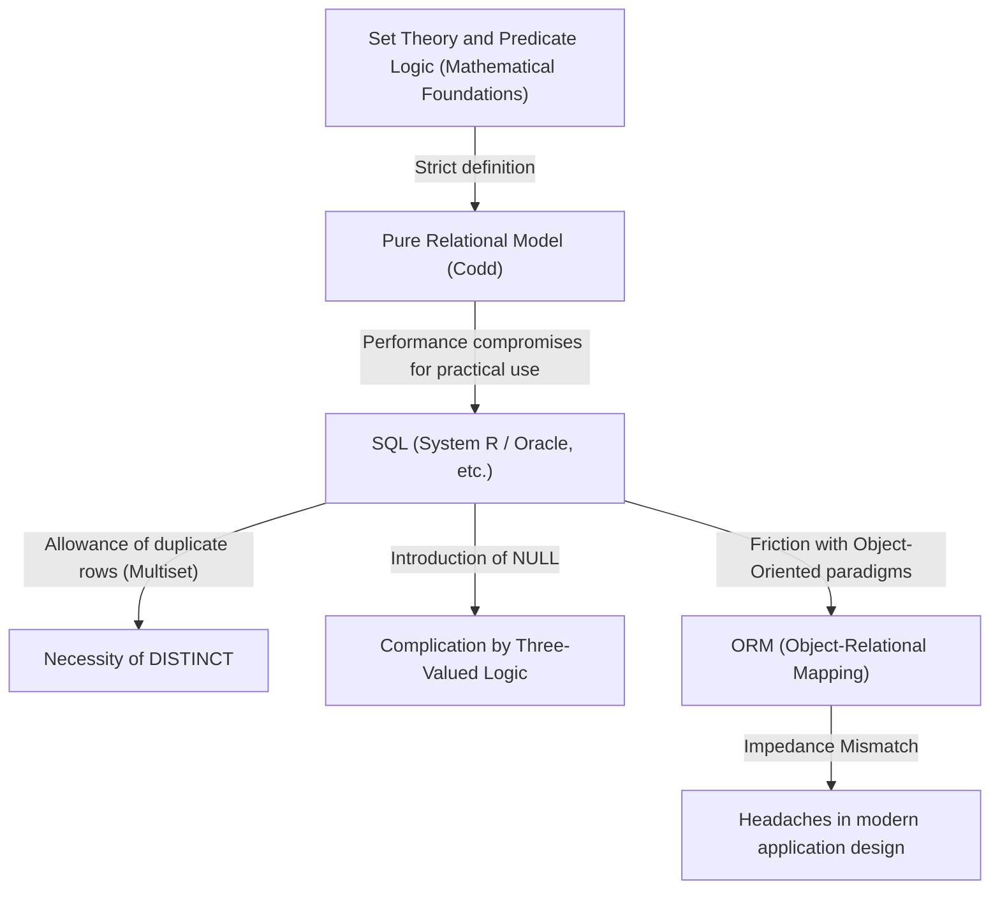

## 1. Introduction: Why Do We Talk About "Relations"?

Today, in the world of software engineering, there are very few developers who don't know SQL (Structured Query Language). From web applications to enterprise systems, and even local data storage on smartphones, RDBMS (Relational Database Management Systems) are running everywhere.

However, "being able to write SQL" and "understanding the essence of the relational model" are entirely different dimensions. Many developers design databases with a naive mental model that "a table is like an Excel sheet." While a system can operate to some extent with this understanding, as the system grows in scale and complex domain logic becomes intertwined, it will eventually collapse.

In this article, we will go back to the origins of the "relational model" proposed by Edgar F. Codd in 1970, and explain in great detail the mathematical and philosophical foundations (especially set theory and predicate logic) upon which it is built. Codd's monumental achievement of elevating the database, a physical storage device, into a world of pure logic and mathematics was not merely a technical breakthrough; it was a paradigm shift in computer science.

---

## 2. The Dark Ages Before Codd: The Limitations of Navigational Databases

To appreciate the true value of the relational model, we must understand "what it solved." In the 1960s, the mainstream database models were known as the "hierarchical model" and the "network model" (representative examples include IBM's IMS and CODASYL-compliant database systems).

These systems were called **"navigational"**. The relationships between data were hardcoded by physical [pointers](/en/p/c-language-pointers-memory-management-stack-heap/) (references to memory addresses). To retrieve data, programmers had to be aware of this physical structure themselves and write procedural code to "navigate by following [pointers](/en/p/c-language-pointers-memory-management-stack-heap/) from parent records to child records."

### Fatal Flaws of Navigational Databases

1. **Lack of Data Independence**
   Physical data structures (such as the presence of indexes and how [pointers](/en/p/c-language-pointers-memory-management-stack-heap/) were linked) were tightly coupled with the application code. Therefore, even the slightest change to the database structure required rewriting all dependent application code.
2. **Query Complexity and Dependency on Individual Skills**
   When multiple access paths existed to retrieve a specific dataset, the programmer had to determine which path was the most efficient and write the code accordingly. This required advanced craftsmanship.
3. **Difficulty with Ad-hoc Queries**
   Searching under unanticipated conditions (e.g., "list all employees belonging to a certain department with a salary above a certain amount") was either highly impractical or extremely costly due to the pointer structure.

Data was trapped in the "quagmire" of hardware constraints and physical representations.

---

## 3. Let There Be Light: The 1970 Paradigm Shift and the Birth of the "Relational Model"

In 1970, Edgar F. Codd, a mathematician-turned-computer-scientist working at IBM's San Jose Research Laboratory (now the Almaden Research Center), published a historic paper titled "A Relational Model of Data for Large Shared Data Banks".

The ideas Codd presented in this paper fundamentally overturned the common sense of the time. He argued that "the logical structure of data should be completely separated from its physical storage method," and adopted **"Set Theory"** and **"First-Order Predicate Logic"** as the mathematical foundations for this.

### What is a Relation?

Many people misunderstand the term "Relation" to mean "the relationship between tables" (for example, the link between a primary key and a foreign key). However, in the mathematical and Coddian definition, a "Relation" refers to **"the table itself (strictly speaking, a set of tuples)"**.

In mathematics, given sets $D_1, D_2, \dots, D_n$, an $n$-ary relation $R$ is defined as a subset of the Cartesian product of these sets.

$R \subseteq D_1 \times D_2 \times \dots \times D_n$

Here:
- $D_1, D_2, \dots$ are called **Domains**. They correspond to "types (data types)" in a database.
- Each element of $R$ is called a **Tuple**. It corresponds to a "row (record)" in a database.
- The entire set $R$ is a **Relation**, which corresponds to a "table" in a database.
- The labeling of the domain to which each element in a tuple belongs is called an **Attribute**, corresponding to a "column" in a database.

### The Absolute Constraints of Being a "Set"

Defining a relation as a "mathematical set" has profound and strict implications. The fundamental rules of set theory become the constraints of data modeling directly.

1. **Elimination of Duplicates (Tuple Uniqueness)**
   In a set, the existence of multiple identical elements is not allowed ($\{1, 2, 2, 3\}$ is equivalent to $\{1, 2, 3\}$). Therefore, **completely identical tuples (rows) must not exist** within a relation. This means that every relation must have a candidate key (a set of attributes that uniquely identify it).
2. **Insignificance of Ordering (Top-Down / Left-Right Independence)**
   Elements in a set have no order. Therefore, the **order of the tuples (row order)** and the **order of the attributes (column order)** that make up a relation are meaningless. Concepts like "the 3rd row" or "the first column" do not exist in the relational model.
3. **Atomic Values (First Normal Form)**
   The elements of a domain were supposed to be "atomic values (cannot be decomposed further)." Pushing arrays or nested structures into a single attribute is not permitted.

---

## 4. Relational Algebra: The Mathematics of "Manipulating" Data

Having defined data as sets, Codd then provided a mathematical system called **Relational Algebra** to answer the question of "how to derive the desired data from those sets."

Algebra is a system consisting of a "set of values" and "operators" applied to those values (e.g., $+$, $-$, $\times$, $\div$ for a set of numbers). In relational algebra, the "values" are relations, and the "operators" take relations as arguments and **always return a new relation**.

This is called the **"Closure Property"**. Because the result of an operation is a relation again, operations can be nested (chained) indefinitely.

The primary relational algebra operators are:

*   **Restrict / Select ($\sigma$)**: Extracts only the tuples (rows) that satisfy a condition.
*   **Project ($\pi$)**: Extracts only specific attributes (columns). If duplicates occur as a result, they are eliminated according to the rules of sets.
*   **Cartesian Product ($\times$)**: Generates all combinations of two relations.
*   **Union ($\cup$)**, **Difference ($-$)**, **Intersection ($\cap$)**: Fundamental operations in set theory. They require the relations to be union-compatible (having the same heading).
*   **Join ($\bowtie$)**: A combination of Cartesian Product and Restrict, this is the most powerful operation for linking related data together.

By combining these operations, it becomes possible to request data "declaratively." You describe "what data you want (What)" instead of "how to fetch the data (How)." The optimization of path selection became the responsibility of the DBMS (specifically, the optimizer inside it) rather than human programmers.

---

## 5. The Gap Between Theory and Reality: Is SQL "Truly Relational"?

Now, let's look at the SQL we use daily. SQL is a language inspired by the relational model (originating from SEQUEL in IBM's System R project), but in fact, **strictly speaking, it is not a faithful implementation of Codd's relational model.**

Purists, including C.J. Date (Codd's colleague and evangelist of the relational model), have severely criticized SQL, stating that it "commits many serious violations against the relational model."

### SQL's "Non-Relational" Sins

1. **Allowance of Duplicate Rows (Bag / Multiset)**
   SQL tables allow duplicate rows by default. They are implemented as multisets (Bags) rather than pure sets (Sets). To eliminate duplicates, you must explicitly write `DISTINCT`. This is a significant compromise that shakes the foundation of the relational model.
2. **The Existence of NULL and Three-Valued Logic (3VL)**
   While the relational model is based on the two-valued logic of true and false (first-order predicate logic), SQL introduced `NULL` to indicate that "the value is unknown or does not exist." This caused SQL's evaluation logic to become a **Three-Valued Logic (3VL)** of TRUE / FALSE / UNKNOWN, making the behavior of queries extremely complex and unpredictable.
3. **Dependency on Column Order**
   In SQL, executing `SELECT *` returns the columns in the order they were defined in the table. Furthermore, the `ORDER BY` clause can impose an order on the result set (an ordered result is no longer a relation, but a list or cursor).

The following diagram illustrates the relationship between the pure relational model and practical SQL implementations.

---

## 6. The Philosophy of Normalization: Unifying the "Truth" of Data

An indispensable concept when discussing the relational model is **"Normalization"**. Normalization is not simply about "splitting tables." It is a process aimed at preventing data anomalies (update anomalies, insertion anomalies, deletion anomalies) and realizing the information theory ideal of **"One Fact in One Place"**.

Based on the concept of Functional Dependency, the table structure is progressively refined.

*   **First Normal Form (1NF)**: All attributes are atomic. There are no repeating groups.
*   **Second Normal Form (2NF)**: Satisfies 1NF, and every non-key attribute is fully functionally dependent on the entire primary key. (Elimination of partial functional dependencies).
*   **Third Normal Form (3NF)**: Satisfies 2NF, and every non-key attribute is functionally dependent *only* on the primary key. It is not dependent on other non-key attributes. (Elimination of transitive functional dependencies).
*   **Boyce-Codd Normal Form (BCNF)**: A state where, for every functional dependency $X \rightarrow Y$, $X$ is a superkey. A stricter version of 3NF.

We often hear the opinion that "normalization hurts performance, so we should appropriately denormalize." It is true that from the perspective of physical disk I/O, the cost of JOINs can be a problem. However, giving up on normalization right from the logical data model design phase means choosing the extremely dangerous path of guaranteeing data integrity through application code (business logic).

A database is not a mere "Bit Bucket" (data dumping ground). **The database schema itself is a first-class document and the enforcement agency declaring the "truth (constraints and rules)" in that business domain.**

---

## 7. The Significance of the Relational Model in the Modern Era and the Rise of NoSQL

In the 2010s, the demands for big data and scalability sparked the "NoSQL (Not Only SQL)" movement. Various data stores emerged, such as document-oriented DBs (MongoDB, etc.), key-value stores (Redis, etc.), column-oriented DBs, and graph DBs, leading some to whisper that "the era of relational databases is over."

NoSQL covered areas where relational databases struggled, such as scalability (horizontal distribution, sharding) and accelerating development speed through schemaless designs. In addition, being able to store JSON documents directly was advantageous regarding compatibility with object-oriented programming languages (resolving the impedance mismatch).

However, as NoSQL became widespread, developers essentially re-experienced the "nightmare of navigational databases" in a sense.
They found themselves joining data relationships at the code level (application joins) and suffering from data inconsistencies due to the lack of transactions. As a result, the demand for strong data consistency and declarative queries rose again, and many of today's leading NoSQL databases have implemented transaction features and SQL-like query languages.

On the other hand, next-generation databases called NewSQL (Google Spanner, CockroachDB, etc.) have achieved cloud-native horizontal distribution architectures while maintaining the strong theoretical foundations of the relational model and the SQL interface.

The philosophy established by Codd in 1970 of "treating data as logical and mathematical sets" has not faded in the slightest even after half a century. No matter how physical storage or infrastructure forms evolve, the relational model continues to reign as a monumental achievement in the history of computer science, providing the answer to the essential challenge of "how to handle information consistently and flexibly."

## 8. Conclusion: Picture "Sets" Before Writing Code

In daily development work, in an era where data can be retrieved simply by invoking ORM (Object-Relational Mapping) methods, there might be fewer opportunities to be conscious of the underlying relational model. ORMs are extremely convenient, but at the same time, they carry the danger of hiding the truth that "relations are sets."

When complex queries perform poorly, or when data inconsistencies begin to arise, rather than adding symptomatic code, stop for a moment and return to the world of the data's "logical form (schema)" and the "set operations (algebra)" that manipulate it.

A table is not an Excel sheet; it is a "set of Facts."
SQL is not a mere command for retrieving data; it is the "pursuit of truth using predicate logic."

By understanding this profound philosophy left behind by Edgar F. Codd, your database designs and SQL queries should evolve into something more robust, beautiful, and truly powerful.
