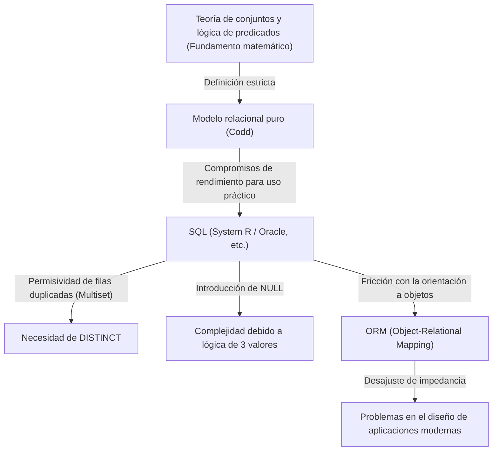
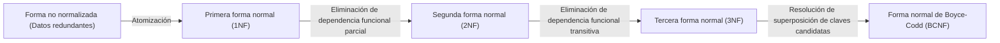

## 1. Introducción: ¿Por qué hablamos de "relaciones"?

Hoy en día, en el mundo de la ingeniería de software, casi no hay desarrollador que no conozca SQL (Structured Query Language). Desde aplicaciones web hasta sistemas empresariales, e incluso el almacenamiento local de datos en teléfonos inteligentes, los RDBMS (Relational Database Management System) operan en todas partes.

Sin embargo, "saber escribir SQL" y "comprender la esencia del modelo relacional" son temas de dimensiones completamente diferentes. Muchos desarrolladores diseñan bases de datos con un modelo mental simple: "una tabla = algo parecido a una hoja de Excel". Con esta comprensión, los sistemas pueden funcionar hasta cierto punto, pero a medida que el tamaño del sistema crece y la lógica del dominio se vuelve más compleja, se desmorona rápidamente.

En este artículo, volveremos a los orígenes del "modelo relacional" propuesto por Edgar F. Codd en 1970 y explicaremos con gran detalle sobre qué fundamentos matemáticos y filosóficos (especialmente la teoría de conjuntos y la lógica de predicados) está construido. El logro de Codd, que elevó los dispositivos de almacenamiento físico de bases de datos al mundo de la lógica pura y las matemáticas, no fue un mero avance técnico, sino un cambio de paradigma en la informática.

---

## 2. La edad oscura antes de Codd: Los límites de las bases de datos navegacionales

Para comprender el verdadero valor del modelo relacional, debemos saber "qué resolvió". En la década de 1960, los modelos de bases de datos dominantes se denominaban "modelos jerárquicos" y "modelos de red" (los ejemplos representativos incluyen IMS de IBM y sistemas de bases de datos conformes a CODASYL).

Estos sistemas se denominaban **"navegacionales" (navigational)**. Las relaciones entre datos estaban codificadas mediante [punteros](/es/p/c-language-pointers-memory-management-stack-heap/) físicos (referencias a direcciones de memoria). Para recuperar los datos, los propios programadores debían ser conscientes de su estructura física y escribir código procedimental que "siguiera los [punteros](/es/p/c-language-pointers-memory-management-stack-heap/) y se moviera del registro padre al registro hijo".

### Problemas fatales de las bases de datos navegacionales

1. **Falta de independencia de los datos (Lack of Data Independence)**
   La estructura de datos física (presencia de índices, cómo se conectaban los [punteros](/es/p/c-language-pointers-memory-management-stack-heap/), etc.) estaba estrechamente acoplada con el código de la aplicación. Por lo tanto, si la estructura de la base de datos se modificaba en lo más mínimo, era necesario reescribir todo el código de la aplicación que dependía de ella.
2. **Complejidad de las consultas y dependencia de personas específicas**
   Cuando existían múltiples rutas (rutas de acceso) para recuperar un conjunto de datos específico, el programador debía determinar cuál era la más eficiente y escribir el código en consecuencia. Esto requería un alto grado de habilidad artesanal.
3. **Dificultad de consultas ad hoc**
   Realizar búsquedas bajo condiciones no previstas (por ejemplo, "listar empleados que pertenecen a cierto departamento y cuyo salario supera cierta cantidad") era poco realista o requería un costo inmenso debido a la estructura de [punteros](/es/p/c-language-pointers-memory-management-stack-heap/).

Los datos estaban atrapados en el "pantano" de las restricciones de hardware y representaciones físicas.

---

## 3. Hágase la luz: El cambio de paradigma de 1970 y el nacimiento del "Modelo Relacional"

En 1970, Edgar F. Codd, un científico de la computación con formación en matemáticas que trabajaba en el Laboratorio San Jose de IBM (ahora Centro de Investigación Almaden), publicó el artículo histórico "A Relational Model of Data for Large Shared Data Banks".

Las ideas presentadas por Codd en este artículo volcaron el sentido común de la época desde sus raíces. Sostuvo que "la estructura lógica de los datos debe estar completamente separada de su método de almacenamiento físico", y adoptó la **"Teoría de Conjuntos (Set Theory)"** y la **"Lógica de Predicados de Primer Orden (First-Order Predicate Logic)"** como sus fundamentos matemáticos.

### ¿Qué es una relación?

Muchas personas malinterpretan la palabra "Relación (Relation)" como "la relación entre tablas (relationship)" (por ejemplo, el vínculo entre una clave primaria y una clave foránea). Sin embargo, en la definición matemática y de Codd, una "relación" se refiere a **"la tabla en sí misma (estrictamente, un conjunto de tuplas)"**.

En matemáticas, dados los conjuntos $D_1, D_2, \dots, D_n$, una relación de $n$-tupla $R$ se define como un subconjunto del producto cartesiano (producto directo) de estos conjuntos.

$R \subseteq D_1 \times D_2 \times \dots \times D_n$

Aquí:
- $D_1, D_2, \dots$ se denominan **Dominios (Domain, dominio de definición)**. Corresponde al "tipo (tipo de datos)" en una base de datos.
- Cada elemento de $R$ se denomina **Tupla (Tuple)**. Corresponde a una "fila (Row, registro)" en una base de datos.
- El conjunto completo $R$ es la **Relación (Relation)**, que corresponde a una "tabla" en una base de datos.
- El etiquetado del dominio al que pertenece cada elemento en una tupla se denomina **Atributo (Attribute)**, y corresponde a una "columna (Column)" en una base de datos.

### La restricción absoluta de ser un "conjunto"

Que una relación se defina como un "conjunto matemático" tiene un significado sumamente importante y estricto. Las reglas básicas de la teoría de conjuntos se convierten directamente en restricciones del modelado de datos.

1. **Eliminación de duplicados (Unicidad de tuplas)**
   En un conjunto, no se permite que existan múltiples elementos idénticos ($\{1, 2, 2, 3\}$ es equivalente a $\{1, 2, 3\}$). Por lo tanto, en una relación, **no deben existir tuplas (filas) completamente idénticas**. Esto significa que toda relación debe tener una clave candidata (un conjunto de atributos que puedan identificarla de manera única).
2. **Insignificancia del orden (Independencia Top-Down / Left-Right)**
   Los elementos de un conjunto no tienen orden. Por lo tanto, ni el **orden de las tuplas (filas)** ni el **orden de los atributos (columnas)** que componen una relación tienen significado. Conceptos como "tercera fila" o "primera columna" no existen en el modelo relacional.
3. **Valores atómicos (Primera Forma Normal)**
   Se estipuló que los elementos de un dominio deben ser "valores que no pueden descomponerse más (atómicos)". No se permite empaquetar arreglos o estructuras anidadas en un solo atributo.

---

## 4. Álgebra Relacional: Matemáticas para "operar" con datos

Codd, quien definió los datos como conjuntos, preparó un sistema matemático llamado **Álgebra Relacional (Relational Algebra)** para responder a la pregunta de "cómo derivar los datos deseados de esos conjuntos".

El álgebra es un sistema con "un conjunto de valores" y "operadores" para esos valores (por ejemplo, $+$, $-$, $\times$, $\div$ para el conjunto de números). El "valor" en el álgebra relacional es una relación, y el "operador" toma una relación como argumento y **siempre devuelve una nueva relación**.

A esto se le llama **"Propiedad de Clausura (Closure Property)"**. Debido a que el resultado de una operación es nuevamente una relación, las operaciones pueden anidarse (encadenarse) indefinidamente.

Los operadores representativos del álgebra relacional son:

*   **Restricción (Restrict / Select: $\sigma$)**: Extrae solo las tuplas (filas) que cumplen una condición.
*   **Proyección (Project: $\pi$)**: Extrae solo atributos específicos (columnas). Si ocurren duplicados como resultado, se eliminan según las reglas de los conjuntos.
*   **Producto Cartesiano (Cartesian Product: $\times$)**: Genera todas las combinaciones de dos relaciones.
*   **Unión (Union: $\cup$)**, **Diferencia (Difference: $-$)**, **Intersección (Intersection: $\cap$)**: Operaciones básicas en la teoría de conjuntos. Deben ser compatibles (tener la misma cabecera).
*   **Reunión (Join: $\bowtie$)**: Una combinación del producto cartesiano y la restricción, es la operación más poderosa para vincular datos relacionados entre sí.

Combinando estas operaciones, es posible solicitar datos de manera "declarativa". No describes "cómo obtener los datos (How)", sino "qué datos deseas (What)". La optimización de la selección de ruta se convirtió en un trabajo para el DBMS (específicamente su optimizador), no para el programador humano.

---

## 5. La brecha entre teoría y realidad: ¿Es SQL "verdaderamente relacional"?

Ahora, veamos el SQL que usamos todos los días. SQL es un lenguaje inspirado en el modelo relacional (su origen es SEQUEL, del proyecto System R de IBM), pero de hecho, **en un sentido estricto, no es una implementación fiel del modelo relacional de Codd.**

Puristas como Chris Date (C.J. Date, colega de Codd y evangelista del modelo relacional) han criticado duramente a SQL por "cometer numerosas violaciones graves contra el modelo relacional".

### Los pecados "no relacionales" de SQL

1. **Permisividad con filas duplicadas (Bag / Multiset)**
   Por defecto, las tablas en SQL permiten filas duplicadas. Están implementadas no como conjuntos puros (Set), sino como multiconjuntos (Bag / Multiset). Debes escribir explícitamente `DISTINCT` para eliminar duplicados. Este es un compromiso grave que sacude los cimientos del modelo relacional.
2. **Existencia de NULL y lógica de 3 valores (3VL)**
   El modelo relacional se basa en una lógica de 2 valores de verdadero y falso (lógica de predicados de primer orden), pero SQL introdujo `NULL` para indicar que "el valor es desconocido o no existe". Debido a esto, la lógica de evaluación de SQL se convirtió en una **lógica de tres valores (Three-Valued Logic)** (VERDADERO / FALSO / DESCONOCIDO), lo que hace que el comportamiento de las consultas sea extremadamente complejo e impredecible.
3. **Dependencia del orden de las columnas**
   En SQL, cuando se ejecuta `SELECT *`, las columnas se devuelven en el orden en que se definió la tabla. Además, puedes dar un orden al conjunto de resultados usando la cláusula `ORDER BY` (un resultado ordenado ya no es una relación, sino una lista o cursor).

El siguiente diagrama muestra la relación entre el modelo relacional puro y la implementación real de SQL.

---

## 6. La filosofía de la normalización: Unificar la "verdad" de los datos

Imprescindible al hablar del modelo relacional es el concepto de **"Normalización (Normalization)"**. Normalizar no es simplemente "dividir tablas". Es el proceso para prevenir anomalías en los datos (anomalías de actualización, inserción y eliminación) y realizar el ideal de la teoría de la información: **"Un hecho en un solo lugar (One Fact in One Place)"**.

Basado en el concepto de Dependencia Funcional (Functional Dependency), la estructura de la tabla se refina en etapas.

*   **Primera Forma Normal (1NF)**: Todos los atributos son atómicos. No existen grupos repetidos.
*   **Segunda Forma Normal (2NF)**: Cumple con 1NF y, además, todos los atributos que no son clave tienen dependencia funcional completa sobre toda la clave primaria. (Eliminación de la dependencia funcional parcial)
*   **Tercera Forma Normal (3NF)**: Cumple con 2NF y, además, todos los atributos que no son clave tienen dependencia funcional solo con la clave primaria. No dependen de otros atributos que no sean clave. (Eliminación de la dependencia funcional transitiva)
*   **Forma Normal de Boyce-Codd (BCNF)**: Un estado en el que, para toda dependencia funcional $X \rightarrow Y$, $X$ es una superclave. Una versión aún más estricta de 3NF.

En la normalización, a menudo se escucha la opinión de que "se debe desnormalizar (Denormalization) moderadamente porque degrada el rendimiento". Es cierto que, desde la perspectiva de E/S de disco físico, el costo del JOIN puede convertirse en un problema. Sin embargo, renunciar a la normalización desde el principio durante la fase de diseño del modelo de datos lógico significa elegir un camino extremadamente peligroso donde la integridad de los datos debe garantizarse mediante el código de la aplicación (lógica de negocio).

Una base de datos no es solo un "contenedor de datos (Bit Bucket)". **El propio esquema de la base de datos es un documento de primera clase que declara la "verdad (restricciones y reglas)" en ese dominio de negocio, y es la agencia ejecutiva.**

---

## 7. El significado del modelo relacional en la era moderna y el auge de NoSQL

A partir de la década de 2010, surgió el movimiento "NoSQL (Not Only SQL)" debido a las demandas de Big Data y escalabilidad. Aparecieron varios almacenes de datos, como bases de datos orientadas a documentos (MongoDB, etc.), de tipo clave-valor (Redis, etc.), orientadas a columnas, bases de datos de grafos, y se llegó a decir que "la era relacional ha terminado".

NoSQL cubrió áreas en las que las bases de datos relacionales eran débiles, como la escalabilidad (distribución horizontal, fragmentación) y la mejora de la velocidad de desarrollo gracias a no requerir esquema (schemaless). Además, poder guardar documentos JSON tal como están era ventajoso en compatibilidad con lenguajes de programación orientados a objetos (resolución del desajuste de impedancia).

Sin embargo, como resultado de la popularidad de NoSQL, los desarrolladores volvieron a experimentar en cierto modo la antigua "pesadilla de las bases de datos navegacionales".
Sufrieron al tener que combinar relaciones entre datos a nivel de código (application join) o enfrentar inconsistencias de datos debido a la falta de transacciones. Como resultado, las demandas por una fuerte consistencia de datos y consultas declarativas aumentaron nuevamente, y muchas bases de datos NoSQL modernas ahora implementan características transaccionales y lenguajes de consulta similares a SQL.

Por otro lado, la base de datos de próxima generación llamada NewSQL (Google Spanner, CockroachDB, etc.) ha realizado una arquitectura distribuida horizontalmente nativa de la nube, manteniendo los poderosos fundamentos teóricos y la interfaz SQL del modelo relacional.

La filosofía que Codd construyó en 1970 de "tratar los datos como conjuntos lógicos y matemáticos" no se ha desvanecido en absoluto medio siglo después. No importa cómo evolucione la forma del almacenamiento físico e infraestructura, el modelo relacional sigue reinando como un monumento en la historia de la informática como respuesta al desafío esencial de "cómo manejar la información sin contradicciones y de manera flexible".

## 8. Conclusión: Imagina "conjuntos" antes de escribir código

En el trabajo de desarrollo diario, donde los datos se pueden obtener simplemente llamando a los métodos de un OR Mapper (ORM), las oportunidades de ser conscientes del modelo relacional detrás de ellos pueden haber disminuido. Aunque el ORM es extremadamente conveniente, al mismo tiempo conlleva el peligro de ocultar la verdad de que "las relaciones son conjuntos".

Cuando el rendimiento de una consulta compleja se degrada, o cuando empiezan a surgir inconsistencias en los datos, en lugar de agregar código para un tratamiento sintomático, deténgase un momento y regrese al mundo de la "forma lógica (esquema)" de los datos y el "álgebra de conjuntos (álgebra)" que los manipula.

Una tabla no es una hoja de Excel, sino un "conjunto de verdades (Fact)".
SQL no es solo un comando para extraer datos, sino una "búsqueda de la verdad utilizando lógica de predicados".

Al comprender esta profunda filosofía dejada por Edgar F. Codd, el diseño de sus bases de datos y consultas SQL evolucionarán hacia algo mucho más robusto, hermoso y verdaderamente poderoso.
