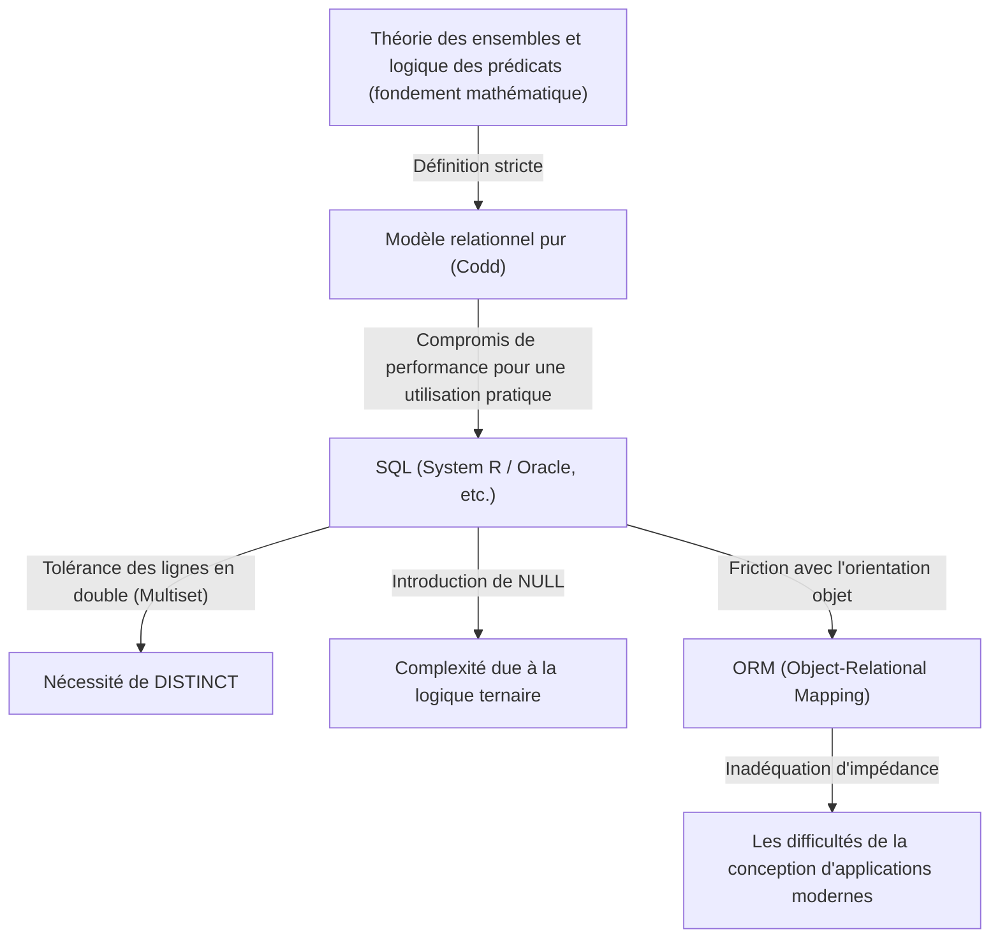

## 1. Introduction : Pourquoi parlons-nous de « relation » ?

Aujourd'hui, dans le monde du génie logiciel, il n'y a presque aucun développeur qui ne connaisse pas SQL (Structured Query Language). Des applications Web aux systèmes d'entreprise, et même au stockage de données local sur les smartphones, les RDBMS (Relational Database Management System) fonctionnent partout.

Cependant, « savoir écrire du SQL » et « comprendre l'essence du modèle relationnel » sont deux choses totalement différentes. De nombreux développeurs conçoivent des bases de données avec un modèle mental naïf où « une table = un peu comme une feuille Excel ». Ce niveau de compréhension peut faire fonctionner un système jusqu'à un certain point, mais à mesure que le système s'agrandit et que la logique du domaine devient complexe, il finit inévitablement par s'effondrer.

Dans cet article, nous remonterons aux origines du « modèle relationnel » proposé par Edgar F. Codd en 1970, et nous détaillerons extrêmement précisément les fondements mathématiques et philosophiques (en particulier la théorie des ensembles et la logique des prédicats) sur lesquels il repose. La réalisation de Codd, qui a élevé la base de données d'un dispositif de stockage physique à un monde pur de logique et de mathématiques, n'était pas seulement une percée technique, mais un changement de paradigme dans l'informatique.

---

## 2. L'âge sombre avant Codd : Les limites des bases de données navigationnelles

Pour comprendre la véritable valeur du modèle relationnel, il faut savoir « ce qu'il a résolu ». Dans les années 1960, les modèles de bases de données dominants étaient appelés « modèles hiérarchiques » ou « modèles réseau » (des exemples typiques incluent IMS d'IBM et les systèmes de bases de données conformes à CODASYL).

Ces systèmes étaient qualifiés de **« navigationnels »**. Les relations entre les données étaient codées en dur avec des pointeurs physiques (références à des adresses mémoire), et pour récupérer des données, les programmeurs devaient eux-mêmes être conscients de cette structure physique et écrire du code procédural pour « naviguer en suivant les pointeurs d'un enregistrement parent à un enregistrement enfant ».

### Les problèmes fatals des bases de données navigationnelles

1. **Le manque d'indépendance des données (Lack of Data Independence)**
   La structure physique des données (présence ou absence d'index, comment les pointeurs étaient définis, etc.) était étroitement couplée au code de l'application. Par conséquent, si vous changiez la structure de la base de données, même légèrement, vous deviez réécrire tout le code de l'application qui en dépendait.
2. **La complexité des requêtes et la dépendance aux compétences individuelles**
   S'il existait plusieurs chemins (chemins d'accès) pour récupérer un ensemble de données spécifique, le programmeur devait déterminer quel chemin était le plus efficace et écrire le code. Cela nécessitait un savoir-faire hautement spécialisé.
3. **La difficulté des requêtes ad hoc**
   Effectuer des recherches avec des conditions imprévues (par exemple, « lister les employés appartenant à un certain département et ayant un salaire supérieur à un certain montant ») était soit irréaliste en raison de la structure des pointeurs, soit nécessitait des coûts énormes.

Les données étaient piégées dans un « bourbier » de contraintes matérielles et de représentations physiques.

---

## 3. Que la lumière soit : Le changement de paradigme de 1970 et la naissance du « Modèle Relationnel »

En 1970, Edgar F. Codd, un informaticien et ancien mathématicien travaillant au laboratoire de recherche de San Jose d'IBM (aujourd'hui le centre de recherche Almaden), a publié un article historique intitulé « A Relational Model of Data for Large Shared Data Banks ».

Les idées présentées par Codd dans cet article ont fondamentalement bouleversé le bon sens de l'époque. Il a soutenu que « la structure logique des données devrait être complètement séparée de sa méthode de stockage physique » et a adopté la **« Théorie des Ensembles (Set Theory) »** et la **« Logique des Prédicats du Premier Ordre (First-Order Predicate Logic) »** comme fondements mathématiques pour y parvenir.

### Qu'est-ce qu'une relation ?

Beaucoup de gens se méprennent en pensant que le mot « Relation » fait référence à la « relation entre les tables » (comme le lien entre la clé primaire et la clé étrangère). Cependant, dans la définition mathématique et selon Codd, une « relation » désigne **« la table elle-même (strictement parlant, un ensemble de tuples) »**.

En mathématiques, étant donné les ensembles $D_1, D_2, \dots, D_n$, une relation n-aire $R$ est définie comme un sous-ensemble du produit cartésien de ces ensembles.

$R \subseteq D_1 \times D_2 \times \dots \times D_n$

Où,
- $D_1, D_2, \dots$ sont appelés le **domaine (Domain)**. Cela correspond au « type (type de données) » dans une base de données.
- Chaque élément de $R$ est appelé un **tuple (Tuple)**. Cela correspond à une « ligne (Row, enregistrement) » dans une base de données.
- L'ensemble entier $R$ est une **relation (Relation)**, ce qui correspond à une « table » dans une base de données.
- L'étiquetage du domaine auquel appartient chaque élément du tuple est appelé un **attribut (Attribute)**, ce qui correspond à une « colonne (Column) » dans une base de données.

### Les contraintes absolues d'être un « ensemble »

Le fait qu'une relation soit définie comme un « ensemble mathématique » a une signification extrêmement importante et stricte. Les règles de base de la théorie des ensembles deviennent les contraintes de la modélisation des données.

1. **Élimination des doublons (Unicité des tuples)**
   Il est interdit d'avoir plusieurs éléments identiques dans un ensemble ($\{1, 2, 2, 3\}$ équivaut à $\{1, 2, 3\}$). Par conséquent, **il ne doit y avoir aucun tuple (ligne) complètement identique** dans une relation. Cela signifie que chaque relation doit avoir une clé candidate (un ensemble d'attributs qui peut l'identifier de manière unique).
2. **L'insignifiance de l'ordre (Indépendance de Top-Down / Left-Right)**
   Les éléments d'un ensemble n'ont pas d'ordre. Par conséquent, il n'y a de sens ni dans l'**ordre des tuples (l'ordre des lignes)** ni dans l'**ordre des attributs (l'ordre des colonnes)** qui composent une relation. Des concepts tels que la « troisième ligne » ou la « première colonne » n'existent pas dans le modèle relationnel.
3. **Valeurs atomiques (Première forme normale)**
   Les éléments d'un domaine doivent être des « valeurs indivisibles (atomiques) ». Il n'est pas permis de regrouper des tableaux ou des structures imbriquées dans un seul attribut.

---

## 4. L'algèbre relationnelle : Les mathématiques pour « manipuler » les données

Ayant défini les données comme des ensembles, Codd a ensuite fourni un système mathématique appelé **Algèbre Relationnelle (Relational Algebra)** pour répondre à la question : « Comment dériver les données que nous voulons de cet ensemble ? »

L'algèbre est un système composé d'un « ensemble de valeurs » et d'« opérateurs » pour ces valeurs (par exemple, $+$, $-$, $\times$, $\div$ pour des ensembles de nombres). Les « valeurs » dans l'algèbre relationnelle sont des relations, et les « opérateurs » prennent des relations comme arguments et **renvoient toujours une nouvelle relation**.

Cela s'appelle la **« Propriété de Fermeture (Closure Property) »**. Étant donné que le résultat d'une opération est à nouveau une relation, vous pouvez imbriquer (chaîner) les opérations autant de fois que vous le souhaitez.

Les opérateurs typiques de l'algèbre relationnelle sont les suivants :

*   **Restriction (Restrict / Select: $\sigma$)** : Extrait uniquement les tuples (lignes) qui satisfont une condition.
*   **Projection (Project: $\pi$)** : Extrait uniquement des attributs (colonnes) spécifiques. Si des doublons apparaissent, ils sont éliminés selon les règles des ensembles.
*   **Produit cartésien (Cartesian Product: $\times$)** : Génère toutes les combinaisons de deux relations.
*   **Union (Union: $\cup$)**, **Différence (Difference: $-$)**, **Intersection (Intersection: $\cap$)** : Opérations de base de la théorie des ensembles. Elles nécessitent d'être compatibles avec l'union (les en-têtes doivent être identiques).
*   **Jointure (Join: $\bowtie$)** : Une combinaison de produit cartésien et de restriction, c'est l'opération la plus puissante pour lier des données associées.

En combinant ces opérations, il devient possible de demander des données de manière « déclarative ». Vous ne décrivez pas « comment obtenir les données (How) », mais « quelles données vous voulez (What) ». L'optimisation de la sélection des chemins est devenue le travail du SGBD (l'optimiseur en son sein), et non celui du programmeur humain.

---

## 5. Le fossé entre la théorie et la réalité : SQL est-il « vraiment relationnel » ?

Regardons maintenant le SQL que nous utilisons tous les jours. SQL est un langage inspiré par le modèle relationnel (issu de SEQUEL du projet System R d'IBM), mais en fait, **au sens strict, il ne met pas fidèlement en œuvre le modèle relationnel de Codd.**

Les puristes, dont Chris Date (C.J. Date, un collègue de Codd et évangéliste du modèle relationnel), ont sévèrement critiqué SQL, affirmant qu'il « commet de nombreuses violations graves contre le modèle relationnel ».

### Les péchés « non relationnels » de SQL

1. **Tolérance des lignes en double (Bag / Multiset)**
   Les tables SQL, par défaut, autorisent les lignes en double. Elles sont implémentées comme des multi-ensembles (Bag / Multiset) plutôt que comme des ensembles purs (Set). Pour éliminer les doublons, vous devez explicitement écrire `DISTINCT`. C'est un compromis majeur qui ébranle les fondements du modèle relationnel.
2. **L'existence de NULL et la logique ternaire (3VL)**
   Le modèle relationnel est basé sur la logique binaire (logique des prédicats du premier ordre) de vrai et faux, mais SQL a introduit `NULL` pour indiquer que « la valeur est inconnue ou n'existe pas ». En conséquence, la logique d'évaluation de SQL est devenue une **logique ternaire (Three-Valued Logic)** avec TRUE / FALSE / UNKNOWN, rendant le comportement des requêtes extrêmement complexe et imprévisible.
3. **Dépendance à l'ordre des colonnes**
   Dans SQL, l'exécution de `SELECT *` renvoie les colonnes dans l'ordre où elles ont été définies dans la table. De plus, la clause `ORDER BY` peut imposer un ordre à l'ensemble de résultats (un résultat ordonné n'est plus une relation, mais une liste ou un curseur).

Le diagramme ci-dessous illustre la relation entre le modèle relationnel pur et les implémentations SQL réelles.

---

## 6. La philosophie de la normalisation : Unifier la « vérité » des données

On ne peut pas parler du modèle relationnel sans mentionner le concept de **« Normalisation (Normalization) »**. La normalisation n'est pas simplement « séparer les tables ». C'est un processus visant à prévenir les anomalies de données (anomalies de mise à jour, d'insertion et de suppression) et à réaliser l'idéal de la théorie de l'information selon lequel **« Un fait à un seul endroit (One Fact in One Place) »**.

Basée sur le concept de dépendance fonctionnelle (Functional Dependency), la structure des tables est affinée par étapes.

*   **Première forme normale (1NF)** : Tous les attributs sont atomiques. Il n'y a pas de groupes répétitifs.
*   **Deuxième forme normale (2NF)** : Satisfait à la 1NF, et tous les attributs non clés sont pleinement dépendants fonctionnellement de l'ensemble de la clé primaire. (Élimination des dépendances fonctionnelles partielles)
*   **Troisième forme normale (3NF)** : Satisfait à la 2NF, et tous les attributs non clés dépendent fonctionnellement de la clé primaire uniquement. Ils ne dépendent pas d'autres attributs non clés. (Élimination des dépendances fonctionnelles transitives)
*   **Forme normale de Boyce-Codd (BCNF)** : Pour toute dépendance fonctionnelle $X \rightarrow Y$, $X$ est une superclé. Une version encore plus stricte de la 3NF.

On entend souvent dire que la normalisation « dégrade les performances, on devrait donc dénormaliser (Denormalization) modérément ». Il est vrai que du point de vue des E/S disque physiques, le coût des JOIN peut poser problème. Cependant, abandonner la normalisation dès la phase de conception logique du modèle de données signifie choisir la voie extrêmement dangereuse de garantir la cohérence des données par le code de l'application (logique métier).

Une base de données n'est pas un simple « conteneur de données (Bit Bucket) ». **Le schéma de la base de données lui-même est le document de première classe et l'organe d'exécution qui déclare la « vérité (contraintes et règles) » dans ce domaine métier.**

---

## 7. La signification du modèle relationnel aujourd'hui et la montée du NoSQL

Dans les années 2010, les exigences liées au Big Data et à l'évolutivité ont déclenché le mouvement « NoSQL (Not Only SQL) ». Divers magasins de données ont émergé, tels que les bases de données orientées documents (MongoDB, etc.), clé-valeur (Redis, etc.), orientées colonnes et bases de données de graphes, au point que l'on chuchotait même que « l'ère du relationnel était révolue ».

Le NoSQL couvrait les domaines avec lesquels les bases de données relationnelles luttaient, comme l'évolutivité (distribution horizontale, sharding) et l'amélioration de la vitesse de développement grâce au schemaless. De plus, la possibilité de sauvegarder des documents JSON tels quels était avantageuse en termes de compatibilité avec les langages de programmation orientés objet (résolution de l'inadéquation d'impédance).

Cependant, à mesure que le NoSQL s'est répandu, les développeurs ont en un sens revécu « le cauchemar des bases de données navigationnelles » d'autrefois.
Ils ont dû joindre les relations entre les données au niveau du code (application joins) ou ont souffert d'incohérences de données dues à l'absence de transactions. Par conséquent, la demande d'une forte cohérence des données et de requêtes déclaratives a de nouveau augmenté, et de nombreuses bases de données NoSQL modernes implémentent désormais des fonctionnalités de transaction et des langages de requête de type SQL.

D'autre part, les bases de données de nouvelle génération appelées NewSQL (Google Spanner, CockroachDB, etc.) ont réalisé une architecture de distribution horizontale cloud-native tout en maintenant les puissants fondements théoriques et l'interface SQL du modèle relationnel.

La philosophie construite par Codd en 1970, « traiter les données comme un ensemble logique et mathématique », n'a pas du tout pâli un demi-siècle plus tard. Peu importe comment évoluent les formes physiques de stockage et d'infrastructure, le modèle relationnel continue de régner comme un jalon monumental dans l'histoire de l'informatique en tant que réponse à la question essentielle : « comment traiter les informations sans contradiction et de manière flexible ».

## 8. Conclusion : Imaginez des « ensembles » avant d'écrire du code

Dans nos tâches de développement quotidiennes, à une époque où nous pouvons récupérer des données simplement en appelant les méthodes d'un ORM, les occasions d'être conscient du modèle relationnel en arrière-plan ont peut-être diminué. Les ORM sont très pratiques, mais ils comportent aussi le danger de cacher la vérité que « les relations sont des ensembles ».

Lorsque les requêtes complexes ne sont pas performantes, ou que des incohérences de données commencent à se produire, au lieu d'ajouter du code symptomatique, arrêtez-vous un instant et revenez au monde de la « forme logique (schéma) » des données et des « opérations sur les ensembles (algèbre) » qui les manipulent.

Une table n'est pas une feuille Excel, mais un « ensemble de vérités (Fact) ».
SQL n'est pas une simple commande d'extraction de données, mais une « quête de la vérité utilisant la logique des prédicats ».

En comprenant cette philosophie profonde laissée par Edgar F. Codd, votre conception de base de données et vos requêtes SQL évolueront sûrement vers quelque chose de plus robuste, plus beau et véritablement puissant.
