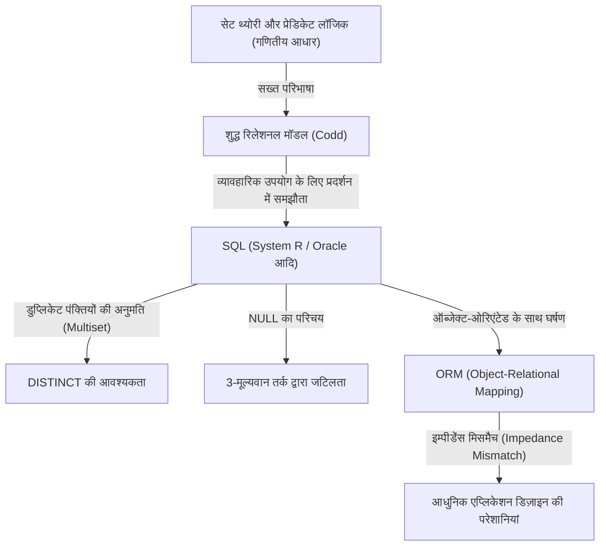

## 1. प्रस्तावना: हम "रिलेशन" के बारे में बात क्यों करते हैं

आज, सॉफ्टवेयर इंजीनियरिंग की दुनिया में ऐसे बहुत कम डेवलपर्स होंगे जो SQL (Structured Query Language) को नहीं जानते। वेब एप्लिकेशन्स से लेकर एंटरप्राइज़ सिस्टम और यहां तक कि स्मार्टफोन के लोकल डेटा स्टोरेज तक, RDBMS (Relational Database Management System) हर जगह काम कर रहा है।

हालांकि, "SQL लिख पाना" और "रिलेशनल मॉडल के वास्तविक सार को समझना" बिल्कुल दो अलग-अलग बातें हैं। कई डेवलपर्स "टेबल = एक्सेल शीट जैसी कोई चीज़" के एक बहुत ही साधारण मानसिक मॉडल के साथ डेटाबेस डिज़ाइन करते हैं। सिस्टम एक निश्चित स्तर तक इस समझ के साथ काम कर सकता है, लेकिन जैसे-जैसे सिस्टम का पैमाना बढ़ता है और जटिल डोमेन लॉजिक आपस में जुड़ते हैं, यह मॉडल तुरंत विफल हो जाता है।

इस लेख में, हम 1970 में एडगर एफ. कॉड (Edgar F. Codd) द्वारा प्रस्तावित "रिलेशनल मॉडल" की उत्पत्ति पर वापस जाएंगे और बहुत विस्तार से स्पष्ट करेंगे कि यह किस तरह की गणितीय और दार्शनिक नींव (विशेष रूप से सेट थ्योरी और प्रेडिकेट लॉजिक) पर बना है। कॉड की महान उपलब्धि, जिसने डेटाबेस जैसी भौतिक स्टोरेज डिवाइस को शुद्ध लॉजिक और गणित की दुनिया में उन्नत किया, केवल एक तकनीकी सफलता नहीं थी, बल्कि सूचना विज्ञान में एक प्रतिमान बदलाव (पैराडाइम शिफ्ट) था।

---

## 2. कॉड से पहले का अंधकार युग: नेविगेशनल डेटाबेस की सीमाएं

रिलेशनल मॉडल के वास्तविक मूल्य को समझने के लिए, यह जानना आवश्यक है कि "इसने क्या हल किया"। 1960 के दशक में मुख्यधारा के डेटाबेस मॉडल "Hierarchical model" और "Network model" कहलाते थे (प्रतिनिधि उदाहरणों में IBM का IMS और CODASYL-संगत डेटाबेस सिस्टम शामिल हैं)।

इन सिस्टम्स को **"नेविगेशनल (Navigational)"** कहा जाता था। डेटा के बीच के संबंध भौतिक पॉइंटर्स (मेमोरी एड्रेस के संदर्भ) द्वारा हार्ड-कोड किए गए थे, और डेटा प्राप्त करने के लिए प्रोग्रामर को स्वयं भौतिक संरचना के बारे में सचेत रहना पड़ता था और "पैरेंट रिकॉर्ड से चाइल्ड रिकॉर्ड तक पॉइंटर को फॉलो करते हुए आगे बढ़ें" जैसा प्रक्रियात्मक कोड लिखना पड़ता था।

### नेविगेशनल डेटाबेस की घातक समस्याएं

1. **डेटा स्वतंत्रता का अभाव (Lack of Data Independence)**
   भौतिक डेटा संरचना (इंडेक्स की उपस्थिति या अनुपस्थिति, पॉइंटर्स को कैसे सेट किया गया है, आदि) एप्लिकेशन कोड के साथ बहुत करीब से जुड़े हुए थे (Tightly coupled)। इसलिए, अगर डेटाबेस की संरचना में थोड़ा सा भी बदलाव किया जाता, तो उस पर निर्भर सभी एप्लिकेशन कोड को फिर से लिखना पड़ता था।
2. **क्वेरी की जटिलता और व्यक्ति-निर्भरता**
   जब किसी विशिष्ट डेटासेट को निकालने के लिए कई रास्ते (एक्सेस पाथ) मौजूद होते थे, तो प्रोग्रामर को यह तय करना होता था कि कौन सा रास्ता सबसे कुशल है और तदनुसार कोड लिखना होता था। इसके लिए उच्च स्तर की शिल्प कौशल (Craftsmanship) की आवश्यकता थी।
3. **तदर्थ (Ad-hoc) क्वेरी में कठिनाई**
   पॉइंटर की संरचना के कारण, अप्रत्याशित शर्तों (जैसे "उन कर्मचारियों की सूची बनाएं जो किसी विशिष्ट विभाग से संबंधित हैं और जिनका वेतन एक निश्चित राशि से अधिक है") के आधार पर खोज करना या तो अवास्तविक था या इसके लिए भारी लागत की आवश्यकता होती थी।

डेटा हार्डवेयर की सीमाओं और भौतिक प्रतिनिधित्व के "दलदल" में फंसा हुआ था।

---

## 3. प्रकाश होने दो: 1970 का पैराडाइम शिफ्ट और 'रिलेशनल मॉडल' का जन्म

1970 में, आईबीएम के सैन जोस रिसर्च लेबोरेटरी (अब अल्माडेन रिसर्च सेंटर) में काम कर रहे एक गणितज्ञ से कंप्यूटर वैज्ञानिक बने एडगर एफ. कॉड ने ऐतिहासिक शोध पत्र 'A Relational Model of Data for Large Shared Data Banks' प्रकाशित किया।

इस पेपर में कॉड द्वारा प्रस्तुत विचारों ने उस समय के सामान्य ज्ञान को पूरी तरह से उलट दिया। उन्होंने तर्क दिया कि "डेटा की तार्किक संरचना को उसकी भौतिक भंडारण विधि से पूरी तरह से अलग किया जाना चाहिए", और इसके लिए गणितीय आधार के रूप में **"सेट थ्योरी (Set Theory)"** और **"फर्स्ट-ऑर्डर प्रेडिकेट लॉजिक (First-Order Predicate Logic)"** को अपनाया।

### रिलेशन क्या है?

कई लोग "रिलेशन (Relation)" शब्द को "टेबल्स के बीच संबंध (Relationship)" (उदाहरण के लिए, प्राइमरी की और फॉरेन की के बीच संबंध) समझने की गलती करते हैं। हालाँकि, गणितीय और कॉड की परिभाषा में "रिलेशन" का अर्थ **"स्वयं टेबल (सख्ती से कहें तो टुपल्स का एक सेट)"** है।

गणित में, यदि सेट $D_1, D_2, \dots, D_n$ दिए गए हैं, तो एक $n$-आरी रिलेशन $R$ को इन सेट्स के कार्टेशियन उत्पाद (Cartesian product) के एक उपसमुच्चय (Subset) के रूप में परिभाषित किया गया है।

$R \subseteq D_1 \times D_2 \times \dots \times D_n$

यहाँ,
- $D_1, D_2, \dots$ को **डोमेन (Domain)** कहा जाता है। यह डेटाबेस में "डेटा टाइप" के बराबर है।
- $R$ के प्रत्येक तत्व (Element) को **टुपल (Tuple)** कहा जाता है। यह डेटाबेस में "पंक्ति (Row / Record)" के बराबर है।
- पूरे सेट $R$ को **रिलेशन (Relation)** कहा जाता है, जो डेटाबेस में "टेबल" के बराबर है।
- उस डोमेन की लेबलिंग जिससे टुपल का प्रत्येक तत्व संबंधित है, उसे **एट्रीब्यूट (Attribute)** कहा जाता है, जो डेटाबेस में "कॉलम (Column)" के बराबर है।

### एक "सेट" होने की पूर्ण बाधाएं (Absolute Constraints)

रिलेशन को एक "गणितीय सेट" के रूप में परिभाषित करने का एक अत्यंत महत्वपूर्ण और सख्त अर्थ है। सेट थ्योरी के मूल नियम सीधे डेटा मॉडलिंग बाधाओं (Constraints) में बदल जाते हैं।

1. **डुप्लिकेट को हटाना (टुपल्स की विशिष्टता)**
   एक सेट के अंदर, बिल्कुल समान तत्वों को एक से अधिक बार मौजूद होने की अनुमति नहीं है ($\{1, 2, 2, 3\}$ $\{1, 2, 3\}$ के बराबर है)। इसलिए, एक रिलेशन के भीतर **पूरी तरह से समान टुपल (पंक्ति) मौजूद नहीं होने चाहिए**। इसका मतलब है कि प्रत्येक रिलेशन में एक कैंडिडेट की (Candidate Key - विशिष्ट रूप से पहचानने योग्य एट्रिब्यूट्स का एक सेट) होना अनिवार्य है।
2. **क्रम का महत्वहीन होना (Top-Down / Left-Right स्वतंत्रता)**
   एक सेट के तत्वों का कोई क्रम नहीं होता है। इसलिए, न तो रिलेशन बनाने वाले **टुपल्स के क्रम (पंक्तियों का क्रम)** और न ही **एट्रीब्यूट्स के क्रम (कॉलम का क्रम)** का कोई मतलब है। "तीसरी पंक्ति" या "पहला कॉलम" जैसी अवधारणाएँ रिलेशनल मॉडल में मौजूद नहीं हैं।
3. **परमाणु मान (Atomic Values) (पहला सामान्य रूप - 1NF)**
   डोमेन के तत्व ऐसे होने चाहिए जिन्हें "और अधिक नहीं तोड़ा जा सके (एटॉमिक मान)"। एक एट्रिब्यूट में एरे या नेस्टेड संरचनाओं को क्रैम करने की अनुमति नहीं है।

---

## 4. रिलेशनल अलजेब्रा: डेटा में "हेरफेर" करने का गणित

डेटा को एक सेट के रूप में परिभाषित करने के बाद, कॉड ने इस सवाल का जवाब देने के लिए गणितीय प्रणाली **"रिलेशनल अलजेब्रा (Relational Algebra)"** तैयार की कि "उस सेट से मनचाहा डेटा कैसे निकाला जाए"।

अलजेब्रा "मानों के एक सेट (Set of values)" और उन मानों के लिए "ऑपरेटर्स" की एक प्रणाली है (उदाहरण के लिए, संख्याओं के सेट के लिए $+$, $-$, $\times$, $\div$, आदि)। रिलेशनल अलजेब्रा में "मान" रिलेशन हैं, और "ऑपरेटर" वो हैं जो रिलेशन को आर्गुमेंट (Argument) के रूप में लेते हैं और **हमेशा एक नया रिलेशन लौटाते हैं**।

इसे **"क्लोजर प्रॉपर्टी (Closure Property)"** कहा जाता है। चूंकि ऑपरेशन का परिणाम फिर से एक रिलेशन होता है, इसलिए ऑपरेशन्स को जितनी बार चाहें उतनी बार नेस्ट (चेन) किया जा सकता है।

विशिष्ट रिलेशनल अलजेब्रा के ऑपरेटर निम्नलिखित हैं:

*   **Restrict / Select ($\sigma$)**: केवल उन टुपल्स (पंक्तियों) को निकालता है जो किसी शर्त को पूरा करते हैं।
*   **Project ($\pi$)**: केवल विशिष्ट एट्रीब्यूट्स (कॉलम) को निकालता है। यदि परिणामस्वरूप डुप्लिकेट उत्पन्न होते हैं, तो उन्हें सेट के नियमों के अनुसार हटा दिया जाता है।
*   **Cartesian Product ($\times$)**: दो रिलेशन के सभी संभावित संयोजनों को उत्पन्न करता है।
*   **Union ($\cup$)**, **Difference ($-$)**, **Intersection ($\cap$)**: सेट थ्योरी में बुनियादी संचालन। इसके लिए उनका यूनियन-कम्पैटिबल (Union-compatible - समान हेडिंग होना) होना आवश्यक है।
*   **Join ($\bowtie$)**: यह कार्टेशियन प्रोडक्ट और रिस्ट्रिक्ट का एक संयोजन है, और यह संबंधित डेटा को एक साथ जोड़ने वाला सबसे शक्तिशाली ऑपरेशन है।

इन ऑपरेशन्स को मिलाकर, "घोषणात्मक (Declaratively)" रूप से डेटा का अनुरोध करना संभव हो जाता है। आप यह वर्णन नहीं करते कि "डेटा कैसे प्राप्त करें (How)", बल्कि "आपको कैसा डेटा चाहिए (What)"। पाथ चयन के अनुकूलन (Optimization) का काम अब मानव प्रोग्रामर का नहीं, बल्कि DBMS (में ऑप्टिमाइज़र) का काम बन गया।

---

## 5. थ्योरी और वास्तविकता के बीच का अंतर: क्या SQL "सच्चा रिलेशनल" है?

अब, आइए उस SQL को देखें जिसका हम हर दिन उपयोग करते हैं। SQL एक ऐसी भाषा है जो रिलेशनल मॉडल से प्रेरित होकर बनाई गई थी (इसकी उत्पत्ति IBM के System R प्रोजेक्ट के SEQUEL से हुई थी), लेकिन वास्तव में, **सख्त अर्थों में, यह कॉड के रिलेशनल मॉडल का वफादार कार्यान्वयन (Implementation) नहीं है।**

क्रिस डेट (C.J. Date, कॉड के सहकर्मी और रिलेशनल मॉडल के प्रचारक) जैसे शुद्धतावादियों (Purists) ने SQL की कड़ी आलोचना की है, उनका कहना है कि यह "रिलेशनल मॉडल के कई गंभीर उल्लंघनों का दोषी है।"

### SQL के "गैर-रिलेशनल" पाप

1. **डुप्लिकेट पंक्तियों की अनुमति (Bag / Multiset)**
   SQL टेबल्स डिफ़ॉल्ट रूप से डुप्लिकेट पंक्तियों की अनुमति देते हैं। उन्हें एक शुद्ध सेट (Set) के बजाय मल्टीसेट (Bag / Multiset) के रूप में कार्यान्वित किया जाता है। डुप्लिकेट्स को हटाने के लिए, आपको स्पष्ट रूप से `DISTINCT` लिखना होगा। यह एक गंभीर समझौता है जो रिलेशनल मॉडल की नींव को हिला देता है।
2. **NULL का अस्तित्व और 3-मूल्यवान तर्क (3VL)**
   रिलेशनल मॉडल सत्य और असत्य के 2-मूल्यवान तर्क (फर्स्ट-ऑर्डर प्रेडिकेट लॉजिक) पर आधारित है, लेकिन SQL ने "मान अज्ञात है, या मौजूद नहीं है" यह दर्शाने के लिए `NULL` पेश किया। इसके परिणामस्वरूप, SQL का मूल्यांकन तर्क TRUE / FALSE / UNKNOWN का **3-मूल्यवान तर्क (Three-Valued Logic)** बन गया, जिसने क्वेरी के व्यवहार को बेहद जटिल और अप्रत्याशित बना दिया।
3. **कॉलम के क्रम पर निर्भरता**
   SQL में, यदि आप `SELECT *` निष्पादित करते हैं, तो कॉलम उसी क्रम में लौटाए जाते हैं जिसमें टेबल को परिभाषित किया गया था। इसके अलावा, `ORDER BY` क्लॉज रिजल्ट सेट को एक क्रम दे सकता है (क्रमबद्ध परिणाम अब एक रिलेशन नहीं है, बल्कि एक सूची या कर्सर है)।

नीचे दिया गया आरेख शुद्ध रिलेशनल मॉडल और वास्तविक SQL कार्यान्वयन के बीच संबंधों को दर्शाता है।

---

## 6. सामान्यीकरण का दर्शन (Philosophy of Normalization): डेटा की "सच्चाई" को एकजुट करना

रिलेशनल मॉडल के बारे में बात करते समय **"सामान्यीकरण (Normalization)"** की अवधारणा अपरिहार्य है। सामान्यीकरण का अर्थ केवल "टेबल्स को अलग करना" नहीं है। यह डेटा विसंगतियों (Update anomaly, Insertion anomaly, Deletion anomaly) को रोकने और सूचना सिद्धांत के इस आदर्श को प्राप्त करने की प्रक्रिया है कि **"एक तथ्य, केवल एक स्थान पर मौजूद होता है (One Fact in One Place)"**।

कार्यात्मक निर्भरता (Functional Dependency) की अवधारणा के आधार पर, टेबल की संरचना को चरण दर चरण परिष्कृत किया जाता है।

*   **पहला सामान्य रूप (1NF)**: सभी एट्रिब्यूट एटॉमिक होते हैं। कोई दोहराए जाने वाले समूह (Repeating groups) मौजूद नहीं होते।
*   **दूसरा सामान्य रूप (2NF)**: 1NF को संतुष्ट करता है, और सभी गैर-कुंजी (Non-key) एट्रिब्यूट, पूरी प्राइमरी की पर पूरी तरह से कार्यात्मक रूप से निर्भर होते हैं। (आंशिक कार्यात्मक निर्भरता को हटाना)
*   **तीसरा सामान्य रूप (3NF)**: 2NF को संतुष्ट करता है, और सभी गैर-कुंजी एट्रिब्यूट केवल प्राइमरी की पर कार्यात्मक रूप से निर्भर होते हैं। वे अन्य गैर-कुंजी एट्रिब्यूट्स पर निर्भर नहीं होते। (संक्रामक (Transitive) कार्यात्मक निर्भरता को हटाना)
*   **बॉयस-कॉड सामान्य रूप (BCNF)**: सभी कार्यात्मक निर्भरताओं $X \rightarrow Y$ के लिए, एक ऐसी स्थिति जिसमें $X$ एक सुपर की है। यह 3NF का और भी सख्त संस्करण है।

```mermaid
graph LR
    A["गैर-सामान्यीकृत (अनावश्यक डेटा)"] -- "एटॉमिक बनाना" --> B["पहला सामान्य रूप (1NF)"]
    B -- "आंशिक कार्यात्मक निर्भरता को हटाना" --> C["दूसरा सामान्य रूप (2NF)"]
    C -- "संक्रामक कार्यात्मक निर्भरता को हटाना" --> D["तीसरा सामान्य रूप (3NF)"]
    D -- "कैंडिडेट की ओवरलैप का समाधान" --> E["बॉयस-कॉड सामान्य रूप (BCNF)"]
```

हम अक्सर यह राय सुनते हैं कि "सामान्यीकरण प्रदर्शन (Performance) को कम करता है, इसलिए इसे उचित रूप से डी-नॉर्मलाइज (Denormalize) किया जाना चाहिए"। यह सच है कि भौतिक डिस्क I/O के दृष्टिकोण से JOIN की लागत एक समस्या बन सकती है। हालाँकि, तार्किक डेटा मॉडल डिज़ाइन चरण में शुरुआत से ही सामान्यीकरण को छोड़ने का मतलब है कि आप एप्लिकेशन कोड (बिजनेस लॉजिक) के माध्यम से डेटा अखंडता (Integrity) की गारंटी देने का एक बेहद खतरनाक रास्ता चुन रहे हैं।

डेटाबेस केवल "डेटा रखने की जगह (Bit Bucket)" नहीं है। **डेटाबेस का स्कीमा ही उस व्यावसायिक डोमेन में "सत्य (बाधाएं और नियम)" घोषित करने वाला प्रथम श्रेणी का दस्तावेज़ और प्रवर्तन एजेंसी (Enforcement agency) है।**

---

## 7. आधुनिक युग में रिलेशनल मॉडल का महत्व और NoSQL का उदय

2010 के दशक में, बिग डेटा और स्केलेबिलिटी की मांगों ने "NoSQL (Not Only SQL)" आंदोलन को जन्म दिया। दस्तावेज़-उन्मुख DB (MongoDB आदि), की-वैल्यू प्रकार (Redis आदि), कॉलम-उन्मुख DB, ग्राफ DB जैसे विभिन्न डेटा स्टोर सामने आए, और यहां तक कि यह भी कानाफूसी होने लगी कि "रिलेशनल युग खत्म हो गया है"।

NoSQL ने उन क्षेत्रों को कवर किया जिनमें रिलेशनल डेटाबेस कमजोर थे, जैसे कि स्केलेबिलिटी (हॉरिजॉन्टल डिस्ट्रीब्यूशन, शार्डिंग) और स्कीमा-रहित होने के कारण विकास की गति में सुधार। इसके अलावा, JSON दस्तावेज़ों को सीधे सहेजने की क्षमता ऑब्जेक्ट-ओरिएंटेड प्रोग्रामिंग भाषाओं (इम्पीडेंस मिसमैच को हल करना) के साथ अनुकूलता में लाभप्रद थी।

हालांकि, NoSQL के व्यापक उपयोग के परिणामस्वरूप, डेवलपर्स ने कुछ मायनों में अतीत के "नेविगेशनल डेटाबेस के बुरे सपने" का फिर से अनुभव किया।
उन्हें कोड स्तर (Application Join) पर डेटा के बीच संबंधों को जोड़ना पड़ा, और लेन-देन (Transactions) की कमी के कारण डेटा विसंगतियों से जूझना पड़ा। नतीजतन, मजबूत डेटा निरंतरता (Consistency) और घोषणात्मक (Declarative) क्वेरी की मांग फिर से बढ़ गई, और कई आधुनिक प्रतिनिधि NoSQL डेटाबेस ने लेनदेन (Transaction) सुविधाओं और SQL जैसी क्वेरी भाषाओं को लागू करना शुरू कर दिया है।

दूसरी ओर, NewSQL (Google Spanner, CockroachDB, आदि) नामक अगली पीढ़ी के डेटाबेस ने रिलेशनल मॉडल की मजबूत सैद्धांतिक नींव और SQL इंटरफ़ेस को बनाए रखते हुए क्लाउड-नेटिव हॉरिजॉन्टल डिस्ट्रीब्यूटेड आर्किटेक्चर हासिल किया है।

1970 में कॉड द्वारा स्थापित यह दर्शन कि "डेटा को तार्किक और गणितीय सेट के रूप में माना जाना चाहिए", आधी सदी के बाद भी बिल्कुल भी फीका অব্যাহত है। भौतिक भंडारण और बुनियादी ढांचे का रूप कितना भी विकसित हो जाए, "जानकारी को बिना किसी विरोधाभास के और लचीले ढंग से कैसे प्रबंधित किया जाए" इस आवश्यक समस्या के समाधान के रूप में रिलेशनल मॉडल सूचना विज्ञान के इतिहास में एक स्मारक के रूप में सर्वोच्च शासन करना जारी रखता है।

## 8. निष्कर्ष: कोड लिखने से पहले "सेट" की कल्पना करें

दिन-प्रतिदिन के विकास कार्य में, ऐसे आधुनिक युग में जहां OR मैपर (ORM) के तरीकों का आह्वान करके ही डेटा प्राप्त किया जा सकता है, हो सकता है कि पृष्ठभूमि में मौजूद रिलेशनल मॉडल के बारे में सोचने के अवसर कम हो गए हों। हालांकि ORM बहुत सुविधाजनक है, यह इस सच्चाई को छिपाने का जोखिम भी उठाता है कि "रिलेशन सेट हैं"।

जब जटिल क्वेरी का प्रदर्शन अच्छा नहीं होता, या जब डेटा में विसंगतियां (Inconsistencies) उत्पन्न होने लगती हैं, तो रोगसूचक (Symptomatic) कोड जोड़ने के बजाय, कृपया एक क्षण के लिए रुकें और डेटा के "तार्किक आकार (Schema)" और उसे संचालित करने वाले "सेट ऑपरेशन्स (Algebra)" की दुनिया में वापस जाएं।

टेबल कोई एक्सेल शीट नहीं है, बल्कि "सत्य का सेट (Set of Facts)" है।
SQL केवल डेटा निकालने का आदेश नहीं है, बल्कि "प्रेडिकेट लॉजिक का उपयोग करके सत्य की खोज" है।

एडगर एफ. कॉड द्वारा छोड़े गए इस गहन दर्शन को समझकर, आपके द्वारा लिखे जाने वाले डेटाबेस डिज़ाइन और SQL क्वेरी अधिक मजबूत, सुंदर और वास्तव में शक्तिशाली चीजों के रूप में विकसित होने चाहिए।
