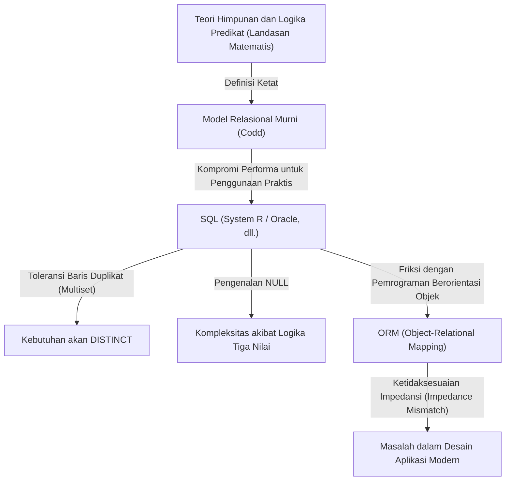
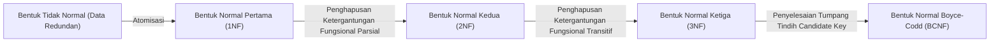

## 1. Pendahuluan: Mengapa Kita Berbicara Tentang "Relasi"

Saat ini, di dunia rekayasa perangkat lunak, hampir tidak ada pengembang yang tidak mengenal SQL (Structured Query Language). Dari aplikasi web hingga sistem perusahaan, bahkan penyimpanan data lokal di ponsel pintar, RDBMS (Relational Database Management System) beroperasi di mana-mana.

Namun, "bisa menulis SQL" dan "memahami esensi model relasional" adalah dua hal yang sama sekali berbeda. Banyak pengembang yang melakukan desain basis data dengan model mental sederhana "tabel = sesuatu seperti lembar Excel". Pemahaman ini mungkin cukup untuk sistem tertentu, tetapi ketika skala sistem membesar dan logika domain yang kompleks saling terkait, seketika itu pula sistem akan hancur.

Artikel ini kembali ke asal mula "model relasional" yang diusulkan oleh Edgar F. Codd pada tahun 1970, dan mengungkap secara sangat rinci landasan matematika dan filosofis apa (khususnya teori himpunan dan logika predikat) yang membangunnya. Pencapaian Codd yang mengangkat basis data dari sekadar perangkat penyimpanan fisik ke dunia logika dan matematika murni bukan hanya sebuah terobosan teknis, melainkan sebuah pergeseran paradigma dalam ilmu informasi.

---

## 2. Zaman Kegelapan Sebelum Codd: Keterbatasan Basis Data Navigasional

Untuk memahami nilai sebenarnya dari model relasional, kita perlu mengetahui "apa yang diselesaikannya". Pada tahun 1960-an, model basis data arus utama adalah apa yang disebut "model hierarkis" dan "model jaringan" (contoh perwakilannya adalah IBM IMS dan sistem basis data yang mematuhi CODASYL).

Sistem-sistem ini disebut sebagai **"navigasional"**. Hubungan antardata dikodekan secara kaku (hard-coded) menggunakan [pointer](/id/p/c-language-pointers-memory-management-stack-heap/) fisik (referensi ke alamat memori), dan untuk mengambil data, programmer sendiri harus menyadari struktur fisik tersebut dan menulis kode prosedural seperti "berpindah dengan menelusuri [pointer](/id/p/c-language-pointers-memory-management-stack-heap/) dari record induk ke record anak".

### Masalah Fatal dari Basis Data Navigasional

1. **Kurangnya Independensi Data (Lack of Data Independence)**
   Struktur data fisik (ada tidaknya indeks, bagaimana [pointer](/id/p/c-language-pointers-memory-management-stack-heap/) dihubungkan, dll.) terikat erat (tightly coupled) dengan kode aplikasi. Oleh karena itu, bahkan sedikit saja perubahan pada struktur basis data akan mengharuskan penulisan ulang semua kode aplikasi yang bergantung padanya.
2. **Kompleksitas Query dan Ketergantungan pada Individu**
   Jika ada beberapa rute (jalur akses) untuk mengambil himpunan data tertentu, programmer harus menentukan rute mana yang paling efisien dan menulis kodenya. Hal ini membutuhkan keterampilan tingkat tinggi.
3. **Kesulitan dalam Query Ad-Hoc**
   Melakukan pencarian dengan kondisi yang tidak diperkirakan sebelumnya (misalnya, "buat daftar karyawan yang tergabung dalam departemen tertentu dan memiliki gaji di atas jumlah tertentu") adalah hal yang tidak realistis secara struktural akibat [pointer](/id/p/c-language-pointers-memory-management-stack-heap/), atau memerlukan biaya yang sangat besar.

Data terpenjara dalam "rawa" pembatasan perangkat keras dan metode representasi fisik.

---

## 3. Jadilah Terang: Pergeseran Paradigma Tahun 1970 dan Lahirnya 『Model Relasional』

Pada tahun 1970, Edgar F. Codd, seorang ilmuwan komputer berlatar belakang matematika yang bekerja di Laboratorium IBM San Jose (sekarang Almaden Research Center), menerbitkan makalah bersejarah 『A Relational Model of Data for Large Shared Data Banks』.

Gagasan yang diajukan Codd dalam makalah ini benar-benar meruntuhkan akal sehat pada masa itu. Ia berpendapat bahwa "struktur logis data harus dipisahkan sepenuhnya dari metode penyimpanan fisiknya," dan mengadopsi **"Teori Himpunan (Set Theory)"** serta **"Logika Predikat Tingkat Pertama (First-Order Predicate Logic)"** sebagai landasan matematikanya.

### Apa Itu Relasi?

Banyak orang salah paham dengan kata "Relasi (Relation)" sebagai "keterkaitan antartabel (relationship)" (misalnya, hubungan antara primary key dan foreign key). Namun, "relasi" dalam definisi matematis dan gaya Codd merujuk pada **"tabel itu sendiri (secara tepatnya, himpunan tupel)"**.

Dalam matematika, jika diberikan himpunan $D_1, D_2, \dots, D_n$, maka relasi $n$-ary $R$ didefinisikan sebagai himpunan bagian dari perkalian Cartesian (perkalian silang) dari himpunan-himpunan tersebut.

$R \subseteq D_1 \times D_2 \times \dots \times D_n$

Di sini,
- $D_1, D_2, \dots$ disebut **Domain (Daerah Asal)**. Setara dengan "tipe (tipe data)" dalam basis data.
- Setiap elemen dalam $R$ disebut **Tupel (Tuple)**. Setara dengan "baris (Row, record)" dalam basis data.
- Keseluruhan himpunan $R$ itu sendiri adalah **Relasi (Relation)**, yang setara dengan "tabel" dalam basis data.
- Pemberian label pada domain dari setiap elemen dalam tupel disebut **Atribut (Attribute)**, yang setara dengan "kolom (Column)" dalam basis data.

### Batasan Absolut Sebagai "Himpunan"

Bahwa relasi didefinisikan sebagai "himpunan matematis" memiliki makna yang sangat penting dan ketat. Aturan dasar teori himpunan secara langsung menjadi batasan pemodelan data.

1. **Penghapusan Duplikasi (Keunikan Tupel)**
   Dalam sebuah himpunan, elemen yang sama persis tidak diizinkan ada lebih dari satu ($\{1, 2, 2, 3\}$ ekuivalen dengan $\{1, 2, 3\}$). Oleh karena itu, di dalam sebuah relasi **tidak boleh ada tupel (baris) yang identik sepenuhnya**. Ini berarti semua relasi harus selalu memiliki candidate key (himpunan atribut yang dapat mengidentifikasi secara unik).
2. **Ketiadaan Makna Urutan (Independensi Top-Down / Left-Right)**
   Elemen himpunan tidak memiliki urutan. Oleh karena itu, baik **urutan tupel (urutan baris)** maupun **urutan atribut (urutan kolom)** yang membentuk relasi tidak memiliki makna apa pun. Konsep seperti "baris ke-3" atau "kolom pertama" tidak ada dalam model relasional.
3. **Nilai Atomik (Bentuk Normal Pertama)**
   Elemen domain harus berupa "nilai yang tidak dapat dipecah lagi (atomik)". Memasukkan array atau struktur bersarang (nested) ke dalam satu atribut tidak diizinkan.

---

## 4. Aljabar Relasional: Matematika untuk "Memanipulasi" Data

Setelah mendefinisikan data sebagai himpunan, Codd kemudian menyiapkan sistem matematika yang disebut **Aljabar Relasional (Relational Algebra)** untuk menjawab pertanyaan "bagaimana cara menurunkan data yang diinginkan dari himpunan tersebut".

Aljabar (Algebra) adalah suatu sistem dari "himpunan nilai" dan "operator" terhadap nilai tersebut (misalnya, $+$, $-$, $\times$, $\div$ terhadap himpunan angka). "Nilai" dalam aljabar relasional adalah relasi, dan "operator" mengambil relasi sebagai argumen, serta **pasti mengembalikan sebuah relasi baru**.

Hal ini disebut **"Sifat Ketertutupan (Closure Property)"**. Karena hasil operasi kembali menjadi relasi, kita dapat menyarangkan (merangkai) operasi sebanyak yang kita inginkan.

Operator aljabar relasional yang representatif adalah sebagai berikut:

*   **Restriksi (Restrict / Select: $\sigma$)**: Hanya mengekstraksi tupel (baris) yang memenuhi kondisi.
*   **Proyeksi (Project: $\pi$)**: Hanya mengekstraksi atribut (kolom) tertentu. Jika terjadi duplikasi sebagai hasilnya, duplikasi tersebut dihapus sesuai dengan aturan himpunan.
*   **Perkalian Cartesian (Cartesian Product: $\times$)**: Menghasilkan semua kombinasi dari dua relasi.
*   **Gabungan (Union: $\cup$)**, **Selisih (Difference: $-$)**, **Irisan (Intersection: $\cap$)**: Operasi dasar dalam teori himpunan. Keduanya harus union-compatible (memiliki heading yang sama).
*   **Gabung (Join: $\bowtie$)**: Kombinasi perkalian Cartesian dan restriksi, dan merupakan operasi paling kuat untuk menggabungkan data yang saling terkait.

Dengan menggabungkan operasi-operasi ini, kita dimungkinkan untuk meminta data secara "deklaratif". Kita mendeskripsikan "data apa yang diinginkan (What)", bukan "bagaimana cara mengambil datanya (How)". Optimalisasi pemilihan rute bukan lagi pekerjaan programmer manusia, melainkan pekerjaan DBMS (optimizer di dalamnya).

---

## 5. Kesenjangan Antara Teori dan Kenyataan: Apakah SQL Itu "Benar-Benar Relasional"?

Sekarang, mari kita lihat SQL yang kita gunakan setiap hari. Meskipun SQL adalah bahasa yang terinspirasi oleh model relasional (berasal dari SEQUEL dari proyek System R IBM), faktanya **dalam arti sempit, ia bukanlah implementasi yang setia pada model relasional Codd.**

Kaum puritan seperti Chris Date (C.J. Date, kolega Codd dan penyebar model relasional) telah mengkritik tajam SQL karena melakukan "banyak pelanggaran serius terhadap model relasional".

### Dosa "Non-Relasional" yang Dimiliki SQL

1. **Toleransi Terhadap Baris Duplikat (Bag / Multiset)**
   Tabel SQL, secara default, mengizinkan baris duplikat. Ia diimplementasikan bukan sebagai himpunan murni (Set), melainkan sebagai multiset (Bag / Multiset). Untuk menghapus duplikat, seseorang harus menuliskan `DISTINCT` secara eksplisit. Ini merupakan kompromi besar yang menggoyahkan fondasi model relasional.
2. **Keberadaan NULL dan Logika Tiga Nilai (3VL)**
   Model relasional didasarkan pada logika dua nilai, yaitu benar dan salah (logika predikat tingkat pertama), tetapi SQL memperkenalkan `NULL` untuk menunjukkan bahwa "nilai tidak diketahui, atau tidak ada". Akibatnya, logika evaluasi SQL menjadi **Logika Tiga Nilai (Three-Valued Logic)** dengan TRUE / FALSE / UNKNOWN, yang membuat perilaku query menjadi sangat rumit dan sulit diprediksi.
3. **Ketergantungan Pada Urutan Kolom**
   Di SQL, ketika kita menjalankan `SELECT *`, kolom-kolom akan dikembalikan sesuai urutan saat tabel tersebut didefinisikan. Selain itu, klausa `ORDER BY` memungkinkan kita memberikan urutan pada result set (hasil yang diurutkan bukan lagi sebuah relasi, melainkan sebuah list atau kursor).

Diagram berikut menunjukkan hubungan antara model relasional murni dan implementasi SQL di dunia nyata.

---

## 6. Filosofi Normalisasi: Menyatukan "Kebenaran" Data

Sesuatu yang sangat penting ketika berbicara mengenai model relasional adalah konsep **"Normalisasi (Normalization)"**. Normalisasi bukan sekadar "memisahkan tabel". Ini adalah proses untuk mencegah anomali data (anomali pembaruan, penyisipan, dan penghapusan) serta mewujudkan cita-cita teori informasi: **"Satu fakta hanya ada di satu tempat (One Fact in One Place)"**.

Berdasarkan konsep Ketergantungan Fungsional (Functional Dependency), struktur tabel disempurnakan secara bertahap.

*   **Bentuk Normal Pertama (1NF)**: Semua atribut bersifat atomik. Tidak ada grup berulang (repeating groups).
*   **Bentuk Normal Kedua (2NF)**: Memenuhi 1NF, dan semua atribut non-key memiliki ketergantungan fungsional penuh pada keseluruhan primary key. (Penghapusan ketergantungan fungsional parsial)
*   **Bentuk Normal Ketiga (3NF)**: Memenuhi 2NF, dan semua atribut non-key bergantung secara fungsional hanya pada primary key. Tidak bergantung pada atribut non-key lainnya. (Penghapusan ketergantungan fungsional transitif)
*   **Bentuk Normal Boyce-Codd (BCNF)**: Kondisi di mana dalam setiap ketergantungan fungsional $X \rightarrow Y$, $X$ adalah super key. Ini adalah versi yang lebih ketat dari 3NF.

Kita sering mendengar pendapat tentang normalisasi bahwa "karena menurunkan performa, kita harus melakukan denormalisasi (Denormalization) secukupnya". Memang benar, dari sudut pandang I/O disk fisik, biaya JOIN dapat menjadi masalah. Namun, menyerah pada normalisasi sejak tahap desain model data logis berarti memilih jalan yang sangat berbahaya: menjamin integritas data menggunakan kode aplikasi (logika bisnis).

Basis data bukan sekadar "tempat membuang data (Bit Bucket)". **Skema basis data itu sendiri adalah dokumen kelas satu sekaligus lembaga eksekutif yang mendeklarasikan "kebenaran (batasan dan aturan)" di dalam domain bisnis tersebut.**

---

## 7. Signifikansi Model Relasional di Era Modern dan Kemunculan NoSQL

Memasuki tahun 2010-an, tuntutan akan big data dan skalabilitas memicu pergerakan "NoSQL (Not Only SQL)". Berbagai penyimpanan data bermunculan, seperti DB berorientasi dokumen (MongoDB, dll.), tipe key-value (Redis, dll.), DB berorientasi kolom, dan graph DB, yang bahkan memunculkan desas-desus bahwa "era relasional telah berakhir".

NoSQL mencakup area di mana basis data relasional kurang mumpuni, seperti skalabilitas (distribusi horizontal, sharding) dan peningkatan kecepatan pengembangan melalui skema tanpa struktur (schemaless). Selain itu, kemampuan untuk menyimpan dokumen JSON secara langsung menguntungkan dalam hal kompatibilitas dengan bahasa pemrograman berorientasi objek (menghilangkan ketidaksesuaian impedansi).

Akan tetapi, sebagai hasil dari mempopulerkan NoSQL, para pengembang bisa dikatakan mengalami kembali "mimpi buruk basis data navigasional".
Mereka menggabungkan hubungan antardata di tingkat kode (application join), dan dipusingkan oleh inkonsistensi data akibat ketiadaan transaksi. Akibatnya, seruan yang menuntut integritas data yang kuat dan query deklaratif kembali meningkat, dan banyak basis data NoSQL representatif modern kini mengimplementasikan fungsi transaksi serta bahasa query yang mirip dengan SQL.

Di sisi lain, basis data generasi berikutnya yang disebut NewSQL (Google Spanner, CockroachDB, dll.) mewujudkan arsitektur distribusi horizontal cloud-native sambil tetap mempertahankan fondasi teoretis yang kuat dan antarmuka SQL dari model relasional.

Filosofi "memperlakukan data sebagai himpunan logis dan matematis" yang dibangun Codd pada tahun 1970 sama sekali tidak memudar bahkan setelah setengah abad berlalu. Tidak peduli seberapa jauh bentuk penyimpanan fisik dan infrastruktur berkembang, model relasional tetap bertahta sebagai pencapaian monumental dalam sejarah ilmu informasi sebagai solusi atas masalah mendasar mengenai "bagaimana menangani informasi secara konsisten dan fleksibel".

## 8. Kesimpulan: Bayangkan "Himpunan" Sebelum Menulis Kode

Dalam tugas pengembangan sehari-hari, di era modern ini di mana data dapat diambil hanya dengan memanggil metode OR mapper (ORM), kesempatan untuk menyadari keberadaan model relasional di belakang layar mungkin berkurang. ORM memang sangat memudahkan, tetapi di saat yang sama ia membawa risiko menyembunyikan kenyataan bahwa "relasi adalah himpunan".

Ketika query kompleks tidak memberikan performa yang baik, atau saat inkonsistensi data mulai muncul, alih-alih menambahkan kode untuk pengobatan simtomatik, cobalah berhenti sejenak dan kembali ke dunia "bentuk logis (skema)" data dan "operasi himpunan (aljabar)" yang memanipulasinya.

Tabel bukanlah lembar Excel, melainkan "himpunan kebenaran (Fact)".
SQL bukanlah sekadar perintah pengambilan data, melainkan "pencarian kebenaran menggunakan logika predikat".

Dengan memahami filosofi mendalam yang ditinggalkan oleh Edgar F. Codd, desain basis data dan query SQL yang Anda tulis niscaya akan berevolusi menjadi sesuatu yang lebih tangguh, indah, dan benar-benar kuat.
