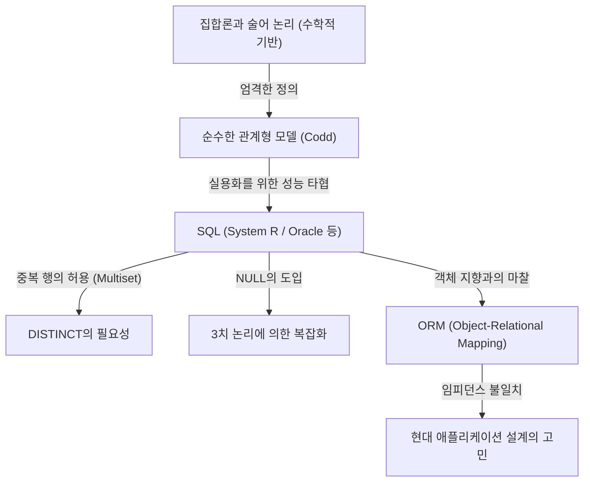

## 1. 서론: 왜 우리는 '릴레이션'을 이야기하는가

오늘날 소프트웨어 엔지니어링 세계에서 SQL(Structured Query Language)을 모르는 개발자는 거의 없을 것입니다. 웹 애플리케이션부터 엔터프라이즈 시스템, 심지어 스마트폰의 로컬 데이터 저장에 이르기까지 RDBMS(Relational Database Management System)는 모든 곳에서 가동되고 있습니다.

하지만 "SQL을 작성할 수 있다"는 것과 "관계형 모델의 진수를 이해하고 있다"는 것은 전혀 다른 차원의 이야기입니다. 많은 개발자가 "테이블 = Excel의 시트와 같은 것"이라는 소박한 멘탈 모델로 데이터베이스 설계를 진행합니다. 이러한 이해로도 어느 정도의 시스템은 작동하지만, 시스템의 규모가 커지고 복잡한 도메인 로직이 얽히게 되면 순식간에 파탄을 맞이하게 됩니다.

본 기사에서는 1970년에 에드거 F. 커드(Edgar F. Codd)가 주창한 '관계형 모델'의 기원으로 돌아가, 그것이 어떠한 수학적·철학적 기반(특히 집합론과 술어 논리) 위에 성립되어 있는지를 지극히 상세하게 해설합니다. 데이터베이스라는 물리적인 기억 장치를 순수한 논리와 수학의 세계로 승화시킨 커드의 위업은 단순한 기술적 혁신에 그치지 않고 정보 과학에서의 패러다임 전환이었습니다.

---

## 2. 커드 이전의 암흑시대: 내비게이셔널 데이터베이스의 한계

관계형 모델의 진가를 이해하기 위해서는 그것이 '무엇을 해결했는가'를 알아야 합니다. 1960년대 주류였던 데이터베이스 모델은 '계층형 모델'이나 '네트워크형 모델'이라고 불리는 것들이었습니다(대표적인 예로 IBM의 IMS나 CODASYL 준수 데이터베이스 시스템을 들 수 있습니다).

이러한 시스템은 **'내비게이셔널(항해적)'**이라고 불렸습니다. 데이터 간의 관계성이 물리적인 [포인터](/ko/p/c-language-pointers-memory-management-stack-heap/)(메모리 주소에 대한 참조)에 의해 하드코딩되어 있어, 데이터를 얻기 위해서는 프로그래머 자신이 그 물리적인 구조를 의식하고 "부모 레코드에서 자식 레코드로 [포인터](/ko/p/c-language-pointers-memory-management-stack-heap/)를 따라 이동한다"는 절차적인 코드를 작성해야만 했습니다.

### 내비게이셔널 데이터베이스의 치명적인 문제점

1. **데이터 독립성의 결여(Lack of Data Independence)**
   물리적인 데이터 구조(인덱스의 유무, [포인터](/ko/p/c-language-pointers-memory-management-stack-heap/)를 연결하는 방법 등)가 애플리케이션 코드와 밀결합되어 있었습니다. 그로 인해 데이터베이스의 구조를 조금이라도 변경하면 그것에 의존하고 있는 모든 애플리케이션 코드를 다시 작성해야 했습니다.
2. **쿼리의 복잡성과 속인성**
   특정 데이터 세트를 꺼내기 위한 경로(액세스 패스)가 여러 개 존재할 경우, 어느 경로가 가장 효율적인지를 프로그래머가 판단하여 코드를 작성해야 했습니다. 여기에는 고도의 장인 정신이 요구되었습니다.
3. **애드혹 쿼리의 어려움**
   미리 예상하지 못한 조건에서의 검색(예를 들어 "어느 부서에 소속되어 있고, 급여가 일정액 이상인 사원을 목록화한다"와 같은 것)을 수행하는 것은 [포인터](/ko/p/c-language-pointers-memory-management-stack-heap/) 구조상 비현실적이거나 막대한 비용이 필요했습니다.

데이터는 하드웨어의 제약이나 물리적인 표현 방법이라는 '수렁'에 갇혀 있었던 것입니다.

---

## 3. 빛이 있으라: 1970년의 패러다임 전환과 『관계형 모델』의 탄생

1970년, IBM의 산호세 연구소(현재의 알마덴 연구 센터)에 근무하던 수학자 출신의 컴퓨터 과학자 에드거 F. 커드는 역사적인 논문 『A Relational Model of Data for Large Shared Data Banks』를 발표했습니다.

이 논문에서 커드가 제시한 아이디어는 당시의 상식을 뿌리째 뒤집는 것이었습니다. 그는 "데이터의 논리적인 구조를 물리적인 저장 방법으로부터 완전히 분리해야 한다"고 주장했으며, 이를 위한 수학적 기반으로서 **'집합론(Set Theory)'**과 **'1차 술어 논리(First-Order Predicate Logic)'**를 채택했습니다.

### 릴레이션이란 무엇인가?

많은 사람이 '릴레이션(Relation)'이라는 단어를 '테이블 간의 관계성(릴레이션십)'이라고 오해하고 있습니다(예를 들어, 기본 키와 외래 키의 연결 등). 하지만 수학적·커드적 정의에서의 '릴레이션'이란 **'테이블 그 자체(엄밀하게는 튜플의 집합)'**를 가리킵니다.

수학에서 집합 $D_1, D_2, \dots, D_n$ 이 주어졌을 때, $n$ 항 릴레이션 $R$ 은 이들 집합의 데카르트 곱(직적)의 부분 집합으로서 정의됩니다.

$R \subseteq D_1 \times D_2 \times \dots \times D_n$

여기서,
- $D_1, D_2, \dots$ 를 **도메인(Domain, 정의역)** 이라고 부릅니다. 데이터베이스에서의 '타입(데이터형)'에 해당합니다.
- $R$ 의 각 원소(요소)를 **튜플(Tuple)** 이라고 부릅니다. 데이터베이스에서의 '행(Row, 레코드)'에 해당합니다.
- $R$ 이라는 집합 전체가 **릴레이션(Relation)** 이며, 데이터베이스에서의 '테이블'에 해당합니다.
- 튜플 내의 각 요소가 속하는 도메인에 대한 레이블 지정을 **속성(Attribute)** 이라고 부르며, 데이터베이스에서의 '열(Column)'에 해당합니다.

### '집합'이라는 것의 절대적인 제약

릴레이션이 '수학적인 집합'으로 정의되었다는 것에는 극히 중요하고 엄격한 의미가 있습니다. 집합론의 기본 규칙이 그대로 데이터 모델링의 제약이 되는 것입니다.

1. **중복의 배제 (튜플의 유일성)**
   집합 안에는 완전히 같은 요소가 여러 개 존재하는 것이 허용되지 않습니다($\{1, 2, 2, 3\}$ 은 $\{1, 2, 3\}$ 과 동치입니다). 따라서 릴레이션 내에는 **완전히 동일한 튜플(행)은 존재해서는 안 됩니다**. 이는 모든 릴레이션이 반드시 후보 키(유일하게 식별할 수 있는 속성의 집합)를 가져야 함을 의미합니다.
2. **순서의 무의미함 (Top-Down / Left-Right의 비의존성)**
   집합의 요소에는 순서가 없습니다. 따라서 릴레이션을 구성하는 **튜플의 순서(행의 순서)**에도, **속성의 순서(열의 순서)**에도 의미는 없습니다. "3번째 행", "첫 번째 열"과 같은 개념은 관계형 모델에는 존재하지 않는 것입니다.
3. **원자적인 값 (제1정규형)**
   도메인의 요소는 "더 이상 분해할 수 없는(원자적인) 값"이어야 한다고 여겨졌습니다. 배열이나 중첩된 구조를 하나의 속성에 밀어 넣는 것은 허용되지 않습니다.

---

## 4. 관계 대수: 데이터를 '조작'하는 수학

데이터를 집합으로 정의한 커드는 다음으로 "그 집합에서 원하는 데이터를 어떻게 도출해 낼 것인가"라는 질문에 대해 **관계 대수(Relational Algebra)**라는 수학적 체계를 마련했습니다.

대수(Algebra)란 어떠한 '값의 집합'과 그 값에 대한 '연산자'의 체계입니다(예를 들어, 수의 집합에 대한 $+$, $-$, $\times$, $\div$ 등). 관계 대수에서의 '값'은 릴레이션이며, '연산자'는 릴레이션을 인수로 받아 **반드시 새로운 릴레이션을 반환**하는 것입니다.

이를 **'폐쇄성(Closure Property)'** 이라고 부릅니다. 연산의 결과가 다시 릴레이션이 되기 때문에, 얼마든지 연산을 중첩(연쇄)시킬 수 있는 것입니다.

대표적인 관계 대수의 연산자는 다음과 같습니다:

*   **제한 (Restrict / Select: $\sigma$)**: 조건을 만족하는 튜플(행)만을 추출한다.
*   **프로젝션 (Project: $\pi$)**: 특정 속성(열)만을 추출한다. 결과적으로 중복이 발생한 경우에는 집합의 규칙에 따라 중복이 배제된다.
*   **카테시안 곱 (Cartesian Product: $\times$)**: 두 릴레이션의 모든 조합을 생성한다.
*   **합집합 (Union: $\cup$)**, **차집합 (Difference: $-$)**, **교집합 (Intersection: $\cap$)**: 집합론에서의 기본적인 연산. 합립(헤딩이 같음)이어야 할 필요가 있다.
*   **조인 (Join: $\bowtie$)**: 카테시안 곱과 제한을 조합한 것으로, 관련 있는 데이터끼리 연결하는 가장 강력한 연산.

이러한 연산을 조합함으로써, '선언적'으로 데이터를 요구하는 것이 가능해집니다. "어떻게 데이터를 가져올 것인가(How)"가 아니라 "어떤 데이터가 필요한가(What)"를 기술하는 것입니다. 경로 선택의 최적화는 인간 프로그래머가 아니라 DBMS(안의 옵티마이저)가 맡아야 할 역할이 되었습니다.

---

## 5. 이론과 현실의 괴리: SQL은 '진정한 관계형'인가?

여기서 우리가 매일 사용하고 있는 SQL에 눈을 돌려보겠습니다. SQL은 관계형 모델에서 영감을 받아 탄생한 언어(IBM의 System R 프로젝트의 SEQUEL이 기원)이지만, 사실 **엄밀한 의미에서는 커드의 관계형 모델을 충실히 구현한 것이 아닙니다.**

크리스 데이트(C.J. Date, 커드의 동료이자 관계형 모델의 전도사)를 비롯한 순수주의자들은 SQL을 "관계형 모델에 대한 많은 중대한 위반을 범하고 있다"고 엄격하게 비판해 왔습니다.

### SQL이 안고 있는 '비관계형'적인 죄악

1. **중복 행 (Bag / Multiset)의 허용**
   SQL의 테이블은 기본적으로 중복되는 행을 허용합니다. 순수한 집합(Set)이 아니라 다중 집합(Bag / Multiset)으로서 구현되어 있는 것입니다. 중복을 배제하려면 명시적으로 `DISTINCT` 를 기술해야 합니다. 이는 관계형 모델의 근간을 뒤흔드는 중대한 타협입니다.
2. **NULL의 존재와 3치 논리 (3VL)**
   관계형 모델은 참과 거짓의 2치 논리(1차 술어 논리)에 기초하고 있지만, SQL에는 "값이 불명, 또는 존재하지 않음"을 나타내는 `NULL` 이 도입되었습니다. 이로 인해 SQL의 평가 로직은 TRUE / FALSE / UNKNOWN 의 **3치 논리(Three-Valued Logic)**가 되었고, 쿼리의 동작을 지극히 복잡하고 예측하기 어렵게 만들어 버렸습니다.
3. **열의 순서에 대한 의존**
   SQL에서는 `SELECT *` 를 실행하면 테이블을 정의한 순서대로 열이 반환됩니다. 또한 `ORDER BY` 절에 의해 결과 집합에 순서를 부여할 수 있습니다(순서가 지정된 결과는 더 이상 릴레이션이 아니며, 리스트나 커서가 됩니다).

다음 그림은 순수한 관계형 모델과 현실의 SQL 구현과의 관계성을 나타냅니다.

---

## 6. 정규화의 철학: 데이터의 '진리'를 하나로 만든다

관계형 모델을 논할 때 빼놓을 수 없는 것이 **'정규화(Normalization)'**의 개념입니다. 정규화란 단순히 "테이블을 나누는 것"이 아닙니다. 데이터의 이상(갱신 시 이상, 삽입 시 이상, 삭제 시 이상)을 방지하고, **"하나의 사실은 하나의 장소에만 존재한다(One Fact in One Place)"**는 정보 이론의 이상을 실현하기 위한 과정입니다.

함수 종속성(Functional Dependency)이라는 개념에 기초하여, 테이블의 구조를 단계적으로 세련되게 다듬어 갑니다.

*   **제1정규형 (1NF)**: 모든 속성이 원자적이다. 반복 그룹이 존재하지 않는다.
*   **제2정규형 (2NF)**: 1NF를 만족하고, 모든 비키 속성이 기본 키 전체에 대해 완전 함수 종속되어 있다. (부분 함수 종속성의 배제)
*   **제3정규형 (3NF)**: 2NF를 만족하고, 모든 비키 속성이 기본 키에 대해서만 함수 종속되어 있다. 다른 비키 속성에 종속되어 있지 않다. (이행적 함수 종속성의 배제)
*   **보이스-커드 정규형 (BCNF)**: 모든 함수 종속성 $X \rightarrow Y$ 에서, $X$ 가 슈퍼 키인 상태. 3NF의 한층 더 엄격한 버전.

정규화는 "성능을 떨어뜨리는 것이기 때문에 적당히 반정규화(Denormalization)해야 한다"는 의견을 자주 듣게 됩니다. 확실히 물리적인 디스크 I/O의 관점에서는 JOIN의 비용이 문제가 되는 경우가 있습니다. 하지만 논리적인 데이터 모델의 설계 단계에서 처음부터 정규화를 포기하는 것은, 데이터의 정합성을 애플리케이션의 코드(비즈니스 로직)로 보장한다는 극히 위험한 길을 선택함을 의미합니다.

데이터베이스는 단순한 '데이터 보관소(Bit Bucket)'가 아닙니다. **데이터베이스의 스키마 자체가 그 비즈니스 도메인에서의 '진리(제약과 규칙)'를 선언한 일급 문서이자, 집행 기관인 것입니다.**

---

## 7. 현대에 있어서 관계형 모델의 의의와 NoSQL의 대두

2010년대에 들어서며, 빅데이터와 확장성의 요구로부터 'NoSQL(Not Only SQL)' 열풍이 일어났습니다. 문서 지향 DB(MongoDB 등), 키-값 형(Redis 등), 칼럼 지향 DB, 그래프 DB 등 다양한 데이터 저장소가 등장하여 "관계형의 시대는 끝났다"고까지 속삭여졌습니다.

NoSQL은 확장성(수평 분산, 샤딩)이나 스키마리스를 통한 개발 속도의 향상 등, 관계형 데이터베이스가 취약했던 영역을 커버했습니다. 또한 JSON 문서를 그대로 저장할 수 있다는 것은 [객체 지향 프로그래밍](/ko/p/object-oriented-programming-oop-solid-principles/) 언어와의 궁합(임피던스 불일치의 해소)에 있어 유리했습니다.

하지만 NoSQL이 보급된 결과, 개발자들은 과거의 '내비게이셔널 데이터베이스의 악몽'을 어떤 의미에서 다시 체험하게 되었습니다.
데이터 간의 관계성을 코드 레벨에서 결합(애플리케이션 조인)하거나, 트랜잭션의 부재로 인해 데이터의 불일치에 시달렸던 것입니다. 결과적으로 강력한 데이터 정합성과 선언적인 쿼리를 요구하는 목소리는 다시 높아졌고, 현대의 대표적인 NoSQL 데이터베이스의 대부분은 트랜잭션 기능이나 SQL과 유사한 쿼리 언어를 구현하게 되었습니다.

한편, NewSQL(Google Spanner, CockroachDB 등)이라 불리는 차세대 데이터베이스는 관계형 모델의 강력한 이론적 기반과 SQL 인터페이스를 유지한 채, 클라우드 네이티브한 수평 분산 아키텍처를 실현하고 있습니다.

커드가 1970년에 구축한 "데이터를 논리적·수학적인 집합으로 다룬다"는 철학은 반세기가 지난 지금도 전혀 퇴색하지 않았습니다. 물리적인 스토리지나 인프라의 형태가 아무리 진화하더라도, "정보를 어떻게 모순 없이, 그리고 유연하게 다룰 것인가"라는 본질적인 과제에 대한 해답으로서 관계형 모델은 정보 과학 역사에 있어 금자탑으로 군림하고 있는 것입니다.

## 8. 결론: 코드를 작성하기 전에 '집합'을 상상하라

매일의 개발 업무에서, OR 매퍼(ORM)의 메서드를 호출하는 것만으로 데이터를 얻을 수 있는 현대에는 그 배후에 있는 관계형 모델을 의식할 기회가 줄어들었을지도 모릅니다. ORM은 매우 편리하지만, 동시에 "릴레이션은 집합이다"라는 진실을 은폐해 버릴 위험성도 내포하고 있습니다.

복잡한 쿼리의 성능이 나오지 않을 때, 혹은 데이터에 불일치가 발생하기 시작했을 때, 대증 요법적인 코드를 추가하는 것이 아니라, 한 번 멈춰 서서 데이터의 '논리적인 형태(스키마)'와 그것을 조작하는 '집합 연산(대수)'의 세계로 돌아가 보십시오.

테이블은 Excel의 시트가 아니라 '진실(Fact)의 집합'입니다.
SQL은 단순한 데이터 추출 명령이 아니라 '술어 논리를 이용한 진리의 탐구'입니다.

에드거 F. 커드가 남긴 이 심오한 철학을 이해함으로써, 당신이 작성하는 데이터베이스 설계, 그리고 SQL 쿼리는 더욱 견고하고 아름다우며, 진정으로 강력한 것으로 진화할 것입니다.
