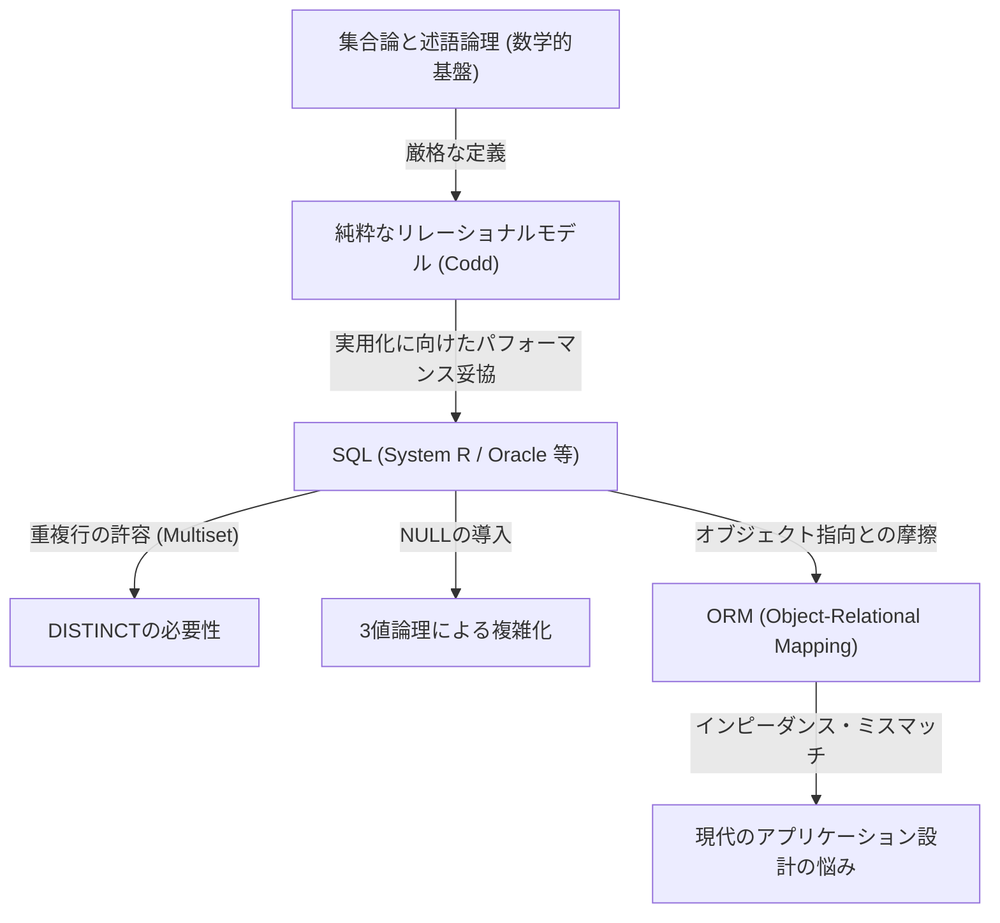

## 1. はじめに：なぜ我々は「リレーション」を語るのか

今日、ソフトウェアエンジニアリングの世界において、SQL（Structured Query Language）を知らない開発者はほとんどいないでしょう。Webアプリケーションからエンタープライズシステム、果てはスマートフォンのローカルデータ保存まで、RDBMS（Relational Database Management System）はありとあらゆる場所で稼働しています。

しかし、「SQLを記述できる」ことと「リレーショナルモデルの真髄を理解している」ことは、全く別の次元の話です。多くの開発者は「テーブル＝Excelのシートのようなもの」という素朴なメンタルモデルでデータベース設計を行っています。この理解でもある程度のシステムは動きますが、システムの規模が大きくなり、複雑なドメインロジックが絡み合うようになると、途端に破綻を来すことになります。

本記事では、1970年にエドガー・F・コッド（Edgar F. Codd）が提唱した「リレーショナルモデル」の起源に立ち返り、それがどのような数学的・哲学的基盤（特に集合論と述語論理）の上に成り立っているのかを極めて詳細に解き明かします。データベースという物理的な記憶装置を、純粋な論理と数学の世界へと昇華させたコッドの偉業は、単なる技術的ブレイクスルーにとどまらず、情報科学におけるパラダイムシフトでした。

---

## 2. コッド以前の暗黒時代：ナビゲーショナル・データベースの限界

リレーショナルモデルの真価を理解するためには、それが「何を解決したのか」を知る必要があります。1960年代、主流だったデータベースモデルは「階層型モデル」や「ネットワーク型モデル」と呼ばれるものでした（代表例としてIBMのIMSや、CODASYL準拠のデータベースシステムが挙げられます）。

これらのシステムは、**「ナビゲーショナル（航海的）」**と呼ばれていました。データ同士の関連性が物理的な[ポインタ](/p/c-language-pointers-memory-management-stack-heap/)（メモリアドレスへの参照）によってハードコーディングされており、データを取得するためにはプログラマ自身がその物理的な構造を意識し、「親レコードから子レコードへ[ポインタ](/p/c-language-pointers-memory-management-stack-heap/)を辿って移動する」という手続き的なコードを記述しなければなりませんでした。

### ナビゲーショナル・データベースの致命的な問題点

1. **データ独立性の欠如（Lack of Data Independence）**
   物理的なデータ構造（インデックスの有無、[ポインタ](/p/c-language-pointers-memory-management-stack-heap/)の張り方など）がアプリケーションコードと密結合していました。そのため、データベースの構造を少しでも変更すると、それに依存しているすべてのアプリケーションコードを書き換える必要がありました。
2. **クエリの複雑さと属人性**
   特定のデータセットを取り出すための経路（アクセスパス）が複数存在する場合、どの経路が最も効率的かをプログラマが判断してコードを書く必要がありました。これには高度な職人技が求められました。
3. **アドホック・クエリの困難さ**
   あらかじめ想定されていない条件での検索（例えば「ある部門に所属し、かつ給与が一定額以上の社員をリストアップする」といったもの）を行うことは、[ポインタ](/p/c-language-pointers-memory-management-stack-heap/)の構造上、非現実的であるか、多大なコストを要しました。

データは、ハードウェアの制約や物理的な表現方法という「泥沼」に囚われていたのです。

---

## 3. 光あれ：1970年のパラダイムシフトと『リレーショナルモデル』の誕生

1970年、IBMのサンノゼ研究所（現在のアルマデン研究センター）に勤務していた数学者出身のコンピュータ科学者、エドガー・F・コッドは、歴史的な論文『A Relational Model of Data for Large Shared Data Banks』を発表しました。

この論文でコッドが提示したアイデアは、当時の常識を根底から覆すものでした。彼は「データの論理的な構造を、物理的な格納方法から完全に分離すべきである」と主張し、そのための数学的基盤として**「集合論（Set Theory）」**と**「一階述語論理（First-Order Predicate Logic）」**を採用しました。

### リレーションとは何か？

多くの人が「リレーション（Relation）」という言葉を「テーブル間の関係性（リレーションシップ）」のことだと誤解しています（例えば、主キーと外部キーの結びつきなど）。しかし、数学的・コッド的な定義における「リレーション」とは、**「テーブルそのもの（厳密にはタプルの集合）」**を指します。

数学において、集合 $D_1, D_2, \dots, D_n$ が与えられたとき、$n$ 項リレーション $R$ は、これらの集合のデカルト積（直積）の部分集合として定義されます。

$R \subseteq D_1 \times D_2 \times \dots \times D_n$

ここで、
- $D_1, D_2, \dots$ を **ドメイン（Domain、定義域）** と呼びます。データベースにおける「型（データ型）」に相当します。
- $R$ の各元（要素）を **タプル（Tuple）** と呼びます。データベースにおける「行（Row、レコード）」に相当します。
- $R$ という集合全体が **リレーション（Relation）** であり、データベースにおける「テーブル」に相当します。
- タプル内の各要素が属するドメインへのラベル付けを **属性（Attribute）** と呼び、データベースにおける「列（Column）」に相当します。

### 「集合」であることの絶対的な制約

リレーションが「数学的な集合」として定義されたことには、極めて重要で厳格な意味があります。集合論の基本ルールが、そのままデータモデリングの制約となるのです。

1. **重複の排除（タプルの一意性）**
   集合の中には、全く同じ要素が複数存在することは許されません（$\{1, 2, 2, 3\} は \{1, 2, 3\}$ と等価です）。したがって、リレーション内には**完全に同一のタプル（行）は存在してはなりません**。これは、すべてのリレーションが必ず候補キー（一意に識別できる属性の集合）を持たなければならないことを意味します。
2. **順序の無意味さ（Top-Down / Left-Right の非依存性）**
   集合の要素には順序がありません。したがって、リレーションを構成する**タプルの順序（行の順番）**にも、**属性の順序（列の順番）**にも意味はありません。「3番目の行」「最初の列」といった概念はリレーショナルモデルには存在しないのです。
3. **アトミックな値（第一正規形）**
   ドメインの要素は「それ以上分解できない（アトミックな）値」であるべきとされました。配列やネストされた構造を一つの属性に押し込むことは許されません。

---

## 4. リレーショナル代数：データを「操作」する数学

データを集合として定義したコッドは、次に「その集合から欲しいデータをどのように導き出すか」という問いに対して、**リレーショナル代数（Relational Algebra）**という数学的体系を用意しました。

代数（Algebra）とは、何らかの「値の集合」と、その値に対する「演算子」の体系です（例えば、数の集合に対する $+$, $-$, $\times$, $\div$ など）。リレーショナル代数における「値」はリレーションであり、「演算子」はリレーションを引数に取り、**必ず新しいリレーションを返す**ものです。

これを **「閉包性（Closure Property）」** と呼びます。演算の結果が再びリレーションになるため、いくらでも演算をネスト（連鎖）させることができるのです。

代表的なリレーショナル代数の演算子は以下の通りです：

*   **制限（Restrict / Select: $\sigma$）**: 条件を満たすタプル（行）だけを抽出する。
*   **射影（Project: $\pi$）**: 特定の属性（列）だけを抽出する。結果として重複が生じた場合は、集合のルールに従い重複は排除される。
*   **直積（Cartesian Product: $\times$）**: 2つのリレーションのすべての組み合わせを生成する。
*   **和（Union: $\cup$）**, **差（Difference: $-$）**, **積（Intersection: $\cap$）**: 集合論における基本的な演算。和両立（見出しが同じ）である必要がある。
*   **結合（Join: $\bowtie$）**: 直積と制限を組み合わせたもので、関連するデータ同士を結びつける最も強力な演算。

これらの演算を組み合わせることで、「宣言的」にデータを要求することが可能になります。「どうやってデータを取ってくるか（How）」ではなく、「どんなデータが欲しいか（What）」を記述するのです。経路選択の最適化は、人間のプログラマではなくDBMS（の中のオプティマイザ）が担うべき仕事となりました。

---

## 5. 理論と現実のギャップ：SQLは「真のリレーショナル」なのか？

ここで、我々が日々使っているSQLに目を向けてみましょう。SQLはリレーショナルモデルにインスパイアされて誕生した言語（IBMのSystem RプロジェクトのSEQUELが起源）ですが、実は**厳密な意味ではコッドのリレーショナルモデルを忠実に実装したものではありません。**

クリス・デイト（C.J. Date、コッドの同僚でありリレーショナルモデルの伝道師）を始めとする純粋主義者たちは、SQLを「リレーショナルモデルに対する多くの重大な違反を犯している」と厳しく批判してきました。

### SQLが抱える「非リレーショナル」な罪悪

1. **重複行（Bag / Multiset）の許容**
   SQLのテーブルは、デフォルトで重複する行を許容します。純粋な集合（Set）ではなく、多重集合（Bag / Multiset）として実装されているのです。重複を排除するには明示的に `DISTINCT` を記述する必要があります。これはリレーショナルモデルの根幹を揺るがす重大な妥協です。
2. **NULLの存在と3値論理（3VL）**
   リレーショナルモデルは真と偽の2値論理（一階述語論理）に基づいていますが、SQLには「値が不明、または存在しない」ことを示す `NULL` が導入されました。これにより、SQLの評価ロジックは TRUE / FALSE / UNKNOWN の**3値論理（Three-Valued Logic）**となり、クエリの挙動を極めて複雑で予測困難なものにしてしまいました。
3. **列の順序への依存**
   SQLでは `SELECT *` を実行するとテーブルを定義した順序で列が返されます。また、`ORDER BY` 句によって結果セットに順序を与えることができます（順序付けられた結果はもはやリレーションではなく、リストやカーソルとなります）。

以下の図は、純粋なリレーショナルモデルと現実のSQL実装との関係性を表しています。

---

## 6. 正規化の哲学：データの「真理」を一つにする

リレーショナルモデルを語る上で欠かせないのが**「正規化（Normalization）」**の概念です。正規化とは、単に「テーブルを分けること」ではありません。データの異常（更新時異常、挿入時異常、削除時異常）を防ぎ、**「1つの事実は、1つの場所にのみ存在する（One Fact in One Place）」**という情報理論の理想を実現するためのプロセスです。

関数従属性（Functional Dependency）という概念に基づき、テーブルの構造を段階的に洗練させていきます。

*   **第一正規形 (1NF)**: 全ての属性がアトミックである。繰り返しグループが存在しない。
*   **第二正規形 (2NF)**: 1NFを満たし、かつ、すべての非キー属性が、主キー全体に対して完全関数従属している。（部分関数従属性の排除）
*   **第三正規形 (3NF)**: 2NFを満たし、かつ、すべての非キー属性が、主キーに対してのみ関数従属している。他の非キー属性に従属していない。（推移的関数従属性の排除）
*   **ボイス・コッド正規形 (BCNF)**: すべての関数従属性 $X \rightarrow Y$ において、$X$ がスーパーキーである状態。3NFのさらに厳密なバージョン。

正規化は「パフォーマンスを落とすものだから、適度に非正規化（Denormalization）すべきだ」という意見をよく耳にします。確かに物理的なディスクI/Oの観点からはJOINのコストが問題になることはあります。しかし、論理的なデータモデルの設計段階において最初から正規化を諦めることは、データの整合性をアプリケーションのコード（ビジネスロジック）で保証するという、極めて危険な道を選ぶことを意味します。

データベースは単なる「データの置き場（Bit Bucket）」ではありません。**データベースのスキーマそのものが、そのビジネスドメインにおける「真理（制約とルール）」を宣言した第一級のドキュメントであり、執行機関なのです。**

---

## 7. 現代におけるリレーショナルモデルの意義とNoSQLの台頭

2010年代に入り、ビッグデータとスケーラビリティの要求から「NoSQL（Not Only SQL）」ムーブメントが巻き起こりました。ドキュメント指向DB（MongoDBなど）、キーバリュー型（Redisなど）、カラム指向DB、グラフDBなど、様々なデータストアが登場し、「リレーショナルの時代は終わった」とまで囁かれました。

NoSQLは、スケーラビリティ（水平分散、シャーディング）やスキーマレスによる開発スピードの向上など、リレーショナル・データベースが苦手としていた領域をカバーしました。また、JSONドキュメントをそのまま保存できることは、[オブジェクト指向プログラミング](/p/object-oriented-programming-oop-solid-principles/)言語との相性（インピーダンス・ミスマッチの解消）において有利でした。

しかし、NoSQLが普及した結果、開発者たちはかつての「ナビゲーショナル・データベースの悪夢」をある意味で再体験することになりました。
データ間の関係性をコードレベルで結合（アプリケーション・ジョイン）したり、[トランザクション](/p/rdbms-transaction-acid-isolation-level-lock/)の欠如によりデータの不整合に悩まされたりしたのです。結果として、強力なデータ整合性と宣言的なクエリを求める声は再び高まり、現代の代表的なNoSQLデータベースの多くは、[トランザクション](/p/rdbms-transaction-acid-isolation-level-lock/)機能やSQLに似たクエリ言語を実装するようになりました。

一方で、NewSQL（Google Spanner, CockroachDBなど）と呼ばれる次世代のデータベースは、リレーショナルモデルの強力な理論的基盤とSQLインターフェースを維持したまま、クラウドネイティブな水平分散アーキテクチャを実現しています。

コッドが1970年に築き上げた「データを論理的・数学的な集合として扱う」という哲学は、半世紀を経た今でも全く色褪せていません。物理的なストレージやインフラの形態がどれほど進化しようとも、「情報をいかに矛盾なく、かつ柔軟に扱うか」という本質的な課題に対する解答として、リレーショナルモデルは情報科学の歴史における金字塔として君臨し続けているのです。

## 8. 結論：コードを書く前に「集合」をイメージせよ

日々の開発業務において、ORマッパー（ORM）のメソッドを叩くだけでデータが取得できる現代では、背後にあるリレーショナルモデルを意識する機会は減っているかもしれません。ORMは非常に便利ですが、同時に「リレーションは集合である」という真実を隠蔽してしまう危険性も孕んでいます。

複雑なクエリのパフォーマンスが出ないとき、あるいはデータに不整合が生じ始めたとき、対処療法的なコードを追加するのではなく、一度立ち止まってデータの「論理的な形（スキーマ）」と、それを操作する「集合演算（代数）」の世界に立ち返ってみてください。

テーブルはExcelのシートではなく「真実（Fact）の集合」です。
SQLは単なるデータ取り出しの命令ではなく「述語論理を用いた真理の探求」です。

エドガー・F・コッドが遺したこの深遠な哲学を理解することで、あなたの書くデータベース設計、そしてSQLクエリは、より堅牢で美しく、そして真にパワフルなものへと進化するはずです。
