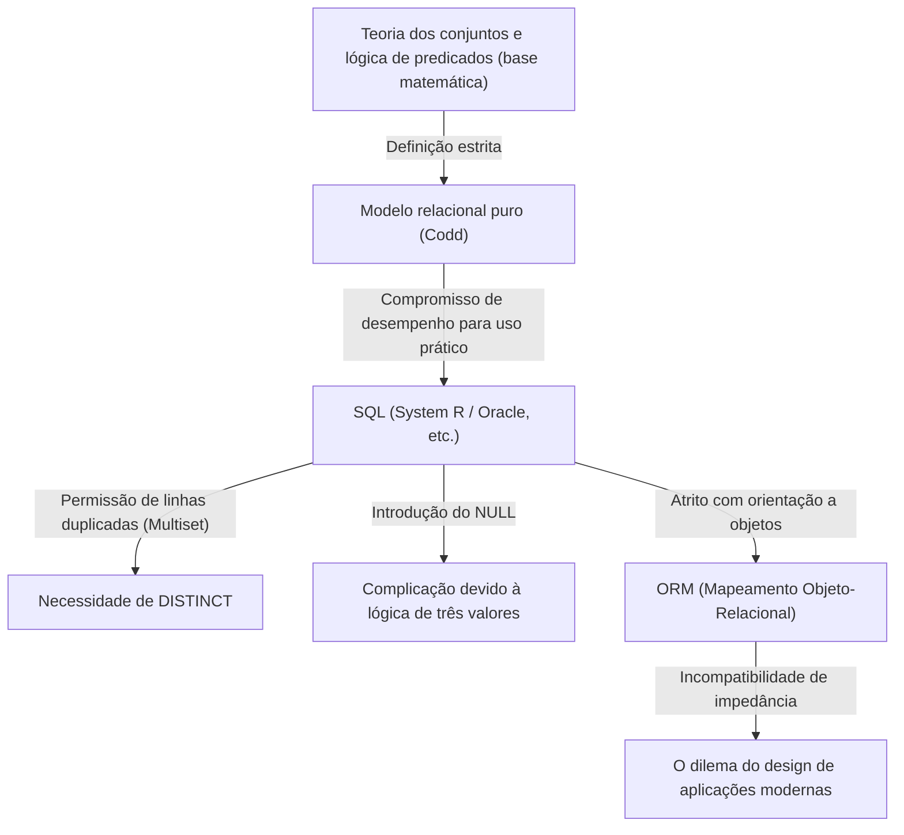

## 1. Introdução: Por que falamos sobre "Relações"

Hoje, no mundo da engenharia de software, quase não há desenvolvedores que não conheçam o SQL (Structured Query Language). De aplicações web a sistemas corporativos, até o armazenamento local de dados em smartphones, os RDBMS (Relational Database Management System) estão operando em quase todos os lugares.

No entanto, "ser capaz de escrever SQL" e "entender a essência do modelo relacional" são assuntos de dimensões completamente diferentes. Muitos desenvolvedores projetam bancos de dados com um modelo mental ingênuo de que "tabelas = algo como planilhas do Excel". Os sistemas podem até funcionar até certo ponto com essa compreensão, mas à medida que a escala do sistema aumenta e as lógicas de domínio complexas se entrelaçam, eles começarão a falhar de forma iminente.

Neste artigo, voltaremos às origens do "modelo relacional" proposto por Edgar F. Codd em 1970, e desvendaremos de forma extremamente detalhada sobre quais bases matemáticas e filosóficas (especialmente a teoria dos conjuntos e a lógica de predicados) ele é construído. O grande feito de Codd de elevar o banco de dados, um dispositivo de armazenamento físico, ao mundo da lógica e matemática pura, não foi apenas um avanço técnico, mas uma mudança de paradigma na ciência da informação.

---

## 2. A Era das Trevas Antes de Codd: Os Limites dos Bancos de Dados Navegacionais

Para entender o verdadeiro valor do modelo relacional, é necessário saber "o que ele resolveu". Na década de 1960, os modelos de banco de dados predominantes eram os chamados "modelos hierárquicos" e "modelos de rede" (exemplos representativos incluem o IMS da IBM e sistemas de banco de dados compatíveis com CODASYL).

Esses sistemas eram chamados de **"navegacionais"**. As relações entre os dados eram codificadas rigidamente (hard-coded) através de ponteiros físicos (referências a endereços de memória), e para recuperar dados, os próprios programadores tinham que estar cientes da estrutura física e escrever código procedimental para "navegar seguindo os ponteiros de um registro pai para um registro filho".

### Os Problemas Fatais dos Bancos de Dados Navegacionais

1. **Falta de Independência de Dados (Lack of Data Independence)**
   A estrutura física dos dados (presença ou ausência de índices, como os ponteiros são configurados, etc.) estava fortemente acoplada ao código da aplicação. Portanto, a menor alteração na estrutura do banco de dados exigiria a reescrita de todo o código da aplicação que dependia dela.
2. **Complexidade de Consultas e Dependência Pessoal**
   Quando existiam múltiplos caminhos (caminhos de acesso) para recuperar um determinado conjunto de dados, o programador tinha que julgar qual caminho era o mais eficiente e escrever o código. Isso exigia habilidades artesanais de alto nível.
3. **Dificuldade em Consultas Ad-Hoc**
   Realizar pesquisas sob condições que não haviam sido previstas (por exemplo, "listar funcionários pertencentes a um determinado departamento e com um salário acima de um certo valor") era inviável ou exigia custos enormes devido à estrutura de ponteiros.

Os dados estavam presos no "pântano" das restrições de hardware e dos métodos de representação física.

---

## 3. Faça-se a Luz: A Mudança de Paradigma de 1970 e o Nascimento do "Modelo Relacional"

Em 1970, Edgar F. Codd, um cientista da computação com formação em matemática que trabalhava no Laboratório de San Jose da IBM (agora o Centro de Pesquisa Almaden), publicou um artigo histórico, "A Relational Model of Data for Large Shared Data Banks".

A ideia apresentada por Codd neste artigo virou de pernas para o ar o senso comum da época. Ele argumentou que "a estrutura lógica dos dados deve ser completamente separada do método de armazenamento físico", e adotou a **"Teoria dos Conjuntos (Set Theory)"** e a **"Lógica de Predicados de Primeira Ordem (First-Order Predicate Logic)"** como bases matemáticas para isso.

### O que é uma Relação?

Muitas pessoas confundem o termo "Relação (Relation)" com "o relacionamento entre tabelas" (por exemplo, a ligação entre a chave primária e a chave estrangeira). No entanto, na definição matemática e de Codd, uma "Relação" refere-se à **"própria tabela (estritamente falando, um conjunto de tuplas)"**.

Na matemática, quando são dados os conjuntos $D_1, D_2, \dots, D_n$, uma relação de $n$-ária $R$ é definida como um subconjunto do produto cartesiano destes conjuntos.

$R \subseteq D_1 \times D_2 \times \dots \times D_n$

Aqui,
- $D_1, D_2, \dots$ são chamados de **Domínio (Domain, domínio de definição)**. Eles correspondem a "tipos (tipos de dados)" em bancos de dados.
- Cada elemento (membro) de $R$ é chamado de **Tupla (Tuple)**. Ela corresponde a uma "linha (Row, registro)" em bancos de dados.
- O conjunto inteiro $R$ é a **Relação (Relation)**, que corresponde a uma "tabela" em bancos de dados.
- A rotulagem do domínio ao qual cada elemento de uma tupla pertence é chamada de **Atributo (Attribute)**, que corresponde a uma "coluna (Column)" em bancos de dados.

### A Restrição Absoluta de Ser um "Conjunto"

O fato de uma relação ser definida como um "conjunto matemático" tem implicações extremamente importantes e estritas. As regras básicas da teoria dos conjuntos tornam-se as restrições da modelagem de dados como elas são.

1. **Eliminação de Duplicações (Singularidade de Tuplas)**
   Não é permitido que elementos exatamente iguais existam várias vezes em um conjunto ($\{1, 2, 2, 3\}$ é equivalente a $\{1, 2, 3\}$). Portanto, **tuplas (linhas) completamente idênticas não devem existir** dentro de uma relação. Isso significa que toda relação deve sempre ter uma chave candidata (um conjunto de atributos que a possa identificar unicamente).
2. **A Falta de Sentido da Ordem (Independência de Top-Down / Left-Right)**
   Os elementos de um conjunto não têm ordem. Portanto, nem a **ordem das tuplas (ordem das linhas)** nem a **ordem dos atributos (ordem das colunas)** que compõem uma relação têm significado. Conceitos como "a terceira linha" ou "a primeira coluna" não existem no modelo relacional.
3. **Valores Atômicos (Primeira Forma Normal)**
   Foi estipulado que os elementos de um domínio deveriam ser "valores que não podem ser decompostos ainda mais (atômicos)". Não é permitido empurrar matrizes ou estruturas aninhadas em um único atributo.

---

## 4. Álgebra Relacional: A Matemática para "Manipular" Dados

Codd, que definiu os dados como conjuntos, forneceu um sistema matemático chamado **Álgebra Relacional (Relational Algebra)** em resposta à pergunta "como extrair os dados desejados desse conjunto".

Álgebra é um sistema de algum "conjunto de valores" e "operadores" nesses valores (por exemplo, $+$, $-$, $\times$, $\div$, etc. para conjuntos numéricos). Na álgebra relacional, os "valores" são relações, e os "operadores" recebem relações como argumentos e **sempre retornam uma nova relação**.

Isto é chamado de **"Propriedade de Fechamento (Closure Property)"**. Como o resultado de uma operação é novamente uma relação, as operações podem ser aninhadas (encadeadas) quantas vezes você quiser.

Os operadores representativos da álgebra relacional são os seguintes:

*   **Restrição (Restrict / Select: $\sigma$)**: Extrai apenas tuplas (linhas) que satisfazem uma condição.
*   **Projeção (Project: $\pi$)**: Extrai apenas atributos (colunas) específicos. Se resultarem duplicações, elas serão eliminadas de acordo com as regras de conjuntos.
*   **Produto Cartesiano (Cartesian Product: $\times$)**: Gera todas as combinações de duas relações.
*   **União (Union: $\cup$)**, **Diferença (Difference: $-$)**, **Interseção (Intersection: $\cap$)**: Operações básicas na teoria dos conjuntos. Eles devem ser compatíveis com a união (ter os mesmos cabeçalhos).
*   **Junção (Join: $\bowtie$)**: Uma combinação de produto cartesiano e restrição, e a operação mais poderosa para conectar dados relacionados.

Ao combinar essas operações, torna-se possível solicitar dados "declarativamente". Em vez de descrever "como buscar os dados (How)", você descreve "quais dados você quer (What)". A otimização da seleção do caminho tornou-se o trabalho a ser assumido não por programadores humanos, mas pelo DBMS (o otimizador dentro dele).

---

## 5. A Lacuna Entre a Teoria e a Realidade: O SQL é "Verdadeiramente Relacional"?

Agora, vamos voltar os nossos olhos para o SQL que usamos todos os dias. O SQL é uma linguagem nascida inspirada no modelo relacional (originada no SEQUEL do projeto System R da IBM), mas na verdade, **não é uma implementação estritamente fiel do modelo relacional de Codd em um sentido estrito.**

Puristas, incluindo Chris Date (C.J. Date, um colega de Codd e evangelista do modelo relacional), têm criticado severamente o SQL por cometer "muitas violações sérias contra o modelo relacional".

### Os Pecados "Não-Relacionais" do SQL

1. **Permissão de Linhas Duplicadas (Bag / Multiset)**
   As tabelas SQL permitem linhas duplicadas por padrão. Elas são implementadas não como conjuntos puros (Set), mas como multiconjuntos (Bag / Multiset). Para eliminar duplicatas, você deve declarar explicitamente `DISTINCT`. Este é um grande compromisso que abala a base do modelo relacional.
2. **A Existência do NULL e a Lógica de Três Valores (3VL)**
   Embora o modelo relacional seja baseado em uma lógica de dois valores (lógica de predicados de primeira ordem) de verdadeiro e falso, o SQL introduziu o `NULL` para indicar que "o valor é desconhecido ou não existe". Com isso, a lógica de avaliação do SQL tornou-se uma **Lógica de Três Valores (Three-Valued Logic)** de TRUE / FALSE / UNKNOWN, tornando o comportamento das consultas extremamente complexo e difícil de prever.
3. **Dependência da Ordem das Colunas**
   No SQL, quando `SELECT *` é executado, as colunas são retornadas na ordem em que a tabela foi definida. Além disso, a cláusula `ORDER BY` pode dar uma ordem ao conjunto de resultados (o resultado ordenado não é mais uma relação, mas uma lista ou cursor).

A figura a seguir ilustra a relação entre o modelo relacional puro e a implementação do SQL na realidade.

---

## 6. A Filosofia da Normalização: Unificando a "Verdade" dos Dados

O que é indispensável quando se fala no modelo relacional é o conceito de **"Normalização (Normalization)"**. A normalização não é apenas "separar tabelas". É um processo para prevenir anomalias de dados (anomalia de atualização, anomalia de inserção, anomalia de exclusão) e realizar o ideal da teoria da informação de **"Um fato em um lugar (One Fact in One Place)"**.

Com base no conceito de Dependência Funcional (Functional Dependency), a estrutura da tabela é refinada em etapas.

*   **Primeira Forma Normal (1NF)**: Todos os atributos são atômicos. Não há grupos de repetição.
*   **Segunda Forma Normal (2NF)**: Satisfaz a 1NF e todos os atributos não-chave são totalmente dependentes funcionalmente de toda a chave primária. (Eliminação de dependência funcional parcial)
*   **Terceira Forma Normal (3NF)**: Satisfaz a 2NF e todos os atributos não-chave são funcionalmente dependentes apenas da chave primária. Eles não dependem de outros atributos não-chave. (Eliminação de dependência funcional transitiva)
*   **Forma Normal de Boyce-Codd (BCNF)**: O estado em que, para toda dependência funcional $X \rightarrow Y$, $X$ é uma superchave. Uma versão ainda mais estrita da 3NF.

Sobre a normalização, frequentemente ouvimos a opinião de que "deve ser desnormalizado moderadamente (Denormalization) porque degrada o desempenho". É verdade que do ponto de vista do I/O de disco físico, o custo de JOINs pode se tornar um problema. No entanto, desistir da normalização desde o início na fase de design do modelo de dados lógico significa escolher um caminho extremamente perigoso de garantir a consistência dos dados com o código da aplicação (lógica de negócios).

O banco de dados não é apenas um "lugar para colocar dados (Bit Bucket)". **O próprio esquema do banco de dados é o documento de primeira classe e o órgão executivo que declara a "verdade (restrições e regras)" nesse domínio de negócios.**

---

## 7. O Significado do Modelo Relacional na Era Moderna e a Ascensão do NoSQL

Na década de 2010, o movimento "NoSQL (Not Only SQL)" surgiu a partir da demanda por Big Data e escalabilidade. Vários armazenamentos de dados, como bancos de dados orientados a documentos (MongoDB, etc.), tipo chave-valor (Redis, etc.), orientados a colunas, bancos de dados de grafos, apareceram, e chegou-se a sussurrar que "a era do relacional acabou".

O NoSQL cobriu áreas nas quais os bancos de dados relacionais eram fracos, como escalabilidade (distribuição horizontal, fragmentação) e a melhoria da velocidade de desenvolvimento devido ao fato de não ter esquema (schemaless). Além disso, a capacidade de salvar documentos JSON como estão era vantajosa em compatibilidade (eliminação da incompatibilidade de impedância) com linguagens de programação orientadas a objetos.

No entanto, como resultado da popularização do NoSQL, os desenvolvedores experimentaram, de certa forma, novamente o antigo "pesadelo do banco de dados navegacional".
Eles vincularam relacionamentos de dados no nível do código (application joins) e sofreram com inconsistências de dados devido à falta de transações. Como resultado, as vozes exigindo uma forte consistência de dados e consultas declarativas aumentaram novamente, e muitos dos bancos de dados NoSQL representativos modernos implementaram funcionalidades de transação e linguagens de consulta semelhantes ao SQL.

Por outro lado, os bancos de dados de próxima geração chamados NewSQL (Google Spanner, CockroachDB, etc.) mantêm a forte base teórica e a interface SQL do modelo relacional, enquanto realizam arquiteturas de distribuição horizontal nativas em nuvem.

A filosofia de "tratar dados como conjuntos lógicos e matemáticos" construída por Codd em 1970 não se desvaneceu em nada, mesmo depois de meio século. Por mais que a forma de armazenamento físico e infraestrutura evolua, o modelo relacional continua a reinar como um marco monumental na história da ciência da informação, como uma resposta ao problema essencial de "como tratar as informações sem contradição e com flexibilidade".

## 8. Conclusão: Imagine um "Conjunto" Antes de Escrever Código

No trabalho de desenvolvimento diário, na era moderna onde os dados podem ser obtidos apenas chamando um método de um mapeador OR (ORM), as oportunidades de estar ciente do modelo relacional por trás dele podem estar diminuindo. Os ORMs são muito convenientes, mas ao mesmo tempo acarretam o perigo de ocultar a verdade de que "uma relação é um conjunto".

Quando consultas complexas não tiverem bom desempenho, ou quando começarem a surgir inconsistências nos dados, em vez de adicionar código como tratamento sintomático, tente parar por um momento e voltar ao mundo da "forma lógica (esquema)" dos dados e da "operação de conjuntos (álgebra)" que os manipula.

As tabelas não são planilhas do Excel, mas "conjuntos de fatos (Fact)".
O SQL não é apenas um comando para extrair dados, mas uma "busca da verdade usando a lógica de predicados".

Compreender esta filosofia profunda deixada por Edgar F. Codd deve fazer com que o design de banco de dados e as consultas SQL que você escreve evoluam para algo mais robusto, belo e verdadeiramente poderoso.
