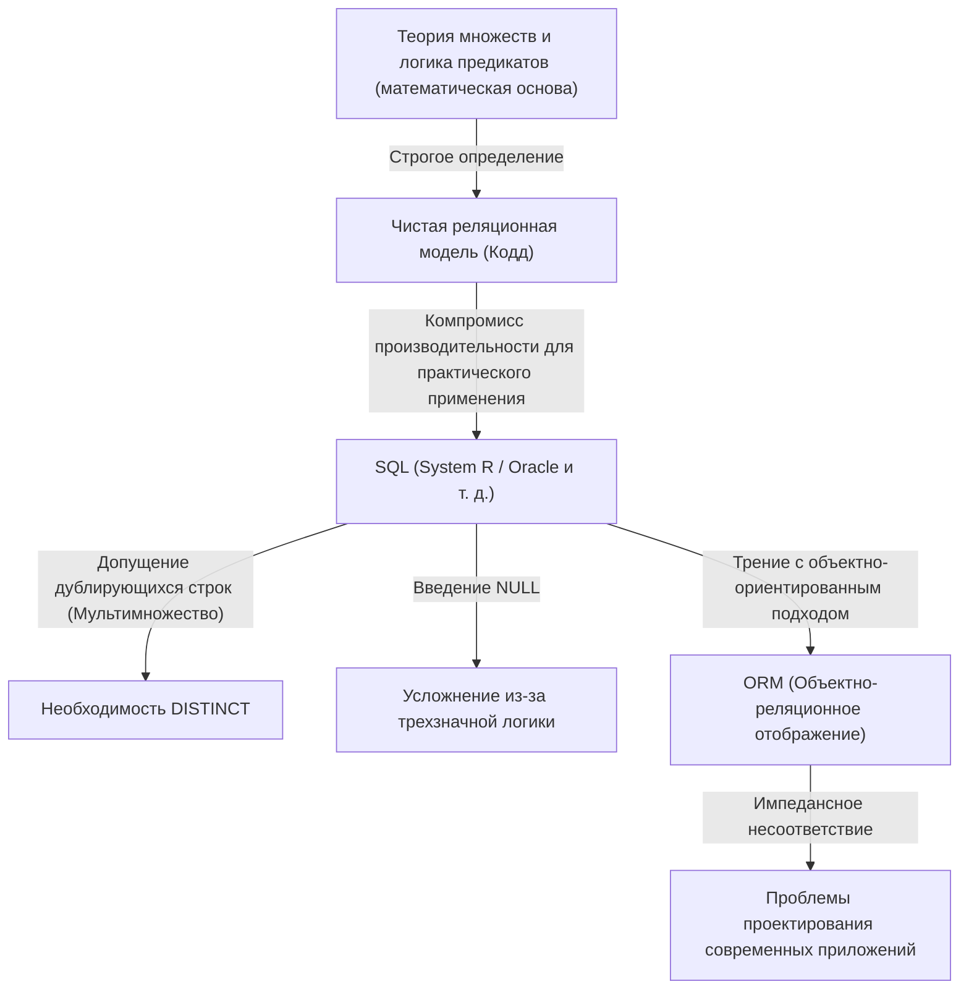
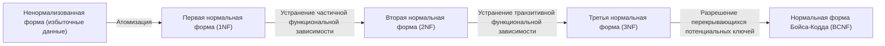

## 1. Введение: Почему мы говорим об «отношении» (реляции)

Сегодня в мире программной инженерии вряд ли найдется разработчик, который не знает SQL (Structured Query Language). От веб-приложений до корпоративных систем и даже локального хранения данных на смартфонах — RDBMS (системы управления реляционными базами данных) работают повсюду.

Однако «уметь писать SQL» и «понимать суть реляционной модели» — это совершенно разные вещи. Многие разработчики проектируют базы данных, опираясь на наивную ментальную модель: «таблица = нечто вроде листа Excel». С таким пониманием система может работать до определенного предела, но когда масштаб системы увеличивается, а сложная предметная логика переплетается, такой подход неизбежно приводит к краху.

В этой статье мы вернемся к истокам «реляционной модели», предложенной Эдгаром Ф. Коддом в 1970 году, и чрезвычайно подробно разберем, на каком математическом и философском фундаменте (в частности, на теории множеств и логике предикатов) она построена. Достижение Кодда, возвысившего физическое устройство хранения баз данных до чистого мира логики и математики, стало не просто техническим прорывом, а настоящей сменой парадигмы в информатике.

---

## 2. Темные века до Кодда: Пределы навигационных баз данных

Чтобы оценить истинную ценность реляционной модели, нужно понять, «какую проблему она решила». В 1960-х годах доминирующими моделями баз данных были «иерархическая модель» и «сетевая модель» (типичными примерами являются IMS от IBM и системы баз данных, совместимые с CODASYL).

Эти системы назывались **«навигационными»**. Связи между данными были жестко закодированы физическими указателями (ссылками на адреса памяти), и для извлечения данных программист должен был сам учитывать эту физическую структуру, написав процедурный код для «перемещения по указателям от родительской записи к дочерней».

### Фатальные проблемы навигационных баз данных

1. **Отсутствие независимости данных (Lack of Data Independence)**
   Физическая структура данных (наличие индексов, способы установки указателей и т. д.) была тесно связана с кодом приложения. Поэтому при малейшем изменении структуры базы данных приходилось переписывать весь зависящий от нее код приложения.
2. **Сложность запросов и зависимость от конкретных разработчиков**
   Если существовало несколько путей (путей доступа) для извлечения определенного набора данных, программисту приходилось решать, какой путь наиболее эффективен, и писать код. Это требовало высокого уровня мастерства.
3. **Сложность выполнения специальных (ad-hoc) запросов**
   Выполнение поиска по условиям, которые не были предусмотрены заранее (например, «составить список сотрудников, работающих в определенном отделе и чья зарплата превышает определенную сумму»), было либо нереалистичным из-за структуры указателей, либо требовало огромных затрат.

Данные были заперты в «болоте» аппаратных ограничений и способов физического представления.

---

## 3. Да будет свет: Сдвиг парадигмы 1970 года и рождение «реляционной модели»

В 1970 году математик и ученый-информатик Эдгар Ф. Кодд, работавший в исследовательской лаборатории IBM в Сан-Хосе (ныне Исследовательский центр Алмаден), опубликовал свою историческую статью «A Relational Model of Data for Large Shared Data Banks».

Идеи, представленные Коддом в этой статье, в корне перевернули тогдашний здравый смысл. Он утверждал, что «логическая структура данных должна быть полностью отделена от метода их физического хранения», и в качестве математической основы для этого принял **«Теорию множеств (Set Theory)»** и **«Логику предикатов первого порядка (First-Order Predicate Logic)»**.

### Что такое отношение (реляция)?

Многие ошибочно понимают слово «отношение» (Relation) как «отношения между таблицами» (например, связь между первичным и внешним ключом). Однако в математическом определении Кодда «отношение» означает **«саму таблицу (строго говоря, множество кортежей)»**.

В математике, когда заданы множества $D_1, D_2, \dots, D_n$, $n$-арное отношение $R$ определяется как подмножество декартова произведения (прямого произведения) этих множеств.

$R \subseteq D_1 \times D_2 \times \dots \times D_n$

Где:
- $D_1, D_2, \dots$ называются **доменами (Domain, областью определения)**. Это эквивалентно «типу (типу данных)» в базе данных.
- Каждый элемент множества $R$ называется **кортежем (Tuple)**. Это эквивалентно «строке (Row, записи)» в базе данных.
- Все множество $R$ целиком является **отношением (Relation)**, что эквивалентно «таблице» в базе данных.
- Метки для доменов, к которым принадлежат элементы в кортеже, называются **атрибутами (Attribute)**, что эквивалентно «столбцу (Column)» в базе данных.

### Абсолютные ограничения того, что это «множество»

Тот факт, что отношение было определено как «математическое множество», имеет чрезвычайно важное и строгое значение. Базовые правила теории множеств напрямую становятся ограничениями для моделирования данных.

1. **Исключение дубликатов (уникальность кортежа)**
   Во множестве не может быть нескольких абсолютно одинаковых элементов ($\{1, 2, 2, 3\}$ эквивалентно $\{1, 2, 3\}$). Следовательно, в отношении **не должно существовать полностью идентичных кортежей (строк)**. Это означает, что любое отношение всегда должно иметь потенциальный ключ (набор атрибутов, который может однозначно его идентифицировать).
2. **Бессмысленность порядка (независимость сверху-вниз / слева-направо)**
   Элементы множества не имеют порядка. Следовательно, **порядок кортежей (строк)** и **порядок атрибутов (столбцов)**, составляющих отношение, не имеют значения. В реляционной модели не существует таких понятий, как «третья строка» или «первый столбец».
3. **Атомарные значения (Первая нормальная форма)**
   Считалось, что элементы домена должны быть «неделимыми (атомарными) значениями». Не допускается помещение массивов или вложенных структур в один атрибут.

---

## 4. Реляционная алгебра: Математика для «манипулирования» данными

Определив данные как множества, Кодд затем подготовил математическую систему под названием **реляционная алгебра (Relational Algebra)** для ответа на вопрос «как извлечь нужные данные из этого множества».

Алгебра — это система, состоящая из какого-либо «множества значений» и «операторов» над этими значениями (например, $+$, $-$, $\times$, $\div$ для множества чисел). «Значение» в реляционной алгебре — это отношение, а «оператор» принимает отношения в качестве аргументов и **всегда возвращает новое отношение**.

Это называется **«Свойством замкнутости (Closure Property)»**. Поскольку результат операции снова является отношением, операции можно вкладывать (объединять в цепочки) сколько угодно раз.

Типичными операторами реляционной алгебры являются:

*   **Ограничение (Restrict / Select: $\sigma$)**: Извлекает только те кортежи (строки), которые удовлетворяют условию.
*   **Проекция (Project: $\pi$)**: Извлекает только определенные атрибуты (столбцы). Если в результате возникают дубликаты, они исключаются в соответствии с правилами множеств.
*   **Декартово произведение (Cartesian Product: $\times$)**: Генерирует все комбинации двух отношений.
*   **Объединение (Union: $\cup$)**, **Разность (Difference: $-$)**, **Пересечение (Intersection: $\cap$)**: Базовые операции в теории множеств. Отношения должны быть совместимы по объединению (иметь одинаковые заголовки).
*   **Соединение (Join: $\bowtie$)**: Комбинация декартова произведения и ограничения; это самый мощный оператор для связывания связанных данных.

Комбинируя эти операции, становится возможным запрашивать данные «декларативно». Вы описываете «какие данные вы хотите (What)», а не «как их получить (How)». Оптимизация выбора пути стала задачей СУБД (а именно ее оптимизатора), а не программиста-человека.

---

## 5. Разрыв между теорией и реальностью: Является ли SQL «истинно реляционным»?

Теперь давайте обратим внимание на SQL, который мы используем каждый день. SQL — это язык, вдохновленный реляционной моделью (он берет свое начало от языка SEQUEL проекта System R от IBM), но на самом деле **в строгом смысле слова он не является точной реализацией реляционной модели Кодда.**

Пуристы, такие как Крис Дейт (C.J. Date, коллега Кодда и евангелист реляционной модели), подвергали SQL резкой критике за то, что он «совершает множество серьезных нарушений реляционной модели».

### «Нереляционные» грехи SQL

1. **Допущение дублирующихся строк (Мультимножество / Bag / Multiset)**
   Таблицы SQL по умолчанию допускают дублирование строк. Они реализованы не как чистые множества (Set), а как мультимножества (Bag / Multiset). Чтобы исключить дубликаты, необходимо явно указать `DISTINCT`. Это серьезный компромисс, который потряс основы реляционной модели.
2. **Наличие NULL и трехзначная логика (3VL)**
   Реляционная модель основана на двузначной логике (логике предикатов первого порядка) истинности и ложности, но в SQL был введен `NULL`, указывающий на то, что «значение неизвестно или отсутствует». В результате логика вычисления SQL стала **трехзначной логикой (Three-Valued Logic)**: TRUE / FALSE / UNKNOWN, что сделало поведение запросов чрезвычайно сложным и непредсказуемым.
3. **Зависимость от порядка столбцов**
   В SQL при выполнении `SELECT *` столбцы возвращаются в том порядке, в котором была определена таблица. Также вы можете задать порядок набора результатов с помощью предложения `ORDER BY` (упорядоченный результат больше не является отношением, а представляет собой список или курсор).

На следующей диаграмме показана взаимосвязь между чистой реляционной моделью и реальной реализацией SQL.

---

## 6. Философия нормализации: Сведение «истины» данных воедино

При обсуждении реляционной модели нельзя обойти вниманием концепцию **«Нормализации (Normalization)»**. Нормализация — это не просто «разделение таблиц». Это процесс предотвращения аномалий данных (аномалий обновления, вставки, удаления) и реализации идеала теории информации о том, что **«один факт находится только в одном месте (One Fact in One Place)»**.

Основываясь на концепции функциональной зависимости (Functional Dependency), структура таблиц поэтапно улучшается.

*   **Первая нормальная форма (1NF)**: Все атрибуты атомарны. Отсутствуют повторяющиеся группы.
*   **Вторая нормальная форма (2NF)**: Удовлетворяет 1NF, и все неключевые атрибуты полностью функционально зависят от всего первичного ключа. (Устранение частичной функциональной зависимости)
*   **Третья нормальная форма (3NF)**: Удовлетворяет 2NF, и все неключевые атрибуты функционально зависят только от первичного ключа. Они не зависят от других неключевых атрибутов. (Устранение транзитивной функциональной зависимости)
*   **Нормальная форма Бойса-Кодда (BCNF)**: Состояние, при котором для всех функциональных зависимостей $X \rightarrow Y$ $X$ является суперключом. Еще более строгая версия 3NF.

Мы часто слышим мнение, что «нормализация снижает производительность, поэтому следует применять умеренную денормализацию (Denormalization)». Действительно, с точки зрения физического ввода-вывода диска затраты на JOIN иногда могут стать проблемой. Однако отказ от нормализации с самого начала на этапе проектирования логической модели данных означает выбор крайне опасного пути, когда обеспечение целостности данных ложится на код приложения (бизнес-логику).

База данных — это не просто «место для хранения данных (Bit Bucket)». **Сама схема базы данных является первоклассным документом и исполнительным органом, декларирующим «истину (ограничения и правила)» в этой предметной области.**

---

## 7. Значение реляционной модели в наши дни и появление NoSQL

В начале 2010-х годов требования к большим данным и масштабируемости породили движение «NoSQL (Not Only SQL)». Появились различные хранилища данных: документо-ориентированные БД (например, MongoDB), хранилища «ключ-значение» (например, Redis), колоночные БД, графовые БД и т. д. Дошло до того, что стали шептаться: «Эпоха реляционных баз данных подошла к концу».

NoSQL охватил те области, в которых реляционные базы данных были не сильны, такие как масштабируемость (горизонтальное распределение, шардинг) и повышение скорости разработки за счет отказа от строгой схемы. Кроме того, возможность сохранять JSON-документы как есть дала преимущество в совместимости с объектно-ориентированными языками программирования (устранение импедансного несоответствия).

Однако в результате распространения NoSQL разработчики в некотором смысле заново пережили «кошмар навигационных баз данных» из прошлого.
Им приходилось объединять отношения между данными на уровне кода (application join) и они страдали от несогласованности данных из-за отсутствия транзакций. Как следствие, спрос на строгую согласованность данных и декларативные запросы снова вырос, и многие из современных популярных баз данных NoSQL стали реализовывать функции транзакций и языки запросов, подобные SQL.

С другой стороны, базы данных следующего поколения, называемые NewSQL (Google Spanner, CockroachDB и т. д.), реализуют облачную горизонтально-распределенную архитектуру, сохраняя при этом мощную теоретическую основу и SQL-интерфейс реляционной модели.

Философия «работы с данными как с логическими и математическими множествами», созданная Коддом в 1970 году, не утратила своей актуальности даже спустя полвека. Независимо от того, насколько эволюционирует физическое хранилище или инфраструктура, в качестве ответа на фундаментальный вопрос «как обращаться с информацией непротиворечиво и гибко», реляционная модель продолжает возвышаться как монументальное достижение в истории информатики.

## 8. Заключение: Перед написанием кода представьте себе «множество»

В повседневной разработке в наше время, когда данные можно получить простым вызовом метода ORM, возможностей задуматься о стоящей за всем этим реляционной модели стало, возможно, меньше. ORM очень удобны, но в то же время они таят в себе опасность сокрытия той истины, что «отношение — это множество».

Когда сложный запрос выполняется медленно или когда в данных начинает появляться несогласованность, вместо того чтобы добавлять симптоматический код для решения проблемы, остановитесь на мгновение и вернитесь к миру «логической формы (схемы)» данных и «операций над множествами (алгебре)», которые ими управляют.

Таблица — это не лист Excel, а «множество фактов (Fact)».
SQL — это не просто команда на извлечение данных, а «поиск истины с использованием логики предикатов».

Поняв эту глубокую философию, оставленную Эдгаром Ф. Коддом, проектирование баз данных и SQL-запросы, которые вы пишете, должны эволюционировать, став более надежными, красивыми и по-настоящему мощными.
