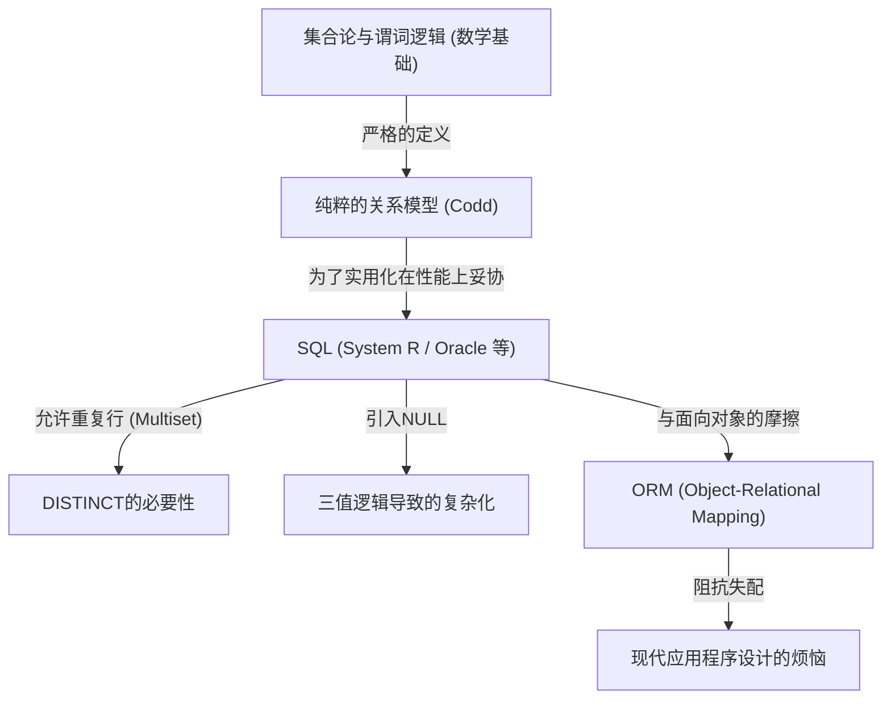

## 1. 引言：为什么我们要讨论“关系（Relation）”

如今，在软件工程的世界里，几乎没有不知道SQL（Structured Query Language）的开发者。从Web应用程序到企业级系统，甚至智能手机的本地数据存储，RDBMS（Relational Database Management System）在所有地方都在运行。

然而，“会写SQL”和“理解关系模型的精髓”完全是两个不同维度的话题。许多开发者带着“表=类似Excel工作表”的朴素心智模型来进行数据库设计。即使是这种理解，系统在某种程度上也能运行，但当系统规模扩大，复杂的领域逻辑相互交织时，它就会立刻崩溃。

本文将回归1970年埃德加·F·科德（Edgar F. Codd）提出的“关系模型”的起源，极其详细地揭示它是建立在怎样的数学和哲学基础（特别是集合论和谓词逻辑）之上的。科德将数据库这个物理存储设备升华到了纯粹的逻辑和数学的世界，这一壮举不仅是单纯的技术突破，更是信息科学领域的一次范式转换。

---

## 2. 科德之前的黑暗时代：导航式数据库的局限性

为了理解关系模型的真正价值，我们需要知道它“解决了什么”。20世纪60年代，主流的数据库模型被称为“层次模型”和“网状模型”（典型代表是IBM的IMS和符合CODASYL标准的数据库系统）。

这些系统被称为**“导航式（Navigational）”**。数据之间的关联性通过物理指针（对内存地址的引用）进行硬编码，为了获取数据，程序员自己必须意识到其物理结构，并编写“从父记录通过指针移动到子记录”的过程式代码。

### 导航式数据库的致命问题

1. **缺乏数据独立性（Lack of Data Independence）**
   物理数据结构（是否存在索引、指针的连接方式等）与应用程序代码紧密耦合。因此，只要稍微改变数据库的结构，就必须重写所有依赖它的应用程序代码。
2. **查询的复杂性与对个人的依赖**
   当提取特定数据集的路径（访问路径）有多个时，程序员需要判断哪条路径最高效并编写代码。这需要高超的工匠技艺。
3. **即席查询（Ad-hoc Query）的困难**
   由于指针结构的限制，执行未预先设定的条件查询（例如“列出属于某个部门且薪水在一定金额以上的员工”）是不切实际的，或者需要付出巨大的成本。

数据被困在硬件限制和物理表示方法这个“泥潭”中。

---

## 3. 要有光：1970年的范式转换与《关系模型》的诞生

1970年，曾在IBM圣何塞研究所（现阿尔马登研究中心）工作的数学家出身的计算机科学家埃德加·F·科德，发表了一篇历史性的论文《A Relational Model of Data for Large Shared Data Banks》。

在这篇论文中，科德提出的想法从根本上颠覆了当时的常识。他主张“数据的逻辑结构应该与物理存储方法完全分离”，并采用了**“集合论（Set Theory）”**和**“一阶谓词逻辑（First-Order Predicate Logic）”**作为其数学基础。

### 什么是关系？

许多人将“关系（Relation）”一词误解为“表之间的关系（Relationship）”（例如主键和外键的关联等）。然而，在数学和科德的定义中，“关系”指的是**“表本身（严格来说是元组的集合）”**。

在数学中，给定集合 $D_1, D_2, \dots, D_n$，一个 $n$ 元关系 $R$ 被定义为这些集合的笛卡尔积（直积）的子集。

$R \subseteq D_1 \times D_2 \dots \times D_n$

在这里：
- $D_1, D_2, \dots$ 被称为**域（Domain，定义域）**。它相当于数据库中的“类型（数据类型）”。
- $R$ 的每个元素（Element）被称为**元组（Tuple）**。它相当于数据库中的“行（Row，记录）”。
- $R$ 这个集合整体就是**关系（Relation）**，相当于数据库中的“表”。
- 为元组内各个元素所属的域打上标签被称为**属性（Attribute）**，相当于数据库中的“列（Column）”。

### 作为“集合”的绝对约束

将关系定义为“数学集合”具有极其重要且严格的意义。集合论的基本规则直接成为了数据建模的约束。

1. **消除重复（元组的唯一性）**
   在集合中，不允许存在完全相同的多个元素（$\{1, 2, 2, 3\} 与 \{1, 2, 3\}$ 是等价的）。因此，在关系内**绝对不能存在完全相同的元组（行）**。这意味着所有的关系都必须拥有候选键（能够唯一标识的属性集合）。
2. **顺序无意义（自上而下 / 自左向右的非依赖性）**
   集合的元素没有顺序。因此，构成关系的**元组的顺序（行的顺序）**和**属性的顺序（列的顺序）**都是没有意义的。“第3行”、“第1列”这样的概念在关系模型中是不存在的。
3. **原子值（第一范式）**
   域的元素应该是“不能再分解的（原子性的）值”。不允许将数组或嵌套结构塞入一个属性中。

---

## 4. 关系代数：用于“操作”数据的数学

将数据定义为集合后，科德接着针对“如何从该集合中推导出想要的数据”这一问题，准备了一个名为**关系代数（Relational Algebra）**的数学体系。

代数（Algebra）是指某种“值的集合”及其值的“运算符”体系（例如，对于数的集合有 $+$, $-$, $\times$, $\div$ 等）。关系代数中的“值”是关系，“运算符”以关系为参数，并且**必定返回一个新的关系**。

这被称为**“闭包性（Closure Property）”**。因为运算的结果依然是关系，所以可以将运算无限次地嵌套（链接）起来。

代表性的关系代数运算符如下：

*   **限制（Restrict / Select: $\sigma$）**: 仅提取满足条件的元组（行）。
*   **投影（Project: $\pi$）**: 仅提取特定的属性（列）。如果结果产生重复，则根据集合的规则消除重复。
*   **笛卡尔积（Cartesian Product: $\times$）**: 生成两个关系的所有组合。
*   **并（Union: $\cup$）**, **差（Difference: $-$）**, **交（Intersection: $\cap$）**: 集合论中的基本运算。需要满足并兼容性（即标题相同）。
*   **连接（Join: $\bowtie$）**: 笛卡尔积和限制的组合，是将相关数据连接在一起的最强大的运算。

通过组合这些运算，可以“声明式”地请求数据。我们描述的是“想要什么样的数据（What）”，而不是“如何去获取数据（How）”。选择最优路径的工作，从人类程序员转移到了DBMS（中的优化器）身上。

---

## 5. 理论与现实的差距：SQL是“真正的关系”吗？

现在，让我们来看看我们每天使用的SQL。虽然SQL是受关系模型的启发而诞生的语言（起源于IBM System R项目的SEQUEL），但实际上**在严格意义上，它并不是对科德的关系模型的忠实实现。**

以克里斯·戴特（C.J. Date，科德的同事、关系模型的布道者）为首的纯粹主义者们，一直严厉批评SQL“违反了许多关系模型的重大原则”。

### SQL所包含的“非关系”罪恶

1. **允许重复行（Bag / Multiset）**
   SQL的表默认允许出现重复的行。它不是作为纯粹的集合（Set），而是作为多重集（Bag / Multiset）实现的。要消除重复，必须显式地编写 `DISTINCT`。这是动摇关系模型根基的重大妥协。
2. **NULL的存在与三值逻辑（3VL）**
   关系模型是基于真与伪的二值逻辑（一阶谓词逻辑）的，但SQL引入了表示“值未知或不存在”的 `NULL`。由此，SQL的评估逻辑变成了 TRUE / FALSE / UNKNOWN 的**三值逻辑（Three-Valued Logic）**，使得查询的行为变得极其复杂且难以预测。
3. **对列顺序的依赖**
   在SQL中，如果执行 `SELECT *`，则会按照表定义时的顺序返回列。此外，可以通过 `ORDER BY` 子句对结果集进行排序（被排序的结果不再是关系，而是列表或游标）。

下图展示了纯粹的关系模型与现实中SQL实现之间的关系。

---

## 6. 规范化的哲学：使数据的“真理”唯一化

在讨论关系模型时，不可或缺的是**“规范化（Normalization）”**的概念。规范化不仅仅是“拆分表”。它是为了防止数据异常（更新异常、插入异常、删除异常），实现**“一个事实只存在于一个地方（One Fact in One Place）”**这一信息论理想的过程。

基于函数依赖（Functional Dependency）的概念，逐步完善表的结构。

*   **第一范式 (1NF)**: 所有属性都是原子的。不存在重复的组。
*   **第二范式 (2NF)**: 满足1NF，且所有非键属性都完全函数依赖于整个主键。（消除部分函数依赖）
*   **第三范式 (3NF)**: 满足2NF，且所有非键属性只函数依赖于主键。不依赖于其他非键属性。（消除传递函数依赖）
*   **巴斯-科德范式 (BCNF)**: 在所有函数依赖 $X \rightarrow Y$ 中，$X$ 都是超键的状态。它是3NF的更严格版本。

关于规范化，我们经常听到这样的观点：“因为它会降低性能，所以应该适度地反规范化（Denormalization）”。确实，从物理磁盘I/O的角度来看，JOIN的成本有时会成为问题。但是，在逻辑数据模型的设计阶段，如果从一开始就放弃规范化，就意味着选择了一条极其危险的道路：依靠应用程序代码（业务逻辑）来保证数据的一致性。

数据库不仅仅是一个“放置数据的地方（Bit Bucket）”。**数据库的模式（Schema）本身就是声明了该业务领域中的“真理（约束和规则）”的一等文档，也是执行机构。**

---

## 7. 关系模型在现代的意义与NoSQL的崛起

进入2010年代后，由于大数据和可扩展性的要求，掀起了一场“NoSQL（Not Only SQL）”运动。面向文档的DB（如MongoDB）、键值型（如Redis）、列式DB、图DB等各种数据存储相继出现，甚至有人窃窃私语：“关系型数据库的时代结束了”。

NoSQL涵盖了关系型数据库不擅长的领域，如可扩展性（水平分布、分片）以及由于无模式（Schema-less）带来的开发速度提升。此外，能够直接保存JSON文档，在与面向对象编程语言的兼容性（消除阻抗失配）方面具有优势。

然而，NoSQL普及的结果是，开发者们在某种意义上重新体验了曾经的“导航式数据库的噩梦”。
他们在代码层面连接数据间的关系（应用程序连接），或者因为缺乏事务而受到数据不一致的困扰。结果，对强大的数据一致性和声明式查询的需求再次高涨，现代许多具有代表性的NoSQL数据库，也开始实现事务功能和类似SQL的查询语言。

另一方面，被称为NewSQL（如Google Spanner、CockroachDB等）的新一代数据库，在保持关系模型强大的理论基础和SQL接口的同时，实现了云原生的水平分布式架构。

科德在1970年建立的“将数据作为逻辑和数学集合来处理”的哲学，即使经过了半个世纪，也依然没有褪色。无论物理存储或基础设施的形态如何进化，作为“如何无矛盾且灵活地处理信息”这一本质课题的答案，关系模型始终作为信息科学历史上的金字塔屹立不倒。

## 8. 结论：在编写代码前请想象“集合”

在日常的开发工作中，在这个只需调用OR映射器（ORM）的方法就能获取数据的时代，我们意识到背后的关系模型的机会可能正在减少。ORM非常方便，但同时也孕育着掩盖“关系就是集合”这一真相的危险。

当复杂查询的性能不佳，或者数据开始出现不一致时，请不要仅仅添加头痛医头、脚痛医脚的代码，而是停下来，回到数据的“逻辑形状（模式）”以及操作它的“集合运算（代数）”世界中去。

表不是Excel工作表，而是“事实（Fact）的集合”。
SQL不是单纯的数据提取命令，而是“利用谓词逻辑对真理的探求”。

通过理解埃德加·F·科德留下的这门深奥哲学，您所编写的数据库设计，以及SQL查询，必将进化得更加健壮、优美且真正强大。
