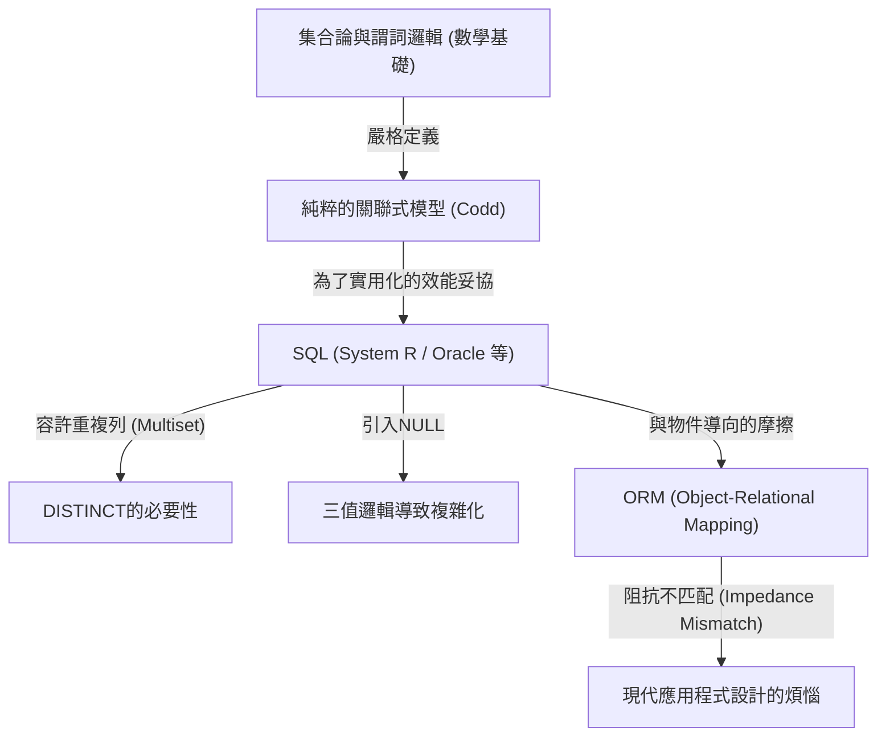

## 1. 簡介：為何我們要討論「關聯 (Relation)」

今日，在軟體工程的世界中，幾乎沒有不知道SQL (Structured Query Language) 的開發者。從Web應用程式到企業級系統，甚至智慧型手機的本機資料儲存，RDBMS (Relational Database Management System) 都在各種地方運行著。

然而，「能夠撰寫SQL」與「理解關聯式模型的精髓」是完全不同層次的事情。許多開發者抱持著「資料表＝類似Excel工作表」這種樸素的心智模型來進行資料庫設計。雖然這種理解也能讓一定程度的系統運作，但當系統規模變大、複雜的領域邏輯交織在一起時，便會立刻面臨崩潰。

本文將回顧1970年由埃德加·F·科德 (Edgar F. Codd) 所提倡的「關聯式模型」之起源，並極其詳細地解明它建立在什麼樣的數學與哲學基礎 (特別是集合論與謂詞邏輯) 之上。科德將資料庫這個物理儲存裝置昇華至純粹邏輯與數學世界的這項偉業，不僅僅是技術上的突破，更是資訊科學中的典範轉移。

---

## 2. 科德以前的黑暗時代：導航式資料庫的極限

為了理解關聯式模型的真正價值，我們必須知道它「解決了什麼」。1960年代，主流的資料庫模型被稱為「階層式模型」或「網路式模型」(代表性例子有IBM的IMS以及遵循CODASYL標準的資料庫系統)。

這些系統被稱為**「導航式 (Navigational)」**。資料之間的關聯性藉由物理指標 (對記憶體位址的參照) 被硬編碼 (hard-coded)，為了取得資料，程式設計師本身必須意識到其物理結構，並撰寫「從父記錄循著指標移動至子記錄」這樣的程序性程式碼。

### 導航式資料庫的致命問題

1. **缺乏資料獨立性 (Lack of Data Independence)**
   物理的資料結構 (索引的有無、指標的建立方式等) 與應用程式程式碼緊密耦合。因此，只要稍微變更資料庫的結構，就必須改寫所有依賴它的應用程式程式碼。
2. **查詢的複雜性與依賴個人經驗**
   當擷取特定資料集的路徑 (存取路徑) 有多條時，程式設計師必須判斷哪條路徑最有效率並撰寫程式碼。這需要高度的職人技巧。
3. **即席查詢 (Ad-hoc Query) 的困難**
   在未預先設定的條件下進行搜尋 (例如「列出隸屬於某部門且薪資達一定金額以上的員工」)，受限於指標的結構，在實務上是不切實際的，或是需要耗費極大的成本。

資料被困在硬體限制與物理表示方式的「泥沼」中。

---

## 3. 迎向光明：1970年的典範轉移與《關聯式模型》的誕生

1970年，任職於IBM聖荷西實驗室 (現為阿爾馬登研究中心)、擁有數學家背景的電腦科學家埃德加·F·科德，發表了歷史性的論文《A Relational Model of Data for Large Shared Data Banks》(大型共享資料庫的資料關聯式模型)。

科德在這篇論文中提出的概念，從根本顛覆了當時的常識。他主張「資料的邏輯結構應該與物理儲存方式完全分離」，並採用**「集合論 (Set Theory)」**與**「一階謂詞邏輯 (First-Order Predicate Logic)」**作為其數學基礎。

### 什麼是關聯 (Relation)？

許多人將「關聯 (Relation)」一詞誤解為「資料表之間的關係 (Relationship)」(例如主鍵與外鍵的結合等)。然而，在數學與科德的定義中，「關聯」指的是**「資料表本身 (嚴格來說是元組的集合)」**。

在數學中，當給定集合 $D_1, D_2, \dots, D_n$ 時，$n$ 元關聯 $R$ 定義為這些集合的笛卡兒積 (卡氏積) 的子集。

$R \subseteq D_1 \times D_2 \times \dots \times D_n$

在這裡，
- $D_1, D_2, \dots$ 稱為**定義域 (Domain)**。相當於資料庫中的「型別 (資料型別)」。
- $R$ 的每個元素稱為**元組 (Tuple)**。相當於資料庫中的「列 (Row，記錄)」。
- $R$ 這個集合整體就是**關聯 (Relation)**，相當於資料庫中的「資料表 (Table)」。
- 為元組內各元素所屬之定義域加上標籤，稱為**屬性 (Attribute)**，相當於資料庫中的「行/欄 (Column)」。

### 作為「集合」的絕對限制

將關聯定義為「數學上的集合」，具有極其重要且嚴格的意義。集合論的基本規則將直接成為資料塑模的限制。

1. **排除重複 (元組的唯一性)**
   集合中不允許存在多個完全相同的元素 ($\{1, 2, 2, 3\}$ 等同於 $\{1, 2, 3\}$)。因此，關聯中**絕對不能存在完全相同的元組 (列)**。這意味著所有關聯都必須擁有候選鍵 (能唯一識別的屬性集合)。
2. **順序的無意義性 (不依賴由上至下/由左至右)**
   集合的元素沒有順序。因此，構成關聯的**元組順序 (列的順序)**與**屬性順序 (行的順序)**都沒有任何意義。在關聯式模型中，不存在「第3列」、「第1行」這樣的概念。
3. **原子值 (第一正規化)**
   定義域的元素必須是「無法再分解的 (原子的) 值」。不允許將陣列或巢狀結構塞入單一屬性中。

---

## 4. 關聯代數：「操作」資料的數學

將資料定義為集合後，針對「如何從該集合導出想要的資料」這個問題，科德準備了名為**關聯代數 (Relational Algebra)**的數學體系。

代數 (Algebra) 是指某種「值的集合」與針對該值的「運算子」所組成的體系 (例如針對數字集合的 $+$, $-$, $\times$, $\div$ 等)。關聯代數中的「值」即為關聯，而「運算子」則是以關聯為參數，並**保證回傳新關聯**的設計。

這被稱為**「閉包性 (Closure Property)」**。因為運算的結果依然是關聯，所以可以無限制地嵌套 (連鎖) 運算。

代表性的關聯代數運算子如下：

*   **限制 (Restrict / Select: $\sigma$)**: 僅萃取滿足條件的元組 (列)。
*   **投影 (Project: $\pi$)**: 僅萃取特定的屬性 (行/欄)。若結果產生重複，將依照集合的規則排除重複。
*   **笛卡兒積 (Cartesian Product: $\times$)**: 產生兩個關聯的所有組合。
*   **聯集 (Union: $\cup$)**, **差集 (Difference: $-$)**, **交集 (Intersection: $\cap$)**: 集合論中的基本運算。必須滿足聯集相容 (標題相同)。
*   **結合 (Join: $\bowtie$)**: 結合笛卡兒積與限制，是將相關資料連接起來最強大的運算。

透過組合這些運算，可以「宣告式地」要求資料。我們描述的是「想要什麼資料 (What)」，而不是「要如何取得資料 (How)」。最佳化路徑選擇的工作不再是由人類程式設計師負責，而是DBMS (內部的最佳化器) 應負的責任。

---

## 5. 理論與現實的差距：SQL是「真正的關聯式」嗎？

現在，讓我們將目光轉向每天使用的SQL。SQL是受關聯式模型啟發而誕生的語言 (起源於IBM System R專案的SEQUEL)，但其實**在嚴格意義上，它並未忠實實作科德的關聯式模型。**

包含克里斯·達特 (C.J. Date，科德的同事兼關聯式模型的傳道者) 在內的純粹主義者們，嚴厲批評SQL「犯下了許多違反關聯式模型的重大過錯」。

### SQL所背負的「非關聯式」罪惡

1. **容許重複列 (Bag / Multiset)**
   SQL的資料表預設容許重複的列。它並不是實作為純粹的集合 (Set)，而是多重集 (Bag / Multiset)。必須明確撰寫 `DISTINCT` 才能排除重複。這是動搖關聯式模型根基的重大妥協。
2. **NULL的存在與三值邏輯 (3VL)**
   關聯式模型是基於真與偽的二值邏輯 (一階謂詞邏輯)，但SQL引入了表示「值不明或不存在」的 `NULL`。這導致SQL的評估邏輯變成了包含 TRUE / FALSE / UNKNOWN 的**三值邏輯 (Three-Valued Logic)**，使得查詢的行為變得極為複雜且難以預測。
3. **依賴行的順序**
   在SQL中執行 `SELECT *` 時，會依照定義資料表的順序回傳行。此外，可以透過 `ORDER BY` 子句為結果集賦予順序 (被排序的結果已不再是關聯，而是串列或游標)。

下圖展示了純粹關聯式模型與現實SQL實作之間的關係。

---

## 6. 正規化的哲學：將資料的「真理」歸一

談論關聯式模型時不可或缺的概念就是**「正規化 (Normalization)」**。正規化並不單純只是「拆分資料表」。它是為了防止資料異常 (更新異常、插入異常、刪除異常)，並實現**「一個事實僅存在於一個地方 (One Fact in One Place)」**這項資訊理論理想的過程。

基於功能相依性 (Functional Dependency) 的概念，階段性地精煉資料表的結構。

*   **第一正規化 (1NF)**: 所有屬性都是原子的。不存在重複群組。
*   **第二正規化 (2NF)**: 滿足1NF，且所有非鍵屬性都完全功能相依於整個主鍵。(排除部分功能相依性)
*   **第三正規化 (3NF)**: 滿足2NF，且所有非鍵屬性僅功能相依於主鍵。不相依於其他非鍵屬性。(排除遞移功能相依性)
*   **博伊斯-科德正規化 (BCNF)**: 在所有的功能相依性 $X \rightarrow Y$ 中，$X$ 皆為超鍵的狀態。這是更為嚴格版本的3NF。

關於正規化，我們常聽到「會降低效能，所以應該適度地反正規化 (Denormalization)」這樣的意見。確實，從物理磁碟I/O的觀點來看，JOIN的成本有時會成為問題。然而，如果在邏輯資料模型設計階段一開始就放棄正規化，這意味著選擇了一條極其危險的道路：必須由應用程式的程式碼 (業務邏輯) 來保證資料的一致性。

資料庫不僅僅是「放置資料的地方 (Bit Bucket)」。**資料庫的綱要 (Schema) 本身，就是宣告了該業務領域中「真理 (限制與規則)」的一等文件，同時也是執行機關。**

---

## 7. 關聯式模型在現代的意義與NoSQL的崛起

進入2010年代後，由於大數據與可擴展性的需求，掀起了「NoSQL (Not Only SQL)」運動。出現了文件導向資料庫 (如MongoDB)、鍵值對型 (如Redis)、列導向資料庫、圖形資料庫等多種資料儲存方式，甚至有人私下耳語「關聯式時代已結束」。

NoSQL涵蓋了關聯式資料庫不擅長的領域，如可擴展性 (水平分散、分片) 以及無綱要 (Schema-less) 帶來的開發速度提升等。此外，能夠直接儲存JSON文件，在與物件導向程式語言的契合度 (消除阻抗不匹配) 上也具有優勢。

然而，NoSQL普及的結果，是開發者們在某種意義上重新體驗了過去「導航式資料庫的夢魘」。
他們必須在程式碼層級結合資料間的關係 (Application Join)，或者因為缺乏交易 (Transaction) 而苦惱於資料的不一致性。結果，對強大資料一致性與宣告式查詢的呼聲再度高漲，現代許多具代表性的NoSQL資料庫也開始實作交易功能與類似SQL的查詢語言。

另一方面，被稱為NewSQL (如Google Spanner, CockroachDB等) 的次世代資料庫，則在維持關聯式模型強大理論基礎與SQL介面的同時，實現了雲端原生的水平分散架構。

科德於1970年建立的「將資料視為邏輯與數學集合來處理」的哲學，即使經過了半個世紀也絲毫未曾褪色。無論物理儲存或基礎設施的型態如何演進，作為「如何無矛盾且靈活地處理資訊」這個本質性課題的解答，關聯式模型依然作為資訊科學歷史上的金字塔屹立不搖。

## 8. 結論：在寫程式碼之前，先想像「集合」

在日常的開發業務中，只要呼叫OR對映 (ORM) 的方法就能取得資料的現代，意識到背後關聯式模型的機會或許減少了。ORM雖然非常方便，但同時也伴隨著隱藏「關聯即集合」這個真相的危險性。

當複雜查詢的效能無法發揮，或者資料開始出現不一致時，請不要急著加入治標不治本的程式碼，而是先停下腳步，回到資料的「邏輯形狀 (綱要)」以及操作它的「集合運算 (代數)」的世界中重新思考。

資料表不是Excel工作表，而是「事實 (Fact) 的集合」。
SQL不僅僅是擷取資料的指令，而是「運用謂詞邏輯的真理探求」。

只要理解了埃德加·F·科德所遺留的深奧哲學，你所撰寫的資料庫設計以及SQL查詢，必定會進化為更堅固、優美且真正強大的成果。
