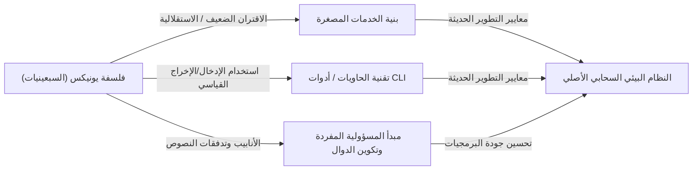

# مقدمة: ما هي فلسفة يونيكس؟

في هندسة البرمجيات الحديثة، لا يمر يوم دون سماع مصطلحات مثل "التصميم المعياري"، "مبدأ المسؤولية المفردة" و"الاقتران الضعيف". يتم التعامل مع هذه المفاهيم كقواعد ذهبية للحفاظ على قاعدة أكواد نظيفة وبناء أنظمة قابلة للتوسع والصيانة. ومع ذلك، لم تولد هذه المفاهيم في السنوات الأخيرة. إذا تتبعنا جذورها، سنصل إلى نظام تشغيل واحد ولد في مختبرات بيل في أوائل السبعينيات: "يونيكس (Unix)".

لم يكن يونيكس مجرد نظام تشغيل. بل كان تجسيدًا لفكرة "كيفية بناء برمجيات ممتازة"، أي "فلسفة يونيكس". هذه الفلسفة التي أسسها عمالقة مثل كين طومسون ودينيس ريتشي ودوغ ماكلروي، لا تزال حية وبقوة في البنى المعمارية السحابية والخدمات المصغرة اليوم بعد نصف قرن.

في هذه المقالة، سوف نتعمق في جوهر "التصميم المعياري" الذي هو أساس فلسفة يونيكس، ونكتشف لماذا استمر دعم هذه الفكرة عبر الزمن.

## الفصل الأول: الصغير جميل — قوة البرامج الصغيرة

للتعبير عن فلسفة يونيكس بوضوح، هناك المبدأ التالي الذي اقترحه دوغ ماكلروي:

> "Make each program do one thing well. To do a new job, build afresh rather than complicate old programs by adding new 'features'."
> (اجعل كل برنامج يقوم بشيء واحد بشكل جيد. للقيام بمهمة جديدة، قم بالبناء من جديد بدلاً من تعقيد البرامج القديمة بإضافة 'ميزات' جديدة.)

هذا المبدأ هو ترياق قوي لـ "لعنة التعقيد" في تطوير البرمجيات. مع نمو البرامج، غالبًا ما يضيف المطورون ميزات بحسن نية. ومع ذلك، فإن إضافة الميزات تزيد من الحالة، وتصعب الاختبار، وتخلق بيئة خصبة للأخطاء. هذه هي ولادة البرنامج "المتجانس (Monolithic)" الضخم.

نهج يونيكس مختلف تمامًا. على سبيل المثال، `grep` للبحث في الملفات، `sort` لفرز النصوص، `uniq` لإزالة التكرارات، و `wc` لعد الكلمات؛ كل منها له وظيفة محدودة للغاية. لا يمكنهم أداء مهام معقدة بمفردهم، ولكن بدلاً من ذلك تم تحسينهم لتنفيذ "مهمة واحدة معينة" بشكل مثالي وسريع.

يتوافق هذا تمامًا مع "مبدأ المسؤولية المفردة (SRP)" في البرمجة الموجهة للكائنات الحديثة. المبدأ القائل بأن الفئة أو الوحدة يجب أن يكون لها سبب واحد فقط للتغيير.

## الفصل الثاني: خط الأنابيب — اللغة المشتركة لتدفق البيانات

ومع ذلك، فإن مجرد وجود برامج صغيرة بشكل منفصل لا يكفي لمواجهة الواقع المعقد. نحن بحاجة إلى "غراء" لربطهم معًا. هذا الغراء في يونيكس هو "الأنبوب (`|`)"، واللغة المشتركة هي "تدفق النص".

قال ماكلروي:

> "Expect the output of every program to become the input to another, as yet unknown, program. Don't clutter output with extraneous information."
> (توقع أن يصبح مخرجات كل برنامج مدخلات لبرنامج آخر غير معروف بعد. لا تزدحم المخرجات بمعلومات غريبة.)

تستقبل برامج يونيكس النصوص من الإدخال القياسي (stdin) وتكتب النصوص إلى الإخراج القياسي (stdout). من خلال اعتماد تنسيق بسيط وعالمي للغاية وهو النص، أصبح من الممكن ربط أي برامج معًا باستخدام الأنابيب.

```bash
# مثال: استخراج أخطاء معينة من ملف السجل، حساب عدد تكراراتها، وفرزها بترتيب تنازلي
cat server.log | grep "ERROR" | awk '{print $5}' | sort | uniq -c | sort -nr
```

يُظهر سطر الأوامر أعلاه تعاونًا مذهلاً على الرغم من أن البرامج لا تعرف بعضها البعض على الإطلاق. `grep` لا يعرف بوجود `awk`، و `sort` يقوم ببساطة بفرز المخرجات السابقة.

### مقارنة البنية: المتجانس مقابل خط الأنابيب

هنا، دعونا نقارن بين النهج المتجانس التقليدي ونهج خط أنابيب يونيكس باستخدام رسم بياني.


في النهج المتجانس، تميل هياكل البيانات الداخلية إلى أن تكون مقترنة بإحكام، وهناك خطر من أن التغيير في جزء واحد سيؤثر على النظام بأكمله. من ناحية أخرى، في نهج خط أنابيب يونيكس، يتم توحيد الواجهة بين العقد في شكل "النص العادي" الأقل اقترانًا، لذلك من السهل جدًا استبدال برنامج بآخر أو إدراج خطوة جديدة في المنتصف.

## الفصل الثالث: الصمت من ذهب — واجهة المستخدم وجماليات التصميم

هناك "قاعدة الصمت (Rule of Silence)" في فلسفة يونيكس. إنها فكرة أنه "إذا لم يكن لدى البرنامج أي شيء مفاجئ ليقوله، فلا ينبغي له أن يقول شيئًا."

عدم إخراج أي شيء عند النجاح (فقط إرجاع رمز الخروج `0`)، وإخراج رسالة إلى الخطأ القياسي (stderr) فقط عند حدوث خطأ. قد يبدو هذا غير ودي بعض الشيء للمستخدمين المبتدئين، ولكنه له معنى مهم جدًا في التصميم المعياري.

هذا لأنه إذا قام برنامج بإخراج رسالة ثرثارة مثل "تمت المعالجة بنجاح!" إلى الإخراج القياسي، فإن البرنامج التالي (مثل `grep` أو `sort`) سيعالج تلك الرسالة كجزء من البيانات، وسيتم تدمير خط الأنابيب.

تجريد واجهة المستخدم (UI) المفرطة للبشر وإعطاء الأولوية للتعاون مع الآلات (البرامج الأخرى). يعتمد هذا أيضًا على رؤية عميقة لزيادة النمطية.

## الفصل الرابع: سلالة هندسة البرمجيات الحديثة

لقد مر أكثر من 50 عامًا منذ ابتكار فلسفة يونيكس. تغيرت بيئة الحوسبة بشكل كبير من عصر البطاقات المثقوبة والإطارات الرئيسية وأنظمة المشاركة الزمنية إلى أجهزة الكمبيوتر الشخصية والهواتف الذكية والحوسبة السحابية الأصلية.

ومع ذلك، فقد انتقلت روح "التصميم المعياري" لفلسفة يونيكس إلى العصر الحديث بأشكال مختلفة.

### بنية الخدمات المصغرة

الخدمات المصغرة، التي تقسم التطبيقات المتجانسة الكبيرة إلى مجموعة من الخدمات الصغيرة القابلة للنشر بشكل مستقل. هذا هو بالضبط نسخة موسعة من فلسفة يونيكس، حيث تربط البرامج التي "تقوم بشيء واحد بشكل جيد" ببروتوكولات شائعة (الأنابيب الحديثة) مثل HTTP و gRPC.

### تقنية الحاويات (Docker)

ترتبط تقنية الحاويات التي يمثلها Docker ارتباطًا وثيقًا بفلسفة يونيكس. تعتمد الحاويات على مبدأ "حاوية واحدة لكل عملية"، وتعمل كل منها في بيئة مستقلة. بالإضافة إلى ذلك، فإن فلسفة التصميم المتمثلة في إدارة السجلات من خلال الإخراج القياسي والخطأ القياسي تشبه يونيكس تمامًا.

### البرمجة الوظيفية وخطوط أنابيب البيانات

تكوين الدوال في [البرمجة الوظيفية](/ar/p/lambda-calculus-functional-programming/) (استخدام مخرجات دالة كمدخلات لدالة أخرى) له تشابه رياضي مع مفهوم خطوط أنابيب يونيكس. تعد معالجة التدفق في معالجة البيانات الضخمة مثل Apache Kafka أيضًا تطبيقًا لمفهوم تدفق النص في [الأنظمة الموزعة](/ar/p/cap-theorem-distributed-systems-tradeoff/).



## الفصل الخامس: النماذج الأولية وبناء الأدوات

تتحدث فلسفة يونيكس ليس فقط عن التصميم ولكن أيضًا عن "البناء".

> "Design and build software, even operating systems, to be tried early, ideally within weeks. Don't hesitate to throw away the clumsy parts and rebuild them."
> (قم بتصميم وبناء البرامج، وحتى أنظمة التشغيل، لتتم تجربتها مبكرًا، من الناحية المثالية في غضون أسابيع. لا تتردد في التخلص من الأجزاء الخرقاء وإعادة بنائها.)

هذا هو سلف التطوير الرشيق (Agile) الحديث ومفاهيم MVP (الحد الأدنى من المنتج القابل للتطبيق). نظرًا لاعتماد التصميم المعياري، فمن الممكن التخلص من "الأجزاء الخرقاء" فقط وإعادة بنائها دون التأثير على النظام بأكمله.

هناك أيضًا فكرة "بناء أدوات لتخفيف مهام البرمجة. حتى لو كان ذلك التفافًا، قم ببناء الأدوات، ولا بأس إذا كان عليك التخلص من بعضها بعد الانتهاء من استخدامها." ثقافة الهاكرز المتمثلة في زيادة كفاءة التطوير من خلال الأتمتة والنصوص البرمجية محلية الصنع متجذرة هنا.

## الخلاصة: فلسفة يونيكس ككلاسيكية خالدة

تتغير اتجاهات التكنولوجيا بسرعة، وتظهر لغات وأطر عمل جديدة وتختفي الواحدة تلو الأخرى. ومع ذلك، تظل مبادئ فلسفة يونيكس مثل "الحفاظ على بساطة الأشياء"، و "الاتصال بواجهات مناسبة"، و "التركيز على مهمة واحدة" هي التدابير المضادة الأكثر فاعلية ضد التعقيد الأساسي للبرمجيات.

جوهر التصميم المعياري ليس مجرد تقسيم الكود. إنه فن يعتمد على رؤى عميقة لضمان "المرونة للتغييرات المستقبلية" وتمكين "التعاون مع برامج غير معروفة".

سنعود دائمًا إلى الفلسفة البسيطة والجميلة التي تركها كين طومسون وآخرون في كل مرة نقوم فيها بتصميم نظام جديد. سواء كان ذلك بكتابة نص برمجي صغير أو بناء نظام موزع على مستوى العالم، فإن فلسفة يونيكس ستكون دائمًا بوصلة ترشدنا في الاتجاه الصحيح.
