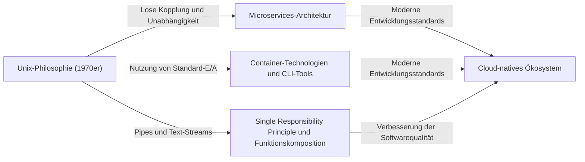

# Einleitung: Was ist die Unix-Philosophie?

Im modernen Software-Engineering vergeht kein Tag, an dem man nicht Begriffe wie „Modulares Design“, „Single Responsibility Principle“ (Prinzip der einzigen Verantwortung) und „Lose Kopplung“ hört. Diese werden als goldene Regeln für die Aufrechterhaltung sauberer Codebasen und den Aufbau skalierbarer, wartbarer Systeme behandelt. Diese Konzepte sind jedoch nicht in den letzten Jahren entstanden. Wenn man ihre Ursprünge zurückverfolgt, stößt man auf „Unix“, ein Betriebssystem, das in den frühen 1970er Jahren in den Bell Labs geboren wurde.

Unix war nicht nur ein OS. Es verkörperte eine Philosophie darüber, „wie man exzellente Software baut“ – die „Unix-Philosophie“. Diese Philosophie, die von Giganten wie Ken Thompson, Dennis Ritchie und Doug McIlroy aufgebaut wurde, atmet ein halbes Jahrhundert später auch in modernen Cloud-nativen Architekturen und Microservices tief durch.

Dieser Artikel beleuchtet die Essenz des „modularen Designs“ im Kern der Unix-Philosophie und deckt auf, warum ihre Ideologie weiterhin so überragend unterstützt wird.

## Kapitel 1: Klein ist schön — Die Macht kleiner Programme

Als direktesten Ausdruck der Unix-Philosophie gibt es das folgende Prinzip, das von Doug McIlroy vorgeschlagen wurde:

> "Make each program do one thing well. To do a new job, build afresh rather than complicate old programs by adding new 'features'."
> (Lassen Sie jedes Programm eine Sache gut machen. Um eine neue Aufgabe zu erledigen, bauen Sie neu auf, anstatt alte Programme durch das Hinzufügen neuer ‚Funktionen‘ zu verkomplizieren.)

Dieses Prinzip ist ein starkes Gegengift gegen den „Fluch der Komplexität“ in der Softwareentwicklung. Wenn Programme wachsen, tendieren Entwickler dazu, mit guten Absichten Funktionen hinzuzufügen. Das Hinzufügen von Funktionen führt jedoch zu einer Zunahme von Zuständen, erschwert das Testen und wird zu einem Nährboden für Fehler. Dies führt zur Entstehung eines sogenannten „monolithischen“ (aus einem Guss bestehenden) Programms.

Der Unix-Ansatz ist völlig anders. Zum Beispiel `grep` zum Durchsuchen von Dateien, `sort` zum Sortieren von Text, `uniq` zum Entfernen von Duplikaten und `wc` zum Zählen von Wörtern – jedes hat extrem begrenzte Funktionen. Sie können komplexe Aufgaben nicht alleine bewältigen, aber im Gegenzug sind sie darauf optimiert, ihre „zugewiesene einzelne Aufgabe“ perfekt und schnell auszuführen.

Dies stimmt perfekt mit dem „Single Responsibility Principle (SRP)“ in der modernen objektorientierten Programmierung überein. Das Prinzip, dass eine Klasse oder ein Modul nur einen Grund für eine Änderung haben sollte.

## Kapitel 2: Pipelines — Die gemeinsame Sprache der Daten-Streams

Allerdings können kleine, verstreute Programme allein der komplexen Realität nicht begegnen. Ein „Klebstoff“ wird benötigt, um sie zu verbinden. In Unix ist dieser Klebstoff die „Pipe (`|`)“ und die gemeinsame Sprache der „Text-Streams“.

McIlroy erklärte:

> "Expect the output of every program to become the input to another, as yet unknown, program. Don't clutter output with extraneous information."
> (Erwarten Sie, dass die Ausgabe jedes Programms zur Eingabe für ein anderes, noch unbekanntes Programm wird. Überladen Sie die Ausgabe nicht mit fremden Informationen.)

Unix-Programme empfangen Text von der Standardeingabe (stdin) und schreiben Text in die Standardausgabe (stdout). Durch die Übernahme dieses extrem einfachen und universellen Formats von Text wurde es möglich, beliebige Programme mit Pipes zu verbinden.

```bash
# Beispiel: Spezifische Fehler aus einer Protokolldatei extrahieren, ihr Auftreten zählen und sie in absteigender Reihenfolge sortieren
cat server.log | grep "ERROR" | awk '{print $5}' | sort | uniq -c | sort -nr
```

Die obige Befehlszeile zeigt eine erstaunliche Koordination, obwohl jedes Programm nichts voneinander weiß. `grep` weiß nicht, dass `awk` existiert, und `sort` sortiert nur die Ausgabe der vorherigen Stufe.

### Architekturvergleich: Monolith vs. Pipeline

Lassen Sie uns den traditionellen monolithischen Ansatz und den Unix-Pipeline-Ansatz visuell vergleichen.


Bei einem monolithischen Ansatz tendieren interne Datenstrukturen dazu, eng gekoppelt zu sein, was das Risiko birgt, dass sich einige Änderungen durch das Ganze ziehen. Auf der anderen Seite sind beim Unix-Pipeline-Ansatz die Schnittstellen zwischen den Knoten in der am lockersten gekoppelten Form von „einfachem Text“ standardisiert, was es extrem einfach macht, ein Programm durch ein anderes zu ersetzen oder neue Schritte dazwischen einzufügen.

## Kapitel 3: Schweigen ist Gold — Benutzeroberfläche und Design-Ästhetik

Zur Unix-Philosophie gehört die „Rule of Silence“ (Regel des Schweigens). Die Idee ist, dass „wenn ein Programm nichts Überraschendes zu sagen hat, sollte es gar nichts sagen“.

Wenn es erfolgreich ist, gibt es nichts aus (gibt nur den Exit-Code `0` zurück) und gibt Meldungen nur an den Standardfehler (stderr) aus, wenn ein Fehler auftritt. Dies mag sich für Anfänger etwas unfreundlich anfühlen, hat aber beim modularen Design eine tiefe Bedeutung.

Denn wenn ein Programm geschwätzige Nachrichten wie „Verarbeitung erfolgreich!“ auf die Standardausgabe ausgeben würde, würde das nächste Programm, das diese Ausgabe empfängt (z. B. `grep` oder `sort`), diese Nachricht als Teil der Daten verarbeiten und die Pipeline zerstören.

Das Entfernen übermäßiger UIs (Benutzeroberflächen) für Menschen und die Priorisierung der Koordination mit Maschinen (anderen Programmen). Auch dies basiert auf tiefen Einblicken, um die Modularität zu verbessern.

## Kapitel 4: Linie zum modernen Software-Engineering

Über 50 Jahre sind vergangen, seit die Unix-Philosophie ersonnen wurde. Die Computerumgebung hat sich drastisch vom Zeitalter der Lochkarten, Mainframes und Time-Sharing-Systeme zu Personal Computern, Smartphones und Cloud-nativem Computing gewandelt.

Der Geist des „modularen Designs“ in der Unix-Philosophie wurde jedoch in verschiedenen Formen bis in die heutige Zeit weitergegeben.

### Microservices-Architektur

Microservices unterteilen riesige monolithische Anwendungen in eine Sammlung kleiner, unabhängig bereitstellbarer Dienste. Dies kann als skalierte Version der Unix-Philosophie bezeichnet werden, „Programme, die eine Sache gut machen“, mit gängigen Protokollen wie HTTP und gRPC (modernen Versionen von Pipes) zu verbinden.

### Container-Technologie (Docker)

Container-Technologien, vertreten durch Docker, haben ebenfalls tiefe Verbindungen zur Unix-Philosophie. Container basieren auf dem Prinzip „ein Prozess pro Container“ und jeder läuft in einer unabhängigen Umgebung. Die Design-Philosophie, Protokolle über Standardausgabe und Standardfehler zu verwalten, ist ebenfalls äußerst Unix-ähnlich.

### Funktionale Programmierung und Daten-Pipelines

Die Funktionskomposition in der funktionalen Programmierung (die Ausgabe einer Funktion als Eingabe einer anderen zu nehmen) weist eine mathematische Ähnlichkeit mit dem Konzept von Unix-Pipelines auf. Stream-Verarbeitung in der Big-Data-Verarbeitung, wie Apache Kafka, ist ebenfalls eine Anwendung des Text-Stream-Konzepts auf verteilte Systeme.



## Kapitel 5: Prototyping und Werkzeugbau

Die Unix-Philosophie berührt nicht nur das Design, sondern auch das „Wie man baut“.

> "Design and build software, even operating systems, to be tried early, ideally within weeks. Don't hesitate to throw away the clumsy parts and rebuild them."
> (Entwerfen und bauen Sie Software, selbst Betriebssysteme, so, dass sie frühzeitig, idealerweise innerhalb von Wochen, ausprobiert werden kann. Zögern Sie nicht, die ungeschickten Teile wegzuwerfen und neu zu bauen.)

Dies nimmt die Konzepte der modernen agilen Entwicklung und des MVP (Minimum Viable Product) vorweg. Da ein modulares Design angewendet wird, ist es möglich, nur die „ungeschickten Teile“ zu verwerfen und neu zu bauen, ohne das gesamte System zu beeinträchtigen.

Es gibt auch die Idee, „Werkzeuge zu bauen, um Programmieraufgaben zu erleichtern. Selbst wenn es ein Umweg ist, bauen Sie Werkzeuge, und es ist in Ordnung, wenn Sie Teile davon nach Gebrauch wegwerfen müssen“. Die Hacker-Kultur, die Entwicklungseffizienz durch Automatisierung und benutzerdefinierte Skripte zu steigern, ist hier verwurzelt.

## Fazit: Die Unix-Philosophie als zeitloser Klassiker

Technologietrends ändern sich rasant, und neue Sprachen und Frameworks erscheinen und verschwinden nacheinander. Die Prinzipien der Unix-Philosophie, „die Dinge einfach zu halten“, „mit geeigneten Schnittstellen zu koppeln“ und „sich auf eine einzige Aufgabe zu konzentrieren“, bleiben jedoch die wirksamsten Gegenmaßnahmen gegen die wesentliche Komplexität von Software.

Die Essenz des modularen Designs besteht nicht einfach darin, Code zu unterteilen. Es ist eine Kunst, die auf tiefen Einsichten beruht, um „Flexibilität für zukünftige Änderungen“ zu gewährleisten und eine „Koordination mit unbekannten Programmen“ zu ermöglichen.

Wenn wir weiterhin neue Systeme entwerfen, werden wir immer wieder zu der einfachen und schönen Philosophie zurückkehren, die Ken Thompson und andere hinterlassen haben. Ob beim Schreiben eines kleinen Skripts oder beim Aufbau eines globalen verteilten Systems, die Unix-Philosophie wird immer als Kompass dienen, der uns in die richtige Richtung weist.
