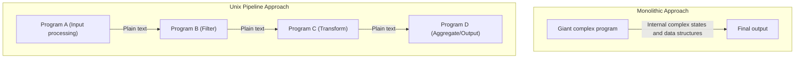
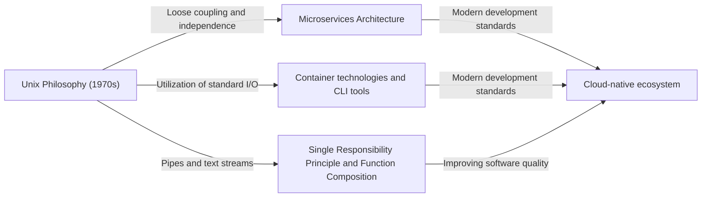

# Introduction: What is the Unix Philosophy?

In modern software engineering, not a day goes by without hearing terms like "Modular Design", "Single Responsibility Principle", and "Loose Coupling". These are treated as golden rules for maintaining clean codebases and building scalable, maintainable systems. However, these concepts were not born in recent years. Tracing their origins leads to "Unix", an operating system born at Bell Labs in the early 1970s.

Unix was not just an OS. It embodied a philosophy of "how to build excellent software"—the "Unix Philosophy". This philosophy, built by giants like Ken Thompson, Dennis Ritchie, and Doug McIlroy, breathes deeply even in modern cloud-native architectures and microservices half a century later.

This article thoroughly explores the essence of "modular design" at the core of the Unix philosophy and reveals why its ideology continues to be supported transcendently.

## Chapter 1: Small is Beautiful — The Power of Small Programs

As the most straightforward expression of the Unix philosophy, there is the following principle proposed by Doug McIlroy:

> "Make each program do one thing well. To do a new job, build afresh rather than complicate old programs by adding new 'features'."

This principle is a powerful antidote to the "curse of complexity" in software development. As programs grow, developers tend to add features with good intentions. However, adding features leads to increased states, makes testing difficult, and becomes a hotbed for bugs. This results in the birth of a so-called "monolithic" program.

The Unix approach is completely different. For example, `grep` for searching files, `sort` for sorting text, `uniq` for removing duplicates, and `wc` for counting words—each has extremely limited functions. They cannot handle complex tasks on their own, but in return, they are optimized to perform their "given single task" perfectly and quickly.

This perfectly aligns with the "Single Responsibility Principle (SRP)" in modern object-oriented programming. The principle that a class or module should have only one reason to change.

## Chapter 2: Pipelines — The Common Language of Data Streams

However, small scattered programs alone cannot face complex realities. A "glue" is needed to connect them. In Unix, that glue is the "pipe (`|`)" and the common language of "text streams".

McIlroy stated:

> "Expect the output of every program to become the input to another, as yet unknown, program. Don't clutter output with extraneous information."

Unix programs receive text from standard input (stdin) and write text to standard output (stdout). By adopting this extremely simple and universal format of text, it became possible to connect arbitrary programs with pipes.

```bash
# Example: Extract specific errors from a log file, count their occurrences, and sort them in descending order
cat server.log | grep "ERROR" | awk '{print $5}' | sort | uniq -c | sort -nr
```

The above command line shows amazing coordination even though each program knows nothing about each other. `grep` doesn't know `awk` exists, and `sort` just sorts the output of the previous stage.

### Architecture Comparison: Monolith vs. Pipeline

Let's visually compare the traditional monolithic approach and the Unix pipeline approach.



In a monolithic approach, internal data structures tend to be tightly coupled, risking that some changes ripple through the whole. On the other hand, in the Unix pipeline approach, the interfaces between nodes are standardized in the most loosely coupled form of "plain text", making it extremely easy to replace one program with another or insert new steps in between.

## Chapter 3: Silence is Golden — User Interface and Design Aesthetics

Among the Unix philosophy is the "Rule of Silence". The idea is that "when a program has nothing surprising to say, it should say nothing".

When successful, it outputs nothing (just returns exit code `0`), and only outputs messages to standard error (stderr) when there is an error. This might feel a bit unfriendly to beginner users, but it has profound meaning in modular design.

Because if a program were to output talkative messages like "Processing successful!" to standard output, the next program receiving that output (e.g., `grep` or `sort`) would process that message as part of the data, destroying the pipeline.

Stripping away excessive UIs for humans and prioritizing coordination with machines (other programs). This too is based on deep insights to enhance modularity.

## Chapter 4: Lineage to Modern Software Engineering

Over 50 years have passed since the Unix philosophy was devised. The computing environment has dramatically changed from the era of punch cards, mainframes, and time-sharing systems to personal computers, smartphones, and cloud-native computing.

However, the spirit of "modular design" in the Unix philosophy has been passed down to the present day in different forms.

### Microservices Architecture

Microservices divide huge monolithic applications into a collection of small, independently deployable services. This can be said to be a scaled-up version of the Unix philosophy of connecting "programs that do one thing well" with common protocols like HTTP and gRPC (modern versions of pipes).

### Container Technology (Docker)

Container technologies represented by Docker also have deep connections with the Unix philosophy. Containers are based on the principle of "one process per container" and each runs in an independent environment. The design philosophy of managing logs via standard output and standard error is also exceedingly Unix-like.

### Functional Programming and Data Pipelines

Function composition in functional programming (taking the output of a function as the input of another) shares a mathematical similarity with the concept of Unix pipelines. Stream processing in big data processing, like Apache Kafka, is also an application of the text stream concept to distributed systems.



## Chapter 5: Prototyping and Tool Building

The Unix philosophy touches upon not only design but also "how to build".

> "Design and build software, even operating systems, to be tried early, ideally within weeks. Don't hesitate to throw away the clumsy parts and rebuild them."

This anticipates the concepts of modern agile development and MVP (Minimum Viable Product). Because modular design is adopted, it is possible to discard and rebuild only the "clumsy parts" without affecting the entire system.

There is also the idea to "build tools to lighten programming tasks. Even if it's a detour, build tools, and it's fine if you have to throw away parts of them after use". The hacker culture of increasing development efficiency through automation and custom scripts is rooted here.

## Conclusion: The Unix Philosophy as a Timeless Classic

Technology trends change rapidly, and new languages and frameworks appear and disappear one after another. However, the Unix philosophy's principles of "keeping things simple", "coupling with appropriate interfaces", and "focusing on a single task" remain the most effective countermeasures against the essential complexity of software.

The essence of modular design is not simply dividing code. It is an art based on deep insight to ensure "flexibility for future changes" and enable "coordination with unknown programs".

As we continue to design new systems, we will repeatedly return to the simple and beautiful philosophy left by Ken Thompson and others. Whether writing a small script or building a global-scale distributed system, the Unix philosophy will always serve as a compass guiding us in the right direction.
