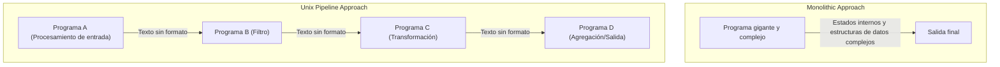
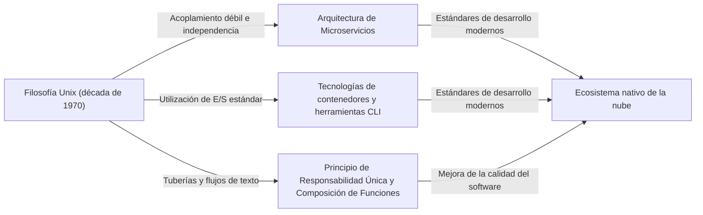

# Introducción: ¿Qué es la Filosofía Unix?

En la ingeniería de software moderna, no pasa un día sin escuchar términos como "Diseño Modular", "Principio de Responsabilidad Única" y "Acoplamiento Débil". Estos se tratan como reglas de oro para mantener bases de código limpias y construir sistemas escalables y mantenibles. Sin embargo, estos conceptos no nacieron en los últimos años. Rastrear sus orígenes nos lleva a "Unix", un sistema operativo nacido en los Laboratorios Bell a principios de la década de 1970.

Unix no era solo un sistema operativo. Encarnaba una filosofía de "cómo construir excelente software": la "Filosofía Unix". Esta filosofía, construida por gigantes como Ken Thompson, Dennis Ritchie y Doug McIlroy, respira profundamente incluso en las arquitecturas nativas de la nube y los microservicios modernos medio siglo después.

Este artículo explora a fondo la esencia del "diseño modular" en el núcleo de la filosofía Unix y revela por qué su ideología sigue siendo apoyada de manera trascendental.

## Capítulo 1: Lo Pequeño es Hermoso — El Poder de los Pequeños Programas

Como la expresión más directa de la filosofía Unix, existe el siguiente principio propuesto por Doug McIlroy:

> "Make each program do one thing well. To do a new job, build afresh rather than complicate old programs by adding new 'features'."
> (Haz que cada programa haga bien una cosa. Para hacer un trabajo nuevo, construye de nuevo en lugar de complicar los programas antiguos agregando nuevas 'características').

Este principio es un poderoso antídoto contra la "maldición de la complejidad" en el desarrollo de software. A medida que los programas crecen, los desarrolladores tienden a agregar características con buenas intenciones. Sin embargo, agregar características conduce a un aumento de estados, dificulta las pruebas y se convierte en un semillero de errores. Esto da lugar al nacimiento de un programa llamado "monolítico".

El enfoque de Unix es completamente diferente. Por ejemplo, `grep` para buscar archivos, `sort` para ordenar texto, `uniq` para eliminar duplicados y `wc` para contar palabras: cada uno tiene funciones extremadamente limitadas. No pueden manejar tareas complejas por sí solos, pero a cambio, están optimizados para realizar su "única tarea asignada" perfecta y rápidamente.

Esto se alinea perfectamente con el "Principio de Responsabilidad Única (SRP)" en la programación orientada a objetos moderna. El principio de que una clase o módulo debe tener solo una razón para cambiar.

## Capítulo 2: Tuberías (Pipelines) — El Lenguaje Común de los Flujos de Datos

Sin embargo, los pequeños programas dispersos por sí solos no pueden enfrentar realidades complejas. Se necesita un "pegamento" para conectarlos. En Unix, ese pegamento es la "tubería (`|`)" y el lenguaje común de los "flujos de texto".

McIlroy afirmó:

> "Expect the output of every program to become the input to another, as yet unknown, program. Don't clutter output with extraneous information."
> (Espera que la salida de cada programa se convierta en la entrada de otro programa aún desconocido. No satures la salida con información extraña).

Los programas Unix reciben texto de la entrada estándar (stdin) y escriben texto en la salida estándar (stdout). Al adoptar este formato de texto extremadamente simple y universal, fue posible conectar programas arbitrarios con tuberías.

```bash
# Ejemplo: Extraer errores específicos de un archivo de registro, contar sus ocurrencias y ordenarlos en orden descendente
cat server.log | grep "ERROR" | awk '{print $5}' | sort | uniq -c | sort -nr
```

La línea de comandos anterior muestra una coordinación sorprendente a pesar de que cada programa no sabe nada del otro. `grep` no sabe que `awk` existe, y `sort` solo ordena la salida de la etapa anterior.

### Comparación de Arquitectura: Monolito vs. Tubería

Comparemos visualmente el enfoque monolítico tradicional y el enfoque de tubería de Unix.



En un enfoque monolítico, las estructuras de datos internas tienden a estar estrechamente acopladas, corriendo el riesgo de que algunos cambios se extiendan por todo el sistema. Por otro lado, en el enfoque de tubería de Unix, las interfaces entre los nodos están estandarizadas en la forma de acoplamiento más débil de "texto sin formato", lo que hace extremadamente fácil reemplazar un programa por otro o insertar nuevos pasos en el medio.

## Capítulo 3: El Silencio es Oro — Interfaz de Usuario y Estética del Diseño

Dentro de la filosofía Unix se encuentra la "Regla del Silencio". La idea es que "cuando un programa no tiene nada sorprendente que decir, no debería decir nada".

Cuando tiene éxito, no genera ninguna salida (solo devuelve el código de salida `0`), y solo emite mensajes al error estándar (stderr) cuando hay un error. Esto puede parecer un poco hostil para los usuarios principiantes, pero tiene un profundo significado en el diseño modular.

Porque si un programa emitiera mensajes locuaces como "¡Procesamiento exitoso!" a la salida estándar, el siguiente programa que reciba esa salida (por ejemplo, `grep` o `sort`) procesaría ese mensaje como parte de los datos, destruyendo la tubería.

Eliminar interfaces de usuario (UI) excesivas para humanos y priorizar la coordinación con máquinas (otros programas). Esto también se basa en conocimientos profundos para mejorar la modularidad.

## Capítulo 4: Linaje hacia la Ingeniería de Software Moderna

Han pasado más de 50 años desde que se concibió la filosofía Unix. El entorno informático ha cambiado drásticamente desde la era de las tarjetas perforadas, los mainframes y los sistemas de tiempo compartido a las computadoras personales, los teléfonos inteligentes y la computación nativa de la nube.

Sin embargo, el espíritu del "diseño modular" en la filosofía Unix se ha transmitido hasta nuestros días en diferentes formas.

### Arquitectura de Microservicios

Los microservicios dividen las enormes aplicaciones monolíticas en una colección de servicios pequeños que se pueden implementar de forma independiente. Se puede decir que esta es una versión a mayor escala de la filosofía Unix de conectar "programas que hacen bien una cosa" con protocolos comunes como HTTP y gRPC (versiones modernas de las tuberías).

### Tecnología de Contenedores (Docker)

Las tecnologías de contenedores representadas por Docker también tienen conexiones profundas con la filosofía Unix. Los contenedores se basan en el principio de "un proceso por contenedor" y cada uno se ejecuta en un entorno independiente. La filosofía de diseño de gestionar los registros a través de la salida estándar y el error estándar también es sumamente similar a Unix.

### Programación Funcional y Tuberías de Datos

La composición de funciones en la programación funcional (tomar la salida de una función como entrada de otra) comparte una similitud matemática con el concepto de tuberías de Unix. El procesamiento de flujos en el procesamiento de big data, como Apache Kafka, también es una aplicación del concepto de flujo de texto a sistemas distribuidos.



## Capítulo 5: Creación de Prototipos y Herramientas

La filosofía Unix aborda no solo el diseño sino también "cómo construir".

> "Design and build software, even operating systems, to be tried early, ideally within weeks. Don't hesitate to throw away the clumsy parts and rebuild them."
> (Diseña y construye software, incluso sistemas operativos, para probarlo temprano, idealmente en semanas. No dudes en desechar las partes torpes y reconstruirlas).

Esto anticipa los conceptos de desarrollo ágil moderno y MVP (Producto Mínimo Viable). Debido a que se adopta el diseño modular, es posible desechar y reconstruir solo las "partes torpes" sin afectar a todo el sistema.

También existe la idea de "construir herramientas para aligerar las tareas de programación. Incluso si es un desvío, construye herramientas, y está bien si tienes que tirar partes de ellas después de usarlas". La cultura hacker de aumentar la eficiencia del desarrollo a través de la automatización y los scripts personalizados tiene sus raíces aquí.

## Conclusión: La Filosofía Unix como un Clásico Atemporal

Las tendencias tecnológicas cambian rápidamente, y nuevos lenguajes y frameworks aparecen y desaparecen uno tras otro. Sin embargo, los principios de la filosofía Unix de "mantener las cosas simples", "acoplar con interfaces adecuadas" y "centrarse en una sola tarea" siguen siendo las contramedidas más efectivas contra la complejidad esencial del software.

La esencia del diseño modular no es simplemente dividir el código. Es un arte basado en un profundo conocimiento para asegurar "flexibilidad para cambios futuros" y permitir "coordinación con programas desconocidos".

A medida que continuamos diseñando nuevos sistemas, volveremos repetidamente a la filosofía simple y hermosa dejada por Ken Thompson y otros. Ya sea escribiendo un pequeño script o construyendo un sistema distribuido a escala global, la filosofía Unix siempre servirá como una brújula guiándonos en la dirección correcta.
