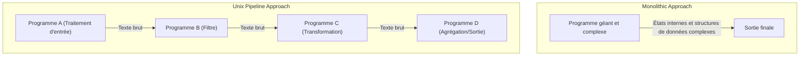
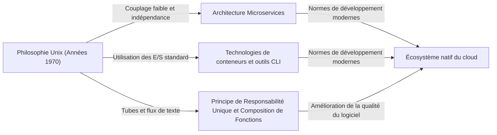

# Introduction : Qu'est-ce que la Philosophie Unix ?

Dans l'ingénierie logicielle moderne, il ne se passe pas un jour sans entendre des termes comme « Design Modulaire », « Principe de Responsabilité Unique » et « Couplage Faible ». Ceux-ci sont traités comme des règles d'or pour maintenir des bases de code propres et construire des systèmes évolutifs et maintenables. Cependant, ces concepts ne sont pas nés ces dernières années. Retracer leurs origines nous mène à « Unix », un système d'exploitation né aux Bell Labs au début des années 1970.

Unix n'était pas seulement un OS. Il incarnait une philosophie de « comment construire un excellent logiciel » — la « Philosophie Unix ». Cette philosophie, bâtie par des géants comme Ken Thompson, Dennis Ritchie et Doug McIlroy, respire profondément même dans les architectures cloud-natives modernes et les microservices, un demi-siècle plus tard.

Cet article explore en profondeur l'essence du « design modulaire » au cœur de la philosophie Unix et révèle pourquoi son idéologie continue d'être soutenue de manière transcendante.

## Chapitre 1 : Small is Beautiful — Le Pouvoir des Petits Programmes

Comme l'expression la plus directe de la philosophie Unix, il existe le principe suivant proposé par Doug McIlroy :

> "Make each program do one thing well. To do a new job, build afresh rather than complicate old programs by adding new 'features'."
> (Faites en sorte que chaque programme fasse bien une chose. Pour faire un nouveau travail, construisez à neuf plutôt que de compliquer les anciens programmes en ajoutant de nouvelles « fonctionnalités ».)

Ce principe est un antidote puissant à la « malédiction de la complexité » dans le développement logiciel. À mesure que les programmes grandissent, les développeurs ont tendance à ajouter des fonctionnalités avec de bonnes intentions. Cependant, l'ajout de fonctionnalités entraîne une augmentation des états, rend les tests difficiles et devient un foyer de bugs. Cela donne naissance à ce que l'on appelle un programme « monolithique ».

L'approche d'Unix est complètement différente. Par exemple, `grep` pour la recherche de fichiers, `sort` pour le tri de texte, `uniq` pour supprimer les doublons, et `wc` pour compter les mots — chacun a des fonctions extrêmement limitées. Ils ne peuvent pas gérer des tâches complexes par eux-mêmes, mais en retour, ils sont optimisés pour exécuter leur « tâche unique assignée » parfaitement et rapidement.

Cela s'aligne parfaitement avec le « Principe de Responsabilité Unique (SRP) » dans la programmation orientée objet moderne. Le principe selon lequel une classe ou un module ne devrait avoir qu'une seule raison de changer.

## Chapitre 2 : Pipelines — Le Langage Commun des Flux de Données

Cependant, de petits programmes dispersés ne peuvent à eux seuls faire face à des réalités complexes. Une « colle » est nécessaire pour les relier. Sous Unix, cette colle est le « tube (pipe `|`) » et le langage commun des « flux de texte (text streams) ».

McIlroy a déclaré :

> "Expect the output of every program to become the input to another, as yet unknown, program. Don't clutter output with extraneous information."
> (Attendez-vous à ce que la sortie de chaque programme devienne l'entrée d'un autre programme encore inconnu. N'encombrez pas la sortie avec des informations étrangères.)

Les programmes Unix reçoivent du texte de l'entrée standard (stdin) et écrivent du texte sur la sortie standard (stdout). En adoptant ce format de texte extrêmement simple et universel, il est devenu possible de connecter des programmes arbitraires avec des tubes.

```bash
# Exemple : Extraire des erreurs spécifiques d'un fichier journal, compter leurs occurrences et les trier par ordre décroissant
cat server.log | grep "ERROR" | awk '{print $5}' | sort | uniq -c | sort -nr
```

La ligne de commande ci-dessus montre une coordination étonnante même si chaque programme ne sait rien de l'autre. `grep` ne sait pas que `awk` existe, et `sort` se contente de trier la sortie de l'étape précédente.

### Comparaison d'Architecture : Monolithe vs Pipeline

Comparons visuellement l'approche monolithique traditionnelle et l'approche pipeline Unix.



Dans une approche monolithique, les structures de données internes ont tendance à être étroitement couplées, risquant que certains changements se répercutent sur l'ensemble. D'autre part, dans l'approche pipeline Unix, les interfaces entre les nœuds sont standardisées sous la forme la plus faiblement couplée, le « texte brut », ce qui rend extrêmement facile le remplacement d'un programme par un autre ou l'insertion de nouvelles étapes entre les deux.

## Chapitre 3 : Le Silence est d'Or — Interface Utilisateur et Esthétique du Design

Parmi la philosophie Unix se trouve la « Règle du Silence ». L'idée est que « lorsqu'un programme n'a rien de surprenant à dire, il ne devrait rien dire ».

En cas de succès, il ne produit aucune sortie (retourne juste le code de sortie `0`), et n'émet des messages sur la sortie d'erreur standard (stderr) qu'en cas d'erreur. Cela peut sembler un peu hostile aux utilisateurs débutants, mais cela a une signification profonde dans la conception modulaire.

Parce que si un programme devait émettre des messages bavards comme « Traitement réussi ! » sur la sortie standard, le programme suivant recevant cette sortie (par exemple, `grep` ou `sort`) traiterait ce message comme faisant partie des données, détruisant ainsi le pipeline.

Supprimer les interfaces utilisateur (UI) excessives pour les humains et privilégier la coordination avec les machines (autres programmes). Cela aussi repose sur des idées profondes pour améliorer la modularité.

## Chapitre 4 : Lignée vers l'Ingénierie Logicielle Moderne

Plus de 50 ans se sont écoulés depuis la conception de la philosophie Unix. L'environnement informatique a radicalement changé, passant de l'ère des cartes perforées, des ordinateurs centraux et des systèmes à temps partagé aux ordinateurs personnels, aux smartphones et à l'informatique native du cloud.

Cependant, l'esprit du « design modulaire » de la philosophie Unix a été transmis jusqu'à nos jours sous différentes formes.

### Architecture Microservices

Les microservices divisent d'énormes applications monolithiques en une collection de petits services déployables indépendamment. On peut dire qu'il s'agit d'une version à grande échelle de la philosophie Unix consistant à connecter des « programmes qui font bien une chose » avec des protocoles communs comme HTTP et gRPC (versions modernes des tubes).

### Technologie des Conteneurs (Docker)

Les technologies de conteneurs représentées par Docker ont également des liens profonds avec la philosophie Unix. Les conteneurs reposent sur le principe « un processus par conteneur » et s'exécutent chacun dans un environnement indépendant. La philosophie de conception consistant à gérer les journaux via la sortie standard et l'erreur standard est également extrêmement similaire à Unix.

### Programmation Fonctionnelle et Pipelines de Données

La composition de fonctions en programmation fonctionnelle (prendre la sortie d'une fonction comme entrée d'une autre) partage une similitude mathématique avec le concept de pipelines Unix. Le traitement des flux dans le traitement du Big Data, comme Apache Kafka, est également une application du concept de flux de texte aux systèmes distribués.



## Chapitre 5 : Prototypage et Création d'Outils

La philosophie Unix aborde non seulement la conception mais aussi « comment construire ».

> "Design and build software, even operating systems, to be tried early, ideally within weeks. Don't hesitate to throw away the clumsy parts and rebuild them."
> (Concevez et construisez des logiciels, même des systèmes d'exploitation, pour être essayés tôt, idéalement dans les semaines. N'hésitez pas à jeter les parties maladroites et à les reconstruire.)

Cela anticipe les concepts de développement agile moderne et de MVP (Produit Minimum Viable). Parce que la conception modulaire est adoptée, il est possible de jeter et de reconstruire uniquement les « parties maladroites » sans affecter l'ensemble du système.

Il y a aussi l'idée de « construire des outils pour alléger les tâches de programmation. Même si c'est un détour, construisez des outils, et ce n'est pas grave si vous devez en jeter des parties après utilisation ». La culture hacker consistant à accroître l'efficacité du développement grâce à l'automatisation et aux scripts personnalisés prend ses racines ici.

## Conclusion : La Philosophie Unix comme un Classique Intemporel

Les tendances technologiques changent rapidement, et de nouveaux langages et frameworks apparaissent et disparaissent les uns après les autres. Cependant, les principes de la philosophie Unix consistant à « garder les choses simples », « coupler avec des interfaces appropriées » et « se concentrer sur une tâche unique » restent les contre-mesures les plus efficaces contre la complexité essentielle des logiciels.

L'essence du design modulaire n'est pas simplement de diviser le code. C'est un art basé sur une compréhension profonde pour assurer une « flexibilité face aux changements futurs » et permettre une « coordination avec des programmes inconnus ».

Alors que nous continuons à concevoir de nouveaux systèmes, nous reviendrons à plusieurs reprises à la philosophie simple et belle laissée par Ken Thompson et d'autres. Qu'il s'agisse d'écrire un petit script ou de construire un système distribué à l'échelle mondiale, la philosophie Unix servira toujours de boussole nous guidant dans la bonne direction.
