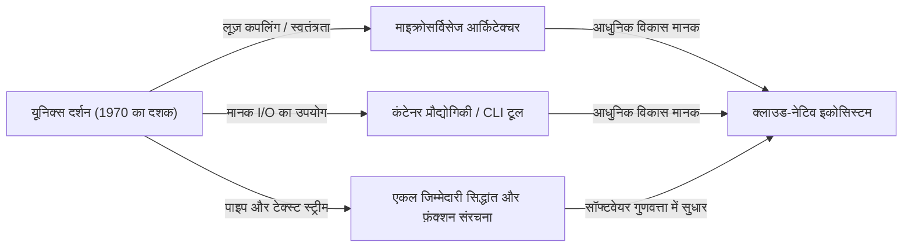

# परिचय: यूनिक्स दर्शन क्या है?

आधुनिक सॉफ्टवेयर इंजीनियरिंग में, "मॉड्यूलर डिज़ाइन", "एकल जिम्मेदारी सिद्धांत (Single Responsibility Principle)" और "लूज़ कपलिंग" जैसे शब्द हर दिन सुने जाते हैं। इन्हें स्वच्छ कोडबेस बनाए रखने और स्केलेबल, रखरखाव योग्य सिस्टम बनाने के लिए सुनहरे नियमों के रूप में माना जाता है। हालाँकि, ये अवधारणाएँ हाल के वर्षों में पैदा नहीं हुई थीं। उनकी जड़ों का पता लगाने पर, हम 1970 के दशक की शुरुआत में बेल लैब्स में पैदा हुए एक ऑपरेटिंग सिस्टम, "यूनिक्स (Unix)" तक पहुँचते हैं।

यूनिक्स केवल एक ओएस नहीं था। यह इस विचार का प्रतीक था कि "उत्कृष्ट सॉफ्टवेयर कैसे बनाया जाए", यानी "यूनिक्स दर्शन"। केन थॉम्पसन, डेनिस रिची और डौग मैकल्रोय जैसे दिग्गजों द्वारा स्थापित यह दर्शन, आधी सदी के बाद आज के क्लाउड-नेटिव आर्किटेक्चर और माइक्रोसर्विसेज में गहराई से जीवित है।

इस लेख में, हम यूनिक्स दर्शन के मूल, "मॉड्यूलर डिज़ाइन" के सार में गहराई से गोता लगाएँगे, और यह पता लगाएँगे कि यह विचार समय के पार क्यों इतना समर्थित है।

## अध्याय 1: स्मॉल इज़ ब्यूटीफुल — छोटे प्रोग्राम्स की शक्ति

यूनिक्स दर्शन को सबसे स्पष्ट रूप से व्यक्त करने वाले डौग मैकल्रोय द्वारा प्रस्तावित निम्नलिखित सिद्धांत हैं:

> "Make each program do one thing well. To do a new job, build afresh rather than complicate old programs by adding new 'features'."
> (प्रत्येक प्रोग्राम को एक काम अच्छी तरह से करने दें। एक नया काम करने के लिए, पुराने प्रोग्राम्स में नई 'सुविधाएँ' जोड़कर उन्हें जटिल बनाने के बजाय नए सिरे से निर्माण करें।)

यह सिद्धांत सॉफ्टवेयर विकास में "जटिलता के अभिशाप" के लिए एक शक्तिशाली मारक है। जैसे-जैसे प्रोग्राम बढ़ते हैं, डेवलपर्स अक्सर अच्छे इरादों के साथ सुविधाएँ जोड़ते हैं। हालाँकि, सुविधाएँ जोड़ने से स्थिति बढ़ती है, परीक्षण कठिन हो जाता है, और बग पैदा होते हैं। यह एक "मोनोलिथिक (Monolithic)" विशाल प्रोग्राम का जन्म है।

यूनिक्स का दृष्टिकोण पूरी तरह से अलग है। उदाहरण के लिए, फ़ाइलों को खोजने के लिए `grep`, टेक्स्ट को सॉर्ट करने के लिए `sort`, डुप्लिकेट हटाने के लिए `uniq`, और शब्दों को गिनने के लिए `wc`, प्रत्येक का एक बहुत ही सीमित कार्य है। वे अपने आप जटिल कार्य नहीं कर सकते, लेकिन इसके बजाय वे "दिए गए एक कार्य" को पूरी तरह और तेज़ी से निष्पादित करने के लिए अनुकूलित हैं।

यह आधुनिक ऑब्जेक्ट-ओरिएंटेड प्रोग्रामिंग में "एकल जिम्मेदारी सिद्धांत (SRP)" के साथ पूरी तरह से मेल खाता है। वह सिद्धांत कि एक क्लास या मॉड्यूल में बदलने का केवल एक ही कारण होना चाहिए।

## अध्याय 2: पाइपलाइन — डेटा स्ट्रीम की आम भाषा

हालाँकि, केवल छोटे प्रोग्राम्स का अलग-अलग अस्तित्व होना जटिल वास्तविकता का सामना करने के लिए पर्याप्त नहीं है। उन्हें एक साथ जोड़ने के लिए "गोंद" की आवश्यकता होती है। यूनिक्स में वह गोंद "पाइप (`|`)" है, और "टेक्स्ट स्ट्रीम" की आम भाषा है।

मैकल्रोय ने कहा है:

> "Expect the output of every program to become the input to another, as yet unknown, program. Don't clutter output with extraneous information."
> (प्रत्येक प्रोग्राम के आउटपुट के किसी अन्य, अभी तक अज्ञात, प्रोग्राम के इनपुट बनने की अपेक्षा करें। आउटपुट को अनावश्यक जानकारी से अव्यवस्थित न करें।)

यूनिक्स प्रोग्राम स्टैंडर्ड इनपुट (stdin) से टेक्स्ट प्राप्त करते हैं और स्टैंडर्ड आउटपुट (stdout) पर टेक्स्ट लिखते हैं। एक अत्यंत सरल और सार्वभौमिक प्रारूप, टेक्स्ट, को अपनाकर, पाइप के माध्यम से किसी भी प्रोग्राम को जोड़ना संभव हो गया।

```bash
# उदाहरण: लॉग फ़ाइल से विशिष्ट त्रुटियों को निकालें, उनकी घटनाओं की गणना करें, और उन्हें अवरोही क्रम में सॉर्ट करें
cat server.log | grep "ERROR" | awk '{print $5}' | sort | uniq -c | sort -nr
```

उपरोक्त कमांड लाइन आश्चर्यजनक सहयोग दिखाती है, भले ही प्रत्येक प्रोग्राम एक-दूसरे को बिल्कुल नहीं जानता हो। `grep` को `awk` के अस्तित्व का पता नहीं है, और `sort` केवल पिछले आउटपुट को सॉर्ट करता है।

### वास्तुकला की तुलना: मोनोलिथ बनाम पाइपलाइन

यहाँ, आइए एक आरेख के साथ पारंपरिक मोनोलिथिक दृष्टिकोण और यूनिक्स पाइपलाइन दृष्टिकोण की तुलना करें।


मोनोलिथिक दृष्टिकोण में, आंतरिक डेटा संरचनाएँ कसकर युग्मित हो जाती हैं, और एक हिस्से में बदलाव से पूरे सिस्टम पर असर पड़ने का जोखिम होता है। दूसरी ओर, यूनिक्स पाइपलाइन दृष्टिकोण में, नोड्स के बीच इंटरफ़ेस "प्लेन टेक्स्ट" के सबसे शिथिल युग्मित रूप में मानकीकृत है, इसलिए एक प्रोग्राम को दूसरे से बदलना या बीच में एक नया चरण सम्मिलित करना बेहद आसान है।

## अध्याय 3: चुप्पी सोना है — यूजर इंटरफेस और डिजाइन का सौंदर्य

यूनिक्स दर्शन में "चुप्पी का नियम (Rule of Silence)" है। यह विचार है कि "यदि किसी प्रोग्राम के पास कहने के लिए कुछ भी आश्चर्यजनक नहीं है, तो उसे कुछ नहीं कहना चाहिए।"

सफल होने पर कोई आउटपुट नहीं देना (केवल निकास कोड `0` वापस करना), और केवल त्रुटि होने पर स्टैंडर्ड एरर (stderr) में एक संदेश देना। यह शुरुआती उपयोगकर्ताओं के लिए थोड़ा अमित्र लग सकता है, लेकिन मॉड्यूलर डिज़ाइन में इसका बहुत महत्वपूर्ण अर्थ है।

ऐसा इसलिए है क्योंकि यदि कोई प्रोग्राम स्टैंडर्ड आउटपुट में "प्रसंस्करण सफल!" जैसा बातूनी आउटपुट भेजता है, तो अगला प्रोग्राम (जैसे `grep` या `sort`) उस संदेश को डेटा के हिस्से के रूप में संसाधित करेगा, और पाइपलाइन नष्ट हो जाएगी।

मनुष्यों के लिए अत्यधिक UI (यूजर इंटरफेस) को हटाना और मशीनों (अन्य प्रोग्राम्स) के साथ सहयोग को प्राथमिकता देना। यह भी प्रतिरूपकता बढ़ाने के लिए गहरी अंतर्दृष्टि पर आधारित है।

## अध्याय 4: आधुनिक सॉफ्टवेयर इंजीनियरिंग की वंशावली

यूनिक्स दर्शन की कल्पना किए 50 साल से अधिक समय बीत चुका है। कंप्यूटिंग वातावरण पंच कार्ड, मेनफ्रेम और टाइम-शेयरिंग सिस्टम के युग से पर्सनल कंप्यूटर, स्मार्टफोन और क्लाउड-नेटिव कंप्यूटिंग में नाटकीय रूप से बदल गया है।

हालाँकि, यूनिक्स दर्शन के "मॉड्यूलर डिज़ाइन" की भावना रूप बदलकर आधुनिक काल में पारित हो गई है।

### माइक्रोसर्विसेज आर्किटेक्चर

माइक्रोसर्विसेज, जो बड़े मोनोलिथिक एप्लिकेशन को स्वतंत्र रूप से डिप्लॉय करने योग्य छोटी सेवाओं के संग्रह में विभाजित करते हैं। यह वास्तव में यूनिक्स दर्शन का एक स्केल-अप संस्करण है, जो HTTP और gRPC (आधुनिक पाइप) जैसे सामान्य प्रोटोकॉल के साथ "एक काम अच्छी तरह से करने वाले" प्रोग्राम को जोड़ता है।

### कंटेनर प्रौद्योगिकी (Docker)

डॉकर द्वारा दर्शाई गई कंटेनर तकनीक भी यूनिक्स दर्शन से गहराई से संबंधित है। कंटेनर "एक कंटेनर प्रति प्रक्रिया" के सिद्धांत पर आधारित हैं, और प्रत्येक एक स्वतंत्र वातावरण में काम करता है। इसके अलावा, मानक आउटपुट और मानक त्रुटि के माध्यम से लॉग प्रबंधित करने का डिज़ाइन दर्शन पूरी तरह से यूनिक्स जैसा है।

### कार्यात्मक प्रोग्रामिंग और डेटा पाइपलाइन

कार्यात्मक प्रोग्रामिंग में फ़ंक्शन संरचना (एक फ़ंक्शन के आउटपुट को दूसरे के इनपुट के रूप में उपयोग करना) यूनिक्स पाइपलाइनों की अवधारणा के साथ गणितीय समानता है। अपाचे काफ्का जैसे बिग डेटा प्रोसेसिंग में स्ट्रीम प्रोसेसिंग भी वितरित सिस्टम में टेक्स्ट स्ट्रीम अवधारणा का अनुप्रयोग है।



## अध्याय 5: प्रोटोटाइपिंग और टूल बिल्डिंग

यूनिक्स दर्शन न केवल डिजाइन बल्कि "निर्माण" के बारे में भी बात करता है।

> "Design and build software, even operating systems, to be tried early, ideally within weeks. Don't hesitate to throw away the clumsy parts and rebuild them."
> (सॉफ्टवेयर और यहाँ तक कि ऑपरेटिंग सिस्टम को जल्दी आज़माने के लिए डिज़ाइन और निर्माण करें, आदर्श रूप से हफ्तों के भीतर। अजीब हिस्सों को फेंकने और उन्हें फिर से बनाने में संकोच न करें।)

यह आधुनिक एजाइल (Agile) विकास और MVP (Minimum Viable Product) अवधारणाओं का पूर्ववर्ती है। क्योंकि मॉड्यूलर डिज़ाइन को अपनाया गया है, इसलिए पूरे सिस्टम को प्रभावित किए बिना केवल "अजीब हिस्सों" को त्यागना और फिर से बनाना संभव है।

यह भी विचार है कि "प्रोग्रामिंग कार्यों को हल्का करने के लिए टूल बनाएँ। भले ही यह एक चक्कर हो, टूल बनाएँ, और उपयोग करने के बाद उनके कुछ हिस्सों को फेंकना पड़े तो भी ठीक है।" स्वचालन और होममेड स्क्रिप्ट के माध्यम से विकास दक्षता बढ़ाने की हैकर संस्कृति यहीं से उपजी है।

## निष्कर्ष: एक शाश्वत क्लासिक के रूप में यूनिक्स दर्शन

प्रौद्योगिकी के रुझान तेजी से बदलते हैं, और नई भाषाएँ और रूपरेखाएँ एक के बाद एक दिखाई देती हैं और गायब हो जाती हैं। हालाँकि, "चीजों को सरल रखना", "उपयुक्त इंटरफेस से जुड़ना", और "एक कार्य पर ध्यान केंद्रित करना" जैसे यूनिक्स दर्शन के सिद्धांत सॉफ्टवेयर की आवश्यक जटिलता के खिलाफ सबसे प्रभावी प्रतिकार बने हुए हैं।

मॉड्यूलर डिज़ाइन का सार केवल कोड को विभाजित करना नहीं है। यह "भविष्य के परिवर्तनों के लिए लचीलापन" सुनिश्चित करने और "अज्ञात कार्यक्रमों के साथ सहयोग" को सक्षम करने के लिए गहरी अंतर्दृष्टि पर आधारित एक कला है।

हम हमेशा केन थॉम्पसन और अन्य लोगों द्वारा छोड़े गए सरल और सुंदर दर्शन पर लौटेंगे, हर बार जब हम कोई नया सिस्टम डिज़ाइन करेंगे। चाहे एक छोटी स्क्रिप्ट लिखना हो या वैश्विक वितरित सिस्टम का निर्माण करना हो, यूनिक्स दर्शन हमेशा एक कंपास होगा जो हमें सही दिशा में मार्गदर्शन करेगा।
