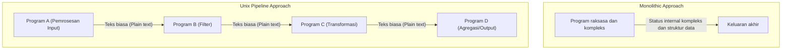
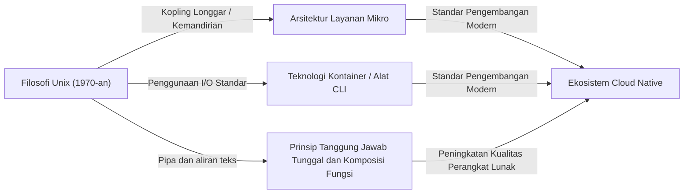

# Pendahuluan: Apa itu Filosofi Unix?

Dalam rekayasa perangkat lunak modern, tidak ada hari tanpa mendengar istilah seperti "desain modular", "Prinsip Tanggung Jawab Tunggal (Single Responsibility Principle)", dan "kopling longgar (loose coupling)". Konsep-konsep ini diperlakukan sebagai aturan emas untuk mempertahankan basis kode yang bersih dan membangun sistem yang terukur serta mudah dipelihara. Namun, konsep-konsep ini sama sekali tidak lahir dalam beberapa tahun terakhir. Jika kita menelusuri akarnya, kita akan sampai pada satu sistem operasi yang lahir di Bell Labs pada awal 1970-an: "Unix".

Unix bukan sekadar sistem operasi. Unix adalah perwujudan dari gagasan "bagaimana membangun perangkat lunak yang sangat baik", yaitu "Filosofi Unix". Filosofi yang dibangun oleh para raksasa seperti Ken Thompson, Dennis Ritchie, dan Doug McIlroy ini, masih hidup dan kuat di dalam arsitektur cloud-native dan layanan mikro saat ini, setengah abad kemudian.

Dalam artikel ini, kita akan menyelami esensi "desain modular" yang merupakan inti dari filosofi Unix, dan mengungkap mengapa gagasan ini terus didukung melampaui batas waktu.

## Bab 1: Kecil itu Indah — Kekuatan Program-Program Kecil

Untuk mengekspresikan filosofi Unix secara ringkas, ada prinsip berikut yang diusulkan oleh Doug McIlroy:

> "Make each program do one thing well. To do a new job, build afresh rather than complicate old programs by adding new 'features'."
> (Buat setiap program melakukan satu hal dengan baik. Untuk melakukan pekerjaan baru, bangun kembali dari awal daripada memperumit program lama dengan menambahkan 'fitur' baru.)

Prinsip ini adalah penawar kuat terhadap "kutukan kompleksitas" dalam pengembangan perangkat lunak. Seiring bertumbuhnya program, pengembang sering kali menambahkan fitur dengan niat baik. Namun, penambahan fitur akan meningkatkan jumlah state, mempersulit pengujian, dan menjadi sarang bug. Ini adalah kelahiran dari sebuah program raksasa yang "monolitik".

Pendekatan Unix sama sekali berbeda. Misalnya, `grep` untuk mencari file, `sort` untuk menyortir teks, `uniq` untuk menghapus duplikat, dan `wc` untuk menghitung kata; masing-masing memiliki fungsionalitas yang sangat terbatas. Mereka tidak dapat melakukan tugas yang kompleks sendirian, namun sebagai gantinya, mereka dioptimalkan untuk mengeksekusi "satu tugas tertentu" dengan sempurna dan cepat.

Ini sepenuhnya sejalan dengan "Prinsip Tanggung Jawab Tunggal (SRP)" dalam pemrograman berorientasi objek modern. Prinsip bahwa sebuah kelas atau modul hanya boleh memiliki satu alasan untuk berubah.

## Bab 2: Pipa (Pipeline) — Bahasa Umum dari Aliran Data

Namun, program kecil yang ada secara terpisah tidaklah cukup untuk menghadapi kenyataan yang kompleks. Diperlukan "perekat" untuk menghubungkannya. Perekat di Unix adalah "pipa (`|`)", dan bahasa umumnya adalah "aliran teks (text stream)".

McIlroy menyatakan:

> "Expect the output of every program to become the input to another, as yet unknown, program. Don't clutter output with extraneous information."
> (Harapkan keluaran dari setiap program menjadi masukan bagi program lain yang belum diketahui. Jangan mengotori keluaran dengan informasi asing.)

Program Unix menerima teks dari standar input (stdin) dan menulis teks ke standar output (stdout). Dengan mengadopsi format yang sangat sederhana dan universal yaitu teks, menjadi mungkin untuk menghubungkan berbagai program melalui pipa.

```bash
# Contoh: mengekstrak kesalahan tertentu dari file log, menghitung kemunculannya, dan menyortirnya dalam urutan menurun
cat server.log | grep "ERROR" | awk '{print $5}' | sort | uniq -c | sort -nr
```

Baris perintah di atas menunjukkan kolaborasi yang luar biasa meskipun setiap program sama sekali tidak saling mengenal. `grep` tidak tahu keberadaan `awk`, dan `sort` hanya menyortir keluaran sebelumnya.

### Perbandingan Arsitektur: Monolitik vs Pipa

Di sini, mari kita bandingkan pendekatan monolitik tradisional dan pendekatan pipa Unix dengan sebuah diagram.



Dalam pendekatan monolitik, struktur data internal cenderung tergabung erat, dan ada risiko bahwa perubahan pada satu bagian akan memengaruhi seluruh sistem. Di sisi lain, pada pendekatan pipa Unix, antarmuka antar simpul distandarisasi dalam bentuk "teks biasa" yang paling longgar (loosely coupled), sehingga sangat mudah untuk mengganti satu program dengan yang lain atau menyisipkan langkah baru di tengah.

## Bab 3: Diam itu Emas — Antarmuka Pengguna dan Estetika Desain

Dalam filosofi Unix terdapat "Aturan Diam (Rule of Silence)". Ini adalah gagasan bahwa "jika sebuah program tidak memiliki hal yang mengejutkan untuk dikatakan, maka ia tidak boleh mengatakan apa-apa."

Tidak menghasilkan keluaran apa pun saat berhasil (hanya mengembalikan kode keluar `0`), dan hanya mengeluarkan pesan ke standar error (stderr) ketika terjadi kesalahan. Ini mungkin terasa sedikit tidak ramah bagi pengguna pemula, tetapi memiliki makna yang sangat penting dalam desain modular.

Hal ini karena jika sebuah program mengeluarkan pesan yang cerewet seperti "Pemrosesan berhasil!" ke standar output, program berikutnya (misalnya `grep` atau `sort`) akan memproses pesan tersebut sebagai bagian dari data, dan pipa tersebut akan hancur.

Menghilangkan antarmuka pengguna (UI) yang berlebihan untuk manusia dan memprioritaskan kolaborasi dengan mesin (program lain). Ini juga didasarkan pada wawasan mendalam untuk meningkatkan modularitas.

## Bab 4: Silsilah Menuju Rekayasa Perangkat Lunak Modern

Lebih dari 50 tahun telah berlalu sejak filosofi Unix disusun. Lingkungan komputasi telah berubah drastis dari era kartu plong, mainframe, dan sistem time-sharing menuju komputer pribadi, telepon pintar, dan komputasi cloud-native.

Namun, semangat "desain modular" dari filosofi Unix telah diwariskan ke era modern dengan bentuk yang berubah.

### Arsitektur Layanan Mikro (Microservices)

Layanan mikro, yang membagi aplikasi monolitik besar menjadi sekumpulan layanan kecil yang dapat di-deploy secara mandiri. Ini benar-benar merupakan versi skala besar dari filosofi Unix, menghubungkan program yang "melakukan satu hal dengan baik" melalui protokol umum (pipa modern) seperti HTTP dan gRPC.

### Teknologi Kontainer (Docker)

Teknologi kontainer yang diwakili oleh Docker juga sangat berkaitan dengan filosofi Unix. Kontainer didasarkan pada prinsip "satu kontainer per proses", masing-masing beroperasi dalam lingkungan independen. Selain itu, filosofi desain tentang manajemen log melalui standar output dan standar error sangat kental dengan gaya Unix.

### Pemrograman Fungsional dan Pipa Data

Komposisi fungsi dalam pemrograman fungsional (menggunakan keluaran dari satu fungsi sebagai masukan bagi fungsi lainnya) memiliki kemiripan matematis dengan konsep pipa Unix. Pemrosesan stream pada pengolahan big data seperti Apache Kafka juga merupakan penerapan konsep aliran teks dalam sistem terdistribusi.



## Bab 5: Pembuatan Prototipe dan Pembuatan Alat

Filosofi Unix berbicara tidak hanya tentang desain tetapi juga tentang "cara membangun".

> "Design and build software, even operating systems, to be tried early, ideally within weeks. Don't hesitate to throw away the clumsy parts and rebuild them."
> (Rancang dan bangun perangkat lunak, bahkan sistem operasi, untuk diuji coba sedini mungkin, idealnya dalam beberapa minggu. Jangan ragu untuk membuang bagian yang kikuk dan membangunnya kembali.)

Ini adalah cikal bakal dari konsep pengembangan Agile modern dan MVP (Minimum Viable Product). Berkat penerapan desain modular, kita dimungkinkan untuk membuang hanya "bagian yang kikuk" dan membangunnya kembali tanpa memengaruhi sistem secara keseluruhan.

Ada juga ide "bangun alat untuk meringankan tugas pemrograman. Sekalipun itu adalah jalan memutar, bangunlah alat, dan tidak apa-apa jika Anda harus membuang beberapa di antaranya setelah selesai digunakan." Budaya peretas (hacker culture) untuk meningkatkan efisiensi pengembangan melalui otomatisasi dan skrip buatan sendiri berakar dari sini.

## Kesimpulan: Filosofi Unix sebagai Klasik Abadi

Tren teknologi berubah dengan cepat, serta bahasa dan framework baru muncul dan menghilang silih berganti. Namun, prinsip-prinsip filosofi Unix seperti "menjaga hal-hal tetap sederhana", "menghubungkan dengan antarmuka yang tepat", dan "fokus pada satu tugas" terus menjadi penangkal paling efektif terhadap kompleksitas esensial dari perangkat lunak.

Esensi desain modular bukan sekadar membagi kode. Ini adalah seni yang didasarkan pada wawasan mendalam untuk memastikan "fleksibilitas terhadap perubahan di masa depan" dan memungkinkan "kerja sama dengan program yang tidak diketahui".

Kita akan selalu kembali ke filosofi sederhana dan indah yang ditinggalkan oleh Ken Thompson dan para perintis lainnya, setiap kali kita mendesain sistem yang baru. Entah itu saat menulis skrip kecil atau membangun sistem terdistribusi berskala global, filosofi Unix akan selalu menjadi kompas yang memandu kita ke arah yang benar.
