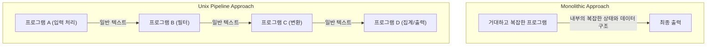
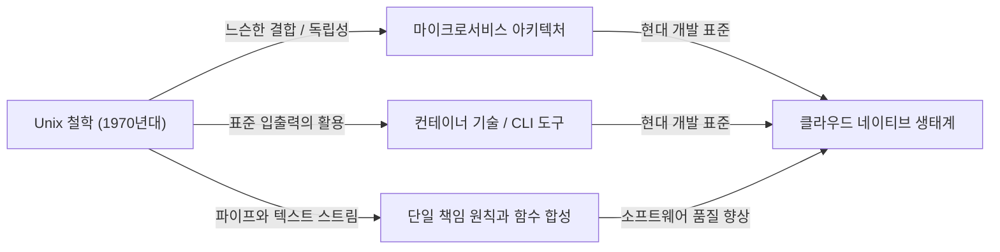

# 서론: Unix 철학이란 무엇인가

현대 소프트웨어 엔지니어링에서 "모듈식 설계(Modular Design)"나 "단일 책임 원칙(Single Responsibility Principle)", "느슨한 결합(Loose Coupling)"과 같은 용어를 듣지 않는 날이 없습니다. 이것들은 깔끔한 코드베이스를 유지하고 확장 가능하며 유지보수하기 쉬운 시스템을 구축하기 위한 금과옥조로 여겨집니다. 하지만 이러한 개념들은 결코 최근에 생겨난 것이 아닙니다. 그 기원을 더듬어 보면 1970년대 초반 벨 연구소에서 탄생한 하나의 운영 체제, "Unix"에 다다르게 됩니다.

Unix는 단순한 OS가 아니었습니다. 그것은 "어떻게 하면 뛰어난 소프트웨어를 구축할 수 있을까"하는 사상, 즉 "Unix 철학"을 구현한 것이었습니다. 켄 톰슨(Ken Thompson), 데니스 리치(Dennis Ritchie), 더그 맥일로이(Doug McIlroy)와 같은 거장들에 의해 확립된 이 철학은 반세기가 지난 현대의 클라우드 네이티브 아키텍처와 마이크로서비스에도 깊이 살아 숨쉬고 있습니다.

이 글에서는 Unix 철학의 핵심인 "모듈식 설계"의 진수를 깊이 파헤치고, 그 사상이 왜 이토록 시대를 초월하여 지지를 받고 있는지 밝혀냅니다.

## 제1장: 작은 것이 아름답다 — 작은 프로그램의 힘

Unix 철학을 가장 단적으로 나타내는 말로, 더그 맥일로이가 제창한 다음의 원칙이 있습니다.

> "Make each program do one thing well. To do a new job, build afresh rather than complicate old programs by adding new 'features'."
> (각 프로그램이 한 가지 일을 잘 수행하게 하라. 새로운 일을 하려면, 기존 프로그램에 새로운 '기능'을 추가하여 복잡하게 만드는 대신 새로 만들어라.)

이 원칙은 소프트웨어 개발에 있어서 "복잡성의 저주"에 대한 강력한 해독제입니다. 프로그램이 성장함에 따라 개발자는 좋은 의도로 기능을 추가하기 마련입니다. 그러나 기능 추가는 상태를 증가시키고 테스트를 어렵게 만들며 버그의 온상이 됩니다. 이른바 "모놀리식(단일 암괴형)" 거대 프로그램의 탄생입니다.

Unix의 접근 방식은 완전히 다릅니다. 예를 들어, 파일을 검색할 때는 `grep`, 텍스트를 정렬할 때는 `sort`, 중복을 제거할 때는 `uniq`, 단어 수를 셀 때는 `wc`를 사용하는 것처럼, 각각이 극도로 제한적인 기능만을 갖습니다. 이들은 단독으로는 복잡한 업무를 처리할 수 없지만, 그 대신 "주어진 한 가지 작업"에 대해서는 완벽하고 빠르게 실행되도록 최적화되어 있습니다.

이는 현대 객체 지향 프로그래밍의 "단일 책임 원칙(SRP)"과 완벽하게 일치합니다. 클래스나 모듈은 단 하나의 변경 이유만을 가져야 한다는 그 원칙입니다.

## 제2장: 파이프라인 — 데이터 스트림이라는 공통 언어

하지만 작은 프로그램들이 뿔뿔이 흩어져 있는 것만으로는 복잡한 현실에 맞설 수 없습니다. 이들을 연결할 "접착제"가 필요합니다. Unix에서의 그 접착제가 바로 "파이프(`|`)"이며, "텍스트 스트림"이라는 공통 언어입니다.

맥일로이는 다음과 같이 말했습니다.

> "Expect the output of every program to become the input to another, as yet unknown, program. Don't clutter output with extraneous information."
> (모든 프로그램의 출력이 아직 알려지지 않은 다른 프로그램의 입력이 될 것을 예상하라. 불필요한 정보로 출력을 어지럽히지 마라.)

Unix 프로그램은 표준 입력(stdin)에서 텍스트를 받아, 표준 출력(stdout)으로 텍스트를 내보냅니다. 텍스트라는 지극히 단순하고 보편적인 포맷을 채택함으로써 어떤 프로그램들끼리도 파이프로 연결하는 것이 가능해졌습니다.

```bash
# 예: 로그 파일에서 특정 오류를 추출하고, 발생 횟수를 세어 내림차순으로 정렬한다
cat server.log | grep "ERROR" | awk '{print $5}' | sort | uniq -c | sort -nr
```

위의 명령행은 개별 프로그램들이 서로에 대해 전혀 모름에도 불구하고 놀라운 연계를 보여줍니다. `grep`은 `awk`의 존재를 모르고, `sort`는 앞 단계의 출력을 그저 정렬할 뿐입니다.

### 아키텍처 비교: 모놀리스 대 파이프라인

여기서 기존의 모놀리식 접근 방식과 Unix 파이프라인 접근 방식을 다이어그램으로 비교해 보겠습니다.



모놀리식 접근 방식에서는 내부 데이터 구조가 강하게 결합되기 쉬우며, 일부의 변경이 전체에 파급될 위험이 있습니다. 반면 Unix 파이프라인 접근 방식에서는 각 노드 간의 인터페이스가 "일반 텍스트"라는 가장 느슨한 결합 형태로 표준화되어 있기 때문에, 일부 프로그램을 다른 프로그램으로 교체하거나 중간에 새로운 단계를 삽입하는 것이 매우 쉽습니다.

## 제3장: 침묵은 금이다 — 사용자 인터페이스와 설계의 미학

Unix 철학에는 "침묵의 원칙(Rule of Silence)"이라는 것이 있습니다. "프로그램이 아무런 놀라운 말을 할 게 없다면, 아무 말도 하지 말아야 한다"는 생각입니다.

성공했을 때는 아무것도 출력하지 않고(그저 종료 코드 `0`을 반환하고), 오류가 났을 때만 표준 에러 출력(stderr)에 메시지를 냅니다. 이는 초보 사용자에게는 조금 불친절하게 느껴질 수 있지만, 모듈식 설계에 있어서는 매우 중요한 의미를 갖습니다.

왜냐하면 만약 프로그램이 "처리에 성공했습니다!" 같은 수다스러운 출력을 표준 출력으로 흘려보내면, 그 출력을 받은 다음 프로그램(예를 들어 `grep`이나 `sort`)이 그 메시지를 데이터의 일부로 처리하게 되어 파이프라인이 망가지기 때문입니다.

인간을 위한 과도한 UI(사용자 인터페이스)를 깎아내고, 기계(다른 프로그램)와의 연계를 최우선으로 생각합니다. 이 또한 모듈성을 높이기 위한 깊은 통찰에 기반하고 있습니다.

## 제4장: 현대 소프트웨어 공학으로의 계보

Unix 철학이 고안된 지 50년 이상이 지났습니다. 컴퓨팅 환경은 천공 카드, 메인프레임, 시분할 시스템 시대를 거쳐 개인용 컴퓨터, 스마트폰, 클라우드 네이티브 컴퓨팅 시대로 극적인 변화를 이루었습니다.

하지만 Unix 철학의 "모듈식 설계" 정신은 형태를 바꾸어 현대까지 이어져 오고 있습니다.

### 마이크로서비스 아키텍처

거대한 모놀리식 애플리케이션을 독립적으로 배포 가능한 작은 서비스의 집합체로 분할하는 마이크로서비스. 이는 바로 "한 가지 일을 잘 수행하는" 프로그램들을 HTTP나 gRPC와 같은 공통 프로토콜(현대판 파이프)로 연결하는 Unix 철학의 스케일업 버전이라고 할 수 있습니다.

### 컨테이너 기술 (Docker)

Docker로 대표되는 컨테이너 기술 역시 Unix 철학과 깊은 관련이 있습니다. 컨테이너는 "1컨테이너 당 1프로세스"를 원칙으로 하며 각각이 독립된 환경에서 동작합니다. 또한 표준 출력과 표준 에러를 통해 로그를 관리한다는 설계 사상은 십분 Unix적입니다.

### 함수형 프로그래밍과 데이터 파이프라인

함수형 프로그래밍에서의 함수 합성(어떤 함수의 출력을 다른 함수의 입력으로 삼는 것)은 Unix 파이프라인의 개념과 수학적인 유사성을 가지고 있습니다. 빅데이터 처리에서의 Apache Kafka 등 스트림 처리도 텍스트 스트림의 개념을 분산 시스템에 응용한 것입니다.



## 제5장: 프로토타이핑과 도구의 구축

Unix 철학은 설계뿐만 아니라 "만드는 방법"에 대해서도 언급하고 있습니다.

> "Design and build software, even operating systems, to be tried early, ideally within weeks. Don't hesitate to throw away the clumsy parts and rebuild them."
> (소프트웨어나 운영 체제조차도 가급적 몇 주 안에 초기 테스트가 가능하도록 설계하고 구축하라. 어설픈 부분은 주저 없이 버리고 다시 만들어라.)

이것은 현대의 애자일(Agile) 개발이나 MVP(최소 기능 제품) 개념을 선구한 것입니다. 모듈식 설계를 채택하고 있기 때문에 시스템 전체에 영향을 주지 않고 "어설픈 부분"만을 버리고 다시 만드는 것이 가능한 것입니다.

또한 "프로그래밍 작업을 줄이기 위해 도구를 만들어라. 비록 우회하는 길이 될지라도 도구를 만들고, 다 쓴 후에는 그 일부를 버리게 되더라도 상관없다"는 사상도 있습니다. 자동화나 자체 제작 스크립트를 통해 개발 효율을 높이는 해커 문화는 여기에 뿌리를 두고 있습니다.

## 결론: 영원한 클래식으로서의 Unix 철학

기술 트렌드는 눈부시게 변화하며 새로운 언어나 프레임워크가 끊임없이 나타났다가 사라집니다. 하지만 "사물을 단순하게 유지한다", "적절한 인터페이스로 결합한다", "한 가지 작업에 집중한다"는 Unix 철학의 원칙은 소프트웨어의 본질적인 복잡성에 대한 가장 효과적인 대항책으로 계속 남아 있습니다.

모듈식 설계의 진수는 단순히 코드를 분할하는 것이 아닙니다. 그것은 "미래의 변화에 대한 유연성"을 확보하고 "미지의 프로그램과의 협조"를 가능하게 하기 위한 깊은 통찰에 바탕을 둔 예술인 것입니다.

우리는 앞으로도 새로운 시스템을 설계할 때마다 켄 톰슨 등이 남긴 단순하고 아름다운 철학으로 돌아가게 될 것입니다. 작은 스크립트를 작성할 때나 지구 규모의 분산 시스템을 구축할 때나, Unix 철학은 언제나 우리를 올바른 방향으로 이끄는 나침반이 될 것입니다.
