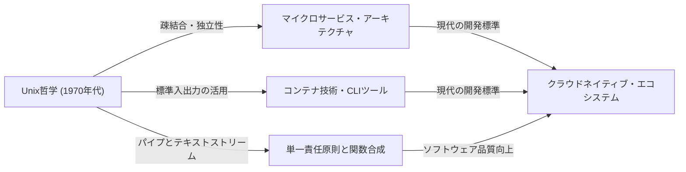

# 序論：Unix哲学とは何か

現代のソフトウェアエンジニアリングにおいて、「モジュール設計」や「単一責任原則（Single Responsibility Principle）」、「疎結合」といった言葉を耳にしない日はありません。これらは、クリーンなコードベースを保ち、スケーラブルでメンテナンス可能なシステムを構築するための金科玉条として扱われています。しかし、これらの概念は決して近年に生まれたものではありません。その源流を辿ると、1970年代初頭のベル研究所で産声を上げた一つのオペレーティングシステム、「Unix」にたどり着きます。

Unixは単なるOSではありませんでした。それは「どうすれば優れたソフトウェアを構築できるか」という思想、すなわち「Unix哲学」を体現したものでした。Ken Thompson、Dennis Ritchie、Doug McIlroyといった巨匠たちによって築かれたこの哲学は、半世紀を経た現代のクラウドネイティブ・アーキテクチャやマイクロサービスにも深く息づいています。

本記事では、Unix哲学の核となる「モジュール設計」の真髄を徹底的に深掘りし、その思想がなぜこれほどまでに時代を超越して支持され続けているのかを解き明かします。

## 第1章：スモール・イズ・ビューティフル — 小さなプログラムの力

Unix哲学を最も端的に表す言葉として、Doug McIlroyが提唱した以下の原則があります。

> "Make each program do one thing well. To do a new job, build afresh rather than complicate old programs by adding new 'features'."
> （各プログラムは一つのことをうまくやるようにせよ。新しい仕事をするには、古いプログラムに新しい「機能」を追加して複雑にするのではなく、新しく作り直せ。）

この原則は、ソフトウェア開発における「複雑さの呪い」に対する強力な解毒剤です。プログラムが成長するにつれて、開発者は良かれと思って機能を追加しがちです。しかし、機能の追加は状態の増加を招き、テストを困難にし、バグの温床となります。いわゆる「モノリシック（一枚岩）」な巨大プログラムの誕生です。

Unixのアプローチは全く異なります。たとえば、ファイルを検索するなら `grep`、テキストを並べ替えるなら `sort`、重複を削除するなら `uniq`、単語数を数えるなら `wc` というように、それぞれが極めて限定的な機能しか持ちません。これらは単体では複雑な業務をこなすことはできませんが、その代わりに「与えられた一つのタスク」に関しては完璧に、そして高速に実行するように最適化されています。

これは現代のオブジェクト指向プログラミングにおける「単一責任原則（SRP）」と完全に合致します。クラスやモジュールは一つの変更理由しか持つべきではない、というあの原則です。

## 第2章：パイプライン — データ・ストリームという共通言語

しかし、小さなプログラムがバラバラに存在するだけでは、複雑な現実に立ち向かうことはできません。それらを繋ぎ合わせる「接着剤」が必要です。Unixにおけるその接着剤が「パイプ（`|`）」であり、「テキストストリーム」という共通言語です。

McIlroyは次のように述べています。

> "Expect the output of every program to become the input to another, as yet unknown, program. Don't clutter output with extraneous information."
> （すべてのプログラムの出力は、まだ見ぬ別のプログラムの入力になることを予期せよ。出力に無関係な情報を混ぜるな。）

Unixのプログラムは、標準入力（stdin）からテキストを受け取り、標準出力（stdout）へテキストを書き出します。テキストという極めてシンプルで普遍的なフォーマットを採用したことで、任意のプログラム同士をパイプで繋ぐことが可能になりました。

```bash
# 例: ログファイルから特定のエラーを抽出し、その出現回数を数え、多い順に並べ替える
cat server.log | grep "ERROR" | awk '{print $5}' | sort | uniq -c | sort -nr
```

上記のコマンドラインは、一つ一つのプログラムが全く互いのことを知らないにもかかわらず、驚くべき連携を見せています。`grep`は`awk`の存在を知らず、`sort`は前段の出力をただ並べ替えるだけです。

### アーキテクチャの比較：モノリス対パイプライン

ここで、従来のモノリシックなアプローチとUnixパイプラインのアプローチを図解で比較してみましょう。


モノリシックなアプローチでは、内部のデータ構造が密結合になりやすく、一部の変更が全体に波及するリスクがあります。一方、Unixパイプラインのアプローチでは、各ノード間のインターフェースが「プレーンテキスト」という最も疎結合な形で標準化されているため、一部のプログラムを別のプログラムに差し替えたり、新しいステップを間に挟んだりすることが極めて容易です。

## 第3章：沈黙は金なり — ユーザーインターフェースと設計の美学

Unix哲学の中には「沈黙の原則（Rule of Silence）」というものがあります。「プログラムが何も驚くべきことを言わないのなら、何も言うべきではない」という考え方です。

成功したときには何も出力せず（ただ終了コード `0` を返す）、エラーのときだけ標準エラー出力（stderr）にメッセージを出す。これは初心者のユーザーにとっては少し不親切に感じるかもしれませんが、モジュール設計においては極めて重要な意味を持ちます。

なぜなら、もしプログラムが「処理に成功しました！」のようなおしゃべりな出力を標準出力に流してしまうと、その出力を受け取った次のプログラム（例えば `grep` や `sort`）が、そのメッセージをデータの一部として処理してしまい、パイプラインが破壊されてしまうからです。

人間向けの過剰なUI（ユーザーインターフェース）を削ぎ落とし、機械（他のプログラム）との連携を第一に考える。これもまた、モジュール性を高めるための深い洞察に基づいています。

## 第4章：現代のソフトウェア工学への系譜

Unix哲学が考案されてから50年以上が経過しました。コンピューティングの環境は、パンチカードやメインフレーム、タイムシェアリングシステムの時代から、パーソナルコンピュータ、スマートフォン、そしてクラウドネイティブ・コンピューティングへと劇的な変化を遂げました。

しかし、Unix哲学の「モジュール設計」の精神は、形を変えて現代に受け継がれています。

### マイクロサービス・アーキテクチャ

巨大なモノリシックアプリケーションを、独立してデプロイ可能な小さなサービスの集合体として分割するマイクロサービス。これはまさに「一つのことをうまくやる」プログラム群を、HTTPやgRPCなどの共通プロトコル（パイプの現代版）で繋ぐというUnix哲学のスケールアップ版と言えます。

### コンテナ技術 (Docker)

Dockerに代表されるコンテナ技術も、Unix哲学と深い関わりがあります。コンテナは「1つのコンテナに1つのプロセス」を原則とし、それぞれが独立した環境で動作します。また、標準出力や標準エラー出力を通じてログを管理するという設計思想は、十二分にUnix的です。

### 関数型プログラミングとデータパイプライン

関数型プログラミングにおける関数合成（関数の出力を別の関数の入力とする）は、Unixパイプラインの概念と数学的な類似性を持っています。ビッグデータ処理におけるApache Kafkaなどのストリーム処理も、テキストストリームの概念を分散システムに応用したものです。



## 第5章：プロトタイピングとツールの構築

Unix哲学は、設計だけでなく「作り方」についても言及しています。

> "Design and build software, even operating systems, to be tried early, ideally within weeks. Don't hesitate to throw away the clumsy parts and rebuild them."
> （ソフトウェアやOSでさえ、数週間以内に早期に試せるように設計し構築せよ。不格好な部分は躊躇なく捨てて作り直せ。）

これは現代のアジャイル開発や、MVP（Minimum Viable Product）の概念を先取りしたものです。モジュール設計を採用しているからこそ、「不格好な部分」だけをシステム全体に影響を与えることなく切り捨て、作り直すことが可能なのです。

また、「プログラミングのタスクを軽減するためにツールを作れ。たとえ回り道になってもツールを作り、使い終わったらその一部を捨てることになっても構わない」という思想もあります。自動化や自作のスクリプトによって開発効率を高めるハッカー文化は、ここに根ざしています。

## 結論：永遠のクラシックとしてのUnix哲学

技術のトレンドはめまぐるしく変化し、新しい言語やフレームワークが次々と現れては消えていきます。しかし、「物事をシンプルに保つ」「適切なインターフェースで結合する」「一つのタスクに集中する」というUnix哲学の原則は、ソフトウェアの本質的な複雑さに対する最も有効な対抗策であり続けています。

モジュール設計の真髄は、単にコードを分割することではありません。それは、「未来の変更に対する柔軟性」を確保し、「未知のプログラムとの協調」を可能にするための深い洞察に基づいた芸術なのです。

私たちはこれからも、新しいシステムを設計するたびに、Ken Thompsonらが遺したシンプルで美しい哲学に立ち返ることになるでしょう。小規模なスクリプトを書くときも、地球規模の分散システムを構築するときも、Unix哲学は常に私たちを正しい方向へと導くコンパスとなるはずです。
