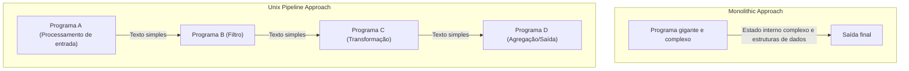
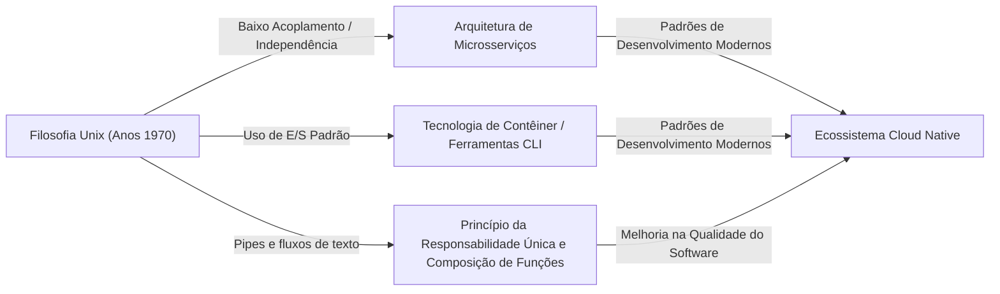

# Introdução: O que é a Filosofia Unix?

Na engenharia de software moderna, não se passa um dia sem ouvir termos como "design modular", "Princípio da Responsabilidade Única (Single Responsibility Principle)" e "baixo acoplamento". Esses conceitos são tratados como regras de ouro para manter uma base de código limpa e construir sistemas escaláveis e fáceis de manter. No entanto, esses conceitos não nasceram nos últimos anos. Rastreados até suas raízes, chegamos a um único sistema operacional que nasceu nos Bell Labs no início dos anos 1970: o "Unix".

O Unix não era apenas um sistema operacional. Foi a personificação da ideia de "como construir um software excelente", ou seja, a "Filosofia Unix". Essa filosofia, construída por gigantes como Ken Thompson, [Dennis Ritchie](/pt/p/biography-dennis-ritchie/) e Doug McIlroy, continua viva nas arquiteturas nativas da nuvem e microsserviços de hoje, meio século depois.

Neste artigo, vamos mergulhar fundo na essência do "design modular" no núcleo da filosofia Unix, e desvendar por que essa ideia continua sendo apoiada através do tempo.

## Capítulo 1: Pequeno é Lindo — O Poder dos Pequenos Programas

Para expressar a filosofia Unix de forma mais sucinta, há o seguinte princípio proposto por Doug McIlroy:

> "Make each program do one thing well. To do a new job, build afresh rather than complicate old programs by adding new 'features'."
> (Faça cada programa fazer uma coisa bem. Para fazer um novo trabalho, construa de novo em vez de complicar programas antigos adicionando novas 'funcionalidades'.)

Este princípio é um poderoso antídoto contra a "maldição da complexidade" no desenvolvimento de software. À medida que os programas crescem, os desenvolvedores frequentemente adicionam recursos com boas intenções. No entanto, adicionar funcionalidades aumenta o estado, dificulta os testes e gera bugs. É o nascimento de um programa gigante e "monolítico".

A abordagem do Unix é completamente diferente. Por exemplo, `grep` para pesquisar arquivos, `sort` para classificar texto, `uniq` para remover duplicatas e `wc` para contar palavras, cada um com funcionalidades muito limitadas. Eles não podem executar tarefas complexas sozinhos, mas, em vez disso, são otimizados para executar "uma tarefa específica" perfeitamente e rapidamente.

Isso se alinha perfeitamente com o "Princípio da Responsabilidade Única (SRP)" na programação orientada a objetos moderna. O princípio de que uma classe ou módulo deve ter apenas um motivo para mudar.

## Capítulo 2: Pipeline — A Linguagem Comum de Fluxos de Dados

No entanto, programas pequenos existindo separadamente não são suficientes para enfrentar uma realidade complexa. É necessário um "revestimento" para conectá-los. No Unix, essa cola é o "pipe (`|`)", e a linguagem comum é o "fluxo de texto (text stream)".

McIlroy afirmou:

> "Expect the output of every program to become the input to another, as yet unknown, program. Don't clutter output with extraneous information."
> (Espere que a saída de cada programa se torne a entrada de outro programa, ainda desconhecido. Não polua a saída com informações estranhas.)

Programas Unix recebem texto da entrada padrão (stdin) e escrevem texto na saída padrão (stdout). Ao adotar um formato extremamente simples e universal que é o texto, tornou-se possível conectar qualquer programa através de pipes.

```bash
# Exemplo: extrair erros específicos de um arquivo de log, contar suas ocorrências e classificá-los em ordem decrescente
cat server.log | grep "ERROR" | awk '{print $5}' | sort | uniq -c | sort -nr
```

A linha de comando acima mostra uma colaboração surpreendente, embora cada programa não conheça o outro. O `grep` não sabe da existência do `awk`, e o `sort` simplesmente classifica a saída anterior.

### Comparação de Arquitetura: Monolito vs Pipeline

Aqui, vamos comparar a abordagem monolítica tradicional e a abordagem de pipeline Unix com um diagrama.



Na abordagem monolítica, as estruturas de dados internas tendem a ser fortemente acopladas, e há o risco de que uma mudança em uma parte afete todo o sistema. Por outro lado, na abordagem de pipeline do Unix, a interface entre os nós é padronizada na forma mais fracamente acoplada de "texto simples", por isso é extremamente fácil substituir um programa por outro ou inserir uma nova etapa no meio.

## Capítulo 3: O Silêncio é de Ouro — Interface de Usuário e Estética de Design

Na filosofia Unix existe a "Regra do Silêncio (Rule of Silence)". É a ideia de que "se um programa não tem nada surpreendente a dizer, ele não deve dizer nada."

Não retornar nenhuma saída quando bem-sucedido (apenas retornar o código de saída `0`) e apenas emitir uma mensagem para o erro padrão (stderr) quando houver um erro. Isso pode parecer um pouco hostil para usuários iniciantes, mas tem um significado extremamente importante no design modular.

Isso ocorre porque, se um programa enviar uma mensagem "falante" como "Processamento bem-sucedido!" para a saída padrão, o próximo programa (por exemplo, `grep` ou `sort`) processará essa mensagem como parte dos dados, e o pipeline será destruído.

Remover a interface do usuário (UI) excessiva para humanos e priorizar a colaboração com máquinas (outros programas). Isso também se baseia em um profundo insight para aumentar a modularidade.

## Capítulo 4: Genealogia para a Engenharia de Software Moderna

Mais de 50 anos se passaram desde que a filosofia Unix foi concebida. O ambiente de computação mudou drasticamente desde a era dos cartões perfurados, mainframes e sistemas de tempo compartilhado para computadores pessoais, smartphones e computação nativa da nuvem.

No entanto, o espírito do "design modular" da filosofia Unix passou para os tempos modernos mudando de forma.

### Arquitetura de Microsserviços

Microsserviços, que dividem um aplicativo monolítico grande em uma coleção de pequenos serviços implantáveis independentemente. Esta é verdadeiramente uma versão ampliada da filosofia Unix, conectando programas que "fazem uma coisa bem" através de protocolos comuns (pipes modernos) como HTTP e gRPC.

### Tecnologia de Contêiner (Docker)

A tecnologia de contêineres, representada pelo Docker, também está profundamente relacionada à filosofia Unix. Os contêineres são baseados no princípio de "um contêiner por processo", cada um operando em um ambiente independente. Além disso, a filosofia de design de gerenciamento de logs via saída padrão e erro padrão é totalmente no estilo Unix.

### Programação Funcional e Pipelines de Dados

A composição de funções na [programação funcional](/pt/p/lambda-calculus-functional-programming/) (usando a saída de uma função como entrada de outra) tem uma semelhança matemática com o conceito de pipelines Unix. O processamento de fluxo no processamento de big data, como o Apache Kafka, também é uma aplicação do conceito de fluxo de texto em [sistemas distribuídos](/pt/p/cap-theorem-distributed-systems-tradeoff/).



## Capítulo 5: Prototipagem e Criação de Ferramentas

A filosofia Unix fala não apenas sobre design, mas também sobre "como construir".

> "Design and build software, even operating systems, to be tried early, ideally within weeks. Don't hesitate to throw away the clumsy parts and rebuild them."
> (Projete e construa software, até mesmo sistemas operacionais, para serem testados cedo, idealmente em poucas semanas. Não hesite em jogar fora as partes desajeitadas e reconstruí-las.)

Este é um precursor das ideias modernas de desenvolvimento Ágil (Agile) e MVP (Minimum Viable Product). Devido à adoção do design modular, é possível descartar apenas as "partes desajeitadas" e reconstruí-las sem afetar o sistema como um todo.

Há também a ideia de "criar ferramentas para aliviar tarefas de programação. Mesmo que seja um desvio, construa ferramentas, e tudo bem se tiver que jogar algumas delas fora depois de usá-las." A cultura hacker de aumentar a eficiência do desenvolvimento através de automação e scripts caseiros está enraizada aqui.

## Conclusão: A Filosofia Unix como um Clássico Eterno

As tendências tecnológicas mudam vertiginosamente, e novas linguagens e frameworks aparecem e desaparecem uns após os outros. No entanto, os princípios da filosofia Unix, como "manter as coisas simples", "conectar com as interfaces adequadas" e "focar em uma única tarefa" continuam a ser a contramedida mais eficaz contra a complexidade essencial do software.

A essência do design modular não é simplesmente dividir o código. É uma arte baseada em profunda compreensão para garantir "flexibilidade para mudanças futuras" e permitir "cooperação com programas desconhecidos".

Sempre voltaremos à filosofia simples e bela deixada por Ken Thompson e outros toda vez que projetarmos um novo sistema. Quer estejamos escrevendo um pequeno script ou construindo um sistema distribuído global, a filosofia Unix será sempre a bússola que nos guia na direção certa.
