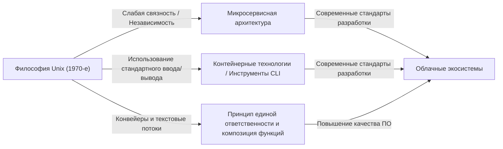

# Введение: Что такое философия Unix?

В современной программной инженерии не проходит и дня, чтобы мы не слышали таких терминов, как «модульный дизайн», «принцип единой ответственности (Single Responsibility Principle)» и «слабая связность». Эти концепции рассматриваются как золотые правила для поддержания чистой кодовой базы и создания масштабируемых, удобных в обслуживании систем. Однако эти концепции появились не в последние годы. Прослеживая их корни, мы приходим к одной операционной системе, родившейся в Bell Labs в начале 1970-х годов: «Unix».

Unix не был просто операционной системой. Он был воплощением идеи о том, «как создавать отличное программное обеспечение», то есть «философии Unix». Эта философия, основанная такими гигантами, как Кен Томпсон, Деннис Ритчи и Даг Макилрой, глубоко жива и по сей день, спустя полвека, в современных облачных архитектурах и микросервисах.

В этой статье мы глубоко погрузимся в суть «модульного дизайна», лежащего в основе философии Unix, и раскроем, почему эта идея остается столь актуальной вне времени.

## Глава 1: Малое — это прекрасно (Small is Beautiful) — Сила небольших программ

Следующий принцип, предложенный Дагом Макилроем, наиболее четко выражает философию Unix:

> "Make each program do one thing well. To do a new job, build afresh rather than complicate old programs by adding new 'features'."
> (Пусть каждая программа делает одну вещь хорошо. Чтобы сделать новую работу, создайте новую программу, а не усложняйте старые добавлением новых «функций».)

Этот принцип является мощным противоядием от «проклятия сложности» в разработке ПО. По мере роста программ разработчики часто из лучших побуждений добавляют новые функции. Однако добавление функций увеличивает количество состояний, усложняет тестирование и становится рассадником ошибок. Так рождается «монолитная» огромная программа.

Подход Unix совершенно иной. Например, для поиска файлов есть `grep`, для сортировки текста — `sort`, для удаления дубликатов — `uniq`, а для подсчета слов — `wc`. Каждая из этих программ имеет очень ограниченную функциональность. Сами по себе они не могут выполнять сложные задачи, но вместо этого они оптимизированы для идеального и быстрого выполнения «одной конкретной задачи».

Это полностью соответствует «принципу единой ответственности (SRP)» в современном объектно-ориентированном программировании. Тому самому принципу, согласно которому у класса или модуля должна быть только одна причина для изменения.

## Глава 2: Конвейер (Pipeline) — Общий язык текстовых потоков

Однако простое существование небольших разрозненных программ недостаточно для решения сложных реальных задач. Нужен «клей», чтобы связать их вместе. В Unix этим клеем является «конвейер (pipe, `|`)», а общим языком — «текстовый поток».

Макилрой говорил:

> "Expect the output of every program to become the input to another, as yet unknown, program. Don't clutter output with extraneous information."
> (Ожидайте, что вывод каждой программы станет вводом для другой, еще неизвестной программы. Не засоряйте вывод посторонней информацией.)

Программы Unix получают текст из стандартного ввода (stdin) и пишут текст в стандартный вывод (stdout). Приняв такой чрезвычайно простой и универсальный формат, как текст, стало возможным соединять любые программы с помощью конвейеров.

```bash
# Пример: извлечь определенные ошибки из лог-файла, посчитать их количество и отсортировать по убыванию
cat server.log | grep "ERROR" | awk '{print $5}' | sort | uniq -c | sort -nr
```

Приведенная выше командная строка демонстрирует удивительное сотрудничество, даже несмотря на то, что программы совершенно не знают друг друга. `grep` не знает о существовании `awk`, а `sort` просто сортирует предыдущий вывод.

### Сравнение архитектур: Монолит против Конвейера

Давайте сравним традиционный монолитный подход и подход конвейера Unix с помощью диаграммы.


В монолитном подходе внутренние структуры данных часто сильно связаны, и существует риск того, что изменение в одной части повлияет на всю систему. С другой стороны, в подходе конвейера Unix интерфейс между узлами стандартизирован в виде «простого текста» — максимально слабо связанной формы, поэтому заменить одну программу другой или вставить новый шаг посередине чрезвычайно просто.

## Глава 3: Молчание — золото — Пользовательский интерфейс и эстетика дизайна

В философии Unix есть «Правило молчания (Rule of Silence)». Идея заключается в том, что «если программе нечего сказать удивительного, она не должна говорить ничего».

Никакого вывода при успешном завершении (просто возврат кода выхода `0`), и вывод сообщений только в стандартный поток ошибок (stderr) при возникновении ошибки. Это может показаться немного недружелюбным для начинающих пользователей, но имеет очень важное значение в модульном дизайне.

Это связано с тем, что если программа выведет в стандартный вывод болтливое сообщение вроде «Обработка успешно завершена!», следующая программа (например, `grep` или `sort`) обработает это сообщение как часть данных, и конвейер будет разрушен.

Отказ от чрезмерного пользовательского интерфейса (UI) для людей и приоритет взаимодействия с машинами (другими программами). Это также основано на глубоком понимании необходимости повышения модульности.

## Глава 4: Наследие в современной программной инженерии

С момента зарождения философии Unix прошло более 50 лет. Вычислительная среда кардинально изменилась: от эпохи перфокарт, мейнфреймов и систем разделения времени до персональных компьютеров, смартфонов и облачных вычислений.

Однако дух «модульного дизайна» философии Unix, изменив форму, передался современности.

### Микросервисная архитектура

Микросервисы разделяют огромные монолитные приложения на набор независимых развертываемых небольших сервисов. Это поистине масштабированная версия философии Unix, объединяющая программы, которые «делают одну вещь хорошо», с помощью общих протоколов (современных конвейеров), таких как HTTP и gRPC.

### Контейнерные технологии (Docker)

Контейнерные технологии, представленные Docker, также тесно связаны с философией Unix. Контейнеры основаны на принципе «один контейнер на процесс», и каждый из них работает в изолированной среде. Кроме того, философия дизайна, предполагающая управление логами через стандартный вывод и стандартный вывод ошибок, в полной мере соответствует духу Unix.

### Функциональное программирование и конвейеры данных

Композиция функций в функциональном программировании (использование вывода одной функции в качестве ввода для другой) имеет математическое сходство с концепцией конвейеров Unix. Потоковая обработка больших данных, например в Apache Kafka, также является применением концепции текстовых потоков в распределенных системах.



## Глава 5: Прототипирование и создание инструментов

Философия Unix говорит не только о дизайне, но и о «создании».

> "Design and build software, even operating systems, to be tried early, ideally within weeks. Don't hesitate to throw away the clumsy parts and rebuild them."
> (Проектируйте и создавайте программное обеспечение, даже операционные системы, так, чтобы их можно было опробовать на ранней стадии, в идеале в течение нескольких недель. Не стесняйтесь выбрасывать неуклюжие части и переделывать их.)

Это предшественник современных концепций гибкой разработки (Agile) и MVP (Minimum Viable Product). Поскольку применяется модульный дизайн, можно отбросить и переделать только «неуклюжие части», не затрагивая всю систему.

Существует также идея: «Создавайте инструменты для облегчения задач программирования. Даже если это обходной путь, создавайте инструменты, и ничего страшного, если часть из них придется выбросить после использования». Хакерская культура повышения эффективности разработки за счет автоматизации и самодельных скриптов берет свое начало здесь.

## Заключение: Философия Unix как вечная классика

Технологические тенденции стремительно меняются, новые языки и фреймворки появляются и исчезают один за другим. Однако принципы философии Unix, такие как «сохраняйте простоту», «соединяйте с помощью подходящих интерфейсов» и «сосредоточьтесь на одной задаче», остаются наиболее эффективным противодействием фундаментальной сложности программного обеспечения.

Суть модульного дизайна — это не просто разделение кода. Это искусство, основанное на глубоком понимании того, как обеспечить «гибкость для будущих изменений» и сделать возможным «взаимодействие с неизвестными программами».

Каждый раз, когда мы проектируем новую систему, мы будем возвращаться к простой и красивой философии, оставленной Кеном Томпсоном и его коллегами. Будь то написание небольшого скрипта или создание глобальной распределенной системы, философия Unix всегда будет компасом, указывающим нам правильное направление.
