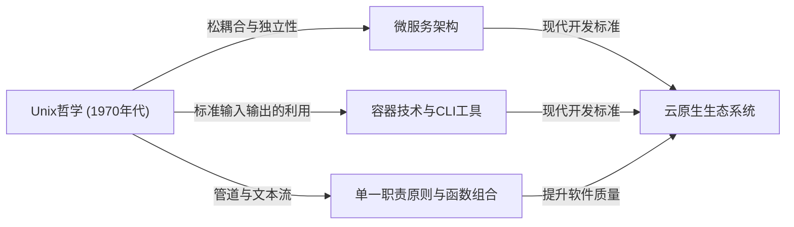

# 引言：什么是Unix哲学

在现代软件工程中，我们几乎每天都会听到“模块化设计”、“单一职责原则”和“松耦合”这些词汇。它们被视为保持干净的代码库以及构建可扩展、可维护系统的金科玉律。然而，这些概念绝非近年的产物。追根溯源，它们源于1970年代初在贝尔实验室诞生的一个操作系统：“Unix”。

Unix不仅仅是一个操作系统。它体现了一种关于“如何构建优秀软件”的思想，即“Unix哲学”。由Ken Thompson、Dennis Ritchie和Doug McIlroy等巨匠建立的这一哲学，在半个世纪后的现代云原生架构和微服务中依然生生不息。

本文将深入探讨Unix哲学核心的“模块化设计”精髓，并揭示其思想为何能够超越时代、历久弥新。

## 第一章：小即是美 — 小程序的力量

作为Unix哲学最直接的表达，Doug McIlroy提出了以下原则：

> "Make each program do one thing well. To do a new job, build afresh rather than complicate old programs by adding new 'features'."
> （让每个程序都做好一件事。为了完成新任务，请重新构建，而不是通过添加新“功能”来使旧程序复杂化。）

这一原则是软件开发中应对“复杂性诅咒”的强效解毒剂。随着程序的成长，开发者往往出于好意添加功能。然而，功能的增加会导致状态增多，使得测试变得困难，并成为Bug的温床。这就是所谓“单体（Monolithic）”庞大程序的诞生。

Unix的方法则完全不同。例如，用于搜索文件的 `grep`、排序文本的 `sort`、删除重复项的 `uniq`、计算单词数的 `wc`——它们每一个都只有极其有限的功能。它们单凭自身无法完成复杂的业务，但作为交换，它们在执行“被赋予的单一任务”时被优化到了完美且高速的地步。

这与现代面向对象编程中的“单一职责原则（SRP）”完全吻合。即一个类或模块应该只有一个引起它变化的原因。

## 第二章：管道 — 数据流的共同语言

然而，仅有散落的小程序是无法应对复杂的现实的。需要一种“胶水”将它们连接起来。在Unix中，这种胶水就是“管道（`|`）”和“文本流”这一共同语言。

McIlroy曾这样说过：

> "Expect the output of every program to become the input to another, as yet unknown, program. Don't clutter output with extraneous information."
> （预期每个程序的输出都会成为另一个尚未未知的程序的输入。不要在输出中混入无关的信息。）

Unix的程序从标准输入（stdin）接收文本，并将文本写入标准输出（stdout）。通过采用文本这种极其简单且普遍的格式，使得通过管道连接任意程序成为可能。

```bash
# 示例：从日志文件中提取特定错误，计算其出现次数，并按降序排列
cat server.log | grep "ERROR" | awk '{print $5}' | sort | uniq -c | sort -nr
```

上述命令行展示了惊人的协作，尽管每个程序对彼此一无所知。`grep` 不知道 `awk` 的存在，而 `sort` 只是简单地对前一阶段的输出进行排序。

### 架构比较：单体 vs 管道

现在，让我们通过图解来比较传统的单体架构和Unix管道架构。


在单体架构中，内部数据结构容易变得紧耦合，部分修改可能会波及整体。另一方面，在Unix管道架构中，各节点之间的接口被标准化为“纯文本”这种最松散耦合的形式，因此极其容易将一个程序替换为另一个程序，或者在中间插入新的步骤。

## 第三章：沉默是金 — 用户界面与设计美学

Unix哲学中有一条“沉默原则（Rule of Silence）”。其核心思想是“如果一个程序没有什么令人惊讶的事情要说，它就应该保持沉默”。

当成功时什么也不输出（仅返回退出码 `0`），只有在错误时才向标准错误输出（stderr）发送消息。这对于初学者来说可能觉得有些不友好，但在模块化设计中却具有极其重要的意义。

因为，如果一个程序向标准输出发送了诸如“处理成功！”这样喋喋不休的消息，接收该输出的下一个程序（例如 `grep` 或 `sort`）就会将该消息作为数据的一部分进行处理，从而破坏整个管道。

剥离面向人类的过度UI（用户界面），将与机器（其他程序）的协作放在首位。这也是基于提高模块化程度的深刻洞察。

## 第四章：现代软件工程的谱系

Unix哲学提出至今已超过50年。计算环境从打孔卡、大型机、分时系统的时代，经历了向个人电脑、智能手机以及云原生计算的剧烈变革。

然而，Unix哲学中“模块化设计”的精神却以不同的形式传承到了今天。

### 微服务架构

将巨大的单体应用拆分为一组可独立部署的小型服务集合的微服务架构。这可以说是Unix哲学的放大版：将“做好一件事”的程序群通过HTTP或gRPC等通用协议（现代版的管道）连接起来。

### 容器技术 (Docker)

以Docker为代表的容器技术也与Unix哲学有着深厚的渊源。容器以“一个容器一个进程”为原则，各自在独立的环境中运行。此外，通过标准输出和标准错误输出管理日志的设计思想也是十足的Unix风格。

### 函数式编程与数据管道

函数式编程中的函数组合（将一个函数的输出作为另一个函数的输入）与Unix管道的概念在数学上具有相似性。大数据处理中的Apache Kafka等流处理，也是将文本流概念应用到分布式系统中的产物。



## 第五章：原型设计与工具构建

Unix哲学不仅涉及设计，还涉及“如何构建”。

> "Design and build software, even operating systems, to be tried early, ideally within weeks. Don't hesitate to throw away the clumsy parts and rebuild them."
> （设计和构建软件，甚至是操作系统，都应尽早试用，理想情况下在几周内。不要犹豫扔掉笨拙的部分并重新构建它们。）

这预示了现代敏捷开发和MVP（最小可行产品）的概念。正因为采用了模块化设计，才使得可以毫不犹豫地舍弃并重构“笨拙的部分”，而不会对整个系统产生影响。

此外，还有一种思想是“为了减轻编程任务而构建工具。哪怕绕道而行，也要构建工具，即便用完后要扔掉其中一部分也无妨”。通过自动化和自制脚本来提高开发效率的黑客文化正是根植于此。

## 结论：作为永恒经典的Unix哲学

技术趋势瞬息万变，新的语言和框架不断涌现又消亡。然而，“保持简单”、“通过适当的接口耦合”、“专注于单一任务”等Unix哲学的原则，依然是应对软件本质复杂性最有效的对策。

模块化设计的精髓不仅仅是拆分代码。它是一门基于深刻洞察的艺术，旨在确保“应对未来变化的灵活性”，并实现“与未知程序的协同”。

在我们今后设计新系统时，将一次又一次地回归到Ken Thompson等人留下的简单而美丽的哲学中。无论是编写小型脚本，还是构建全球规模的分布式系统，Unix哲学都将永远是指引我们走向正确方向的指南针。
