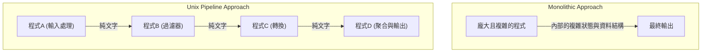
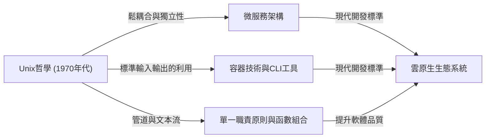

# 引言：什麼是Unix哲學

在現代軟體工程中，我們幾乎每天都會聽到「模組化設計」、「單一職責原則」和「鬆耦合」這些詞彙。它們被視為保持乾淨的程式碼庫以及構建可擴展、可維護系統的金科玉律。然而，這些概念絕非近年的產物。追根溯源，它們源於1970年代初在貝爾實驗室誕生的一個作業系統：「Unix」。

Unix不僅僅是一個作業系統。它體現了一種關於「如何構建優秀軟體」的思想，即「Unix哲學」。由Ken Thompson、Dennis Ritchie和Doug McIlroy等巨匠建立的這一哲學，在半個世紀後的現代雲原生架構和微服務中依然生生不息。

本文將深入探討Unix哲學核心的「模組化設計」精髓，並揭示其思想為何能夠超越時代、歷久彌新。

## 第一章：小即是美 — 小程式的力量

作為Unix哲學最直接的表達，Doug McIlroy提出了以下原則：

> "Make each program do one thing well. To do a new job, build afresh rather than complicate old programs by adding new 'features'."
> （讓每個程式都做好一件事。為了完成新任務，請重新構建，而不是透過添加新「功能」來使舊程式複雜化。）

這一原則是軟體開發中應對「複雜性詛咒」的強效解毒劑。隨著程式的成長，開發者往往出於好意添加功能。然而，功能的增加會導致狀態增多，使得測試變得困難，並成為Bug的溫床。這就是所謂「單體（Monolithic）」龐大程式的誕生。

Unix的方法則完全不同。例如，用於搜尋檔案的 `grep`、排序文本的 `sort`、刪除重複項的 `uniq`、計算單詞數的 `wc`——它們每一個都只有極其有限的功能。它們單憑自身無法完成複雜的業務，但作為交換，它們在執行「被賦予的單一任務」時被優化到了完美且高速的地步。

這與現代物件導向程式設計中的「單一職責原則（SRP）」完全吻合。即一個類別或模組應該只有一個引起它變化的原因。

## 第二章：管道 — 數據流的共同語言

然而，僅有散落的小程式是無法應對複雜的現實的。需要一種「膠水」將它們連接起來。在Unix中，這種膠水就是「管道（`|`）」和「文本流」這一共同語言。

McIlroy曾這樣說過：

> "Expect the output of every program to become the input to another, as yet unknown, program. Don't clutter output with extraneous information."
> （預期每個程式的輸出都會成為另一個尚未未知的程式的輸入。不要在輸出中混入無關的資訊。）

Unix的程式從標準輸入（stdin）接收文本，並將文本寫入標準輸出（stdout）。透過採用文本這種極其簡單且普遍的格式，使得透過管道連接任意程式成為可能。

```bash
# 範例：從日誌檔案中提取特定錯誤，計算其出現次數，並按降序排列
cat server.log | grep "ERROR" | awk '{print $5}' | sort | uniq -c | sort -nr
```

上述命令列展示了驚人的協作，儘管每個程式對彼此一無所知。`grep` 不知道 `awk` 的存在，而 `sort` 只是簡單地對前一階段的輸出進行排序。

### 架構比較：單體 vs 管道

現在，讓我們透過圖解來比較傳統的單體架構和Unix管道架構。



在單體架構中，內部資料結構容易變得緊耦合，部分修改可能會波及整體。另一方面，在Unix管道架構中，各節點之間的介面被標準化為「純文字」這種最鬆散耦合的形式，因此極其容易將一個程式替換為另一個程式，或者在中間插入新的步驟。

## 第三章：沉默是金 — 使用者介面與設計美學

Unix哲學中有一條「沉默原則（Rule of Silence）」。其核心思想是「如果一個程式沒有什麼令人驚訝的事情要說，它就應該保持沉默」。

當成功時什麼也不輸出（僅返回退出碼 `0`），只有在錯誤時才向標準錯誤輸出（stderr）發送訊息。這對於初學者來說可能覺得有些不友善，但在模組化設計中卻具有極其重要的意義。

因為，如果一個程式向標準輸出發送了諸如「處理成功！」這樣喋喋不休的訊息，接收該輸出的下一個程式（例如 `grep` 或 `sort`）就會將該訊息作為資料的一部分進行處理，從而破壞整個管道。

剝離面向人類的過度UI（使用者介面），將與機器（其他程式）的協作放在首位。這也是基於提高模組化程度的深刻洞察。

## 第四章：現代軟體工程的譜系

Unix哲學提出至今已超過50年。計算環境從打孔卡、大型主機、分時系統的時代，經歷了向個人電腦、智慧型手機以及雲原生計算的劇烈變革。

然而，Unix哲學中「模組化設計」的精神卻以不同的形式傳承到了今天。

### 微服務架構

將巨大的單體應用拆分為一組可獨立部署的小型服務集合的微服務架構。這可以說是Unix哲學的放大版：將「做好一件事」的程式群透過HTTP或gRPC等通用協定（現代版的管道）連接起來。

### 容器技術 (Docker)

以Docker為代表的容器技術也與Unix哲學有著深厚的淵源。容器以「一個容器一個行程」為原則，各自在獨立的環境中執行。此外，透過標準輸出和標準錯誤輸出管理日誌的設計思想也是十足的Unix風格。

### 函數式程式設計與資料管道

函數式程式設計中的函數組合（將一個函數的輸出作為另一個函數的輸入）與Unix管道的概念在數學上具有相似性。大數據處理中的Apache Kafka等串流處理，也是將文本流概念應用到分散式系統中的產物。



## 第五章：原型設計與工具構建

Unix哲學不僅涉及設計，還涉及「如何構建」。

> "Design and build software, even operating systems, to be tried early, ideally within weeks. Don't hesitate to throw away the clumsy parts and rebuild them."
> （設計和構建軟體，甚至是作業系統，都應盡早試用，理想情況下在幾週內。不要猶豫扔掉笨拙的部分並重新構建它們。）

這預示了現代敏捷開發和MVP（最小可行產品）的概念。正因為採用了模組化設計，才使得可以毫不猶豫地捨棄並重構「笨拙的部分」，而不會對整個系統產生影響。

此外，還有一種思想是「為了減輕程式設計任務而構建工具。哪怕繞道而行，也要構建工具，即便用完後要扔掉其中一部分也無妨」。透過自動化和自製腳本來提高開發效率的駭客文化正是根植於此。

## 結論：作為永恆經典的Unix哲學

技術趨勢瞬息萬變，新的語言和框架不斷湧現又消亡。然而，「保持簡單」、「透過適當的介面耦合」、「專注於單一任務」等Unix哲學的原則，依然是應對軟體本質複雜性最有效的對策。

模組化設計的精髓不僅僅是拆分程式碼。它是一門基於深刻洞察的藝術，旨在確保「應對未來變化的靈活性」，並實現「與未知程式的協同」。

在我們今後設計新系統時，將一次又一次地回歸到Ken Thompson等人留下的簡單而美麗的哲學中。無論是編寫小型腳本，還是構建全球規模的分散式系統，Unix哲學都將永遠是指引我們走向正確方向的指南針。
