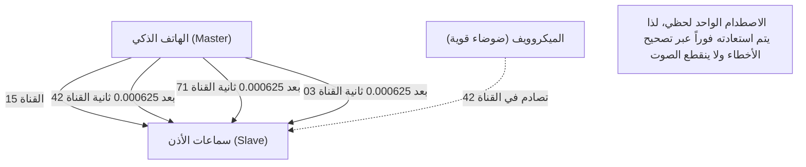

## 1. التحرر من الكابلات

سماعات الأذن، الماوس، لوحة المفاتيح، الساعات الذكية، وأنظمة الملاحة في السيارات. العديد من الأجهزة الرقمية حولنا أصبحت الآن لا تحتوي على كابلات، بل تتصل بخط سحري غير مرئي يسمى "البلوتوث (Bluetooth)".

إذا كان الـ Wi-Fi هو "الشريان الرئيسي للإنترنت" الذي ينقل كميات كبيرة من البيانات بسرعة لمسافات طويلة، فإن البلوتوث أشبه بـ "الشعيرات الدموية" التي تربط الأجهزة القريبة من بعضها البعض بسهولة وبطاقة منخفضة. ولكن، في بيئات مثل المناطق الحضرية أو القطارات المزدحمة، حيث تتواجد أجهزة بلوتوث لا حصر لها، لماذا لا تتداخل إشارات هاتفك وسماعاتك، وتصلك الأصوات الخاصة بك فقط دون "تداخل"؟

تختبئ هناك تقنية اتصالات مذهلة تستخدم الخصائص الفيزيائية لموجات الراديو بمهارة.

## 2. نطاق 2.4 جيجاهرتز: "منطقة معركة شديدة"

موجات الراديو التي يستخدمها البلوتوث للاتصال هي موجات كهرومغناطيسية بتردد يُعرف بـ "**نطاق 2.4 جيجاهرتز (GHz)**".
نطاق 2.4 جيجاهرتز هذا مفتوح كـ "نطاق ISM (الصناعي والعلمي والطبي)"، والذي يمكن لأي شخص في أي مكان في العالم استخدامه بحرية دون الحاجة إلى ترخيص.

لذلك، على الرغم من سهولة استخدامه، فقد أصبح "منطقة معركة" شرسة للغاية.
تشمل الأجهزة التي تستخدم نفس نطاق 2.4 جيجاهرتز شبكات Wi-Fi (الشبكات المحلية اللاسلكية)، والهواتف اللاسلكية، والدونجل الخاص بالماوس اللاسلكي، وحتى **أفران الميكروويف**. الموجات الدقيقة التي تصدرها أفران الميكروويف لتسخين الماء في الطعام تعمل في الواقع ضمن نطاق 2.4 جيجاهرتز (وهذا هو السبب في انقطاع اتصال Wi-Fi أو البلوتوث عند استخدام الميكروويف).

في بيئة تتطاير فيها الكثير من موجات الراديو، كيف يضمن البلوتوث أمان واستقرار الاتصالات؟ تكمن الإجابة في "**القفز الترددي (Frequency Hopping)**".

## 3. "القفز الترددي (FHSS)" لمنع التداخل

يقسم البلوتوث عرض نطاق 2.4 جيجاهرتز (تحديداً من 2.402 جيجاهرتز إلى 2.480 جيجاهرتز) إلى **79 قناة دقيقة** بعرض 1 ميجاهرتز لكل منها.

إذا كان الاتصال ثابتًا على قناة واحدة فقط (على سبيل المثال 2.410 جيجاهرتز)، ففي اللحظة التي تتداخل فيها إشارة Wi-Fi قوية أو ضوضاء من الميكروويف بالصدفة، سيتم مسح الاتصال.

لذلك، يقوم البلوتوث بالتبديل (القفز) بسرعة هائلة تصل إلى **1600 مرة في الثانية** بين القنوات المستخدمة أثناء الاتصال. يسمى هذا "طيف الانتشار بالقفز الترددي (FHSS)".

سيكون من الأسهل فهم ذلك إذا شبهناه بمفاتيح البيانو (79 قناة).
يتم إرسال الرسائل وكأنها إشارات مورس، حيث يتم ضرب المفاتيح بشكل عشوائي 1600 مرة في الثانية مثل "دو، مي، صول، لا، دو، فا...".
حتى لو قامت ضوضاء الميكروويف بضرب مفتاح "مي" بقوة وتحطيمه، فإن البيانات في توقيت "مي" (1/1600 من الثانية) هي فقط التي تتلف، بينما تصل معظم البيانات المرسلة عبر القنوات الأخرى سليمة. البيانات التالفة القليلة يتم استعادتها فوراً من خلال تصحيح الأخطاء بالمعالجة الرقمية، ولذلك لا نشعر بأن "الصوت انقطع" في آذاننا.

### القفز الترددي التكيفي (AFH)
علاوة على ذلك، بدءاً من إصدار البلوتوث v1.2، تم إدخال تقنية تسمى "AFH (القفز الترددي التكيفي)".
هذه آلية ذكية تتعلم القنوات التي تستخدمها شبكات Wi-Fi باستمرار وتعتبرها "مليئة بالضوضاء" لتستبعدها من القائمة، وتختار فقط "القنوات النظيفة" ذات الضوضاء المنخفضة للقفز إليها. بفضل هذا، اكتسب البلوتوث الحديث استقراراً لا يصدق.

## 4. الاقتران: الرقصة السرية بين السيد والتابع (Master and Slave)

عندما نشتري جهاز بلوتوث جديداً، فإننا دائماً ما نقوم بـ "الاقتران" أولاً.
هذا الاقتران، من وجهة نظر فيزيائية، هو "طقس لمشاركة ترتيب (نمط) القفز سراً بين الجهازين".

يوجد دائماً علاقة سيد وتابع في اتصالات البلوتوث.
* **السيد (Master)**: الطرف الذي يتحكم في الاتصال، مثل الهاتف الذكي أو جهاز الكمبيوتر.
* **التابع (Slave)**: الطرف الذي يتم التحكم فيه، مثل سماعات الأذن أو الماوس.

بمجرد اكتمال الاقتران، يشارك الجهاز السيد "ساعته (Clock)" و "معرفه الفريد (عنوان البلوتوث)" مع التابع.
يضع البلوتوث "معرف السيد" و "الوقت الحالي لساعة السيد" في معادلة معقدة (خوارزمية) لحساب رقم القناة التالية التي يجب القفز إليها (من 1 إلى 79).

نظراً لأن السيد والتابع يشتركان في نفس المعرف والساعة، يمكنهما التبديل بين القنوات بتوقيت متزامن تماماً بوحدة 1/1600 من الثانية، مثل "التالي هو القناة 42" و "ثم 71"، دون الحاجة إلى التشاور مع بعضهما البعض.
الهواتف الذكية وسماعات الأذن الأخرى غير المرتبطة تمتلك معرفات وساعات مختلفة، لذلك فهي تقفز بأنماط عشوائية ومختلفة تماماً. لهذا السبب لا يحدث تداخل أبداً، حتى في القطارات المزدحمة.

## 5. تاريخ الاختراع: ممثلة هوليوود والطوربيدات

من المثير للدهشة أن جذور هذه التقنية المتقدمة للغاية، "القفز الترددي"، تعود إلى الحرب العالمية الثانية.

المخترعان هما ممثلة هوليوود هيدي لامار (Hedy Lamarr)، التي لُقبت بـ "أجمل وجه في العالم" في ذلك الوقت، والملحن جورج أنثيل (George Antheil).
لمنع تحويل مسار طوربيدات قوات الحلفاء بواسطة التشويش اللاسلكي من العدو، استلهمت فكرتها من آلية عمل آلات البيانو ذاتية العزف (اللفائف)، وابتكرت فكرة أنه "إذا قمنا بتغيير تردد الاتصال تباعاً وفقاً لنمط مشفر، فلن يتمكن العدو من استهدافنا بموجات التشويش".

كانت هذه البراءة سابقة لعصرها في ذلك الوقت ولم يتبناها الجيش، لكنها تطورت لاحقاً كتقنية اتصالات عسكرية خلال الحرب الباردة، ثم تم تحويلها للاستخدام المدني لتصبح التقنية الأساسية للبلوتوث والـ Wi-Fi الحاليين.

## 6. ثورة إنترنت الأشياء (IoT) بواسطة تقنية BLE (Bluetooth Low Energy)

استمر البلوتوث في التطور لسنوات عديدة، ولكن تقنية "**BLE (Bluetooth Low Energy)**" التي تم تقديمها في بلوتوث 4.0 عام 2010 كانت نقطة التحول الأكبر.

كان البلوتوث التقليدي (Classic) مناسباً لتشغيل الموسيقى بجودة عالية، ولكن استهلاكه العالي للبطارية كان نقطة ضعفه. أما تقنية BLE فهي معيار اتصالات أُعيد تصميمه خصيصاً "لإرسال كمية ضئيلة جداً من البيانات، بطاقة منخفضة للغاية، وفي لحظة واحدة فقط".

بفضل تقنية BLE، أصبحت اتصالات أجهزة إنترنت الأشياء (IoT)، مثل بيانات معدل ضربات القلب من الساعات الذكية، ونتائج القياس من مقاييس الحرارة، ومعلومات الموقع من أجهزة التتبع (مثل AirTag)، قادرة على العمل لـ "أشهر إلى سنوات باستخدام بطارية خلية واحدة (بطارية زر)".

لقد أنهى البلوتوث دوره كمجرد "كابل لاسلكي"، وهو الآن يتطور بهدوء ولكن بثبات كبنية تحتية لنسج العالم المادي رقمياً، مثل قياس المسافات في الفضاء (معلومات موقع عالية الدقة) أو تكوين شبكات متداخلة (Mesh) للتحكم في إضاءة المباني بأكملها.
